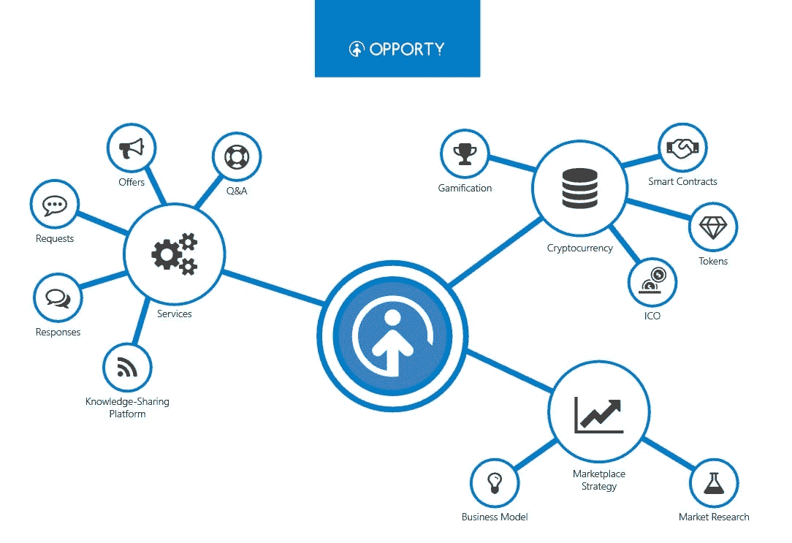
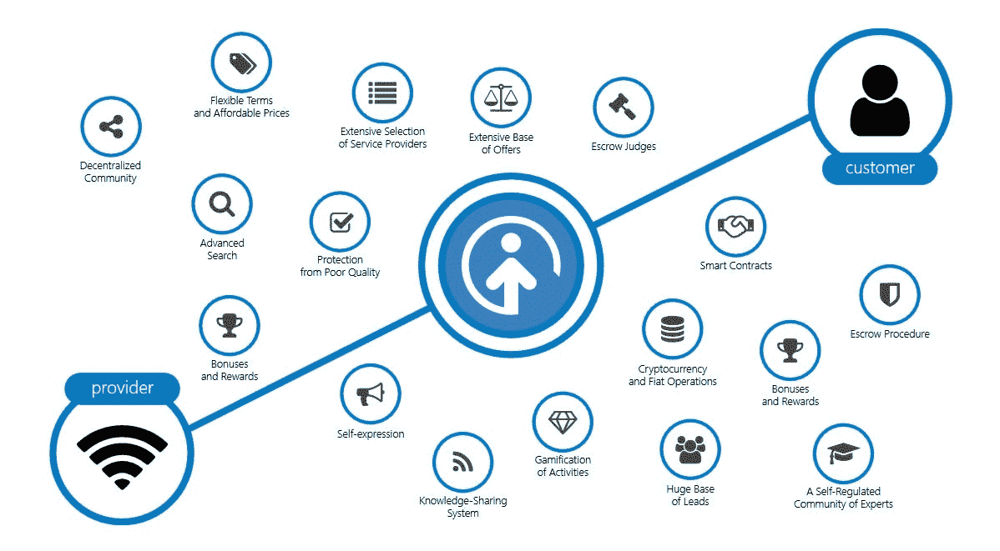

# 小企业能在下一次技术革命中生存下来吗？是的，他们可以！

> 原文：<https://medium.com/hackernoon/can-small-businesses-survive-the-next-technology-revolution-yes-they-can-71045aeacf90>

嗨伙计们！

我叫谢尔盖·格里布尼克。我是一名连续创业者，也是区块链的狂热爱好者，我有一个全新的想法，它将彻底改变企业之间的互动方式。

今天，[90%的小企业在进入市场的第一年后都无法生存。他们失败的主要原因是他们没有能力建立一个早期用户和老顾客的坚实基础。](https://www.fundera.com/blog/what-percentage-of-small-businesses-fail)

通常，缺乏顾客与提供顾客实际上不需要或不想要的产品有关。然而，失败的另一个原因是，中小企业无法与大公司和知名品牌竞争，后者可以轻松地为大多数客户提供服务。

即使是最好的产品或服务的概念和想法，也可能因为缺乏愿意在一个未知品牌上冒险的客户而失败。例如，想象一个只有几家家具供应商的小城市。一家宜家商场会毁掉他们的生意，吸引几乎所有的顾客。简而言之，小型企业需要能够帮助他们在可承受的条件下接触并转化新客户的解决方案。一个常见的解决方案是使用销售线索生成平台。

我仔细研究了潜在客户生成平台的市场，并弄清楚了它们是如何运作的。基本上，它们是一个市场，企业在这里找到愿意为其产品或服务付费的客户。他们解决了业务发展中第一个也是最重要的挑战，那就是寻找客户，但他们这么做是为了自己的利益。

当我建立我的第一个企业时，我面临着同样的问题。很难建立一个愿意消费你的服务或产品的客户群。利用 lead-gen 平台，企业可以销售他们的服务。然而，当你开始一项业务时，你不能把你的最后一美元支付给潜在客户生成平台。问题是 lead-gen 平台提供服务的费用是小企业负担不起的。

新成立的企业往往缺乏资源来投资扩大客户群。考虑到市场的波动性，企业无法在不断变化的环境中生存，并且缺乏资本，这意味着他们无法依赖 lead-gen 平台。而且，即使他们设法分配了足够的资源，他们仍然面临着与那些与当地客户有更多接触的老牌公司竞争的挑战。

我记得自己试图向市场推广我的创业公司。我很快意识到，老牌公司占据了几乎 70%的市场份额。基本上，你的潜在客户已经是别人的客户了，你没有足够的资源把他们带到你的网站或者实体店。当然，你总能以更好的价格提供更高质量的服务。但这样做，你可能不得不牺牲公司的最后一点收入。

长话短说，小企业应该拥有和大公司一样的机会。虽然这看起来有点不切实际，但尖端的区块链技术有可能创造公平的竞争环境。

# 机会—具有公平条件的销售线索生成平台

业务发展可能成本高昂，并会占用你很大一部分收入。在能够吸引更多客户的解决方案中，整合一些免费或免费增值工具是必不可少的。因为付费服务需要竞价才能获得有价值的客户。对于那些有足够资源参与拍卖并获得最有价值客户的老牌公司来说，竞价是一个很好的解决方案。

# 免费服务

当我看到企业因缺乏曝光度而遭受巨大损失时，我常常会想，我该如何改变它们的经营方式。我认为潜在客户的产生可以是免费的，或者至少是有限量的报价或回应。不幸的是，现代潜在客户生成平台很少免费提供服务。为了让小企业有机会获得更多的初始发展客户， [Opporty](https://opporty.com/) 提供了数量有限的免费优惠和回应。小企业可以利用这个机会开始运营，并建立一个忠诚的客户群。通过获得更高的曝光率，优质服务提供商可以在市场中确立自己的地位。

# 获得免费请求、优惠和回应

所有潜在客户生成平台都收取服务费。这让小公司失去了使用它们的勇气。大多数平台为他们的客户提供了一个投标优质线索的机会。例如，你想去连锁加油站。这个顾客会给你带来一大笔钱。你可能想获得这个客户，但是，更多的老牌公司会为这个客户付出很多，而你永远无法接触到他们。销售线索的质量决定了为获得客户必须支付的金额。

我设计 Opporty 有一个独特的功能，让用户赚取内部硬币，然后可以花在额外的请求和提供。小企业可以节省获得新客户的资金，同时有助于平台和自身业务的整体推广。为了赚取硬币，他们贡献内容，为知识共享平台增加价值，使企业有可能吸引更多的客户，几乎是免费的。

# 具有智能合同的销售线索挖掘平台

# 保护服务提供商和客户之间的交易

小企业承认，他们曾遇到过提供优质服务的问题，但服务质量受到了客户的质疑。在这种情况下，付款被拖延，而时间和资源已经被花费，这阻碍了业务发展。对客户提起诉讼不是一个好的解决方案，因为诉讼可能会失败，并且不会为浪费的时间和资源提供补偿。我知道它会如何影响企业的健康发展，会造成多大的损失。Opporty 提供分散托管法官的支持，这些法官监督服务提供商和客户之间协议的执行。协议的条件在不可变的强智能合同中详细说明，消除了对协议的争议和误解的威胁。托管法官审查有争议的协议和被指控的不当行为，以确定智能合同是否得到令人满意的执行。这有助于确保双方履行协议条件。

# 全球业务标准化

成熟的企业倾向于将其服务标准化以确保服务质量，这意味着小型企业可以遵循这些标准并为客户提供高质量的服务。我发现向小公司提供关于其业务适当发展的见解非常重要。为此，我在 Opporty 上设计了终极知识共享平台。除了分享专业知识，它还通过使用区块链和代管法官来支持服务标准。托管-法官是某些行业的专家，他们为做生意和提供某些服务制定标准。这些标准以区块链智能合同的形式保存。小型企业遵循专家提供的最佳实践，并获得忠诚的客户。这对那些缺乏经验和对市场缺乏了解的小公司和那些能够通过展示自己的专业知识来确保自己地位的大公司都是有益的。

# 结论

技术可以极大地改变公司开展业务的方式。对于那些有能力雇佣技术专家和拥抱高科技设备和应用的大公司来说尤其如此。然而，技术解决方案不仅适用于老牌公司，也适用于小型企业。Opporty 已经开发出一种技术来弥补小企业与大公司竞争的差距。Opporty 拥有一个领先一代平台，该平台具有成熟的商业模式，提供托管法官的支持，以保护公司免受欺诈活动的影响，帮助他们在现代世界的挑战中生存下来，并最终成为区块链领导的勇敢新世界的一个组成部分。