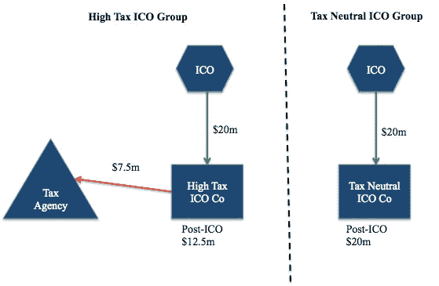

# 结构化如何帮助管理您的 ICO 税务风险

> 原文：<https://medium.com/hackernoon/can-structuring-manage-your-initial-coin-offering-tax-exposure-a1b282f2288d>

随着比特币和其他加密货币创下新高，首次发行硬币或代币生成事件(在本文中我们统称为 ico)作为一种筹集资金为新的加密项目融资的方式继续受到关注。

虽然监管机构仍在很大程度上追赶最新的加密货币趋势，但对加密世界的审查越来越多，监管机构正在对 ico 和加密项目应用法律框架，包括采取措施[确保加密行业纳税](https://www.cnbc.com/2017/11/30/bitcoin-investors-beware-the-irs-wants-its-cut-and-you-may-not-know-it.html)和[遵守证券法](https://www.sec.gov/news/press-release/2017-219)。

Lupercal 以前的文章已经确定了 ico 的一些[关键监管考虑事项。概括地说，我们看到了考虑 ICO 的项目必须解决的三个监管领域:](https://lupercalcapital.com/cryptowiki-icoregulation.html)

1.  反洗钱/反恐融资法；
2.  公司和金融法规，通常涉及确定 ICO 代币是否构成证券；和
3.  ICO 收益的税务处理。

遵守这些法规可能成本高昂且复杂。仅公司税一项就可能导致超过 30%的 ICO 收益被税务机关拖欠(除增值税( **VAT** )部分收益可能适用 20–25%或更高的税率！).

# **税收和 ico**

从高层次来看，有两个关键税种会影响 ICO: **所得税，对实体的“收入”征收**，以及**增值税**，对实体生产的产品征收。

## 增值税

增值税系统实际上产生了一种纳税义务，在这种情况下，一个实体制造某些种类的“供应品”。普通人制造的许多“供应品”都是熟悉的:它们包括商品(如可乐)或服务(如修理断裂悬架的汽车修理工)。但增值税可以适用于比通常认为的更广泛的“供应品”:例如保险产品、某些类型的金融衍生产品和一些凭证。

虽然大多数监管机构尚未就 ICO 项目发行的代币或硬币的增值税处理发表正式立场，但 ICO 代币销售确实有可能构成供应并需缴纳增值税(税率各不相同，但平均约为 20%)。

增值税是一种“高合规成本”税，因为每个司法管辖区对 ICO 令牌的增值税处理可能不同。如果不考虑增值税的影响，你可能会在某天早上醒来，看到一张来自地球另一端的国家的高额增值税账单。

## 收入和国际税

所得税规则因司法管辖区而异，但作为一般规则，公司所得税实际上是对特定司法管辖区内实体享有的“净收入”(或利润)征收的。

[正如我们之前在此](https://hackernoon.com/icos-trade-offs-between-securities-and-tax-law-ee7090421c3b)所解释的，根据许多司法管辖区的公司税法，从某些 ico 筹集的收益可能是应税收入。这可能意味着实体在完成 ICO 后不久将面临巨额所得税账单(公司税率各不相同，但可能超过 30%)。

我们之前的文章解释了在国内所得税的基础上，公司税在许多司法管辖区是如何运作的。然而，ICO 项目的全球性质——可能涉及分布在世界各地的团队和位于几乎每个国家的购买者——意味着“国际税收”原则(已经是利基税收领域的一个复杂领域)可能会在 ICO 项目中发挥作用。

一般而言，特定国家对以下两种情况征税:

*   居住地基础，即实体的“全球”收入(所有收入，无论收入来源如何)。或者
*   来源基础，即产生收入的国家。

这些规则实际上增加了另一个“条件”，即某一金额在特定国家是否属于应税收入。简而言之，这意味着一个国家征收公司税，条件是某笔收入*和*来源于该国，或者该收入由该国的“居民”实体产生。

如果这些规则都不满足，一个国家通常不会对收入征收所得税——在这种情况下，国际税收规则实际上假设这种收入在其他地方也应征税，这是另一个国家的问题。不同管辖区之间签订的税务条约的适用可能会使问题进一步复杂化。

## ICOs 与国际税收结构

假设 ICO 收益是“应税收入”，国际税收原则可能会为 ICO 实体增加另一组税收考虑。这些原则对于管理许多跨国实体的全球税务风险至关重要。

许多 ICO 项目正在积极探索或重新考虑其代币发行实体的位置，以管理潜在的税收结果，部分原因是出于税收居留的考虑。

ICO 项目特别感兴趣的是使用“税收中性”司法管辖区作为 ICO 发行实体的所在地，在其他项目成员的所在地设立单独的服务/开发实体(通常在相对“高税收”的司法管辖区，如美国、加拿大或澳大利亚)。一些运营部门探索的另一种替代方案是将整个 ICO 组一起迁移。

简而言之，如果实体位于不征税的司法管辖区，则不对其所有全球收入征税(仅在某些司法管辖区根据“来源”征税，即在产生收入的某些司法管辖区，但来源原则对国际 ICO 的应用尚未经过测试，因此尚不清楚它是否/在多大程度上适用于 ICO 收益)。

在很高的层面上，采用 ICO 发行人位于税收中性管辖区(与更高的税收管辖区相比)的结构的潜在影响如下所示。

Illustrative potential tax impact of ICO issuers in high tax v tax neutral jurisdictions

但是住院医师资格是(非常，非常)大的结构考虑的冰山一角。考虑不周、建议不周和实现不佳的结构会导致许多问题。

## 结构的复杂性——仍然是跨国公司的专利？

传统上，国际税收结构是大型跨国公司和高净值个人的专属领域。有效的国际结构是复杂的，需要非常专业、昂贵的律师和会计师团队。

Lux Leaks、 [Panama Papers](https://panamapapers.icij.org) 和 [Paradise Papers](https://www.icij.org/investigations/paradise-papers/) 等重大泄密事件将国际税收结构安排推到了公众辩论的前沿。

## **税收结构的复杂性——为什么不是每个人都这样做？**

虽然税收结构的基本运作比过去更加广为人知，但其复杂性并未降低。最近的监管变化使得这个领域比以前复杂得多。

考虑简单使用“现成”结构来实现预期税收结果的 ICO 项目应在采用此类“解决方案”之前仔细考虑其选项。为一个实体运作的结构通常不太可能为另一个实体运作。了解如何应用国际税法依赖于对关键司法管辖区内错综复杂的税法的详细、特殊的了解，以及对项目商业运作的深刻理解。

正如许多跨国公司目前从[巴拿马文件](https://panamapapers.icij.org)和[天堂文件](https://www.icij.org/investigations/paradise-papers/)中发现的那样，项目的商业驱动因素、相关实体的位置以及所提供产品/服务的类型都将对每个单独 ICO 项目的税收结果产生独特的影响。

简而言之,“纸上”结构是否有效可能取决于采用它的实体的情况——这通常比看起来要复杂得多。

## 政府/法规对 ico 的关注

正如大多数读者所知，世界各地的许多经合组织政府都在寻求解决某些导致雇佣他们的人“避税”的结构。

一个特定的结构是否被视为合法往往取决于 ICO 项目活动的性质、类型和地点。在许多情况下，有一个不明智的或执行不力的 ICO 结构实际上可能比没有一个“优化”的结构更糟糕——许多国家对税务违法行为征收罚款和利息，其金额可能远远超过任何感知的税收“节约”。

## 公司与非公司实体

除了上面提到的国际税务方面，确定 ICO 项目中涉及的实体类型(公司或其他)为 ICO 结构增加了另一个维度。

例如，一些 ICO 项目试图使用非营利实体作为 ICO 代币的发行者，因为从表面上看，这些实体免除公司所得税，因此可以避免代币发行后的所得税责任。

这种方法并不是没有问题，因为 Tezos 项目的创始人[目前发现](https://www.reuters.com/article/us-bitcoin-tezos-lawsuits-exclusive/exclusive-tezos-founders-push-for-legal-bailout-from-swiss-foundation-idUSKBN1DV4K0):为他们的项目筹集了 2.32 亿美元的基金会仍在考虑是否为 Tezos 在美国面临的三起集体诉讼提供诉讼费用。

使用非营利和慈善实体的 ICO 项目的创始人和项目主管可能会发现繁重的合规性和监管考虑限制了他们按照自己认为合适的方式开发项目的能力。重要的是，如何起草基金会的法律文件可能是如何使用其资金的关键。

# **结论——那么，结构化是 ico 的一个选择吗？**

是的，结构化绝对是 ico 的一个选项和一个重要的考虑因素。但是，不应该轻率地决定 ICO 组的结构，应该由项目的基本商业运作来驱动。

## *需要考虑的关键事项…*

许多 ICO 项目都经历过 ICO 项目成功后收到大量预付税款的后 ICO 时期，因此被复杂且看似“高效”的结构所吸引，以管理其潜在的纳税义务。

然而，为你的 ICO 决定一个结构是一个棘手而复杂的任务，通常需要有经验的顾问。每一个 ICO 项目都会有独特的环境，比如团队的位置和资金筹集的地点。通常，一个 ICO 项目在没有建议的情况下进展得越久，实现或解决任何事情就变得越困难、越昂贵。

廉价地运行 ICO 前的结构化可能很诱人，但廉价的解决方案往往是糟糕的解决方案。正如 Tezos 这样的项目所强调的，从一开始就建立公司安排可以节省大量资金，从长远来看也不会令人头痛。

许多结构选项都需要权衡风险、财务、商业、法律或税务状况。在为 ICO 选择正确的方法之前，最好先讨论这些权衡和考虑因素。

可能你的 ICO 的合适结构不是国际化的，也不涉及常驻考虑因素——对于 ICO 项目，有更多的选择可以探索。使用不同实体类型的结构可能是一种有效的方法，可以确保 ICO“总额”在一个较长的时期内摊销或确认，例如，当实体发生更多开发支出时。

## ***下一步***

在考虑 ICO 时尽快获得好的建议可能会对项目的长期未来产生重大影响。

Lupercal Capital ( [*、lupercalcapital.com*](http://lupercalcapital.com)*)及其专家顾问网络曾与许多 ICO 项目合作，指导他们解决运营 ICO 的复杂商业和财务问题。*

*我们还向投资者和购买者提供建议，说明哪些加密项目解决了关键的商业和金融问题，并为自己的长期成功奠定了基础。*

*[***enquiries@lupercalcapital.com***](mailto:enquiries@lupercalcapital.com)***如果您想和我们经验丰富的顾问谈谈我们如何能帮助您，请联系我们。****