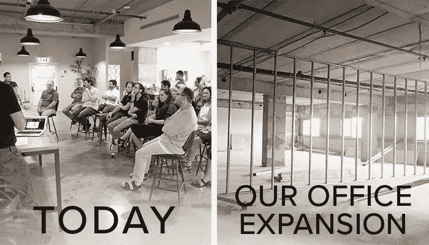

# 我们能在成长过程中保持温暖和毛茸茸吗？

> 原文：<https://medium.com/hackernoon/can-we-stay-warm-and-fuzzy-as-we-grow-67c5fcd8bd23>

我大学毕业后的第一份工作是为甲骨文公司工作。今天，我是一家拥有 41 名员工的成长中的初创公司的首席执行官。我亲身经历了在不同公司工作的好处和坏处，无论是大公司还是小公司。现在我有了自己的想法，我想了很多下面这个问题:创业公司如何在快速增长期间保持自己的文化？

在进入甲骨文公司之前，我去公司总部参加了为期三周的培训。我和其他大学毕业生住在酒店里，我们没有真正的责任。换句话说，我觉得我又开始了大学生活。甲骨文证明了它有资源投资于我的职业发展，我很高兴能为这样一家大公司工作。然而，在完成训练后，现实世界像波浪一样向我袭来。告别命名游戏和团队建设练习！我不得不低下头，努力工作，创造价值。一切运转高效，资源丰富。但与此同时，管理层似乎离我很远，我觉得自己远离了公司的大愿景。

How can we keep our great culture as we grow to larger offices?

相比之下，当我三年前创建 IT 中心站时，总共只有五名员工，每个人都在同一个房间里工作。一整天，我与团队的每个成员都有定期、持续的互动。从那时起，我们已经扩大到 35 名员工，我们还买了一个新的办公空间，面积很快就会翻一番。因此，很明显，当我们是五人团队时有效的模式(与每个员工频繁互动)在今天并不奏效，而且随着我们的不断发展，今天有效的模式在一年后也不会奏效。

每当团队雇佣新员工时，我们都会召开全公司会议，介绍我们自己。我们创建了自己的内部网，提供从使用咖啡机到访问密码保护账户的各种指令。我们办公室实行门户开放政策，我们每天一起吃午饭。我们在酒店培训场所所缺乏的，我们在可及性和温暖性方面进行了弥补。我们的规模很容易做到这一点。

随着 IT 中心站的不断扩张，我们如何保持我们的无障碍和温暖的文化？

虽然我们欢迎有形的东西加入我们的公司，但我们也害怕失去无形的东西。例如，IT 中心站优先考虑快速决策。作为一家初创公司，快速决策是很自然的。另一方面，对于大公司来说，有更多的惰性需要克服。为了保持我们的公司精神，我们将坚持不懈地定义和强化我们的文化价值观，同时继续投资于实现这一切的流程和人员。

如果您喜欢这篇文章，请**点击下面的心形符号**，这样其他人就可以看到了。