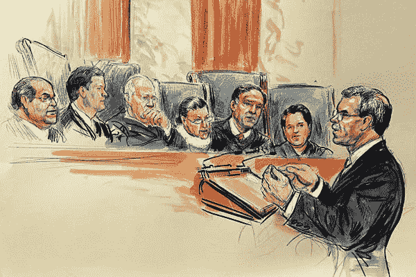
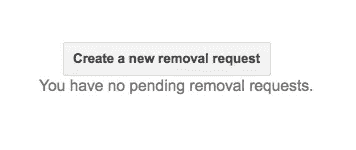
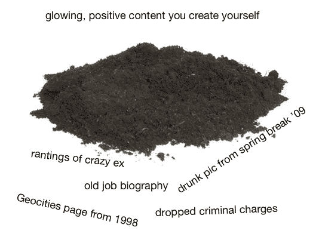
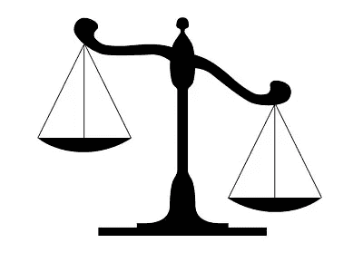
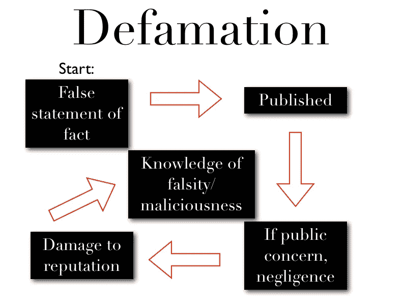

# 你能从网上删除东西吗？

> 原文：<https://medium.com/hackernoon/can-you-delete-things-from-the-internet-e51fad40dbaf>

威尔·西蒙兹

> 披露:[在线隐私公司 Abine](https://goo.gl/3iEZxb) 曾赞助过黑客 Noon。 [**他们招牌产品七五折，模糊&删除我**。](https://goo.gl/Uk2QUH)

你想从网上删除一些东西:可能是一篇文章，一张图片，一篇博文，一个账号，或者一个视频。这并不总是容易的，但是这是可以做到的。所以，下面是如何删除网上的东西。

我们花了几年时间用我们的产品 [DeleteMe](http://www.abine.com/deleteme/) 从数据经纪人网站上删除人们的信息，我们学到了很多。在我们开始我们的 7 个删除技巧之前，让我们从网络的一些基本规则开始。

# 网络规则 1:跑之前先走。在谷歌注意到之前，必须从原始来源删除。

在本指南中，我们将实际托管您想要删除的内容的网站称为原始来源发布者。博客、报纸、论坛、脸书……它们都是出版商。

假设有人写了一篇关于你的非常不友好的博文，现在每当有人搜索你的名字时，它就会出现在谷歌的搜索结果中。很自然，你会希望它从谷歌上消失。重要的是:*谷歌不是那个帖子的来源；它只是让那个帖子更容易被找到。*文章实际上是在博客上发布的，可能是 WordPress、Posterous、Tumblr 或其他流行的博客网站。谷歌没有该文件，也不能删除该文件。

要从谷歌的搜索结果中删除某些东西，你必须首先从原始来源中删除它。一旦你删除了一条内容，谷歌和其他搜索引擎自然会把它从搜索结果中过滤掉。然而，有一种方法可以加快这个过程:参见下面的第 2 点。

# 网络规则 2:你会碰到一些红灯。在大多数情况下，网站没有任何义务删除任何东西。

再见，数据。

大多数人们想要删除的东西都是他们在更早的时候自愿发布的。根据许多网站的使用条款，无论你发布什么，一旦发布，你就失去了权利。这就是为什么你在发帖前思考是绝对关键的，因为它可能会永远留在互联网上。

你还必须有一个真正的理由来迫使网站删除内容。在照片上看起来很糟糕或者不喜欢某人在你的脸书墙上发表的评论是不够的。我们将在本指南的后面深入探讨这些重要的原因。好消息是:尽管网站没有*的*来删除内容，但他们可能会这么做来帮助你。礼貌地请求可以帮你大忙！

# 网络规则 3:坚持下去。坚持是有回报的，所以如果你碰壁了，绕过去。

“吱吱作响的轮子得到了润滑油”这句话比以往任何时候都更适用于拆卸。你必须大声说出来，经常说，并坚持下去。一个项目是否被删除 80%取决于你愿意付出多少。你不能把没有回应当作答案。你在和非常忙碌的人和公司争夺有限的时间。事不宜迟，下面是我们关于如何从网上删除一些东西的 7 个建议。

# 1.找个人，或者至少找一个部门来谈谈

要真正删除一个项目，你必须联系负责管理它出现的特定网站的人。如果是你，而且是你的账号或者网站，那就更好了。一些网站有要求删除的系统，但是如果你和一个真实的人交谈，你的机会会更大。

尝试在出版物上找到网站编辑、网站管理员或作家的电话号码。根据我们的经验，最好的交谈对象是对技术足够了解的人，并且有权自己删除内容。这样，当你提出要求时，他们可以正确地处理你的要求，而不是经过一长串可能忘记你的决策者。需要最长时间回复你的部门？合法。

你的目标是和一个真实的人交谈。不过，我们不能保证人类听到你的消息会这么高兴。

你通常可以在大多数网站底部的“联系我们”链接中找到一个号码。如果没有列出联系信息，您可以进行特殊搜索，看看是谁注册了该网站。这叫做“谁是谁”搜索，你可以在谷歌上免费搜索。只需输入“whois [www。[您正在查找的](http://www.[the)站点]。然后你会得到一个注册人的搜索结果。例如，如果你想在我们网站上搜索谁，你可以在搜索栏中输入“whois www.abine.com”。“谁是搜索者”将提供该站点管理联系人的姓名、地址和电话号码。请注意，如果网站是通过代理服务注册的，联系信息可能是匿名的。

如果你只能找到前台的一般电话号码(这种情况在报纸上经常发生)，告诉接待员你想就撤下请求与负责网站内容的人联系。如果你在和一家有自动电话菜单的大公司打交道，坚持下去，直到你接通另一个人的电话。

# 2.如果你不能说话，发邮件

如果你找不到电话号码，就去找一个私人邮箱。当你挑选一个人去接触时，遵循我们上面第一点的建议。即使你找不到个人邮件，大多数网站都使用员工邮件的标准格式，你只要稍加努力就能猜到。例如，我们使用格式“Abine dot com 的名字”这个网站，[邮件格式](http://www.email-format.com/)，可以通过提供很多热门网站的格式来帮你猜。

# 3.提出你的理由，并把它做好

通常没有合法的理由让一件物品被拿下来，所以只有你礼貌而雄辩地请求，你才会成功。把自己想象成一名律师:你必须代表自己，提出令人信服的论点。如果他们真的把东西拿走了，那也是在帮你的忙。

你必须证明你的观点。

写下你的要求是个好主意，即使你打算和某人交谈，这样你就有一个路线图可以参考。按顺序坚持以下建议:

*   首先*简单*说明你是谁以及你联系他们的目的(例如，“我想和你谈谈从你的网站上删除一个项目的事情”)。
*   感谢他们的宝贵时间，并确认他们是讨论删除请求的合适人选。如果不是，继续下去就是浪费你们两个人的时间。请他们帮你联系合适的人，不仅仅是重定向的电话，还要那个人的电话号码、姓名和电子邮件地址。
*   提供一个简明的背景，说明你想删除什么，以及它是如何出现在网上的。
*   下面是最重要的部分:说*为什么*删除这些内容对你很重要。使你自己和你的处境人性化，但是不要太情绪化或者太戏剧化，即使这可能对你来说很敏感。你希望他们能够和你产生共鸣，喜欢你，和你感同身受。几个很好的理由:内容可能不真实，对你的声誉有害，让你很难找到工作，和/或情感创伤。
*   在你陈述了你的理由后，重申你希望他们删除它。然后等待。球现在在他们的球场上；在他们给你答复之前不要说话。
*   如果他们对完全删除说不，提供替代方案。如果出版商有一个政策，除非在特殊情况下，否则不得发布，他们会考虑(1)通过使用 robots.txt 文件阻止内容被搜索索引，(2)删除或匿名您的姓名，或者(3)甚至添加一个简短的编辑以包括更新，以澄清情况或解决您的任何问题吗？
*   最后，感谢他们花时间考虑你的情况。要知道他们会很有风度地回顾它，并确保他们感到被欣赏。你还应该主动提供任何可能对他们有帮助的额外信息。
*   检查书面请求的拼写和语法错误。这些事情很重要。
*   如果你确实要和某人交谈，确保你记下他或她的名字，并有条理地记录你们的交流，以防你不得不重复尝试。

如果一个人拒绝了你，试试公司里的其他人。记住:坚持是有回报的。

# 4.用谷歌的网址删除工具从谷歌搜索中删除东西

你可以要求谷歌删除过时的搜索结果。

如果你在谷歌中看到一个需要更新的链接(换句话说，你已经删除或更改了出版商网站上的内容，但谷歌的搜索结果仍然反映了旧的内容)，你可以使用[谷歌的 URL 删除工具](https://www.google.com/webmasters/tools/removals)来修复它。

注意，你需要一个谷歌账户。只需点击“新删除请求”按钮，粘贴需要更新的网站链接，在“原因”下，从下拉菜单中选择“页面已更改，谷歌缓存版本过期”。然后按照页面上的指示，“输入一个已从实时页面中完全删除但仍存在于缓存版本中的单词。”最后，提交您的请求。谷歌将在大约 48 小时内批准或拒绝。您还可以[查看待定、已批准和已拒绝的移除请求](https://www.google.com/webmasters/tools/removals.)。

# 5.如果你不能删除不好的东西，那就用好的东西把它埋了

在一个完美的世界里，我们可以删除所有不公平的、过时的、负面的搜索结果。事实上，除非在特殊情况下，大多数内容都会存在。删除你能删除的，但是创建你自己的正面内容来抑制负面的搜索结果是控制你的形象和改善搜索结果的一个很好的方法。请注意，如果你想从网上消失，这不是你的解决方案。你会创造出更多关于你的*内容，但你会将天平从消极转为积极。*

可以把负面的东西埋在搜索结果里。

**为自己创建和管理公共档案**

某些网站总是出现在搜索结果的前列。只需用你的名字和一些身份信息创建一个个人资料，你就可以抑制负面结果。请确保将您的隐私设置设为公开查看，并且只发布您绝对确定以后不会后悔的内容。以下是可供使用的网站列表:

推特:[http://twitter.com/](http://twitter.com/)

领英:[http://www.linkedin.com/](http://www.linkedin.com/)

MySpace:[http://www.myspace.com/](http://www.myspace.com/)

http://www.facebook.com/

formspring . me:【http://www.formspring.me/】T2

四方:【http://foursquare.com/ 

关于。我:[https://about.me/](https://about.me/)

谷歌:[https://profiles.google.com/](https://profiles.google.com/)

博主:[http://blogger.com](http://blogger.com/)

Tumblr:[http://tumblr.com](http://tumblr.com/)

摄影记者:[http://www.photobucket.com/](http://www.photobucket.com/)

quora:[http://www.quora.com/](http://www.quora.com/)

http://www.stumbleupon.com/

http://www.reddit.com

http://www.digg.com

普利西:[http://www.plixi.com](http://www.plixi.com/)

雅虎脉搏:[http://pulse.yahoo.com/](http://pulse.yahoo.com/)

http://www.flickr.com/

你也可以使用你的真实姓名在新闻网站上注册，并对文章发表评论，尽管这些类型的帖子往往不如上面列出的网站排名高。

**链接您的各个站点**

谷歌确定一个网站在搜索结果中排名的方法之一是分析其他网站链接到它的次数。你可以让你的内容上升，通过链接到它本身。例如，创建一个 twitter 帐户，将其连接到您的 formspring 帐户，将这两个帐户连接到您的脸书页面，并在您的 Blogger 页面上链接到所有帐户。当然，你越是使用你的账户并与其他人互动，他们就越有可能链接到你的内容，从而推动你的结果更高。

**收回否定关键字**

如果对你的名字的搜索通常是正面的，但是包括一个特定的关键词会带来负面的或者不想要的结果，试着重新使用那个词。假设对“John Doe”的搜索是肯定的，但是“John Doe”+“State College”带来了否定的结果。John Doe 应该开始在他的正面内容创作中包括短语“州立大学”,以便将其与他的良好声誉相关联。

# 6.向搜索引擎举报违法行为

如果你认为你想要删除的任何内容违反了任何法律(侵犯版权是常见的一种)，那么访问[此链接](http://www.google.com/support/bin/static.py?page=ts.cs&ts=1114905)，选择“网络搜索”，然后从那里开始。一般来说，如果内容属于以下任何类别，Google 和其他网站都会将其删除:

–侵犯版权或商标——威胁对他人使用暴力——儿童色情——淫秽——剥削儿童——垃圾邮件——冒用或滥用他人身份——法院下令删除——恶意软件/病毒——机密信息(包括社会安全号码、银行账号和信用卡号)—网络欺凌——其他非法材料

# 7.如果某件事确实是诽谤性的，请律师

抱歉。我们试图避免让它来找律师，但不幸的是，有一个点，当你不得不打电话给法律团队。

如果你想删除的内容是某人对你或你的企业的负面评价，如果没有法律文件支持你的主张，你通常不能删除这类内容。根据目前的互联网法律，托管公司和网站没有法律义务删除涉嫌诽谤的内容，除非法院确定该内容实际上是不真实的，对你有害。

仅仅因为某人说了你不喜欢的话，并不意味着这个声明是诽谤性的。诽谤是一个定义明确的法律术语，有着非常具体的含义。它也与言论自由权相平衡。如果你在一家餐馆食物中毒，你有权在 Yelp 上发布对那家餐馆的差评。业主可能不喜欢，但如果这是真的，你可以说出来，公众有兴趣了解一个可能让他们生病的地方。那个差评不是诽谤。然而，如果你发帖说餐馆老板是恋童癖，只是为了报复他整夜呕吐，那最有可能的*是*诽谤。

诽谤需要满足四个要素:(1)存在对事实的虚假陈述，而不是观点；(2)向至少一个其他人公开发表的；(3)如果诽谤性事件引起公众关注，则发布者至少有过失；以及(4)必须存在对被谈论者名誉的损害。对于名人和公众人物，还有一个额外的要求，即声明是恶意不真实的——你知道它是假的，但你说它是出于不良和伤害的意图。

诽谤的法律要件。

令人沮丧的是，你需要一个法院命令来宣布一些事情是诽谤，但如果没有这条规则，网站和托管公司就不可能处理成千上万的诽谤索赔。例如，如果你看一下 [Blogger 的使用条款和内容政策](http://www.blogger.com/content.g)，你会发现他们并没有将诽谤列为违法行为。此外，谷歌声明他们“不会删除 www.google.com[或任何其他美国. com 域名中涉嫌诽谤的内容。”](http://www.google.com)

因此，如果索赔(1)是作为事实而不是观点提出的，(2)实际上是错误的(你可以证明这一点)，以及(3)已经对你的名誉造成了实际的、可证明的损害，你可能需要与第一修正案律师交谈，特别是专门从事互联网诽谤的律师。

我们希望这些信息对你有所帮助，并祝你好运删除！