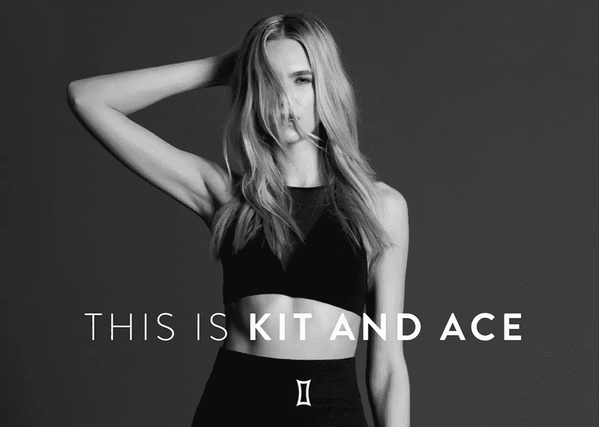
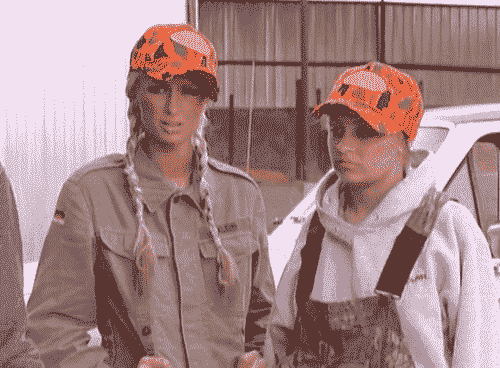
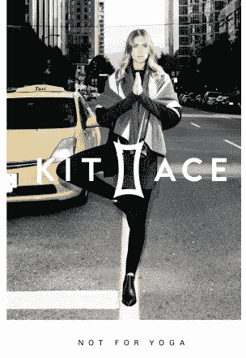
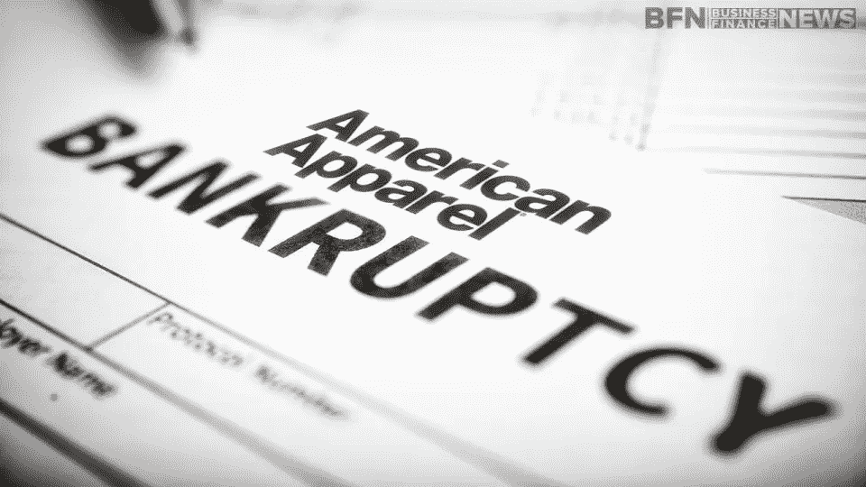
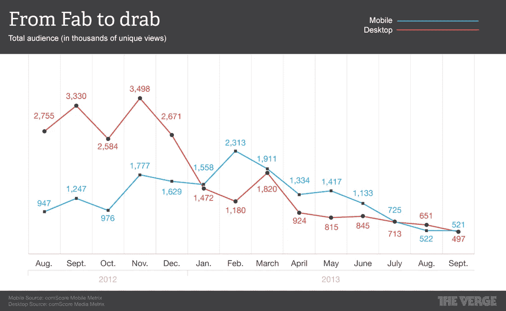

# 你能黑掉信任吗？

> 原文：<https://medium.com/hackernoon/can-you-hack-trust-b28984e40fcb>

By [Jonas Altman](http://thesocialfabric.com/about/people/)

## 一些品牌逐渐消失，而另一些却留下了印记。还记得冯·达奇吗？

## 建立一个品牌需要时间。更准确地说，市场研究人员表示，这至少需要两年时间。根据客户参与公司 [SDL](http://www.sdl.com/about/) 的说法，消费者与一个品牌建立真正有意义的关系需要将近 5 年的时间。在这条时间线上的某个地方，忠诚者从意识到一个品牌的存在，到习惯性地在这个品牌上比其他品牌花更多的钱。

# **遇见基特和艾斯**

这家时装公司是以其虚构的缪斯命名的；运动服和她的对手冲浪小子艾斯。领导这家公司的是香农和 JJ·威尔逊，他们是 Lululemon 创始人奇普的妻子和儿子。现在价值超过 100 亿美元的 Lululemon 的成功无疑为建立另一个强大的品牌提供了充足的基础。

然而，不到两年的时间，Ace 已经拥有了 62 家零售店。据传闻，仅在 2016 年这一数字就将翻倍。

建立持久的品牌，通常需要员工留下来帮助实现品牌愿景。在 [**Glassdoor**](https://www.glassdoor.ca/Overview/Working-at-Kit-and-Ace-EI_IE840007.11,22.htm?&countryRedirect=true) 上快速搜索，结果并不令人兴奋(5 颗星中的 3.3 颗)。如果 Lululemon 是什么，基特和 Ace 有几个麻烦要避免。它的老姐曾有过产品召回和质量问题、商品定价过高、人为抬高股价、欺诈指控、虚假广告和创始人发表的有争议的言论(包括最近的一篇 [**给《纽约时报》记者的**](http://forward.com/the-assimilator/332860/former-lululemon-ceo-late-shames-new-york-times-reporter-and-believes-in-je/) )。我们不要忘记排除超重顾客的营销努力。*

Lululemon 还因饮用来自 [**地标论坛**](http://www.landmarkworldwide.com/) 的 Kool-Aid，并将几条原则融入其公司文化而臭名昭著。虽然这对某些人来说很好，但也会疏远其他人。Kit & Ace 的一名前雇员解释说，他们目前有一些优秀的人才，但问题仍然是:他们会留下来吗？

还记得美国服装吗？在 2000 年的全盛时期，他们以性感的广告宣传、洛杉矶市中心制作的免费血汗工厂服装和有争议的首席执行官而闻名。品牌基础并没有建立长久。去年 10 月，他们申请了破产法第 11 章的保护，目前正在进行收购。

城市用品商也没能与最初帮助其繁荣的 X 一代人同步成长。

> 它仍在兜售同样的俗气家居用品，以及昔日的过时时尚标签。

是他们的合作伙伴公司 Anthropologie 成熟地扭转了局面。

在启动的土地上我想起了【Fab.com】****的故事。大多数初创公司会等到在一个国家建立了稳固的业务(和品牌)之后，再进行国际扩张。据说这个 1 亿美元的错误导致了他们戏剧性的内爆。****

********

****与此形成鲜明对比的是时尚品牌 Everlane 的策略，该品牌众筹**将其扩张至加拿大。相当令人惊讶的是，他们继续通过一个私人 Instagram 频道和 [**1 小时送达**](https://www.everlane.com/collections/sf-everlane-now-mens) 窗口取悦他们的忠实客户。******

****久经考验的赛道包括 [**【西滩】**](http://www.westbeach.com/)[**【翅膀与犄角】**](http://www.wingsandhorns.com/) 和 Lululemon，毫无疑问威尔逊是知道时尚的。作为有能力的经营者和品牌建设者，Kit & Ace 应该也不例外。然而，该品牌正在利用一种被称为休闲运动的趋势(我应该补充一点，我其实很喜欢这种趋势)，并为此投入了大量资金。****

****Kit & Ace 的员工将它比作一家科技初创公司，既指业务，也指文化。如果唱片公司计划在提高长期客户忠诚度的同时加快这种快速增长，那么最好相应地平衡一下规模。****

****延伸一个品牌，打造一个前瞻性思维 [**实验室**](http://lululemonlab.com/yvr/) **是一回事。推出一个能够自立的新时尚品牌完全是另一回事。撇开财大气粗不谈，只有时间才能证明*运动套装*和她的犯罪搭档*王牌*是否忠于他们背后的衣服。******

******摘自* [*维基百科*](https://en.wikipedia.org/wiki/Lululemon_Athletica)****

*****Jonas Altman 离开了 schmatta 业务，专注于战略咨询。你可以在《培训师》中找到他经常出差跑活动、****以及未来的工作。*******

******

Share the Love****** 

******如果你喜欢这个，你可能也会喜欢..******

******N E X T → [**好的设计如何让生意更好**](/@sfagency/how-good-design-makes-better-business-b7437d25aa67#.niyqb453m)******

************************************

> ******[黑客中午](http://bit.ly/Hackernoon)是黑客如何开始他们的下午。我们是 [@AMI](http://bit.ly/atAMIatAMI) 家庭的一员。我们现在[接受投稿](http://bit.ly/hackernoonsubmission)并乐意[讨论广告&赞助](mailto:partners@amipublications.com)机会。******
> 
> ******如果你喜欢这个故事，我们推荐你阅读我们的[最新科技故事](http://bit.ly/hackernoonlatestt)和[趋势科技故事](https://hackernoon.com/trending)。直到下一次，不要把世界的现实想当然！******

************