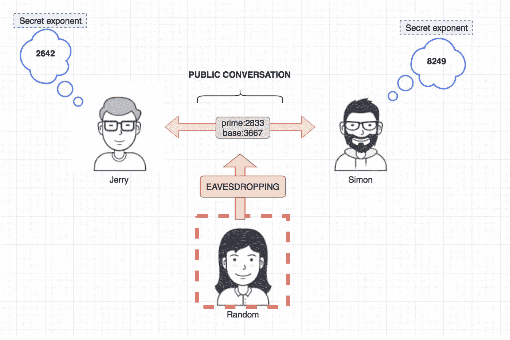
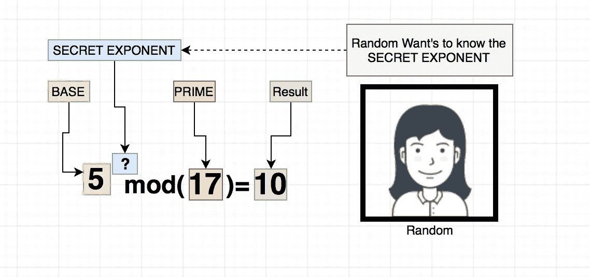
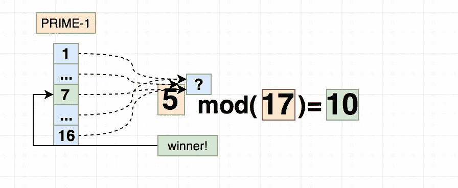
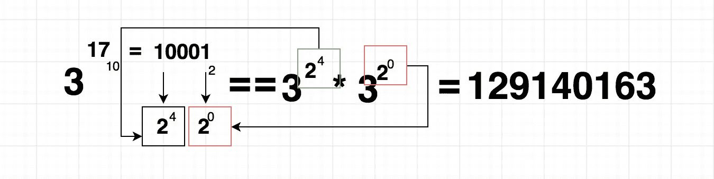

# 你能逆转迪菲-赫尔曼吗？

> 原文：<https://medium.com/hackernoon/can-you-reverse-diffie-hellman-b26b2173c785>

大家好，在之前的一篇文章中，我试图解释 D-H 是如何工作的，我希望我做得很好，希望没有问题，但对于偷听的人来说，反转“秘密指数”并猜出密钥有多难？



Initial communication

记得那张照片吗？让我们回顾一下:

杰里和西蒙商定了一个质数 T1 和一个基数 T3，当他们在聊这个的时候，有一个“随机”的第三个人在监听一切。

下一步，西蒙和杰里将计算一个数字，并告诉对方，例如杰里会告诉西蒙:

```
BASE to the SECRET EXPONENT modulo PRIME
```

也就是说:

```
3667 ** 6531 % 2833 = 2642
```

所以杰瑞会告诉西蒙我计算出的数字是 **2642。**

那么，对于“Random”来说，获得她现在拥有的所有值的“秘密指数”有多难呢？阐明“随机”方程应该是这样的:

```
3667 ** **X** % 2833 = 2642 
```

**X** 是我们想知道的值，如果“Random”知道 **X** ，那么她就能知道秘密指数。

这叫做离散对数，为了举例说明，我将使用较小的数字:

```
BASE=5 , PRIME=7 , RESULT=2 , SECRET = 10
**5 ** 7 % 17 = 10**
```



到目前为止，还没有简单的方法来逆向解决这个问题，对于小数字来说很容易，例如，我们可以列出所有小于**素数:**的数字



所以这在某种程度上是可行的…但是你可以看出这是一种蛮力，问题是当你使用一个大质数 **(+100 位数)**时，它在以下范围内:

```
2074722246773485207821695222107608587480996474721117292752992589912196684750549658310084416732550077
```

你可以看到复杂性**急剧增加**，另一个问题是一旦你建立了这个表，并且在**时间**内建立它！，你如何高效地在上面搜索**？如你所见，不是不可能，而是非常非常慢。**

**如此长的质数会增加求逆模运算的复杂性。**

**论坛上的一个问题是，生成这些数字有多复杂，速度有多快？专门**异能**什么的。**

**我发现如果计算机想知道:**

```
3 ** 17 OR 3 power of 17
```

**电脑不会这样:(太慢了)**

```
3x3x3x3x3x3x3x3x3....
```

**取而代之的是一种叫做**重复平方的操作，**大大简化了这种操作，其思想如下:**

****

**这比乘以 **3** ， **17** 倍快多了:)**

**总而言之，有些算术运算非常简单/可行，但反过来却非常复杂，因此 D-H 很受欢迎。**

**[](http://bit.ly/HackernoonFB)****[](https://goo.gl/k7XYbx)****[](https://goo.gl/4ofytp)**

> **[黑客中午](http://bit.ly/Hackernoon)是黑客如何开始他们的下午。我们是 [@AMI](http://bit.ly/atAMIatAMI) 家庭的一员。我们现在[接受投稿](http://bit.ly/hackernoonsubmission)，并乐意[讨论广告&赞助](mailto:partners@amipublications.com)机会。**
> 
> **如果你喜欢这个故事，我们推荐你阅读我们的[最新科技故事](http://bit.ly/hackernoonlatestt)和[趋势科技故事](https://hackernoon.com/trending)。直到下一次，不要把世界的现实想当然！**

****