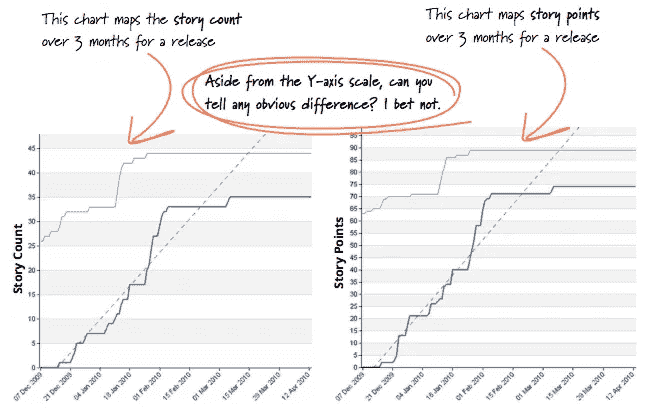
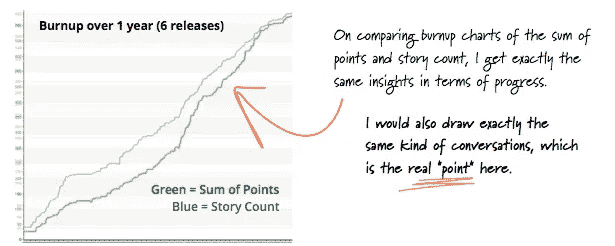

# 你能停止使用故事点吗？

> 原文：<https://medium.com/hackernoon/can-you-stop-using-story-points-ac36449ffa10>

注意:这篇文章的目标读者是那些可能错过了敏捷社区关于故事点估算的长期争论的产品经理。作为项目经理，我们可能只对这种做法有一点点影响，但是我们应该确保我们不是滥用/误用的同谋，并且我们提倡帮助我们的队友。

我目前正在读道格拉斯·w·哈伯德的《T2:如何衡量一切:发现商业中无形资产的价值》。这是第三版了，所以我要迟到了。哈伯德强调了我们正在雇佣的“工作”(决策)和不完美信息的价值。他写道…

> 测量不一定要完全消除不确定性，但一定会有一些预期的不确定性降低。如果决策者或分析师从事他们认为是度量的活动，但他们的估计和决策实际上平均变得更差，那么他们实际上并没有减少他们的误差…

作为一名产品经理，在下注时，我会尽我所能。

在产品开发中，一个月和六个月的差别——对于**的工作来说，同等的客户价值**——*真的很重要(每两周冲刺 5 万美元，以及昂贵得多的机会成本)。*为了做出选择，我将向六名团队成员展示两个潜在的赌注，并要求他们对更有可能在*一个月内*完成的项目进行投票。如果团队以较大优势(6–0 或 5–1)投票支持第一注，我们将进行第一注。如果票数接近，我们会进行对话。

但是我不会使用相同的信息来计划与另一个团队的交接，设置一个假的“激励性”截止日期，衡量我的团队的表现，或者承诺在一个月后开始新的工作。如果这项工作花了五个月的时间，我也不会生气，因为这总有可能发生。如果我们正在努力减少不确定性和风险，这一点很快就会显现出来。如果我们有机会更早地交付价值/提取知识，我们会的。

简而言之，我认为对于特定的优先化工作，信号总比没有好(尽管在某些情况下，特别是对于大量无计划的工作，信号可能没有任何价值……我还不如掷硬币来决定)。

无论如何……关于故事点估算(我写上面的内容是为了表明我不反对估算，也不反对进行测量——在这种情况下是投票——来帮助做决定)。故事不会持续一至六个月。如果我们幸运的话，他们需要一到三*天，*或者更长的时间，如果计划外的工作频繁中断，团队没有很好地划分故事，或者有故事级别的范围蔓延。

我已经在这里写了关于[疯狂用户故事规模谱](https://hackernoon.com/stories-vs-epics-d773118420d2)。可以说，在分解、以用户为中心、规模、独立性等之间总是存在着推/拉的关系。

根据我的经验——特别是如果你强调故事拆分的实践——你可以安全地使用用户故事计数而不是故事点(来完成各种工作)。这绝不是一个新的/原创的想法([参见 2013 年关于评估的 ThoughtWorks 电子书](https://info.thoughtworks.com/rs/thoughtworks2/images/twebook-perspectives-estimation_1.pdf)):

[https://info.thoughtworks.com/rs/thoughtworks2/images/twebook-perspectives-estimation_1.pdf](https://info.thoughtworks.com/rs/thoughtworks2/images/twebook-perspectives-estimation_1.pdf)

[https://info.thoughtworks.com/rs/thoughtworks2/images/twebook-perspectives-estimation_1.pdf](https://info.thoughtworks.com/rs/thoughtworks2/images/twebook-perspectives-estimation_1.pdf)

我的个人经历非常类似于李蕙敏和胡利亚诺·贝尔萨诺(来自电子书)。我发现有替代的方法来做决策*而不需要*故事点评估，以及伴随 sp 而来的混乱、误用和滥用。

“积分”这个词引出了得分的想法(“T8 团队在上次冲刺中赢得了 T9 30 分，而他们的分数在这次冲刺中降到了 24 分，wtf？”).团队经常对实践感到困惑，当他们在团队和公司之间移动时，不得不重新设置。我非常尊重 SPs 背后的想法，但是(通常)有更好的替代方案。

也许一个团队使用故事点估算来擅长分解…但是团队分解问题、实践持续改进和快速测试/学习的能力使他们变得伟大和“可预测”。

没有故事点估算，你*还能做什么(或者做得更好)*？

1.  你可以**引发关于范围、解决方案、风险和复杂性的对话**而无需故事点评估。
2.  可以**比较相对复杂度** 不用故事点估算。
3.  可以 **鼓励故事拆分/问题分解**不用故事点估算。
4.  你可以在没有故事点评估的情况下做出重要的资源分配决策(假设你的故事确实很小)
5.  您可以**估算不同类型工作的分配**而无需故事点估算。
6.  没有故事点评估，你也可以有目标。可以**《补个冲刺》**不用故事点估算。
7.  您可以跟踪**周期时间和提前期**而无需故事点估算。
8.  你可以跟踪**故事吞吐量**而无需故事点估算。
9.  你可以**测量团队绩效**而不需要故事点评估。
10.  您可以**随着时间的推移**提高可预测性，而无需故事点评估。
11.  你可以**预测一个大型项目的完成**而不需要故事点评估。
12.  您可以**梳理出影响故事吞吐量的障碍/阻碍**而无需故事点评估。

在一天结束的时候，你需要自己解决这个问题。

作为中间步骤，我建议继续你的故事点估计实践，但是也记录故事计数、[周期时间、交付时间和吞吐量](https://leankit.com/learn/kanban/lean-flow-metrics/)。试着给你的故事设定一个最大长度的准则(比如三天)。衡量、比较和反思。