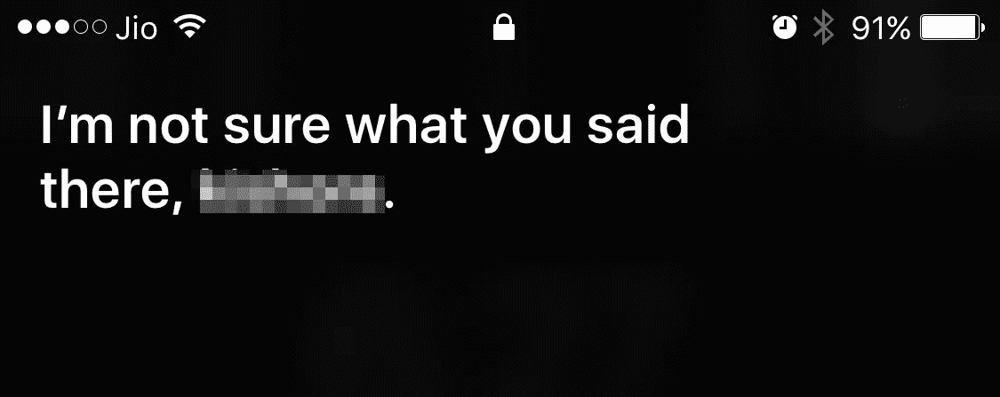
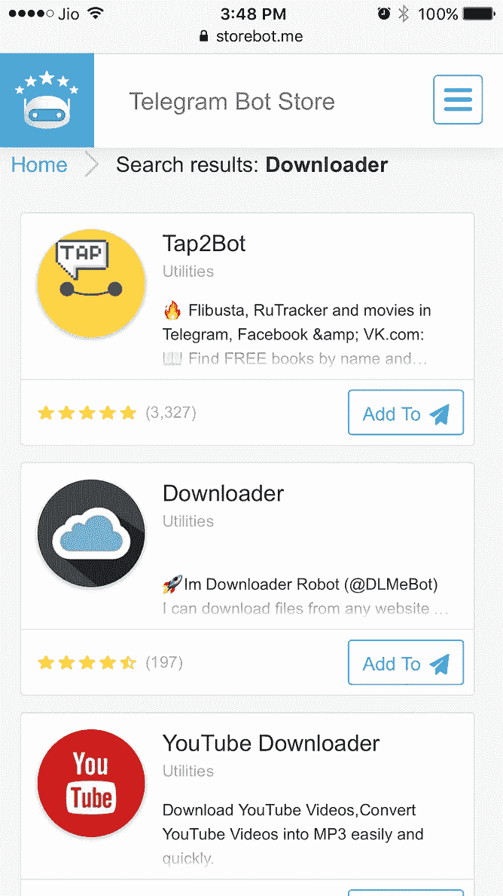
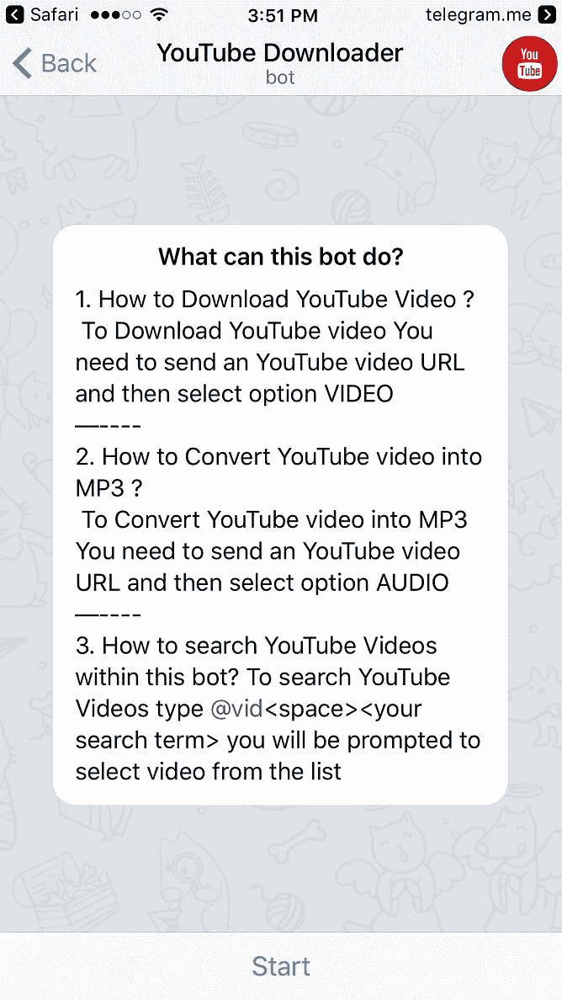
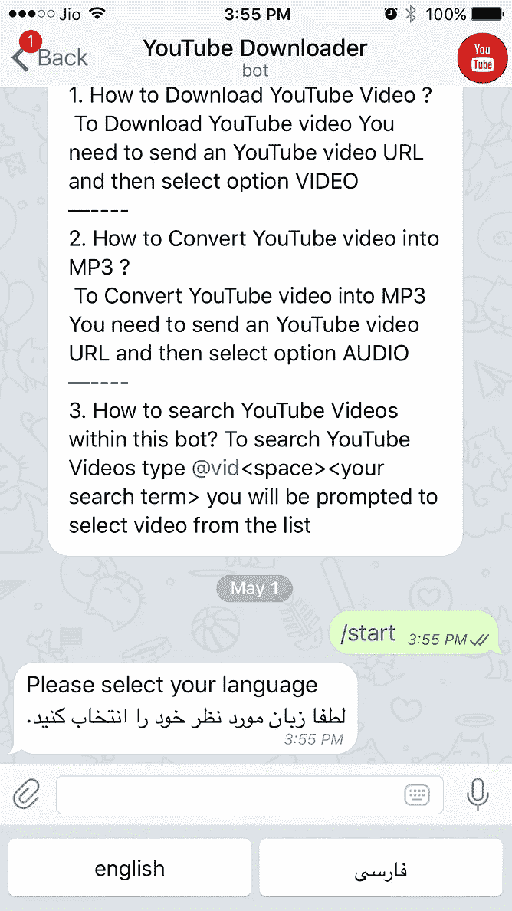
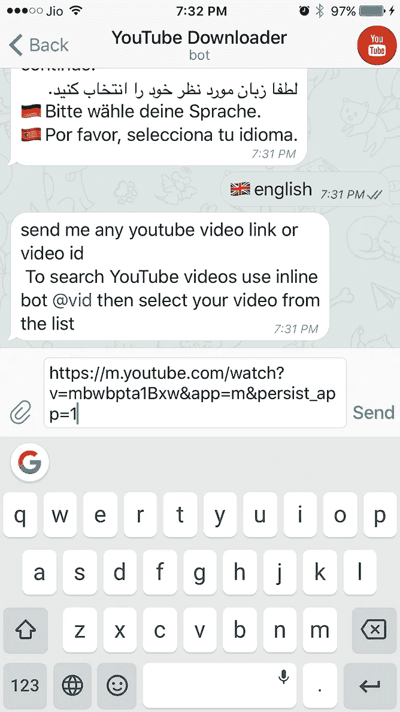
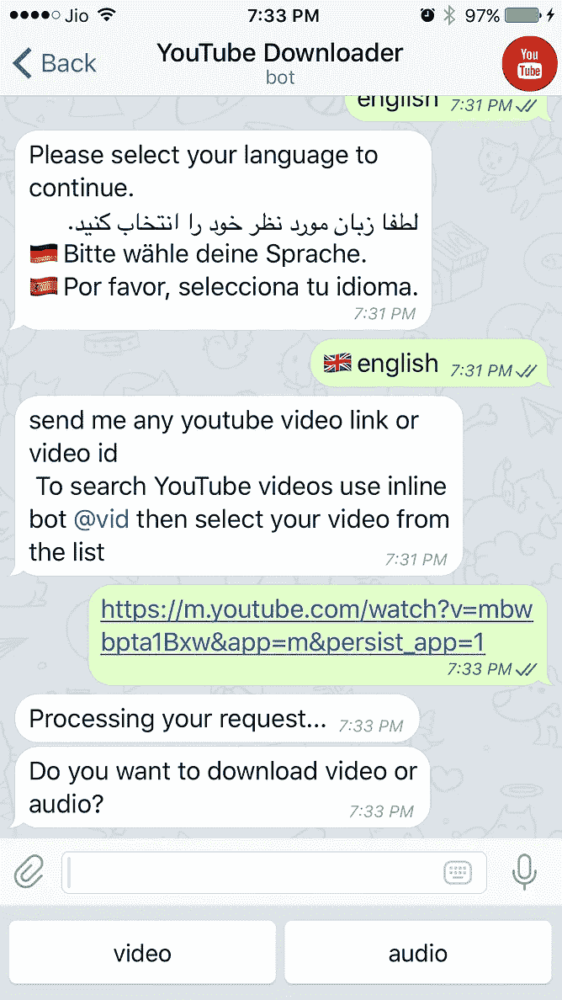
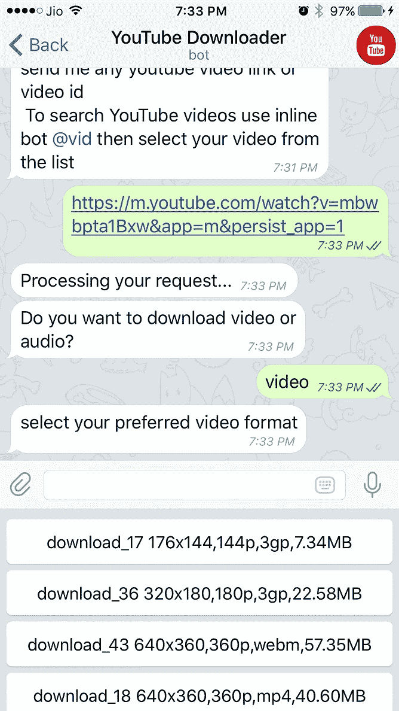
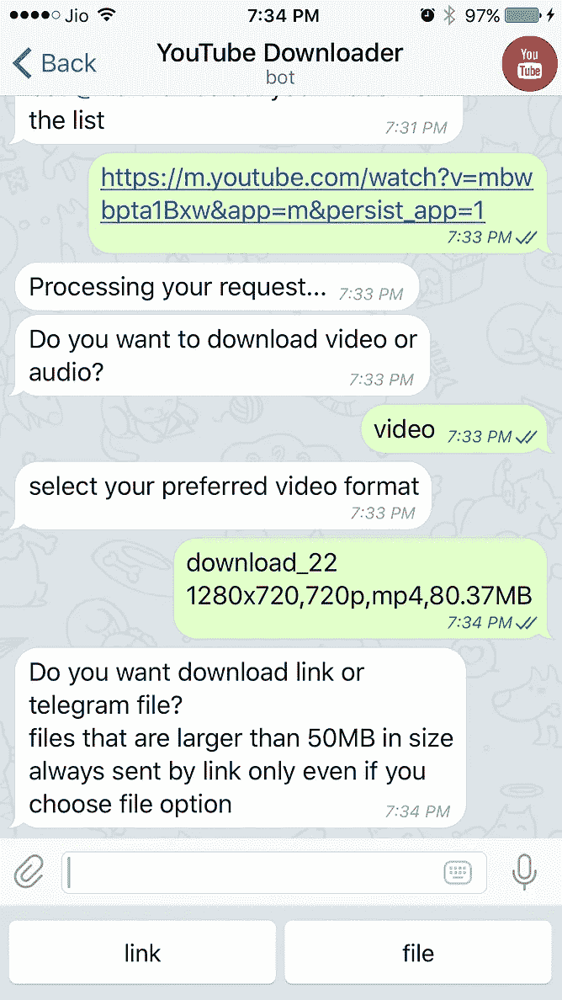
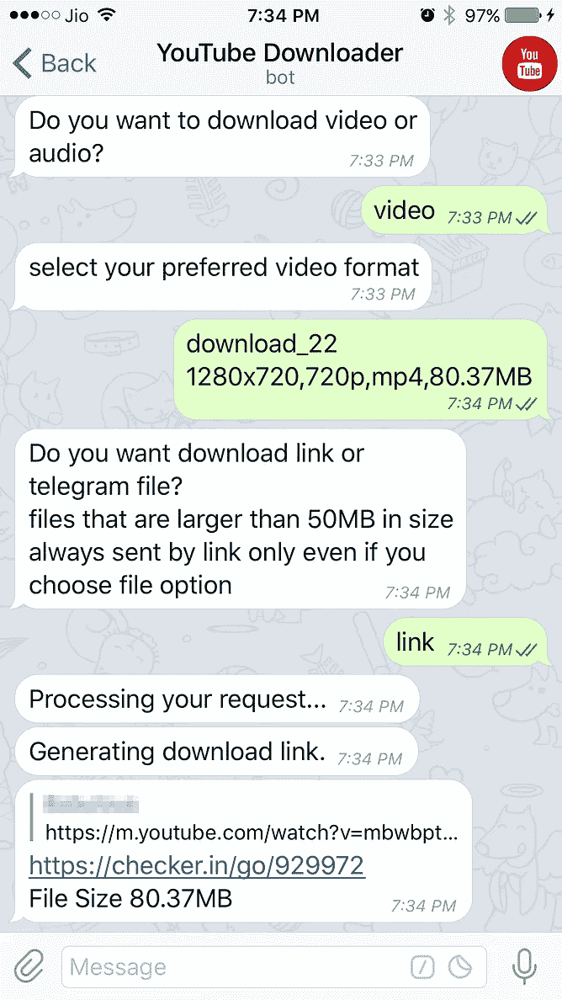
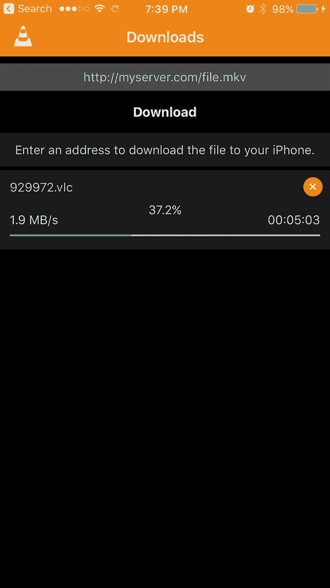

# 你能起诉机器人吗？

> 原文：<https://medium.com/hackernoon/can-you-sue-a-bot-3aac264f93f4>

Close encounters of a bot kind

聊天机器人已经存在一段时间了。但是我对周围发生的所有变化感到有点不知所措，没有太关注这些小家伙。然而，它们一直在快速繁殖，越来越难忽视它们。

也许我一直在回避他们，因为我和机器人的远房表亲，助理们有过接触。在我与 Siri 的互动中，事情并不太顺利，大多数对话都突然结束，就像这样。

我不知道你怎么想，但我觉得在公共场合慢跑时漫无目的地重复“Siri，播放下一首歌”很愚蠢，尽管她听不懂我的印度口音可能不是她的错。

与谷歌助手的对话也有类似的结局，“如果你刚才说了什么，我没听到是什么。”虽然我和 Cortana 和 Echo 互动不多，但我猜他们是一个阵营的。

在我看来，人工智能还没有准备好迎接印度的黄金时代。

然后我被介绍给 Telegram，开源的 messenger 应用程序。

在印度，WhatsApp 统治着信息世界。每个人都在上面。孩子、老师、家庭主妇、主管、医生，甚至警察。我甚至从未尝试过 Telegram，这似乎没有多大意义，因为要让我的数百万同胞都放弃 WhatsApp 是不可能的。

但后来一位法国朋友告诉我，Telegram 在那里很受欢迎，原因之一是你的电话号码是保密的，因为你可以通过用户名连接。

所以我安装了 Telegram，并第一次接触了聊天机器人。

这些聊天机器人基本上都是软件运行的电报账号，而不是人。让它们成为机器人的是它们有一定程度的人工智能，这使得它们可以和你对话，为你做事。最好的部分是，它都是文本，所以没有白痴误解我说的话。

所以我想为自己做什么？

嗯，我一直试图从 Youtube 上下载一个网球训练视频，但似乎有版权和其他东西的问题，这使事情变得复杂。我想看看机器人能否简化这项任务。

为了获得 Telegram 的机器人，我必须在我的手机浏览器上访问 [Telegram 机器人商店](http://storebot.me)。我搜索了下载器，弹出了几个。我点击了 Youtube 下载器上的“添加到电报”链接。它在 Telegram 中打开，上面有如何下载视频、音频和搜索视频的说明。然后我点击了“开始”，它让我选择我的语言。(地点在迪拜或其附近。我是中东人，这解释了阿拉伯语)

我回复英文，机器人让我给它视频链接。在我这样做之后，它通知我它正在处理我的请求。过了一会儿，它问我是想下载音频还是视频文件，当我回答视频时，它给了我一个格式选择。

我选择了 720p 格式。然后这个机器人问我是想把它作为电报文件还是视频链接发送出去。它还提到大于 50MB 的文件将只作为链接发送。我的文件是 80MB，所以我回复了链接，然后机器人把链接发给了我。

我复制粘贴到 VLC，就是这样。

我思考着刚刚发生的事情。我下载了一个我想要的视频，格式由我选择。除了回答机器人的一些相关问题，我什么都不用做。自己做这件事需要付出更多的努力。

真是令人印象深刻。我肯定会检查更多的机器人。

与此同时，我试图感谢机器人，这是唯一一次它暴露了它的弱点，要求我，“请发送一个有效的 youtube url 或视频 id，以获得任何帮助发送/帮助。”

当我离开电报的时候，一个问题浮现在我的脑海里。机器人和应用程序有什么不同？不难找到答案。

机器人是 21 世纪人类的星期五。

我已经通过我的信息应用程序下载了整个视频，只需请求一个名为“YouTube Downloader”的联系人为我下载即可。联系人碰巧是机器人的事实，并没有改变这一切都发生在一次简单的聊天中的事实。

没有狩猎的应用程序来做这项工作。不知道如何下载应用程序。不知道如何使用这个应用程序。不用担心我手机上的应用程序是否有足够的空间。不要试图回忆应用程序的名称。没有持续更新的应用程序。

事实上，关于机器人是否会取代应用的争论正在进行。我不这么认为。它们将共存，因为在某些事情上，每一个都比另一个做得更好。毕竟，我最终把那个视频保存在了一个应用程序里，VLC。

想起来了。如果 YouTube 决定起诉下载视频侵犯版权，会起诉谁？是我要求下载视频的，是机器人制造者让它成为可能的，还是机器人真的做到了？

你能起诉机器人吗？

> [黑客中午](http://bit.ly/Hackernoon)是黑客如何开始他们的下午。我们是 [@AMI](http://bit.ly/atAMIatAMI) 家庭的一员。我们现在[接受投稿](http://bit.ly/hackernoonsubmission)，并乐意[讨论广告&赞助](mailto:partners@amipublications.com)机会。
> 
> 如果你喜欢这个故事，我们推荐你阅读我们的[最新科技故事](http://bit.ly/hackernoonlatestt)和[趋势科技故事](https://hackernoon.com/trending)。直到下一次，不要把世界的现实想当然！

