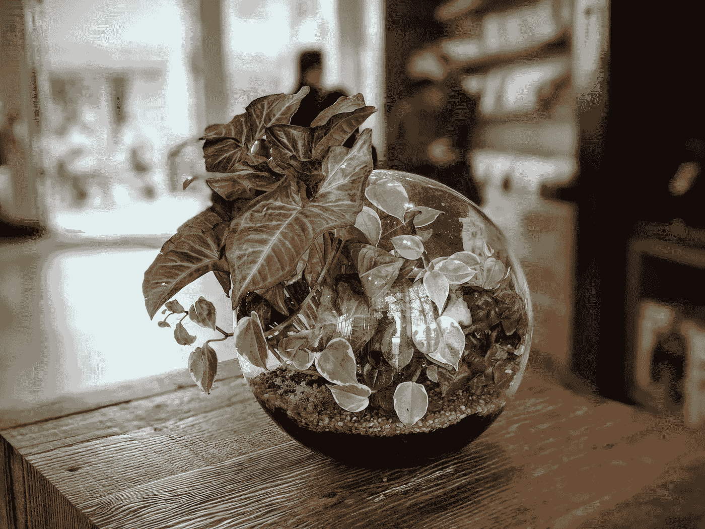
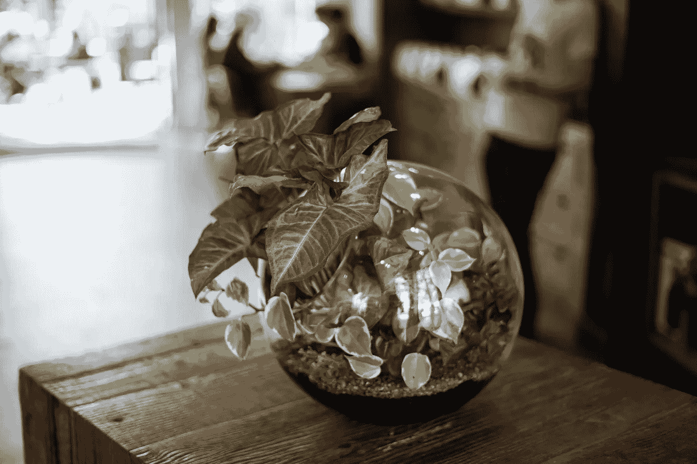
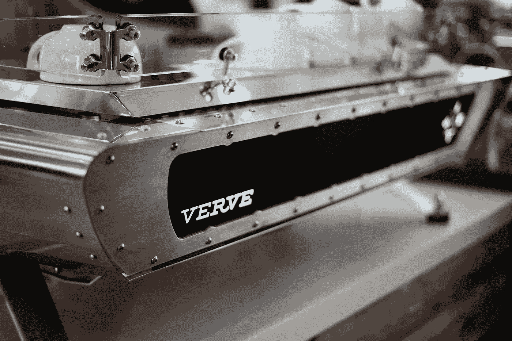

# 你能看出来吗？像素 2 人像模式与全画幅散景

> 原文：<https://medium.com/hackernoon/can-you-tell-pixel-2-portrait-mode-vs-full-frame-bokeh-b5982a902dee>

声明:这不是付费的也不是全面的评论，只是我的观点。

这个周末，我一直在测试我的新谷歌 Pixel 2 照片功能，我很高兴地说，它比我预期的要好。

我特别感兴趣的是，在新的纯粹基于人工智能的肖像模式中，散景与“真实的”(或者我应该说是基于光学的*)相比如何？)浅景深图片中的散景。*

*在我的第一次测试中，我使用了一个复杂轮廓的物体。下面的一张图片是用谷歌 Pixel 2 拍摄的，另一张是用我的索尼 A7rii 用 50mm f1.8 镜头拍摄的，你能分辨出哪个是哪个吗？(在 Google 相册中完成的对比度、白平衡和晕影调整)*

**

*[Click here to download full size](https://i.imgur.com/Y8AYS94.jpg)*

**

*[Click here to download full size](https://i.imgur.com/8qPyDtU.jpg)*

*请随意查看 EXIF，以了解哪个是哪个，但有一个小细节会将像素 2 泄露给训练有素的眼睛——第一张图片 [*](#1025) 的碗上的*过于完美的*倒影。*

*除此之外，我不得不说我很高兴对谷歌的肖像模式的质量感到惊讶，而且手机上只有一个镜头！正如你所看到的，它很好地处理了树叶的复杂轮廓和木制桌子的细节和令人困惑的纹理，只模糊了应该不在焦点上的部分，除了在碗的左下方与桌子相遇的几个区域。虽然不完美，但也很接近了。*

*在我的第二次测试中，我使用了一个倾斜的对象来尝试 Pixel 2 的人像模式如何堆叠到 50 毫米/索尼 A7rii，随着对象失焦，前景逐渐模糊。同样，Google 相册中的对比度、颜色和晕影校正:*

**

*[Click here to download full size](https://i.imgur.com/GvK2WXo.jpg)*

**

*[Click here to download full size](https://i.imgur.com/FTGUfVr.jpg)*

*如果你是一个摄影爱好者，第二张照片可疑的锐利*神韵*排版和略微*嘈杂的*阴影会泄露它是用像素 2 拍摄的。*

*但我仍然坚信，对于未经训练的眼睛来说，这两张照片看起来非常相似，如果不是完全相同的话，这再次证实了 Pixel 的肖像模式在现实生活中的表现。浓缩咖啡机精致地模糊到背景中，令人惊讶地模仿真实的散景。*

*诚然，*这不是同一个*——也不是我所期望的。但是谷歌的肖像模式是免费的*配备了一部已经非常出色的手机(和相机)。如果你想拍出真正浅景深的照片，你至少要花两倍于手机价值的钱来买一个好相机和镜头。不仅如此，你还可以得到一个足够体面的(DSLR 标准的)适合你口袋里的散景——不必为了偶尔的肖像而拖着一个笨重的 2 公斤相机到处跑，这是许多人都会喜欢的优点。**

*   ***反射到其他物体上的物体仍然比它们被反射到的物体距离相机的传感器更远，因此当 d of 较浅时，它们应该是失焦的(模糊的)而不是清晰的。***

**  I 感谢您的阅读，希望您觉得有用。如果你喜欢，请**考虑订阅**[**gray matters**](https://graymatters.substack.com/)**🧠**，这是我与[马里奥·查莫罗](https://medium.com/u/6291e977af46?source=post_page-----b5982a902dee--------------------------------)共同撰写的每周时事通讯，我们在这里讨论生产力、科技、新常态以及介于两者之间的一切。**