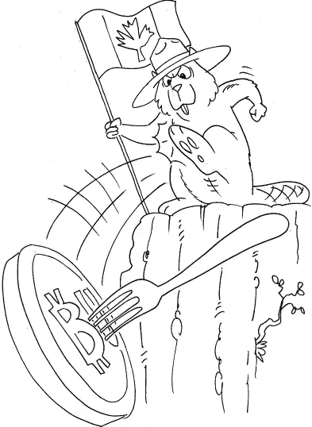

# 加拿大比特币经济节点联合起来反对比特币无限，并提出硬分叉的行业准则

> 原文：<https://medium.com/hackernoon/canadian-bitcoin-economic-nodes-unite-against-bitcoin-unlimited-412786fb4bb6>

以下声明在此代表其签署人发布，由 Dave Bradley 和 Francis Pouliot 于 2017 年 3 月 22 日编制。

___________________________________________________________________

# **加拿大经济节点关于硬分叉的声明**

我们，签名人，代表加拿大用户、投资者和商人，他们每天都与[比特币](https://hackernoon.com/tagged/bitcoin)网络互动。我们是比特币应用的前沿阵地，在加拿大充当比特币品牌的管家。作为加拿大的比特币交易所、经纪商、支付处理商和服务提供商，我们是世界上最活跃、最发达的比特币经济体之一的主要经济节点。

作为代表最终用户的经济节点，为[区块链](https://hackernoon.com/tagged/blockchain)提供合法性和价值，我们在此声明我们作为核心组件在比特币系统规则上达成共识的角色。

我们支持激活隔离见证，作为比特币规模扩大的即时解决方案，以及长期容量增加路线图的基本组成部分。

我们还认为，在激活隔离见证后，可以实现围绕技术上合理且保守的块大小增加的全行业共识。

我们强烈认为，比特币无限或比特币经典积极考虑的硬分叉将对我们搭载新比特币用户的能力造成巨大破坏，并将对比特币和我们的业务造成不可挽回的损失。**我们明确反对比特币无限网络拆分提案。**

总的来说，我们采用以下关于比特币网络潜在分裂的原则，特别是激活比特币无限硬分叉导致的网络分裂。

# 有争议的硬叉子

我们认为比特币核心是最初的 Satoshi 比特币客户端的直接后代，是比特币协议和共识规则的官方参考实现。

比特币区块链的任何有争议的硬分叉都应被视为替代加密货币(altcoin)，**无论分叉链上的相对哈希能力如何。**

我们认为任何提议的硬分叉都是有争议的。如下所述，任何没有得到整个比特币生态系统近乎一致共识支持的硬分叉提议，都将被视为有争议。在确立生态系统共识地位时，举证责任应由提议硬分叉的各方承担。

经过一段时间的仔细分析后，我们可能会单独或集体认定硬分叉提案没有争议。

在硬分叉没有争议、技术上安全且不会从根本上改变比特币性质的情况下，我们将明确声明我们对具体硬分叉提议的支持。

我们鼓励开发和使用比特币的替代实现(如 bcoin、libbitcoin、bitcore、比特币结)，只要它们符合比特币核心参考实现中定义的当前共识规则。

# **无争议的硬分叉**

提议的硬分叉是由合理可证的全行业共识驱动的，使用下面列出的标准，可以作为比特币的官方版本得到支持，前提是保证以下安全保护措施:

*   清晰的激活和链上协调流程。
*   较长的宽限期反映了对节点升级容量的悲观和保守评估。
*   强大的双向重放保护，不会给用户带来过多的负担。
*   擦出保护，意味着硬叉必须是永久性的。
*   在开发和实施过程中的任何时候都必须完全开源。
*   必须经过长期的同行评审和广泛测试。

# **比特币无限共识评估及风险**

我们认为这是生态系统共识的一部分，目前主要支持[比特币核心容量增加路线图](https://bitcoincore.org/en/2015/12/23/capacity-increases-faq/)。作为积极的参与者，我们将努力保持围绕比特币核心项目的共识，只要它能保护我们用户的利益。

我们不认为比特币无限制硬分叉提议获得了压倒性的共识。因此，我们认为比特币无限制的提议是有争议的。

除了有争议之外，这个提议的硬分叉和软件项目对用户和我们的业务构成了严重的风险，例如:

*   业务流程不可预测的硬分叉激活和中断。
*   远程关闭节点导致资金不可用。
*   重放攻击导致资金损失。
*   重组回到原来的链条导致资金损失。
*   网络资源不可预测的增长导致运营成本增加。
*   由于网络中不同的数据块大小配置，网络会自发分裂。

此外，我们认为，通过增加比特币矿工的责任和权力，打破现有的制衡体系，紧急共识从根本上改变了比特币的性质。这可能导致比特币矿工和资金池运营商手中出现一个逐渐且不可逆转的集中化过程，这将损害比特币的核心特性，如抗审查性、隐私和开放参与。

# **将比特币无限量视为替代币**

我们会把目前比特币无限量提案下的任何一个比特币分叉都视为 altcoin。

我们将继续使用面额“比特币”和符号“BTC”和“XBT”，作为根据比特币核心共识规则(比特币协议的参考实施)的最长区块链有效期。

在任何情况下，签名人都不会认为当前的比特币无限提案是 Satoshi 白皮书中描述的原始比特币加密货币，也不会认为它是我们业务中目前使用的“比特币”名称。

# **保护比特币品牌**

我们认为，任何关于另一种名为“比特币”的硬币的知识或与这种硬币的互动，都会让无数日常使用比特币的普通用户感到困惑，尤其是那些不了解比特币开发流程的人，他们只是想利用比特币网络令人难以置信的效用。

为了保护与我们的业务有内在联系的比特币品牌，并根据我们教育公众和促进对比特币的清晰理解的各自努力，在 hard fork 的情况下:

*   **我们将拒绝在我们的产品和服务中集成比特币无限币(BTU)。**
*   **我们不会将英国热量单位与 BTC 并列为替代货币选项**
*   **我们不会公开提供购买、出售或交易英国热量单位的服务**

# **确定共识:指导方针**

在评估共识状态时，我们将要求通过以下方式提供合理的证据，证明存在近乎一致的支持和技术准备:

*   比特币开发社区，包括协议和非协议开发者，通过公开声明发出信号。
*   比特币矿工，使用哈希函数发出信号。
*   单个比特币全节点，由软件版本发出信号。
*   委派的“超级节点”，如比特币钱包和块探索者，由公共声明和软件版本(如果节点是公共的)发出信号。
*   经济节点，如比特币交易所、点对点交易平台、经纪商、流动性提供商和支付处理器，如果节点是公开的，则通过公开声明和软件版本发出信号。

我们也可以部分利用我们自己的用户所代表的非全节点运行的比特币最终用户对硬分叉提议的意见和知识来评估共识。

我们认为任何对硬分叉的“中立”或“缺席”立场都默认与硬分叉相反。

# **向前移动**

我们相信，比特币将在这个充满争议的时期变得比以往任何时候都更加强大。

我们仍然致力于促进比特币的采用，为我们用户的比特币资产提供价值和用途，并为比特币生态系统做出建设性贡献。

我们鼓励世界各地的经济节点表明自己的立场，并表明自己是全球比特币共识的核心组成部分。

# **签署人**

*   [蜜獾](http://www.badgercoin.com)，比特币经纪和 ATM 运营商(不列颠哥伦比亚)
*   [Bitcoiniacs](http://www.bitcoiniacs.com/) ，全球首家实体比特币交易所，ATM 运营商(不列颠哥伦比亚省)
*   [比特币大脑](http://bitcoinbrains.com/)，领先的比特币经纪公司，ATM 运营商(艾伯塔省)
*   [比特币大使馆](https://bitcoinembassy.ca/)，世界上第一个也是加拿大最大的实体比特币中心(魁北克)
*   [比特币网点](http://bitcoinoutlet.com)，在线比特币交易网站(魁北克)
*   [Bylls](https://bylls.com/) ，专门从事账单支付的比特币支付处理器(魁北克)
*   [Coincards](https://coincards.ca/) ，允许加拿大人用比特币购买加拿大礼品卡的服务(不列颠哥伦比亚省)
*   [Coinkite](http://coinkite.com/) ，比特币销售点和安全硬件制造商，Opendime(安大略省)的发明者
*   [加密经纪人](https://www.cryptobroker.io/)，比特币经纪人和数字货币专家(安大略省)
*   [加密珠宝商](https://www.cryptojeweler.com/)，用比特币购买珠宝的服务(安大略省)
*   [蒙特利尔交易所](https://www.echangedemontreal.com/#/)，外汇和比特币实物交易所(魁北克)
*   Jordan Samulaitis，比特币经纪人(马尼托巴)
*   [Satoshi 柜台，](https://satoshicounter.com/)实物比特币交易和服务中心，ATM 运营商(魁北克)
*   [Satoshi 门户](http://satoshiportal.com)、比特币经纪和金融科技应用开发(魁北克)
*   热门的在线比特币购买服务(安大略省)
*   Yuri Yerofeyev，比特币经纪人(不列颠哥伦比亚)

___________________________________________________________________

## 作者指出

我们调查了大约 25 个比特币经济节点。没有人赞成比特币无限制的提议。那些拒绝的人要么不能承诺我们绝不让比特币无限制上市的承诺，要么反对 Sewgit 软分叉，因为它已经增加了太多的块大小。

我们没有时间调查众多的比特币企业，随着时间的推移，我们可能会添加他们的签名。

欲了解更多信息，请联系:francis@bitcoinembassy.ca

> [黑客中午](http://bit.ly/Hackernoon)是黑客如何开始他们的下午。我们是 [@AMI](http://bit.ly/atAMIatAMI) 家庭的一员。我们现在[接受投稿](http://bit.ly/hackernoonsubmission)，并乐意[讨论广告&赞助](mailto:partners@amipublications.com)机会。
> 
> 如果你喜欢这个故事，我们推荐你阅读我们的[最新科技故事](http://bit.ly/hackernoonlatestt)和[趋势科技故事](https://hackernoon.com/trending)。直到下一次，不要把世界的现实想当然！

