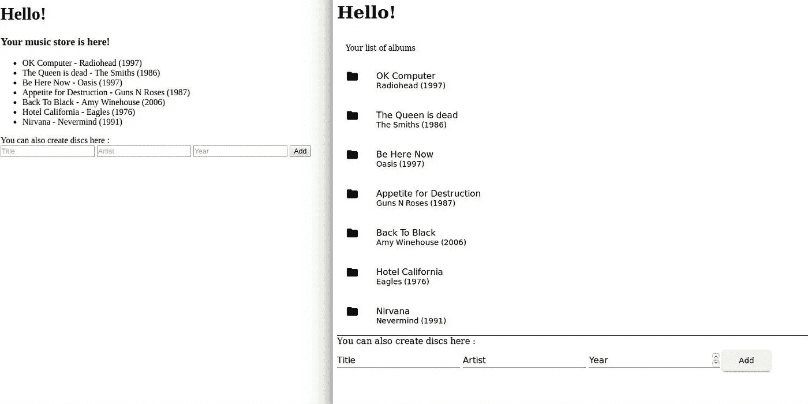
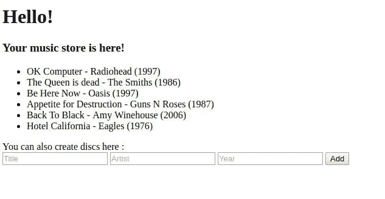
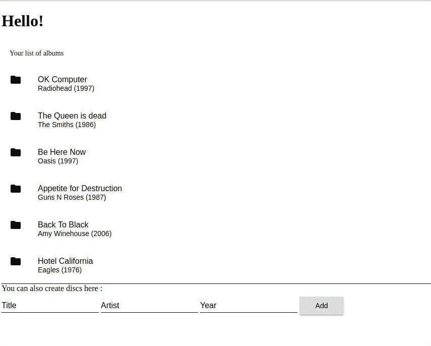

# 金丝雀释放与 Kubernetes

> 原文：<https://medium.com/hackernoon/canary-release-with-kubernetes-1b732f2832ac>

安全轻松地部署新版本的 web [应用](https://hackernoon.com/tagged/app)


[Canary Release](https://martinfowler.com/bliki/CanaryRelease.html) 是我们用来将一个新版本的[应用](https://hackernoon.com/tagged/application)“软”部署到产品中的技术。它包括只让一部分观众访问新版本的应用程序，而其他人仍然可以访问“旧”版本的应用程序。当我们想要确定稳定性时，这是非常有用的，以防任何变化可能会破坏稳定性，并产生很大的副作用。

关键是:金丝雀释放从来就不容易付诸实践。根据我们所处的环境，它可能需要很长时间才能到位，因此我们通常更愿意将它放在一边。

然而，使用 Docker 容器和 Kubernetes 编排，这样做是非常友好的。在这里，我将展示如何使用这个工具来做一个虚拟网站的新版本的小金丝雀部署。

这些是我们网站的版本:



On the left, musicstore v1; on the right, the new version v2

# 设置环境

为了在本地使用 Kubernetes，我们将安装 [minikube](https://github.com/kubernetes/minikube) 和 [kubectl](https://kubernetes.io/docs/tasks/kubectl/install/) 。我们还需要安装[码头](https://docs.docker.com/engine/installation/)。

安装好所有东西后，我们启动 minikube，以启动并运行 Kubernetes:

```
minikube start
```

作为响应，终端将显示:

```
Starting local Kubernetes cluster...
Starting VM...
SSH-ing files into VM...
Setting up certs...
Starting cluster components...
Connecting to cluster...
Setting up kubeconfig...
Kubectl is now configured to use the cluster.
```

第二步:调用这个命令在 Minikube 中运行 Docker:

```
eval $(minikube docker-env) 
```

## 设置数据库和后端

对于这个应用程序，后端将是一个在 Go 中开发的 API，对 Mongo 数据库进行查询。我们不会详细讨论这一部分，因为这里的目的不是展示如何在 Go 中开发 REST API。

要部署后端，[克隆存储库](https://github.com/morris-ribs/canary-deployment/tree/master/api-golang/musicstore)并使用下面的命令构建 docker 映像:

```
docker build -t api-musicstore .
```

## 可选步骤:在数据库中插入一些数据:

使用以下命令输入 docker 容器:

```
docker exec -t -i <mongo_container> /bin/bash
```

其中**<mongo _ container>**是针对 mongo 映像运行的容器的 id。跑完就能发现

```
docker psCONTAINER ID        IMAGE                                                        COMMAND                  CREATED             STATUS              PORTS               NAMES
3304ee6ab94e        api-musicstore:v1                                            "/go/bin/musicstore"     3 minutes ago       Up 4 minutes                            k8s_backend.72a7365d_api-musicstore-931708012-g4grg_musicstore_442ad9d4-123c-11e7-ae23-0800275d1cac_9f1e978d
**75b2eca8cf1f        mongo **                                                       "docker-entrypoint..."   4 minutes ago       Up 4 minutes                            k8s_db.b9d32dcd_api-musicstore-931708012-g4grg_musicstore_442ad9d4-123c-11e7-ae23-0800275d1cac_67653438
```

在这种情况下，<mongo_container>就是 **75b2eca8cf1f** 。所以我们跑:</mongo_container>

```
docker exec -t -i **75b2eca8cf1f** /bin/bash
```

在容器内部，我们使用以下命令打开 mongo 命令行工具:

```
mongo
```

一旦我们进入 mongo，复制粘贴下面的内容，然后按 Enter 键:

就是这样！现在我们的数据库中有了一些种子数据，让我们现在部署将与网站通信的 REST API！

## 部署后端:REST API

通常，我喜欢在名称空间中组织我的部署和服务。这里，我创建了一个名称空间 musicstore 来部署我的 Music Store 虚拟应用程序。

要创建这个名称空间，[在本地复制这个文件](https://github.com/morris-ribs/canary-deployment/blob/master/kubeconfig/namespace.yaml),并运行以下命令:

```
kubectl create -f namespace.yaml
```

之后，[复制这些文件](https://github.com/morris-ribs/canary-deployment/tree/master/kubeconfig/back)并运行以下命令，以便在 Kubernetes 中创建 API/DB 部署:

```
kubectl create -f deployment.json
```

> 注意:Kubernetes 的配置文件可以在 JSON 和 YAML 两种结构中创建。

要创建副本控制器，请运行以下命令:

```
kubectl create -f rc.yaml
```

最后，我们可以创建服务，我们的后端已经准备好运行了:

```
kubectl create -f service.json
```

我们可以看到我们的 API 部署得很好，查询 URL 并在 web 浏览器中打开它:

```
minikube service api-musicstore --url --namespace=musicstore
[http://<url>:32495](http://192.168.99.100:32495)
```

> 不要忘记指定名称空间 musicstore，否则 kubectl 会在默认名称空间中搜索服务，但它不会找到！

# 部署音乐商店虚拟网站的版本 1

现在我们要为网站的第一版建立图像。为了做到这一点，您将需要克隆[这个存储库](https://github.com/morris-ribs/canary-deployment/tree/master/musicstore)并运行以下命令:

```
docker build -t musicstore:v1 .
```

构建好容器后，我们可以继续进行部署了。首先，我们创建我们的服务:

```
kubectl -f service.yaml
```

这将创建音乐商店网站服务。我们将创建部署，以便我们可以部署我们的代码来由该服务提供服务。让我们获取它的 URL，并保留它以供以后测试:

```
minikube service musicstore-website --url --namespace=musicstore
[http://<url>:32000](http://192.168.99.100:32000)
```

让我们看一下部署配置文件:我们将要求 Kubernetes 创建该网站的 3 个副本，以便处理流量和负载平衡。所有复制品将在第一时间指向对应于音乐商店网站版本 v1 的图像的图像:

The deployment file of version 1 of our Music Store

让我们部署它:

```
kubectl create -f deployment-without-canary.json
```

现在，如果你打开网站，你会看到它的版本 1:



Website after first deployment

# 使用 canary 部署来部署音乐商店虚拟网站的版本 2

部署版本 2 的第一步是为它创建一个 docker 映像，就像我们为版本 1 所做的一样。

因此，[从这里复制内容](https://github.com/morris-ribs/canary-deployment/tree/master/musicstorev2)并在终端中运行以下命令:

```
docker build -t musicstore:v2 .
```

如前所述，我们创建了前端服务的 3 个副本。如前所述，canary 部署的想法是获取一部分流量，并将其重定向到新版本。

我们将实现这一点，将我们服务的一个副本指向音乐商店的新版本。像这样，大部分流量还是会被重定向到版本 1。

为此，我们运行以下命令:

```
kubectl apply deployment.json
kubectl apply deployment-canary.json
```

使用这个命令，我们告诉 Kubernetes 将这个部署应用到我们的环境中。如果我们看一下这个文件，我们会发现关于版本 1 的部署，它唯一改变的是标签“canary”(另一个版本被认为是“稳定的”)，以及副本的数量(1 个用于新版本，2 个用于旧版本)。当然，它指向 Docker 图像 **musicstore:v2** :

The Canary Release deployment file of version 2

下面是版本 1 的部署情况，有两个副本指向稳定版本:

Canary Release: depoloyment of version 1 with 2 replicas instead of 3

现在，我们可以看到一些流量已经看到我们的音乐商店虚拟应用程序的版本 2:



Musicstore version 2

# 推出新版本

现在，我们可以放心大胆地使用新版本了。使用 canary delpoyment，这很简单:我们只需要将所有副本设置为指向运行音乐商店版本 2 映像的稳定版本:

```
kubectl apply deployment-new-version.json
```

这是我们的 deployment-new-version.json 的外观:

Rollout file of version 2

非常好！现在，每个人都可以看到音乐商店网站的新版本！

本教程中用到的所有文件都可以在[这里](https://github.com/morris-ribs/canary-deployment)找到。

一个释放金丝雀的好例子可以在[这里](https://github.com/kelseyhightower/talks/tree/master/kubecon-eu-2016/demo)找到。

[](http://bit.ly/HackernoonFB)[](https://goo.gl/k7XYbx)[](https://goo.gl/4ofytp)

> [黑客中午](http://bit.ly/Hackernoon)是黑客如何开始他们的下午。我们是 [@AMI](http://bit.ly/atAMIatAMI) 家庭的一员。我们现在[接受投稿](http://bit.ly/hackernoonsubmission)并乐意[讨论广告&赞助](mailto:partners@amipublications.com)机会。
> 
> 如果你喜欢这个故事，我们推荐你阅读我们的[最新科技故事](http://bit.ly/hackernoonlatestt)和[趋势科技故事](https://hackernoon.com/trending)。直到下一次，不要把世界的现实想当然！

