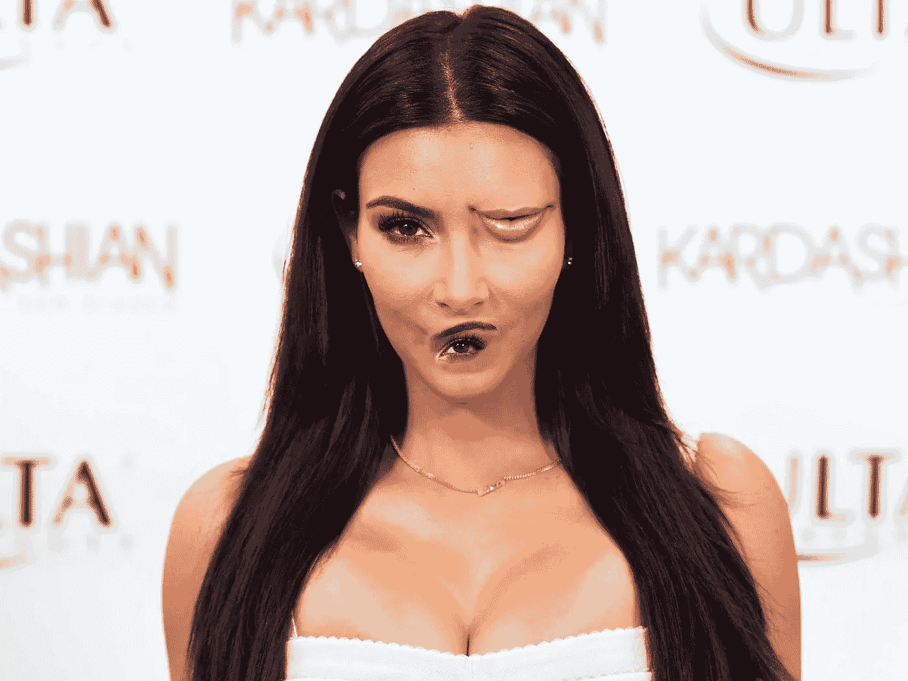
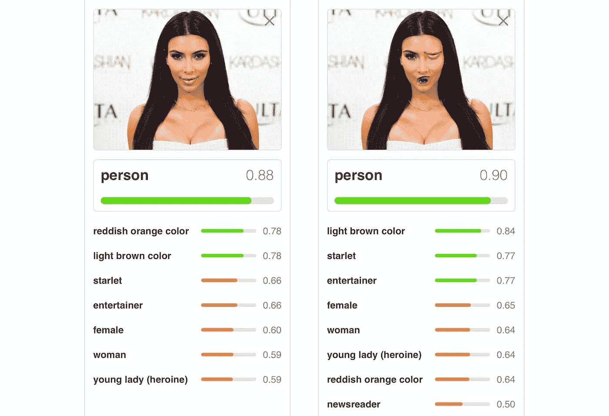
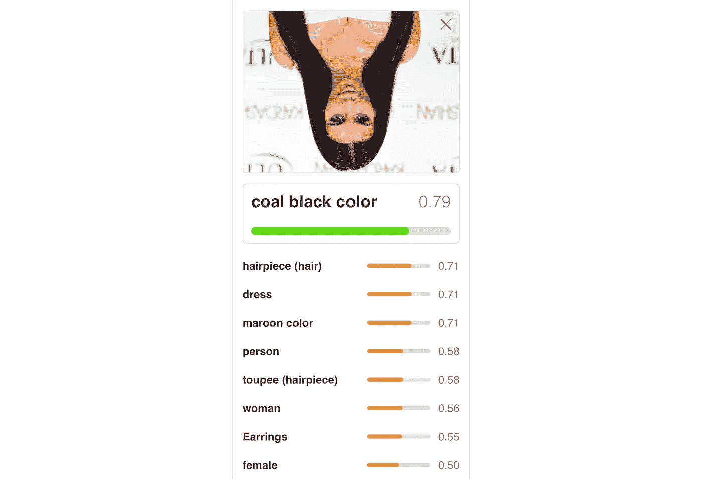
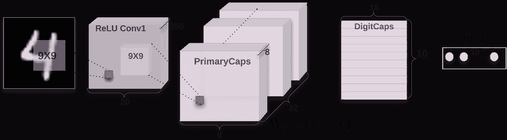

# 胶囊网络正在动摇人工智能——以下是如何使用它们

> 原文：<https://medium.com/hackernoon/capsule-networks-are-shaking-up-ai-heres-how-to-use-them-c233a0971952>


Geoffrey Hinton [[Source](https://www.technologyreview.com/s/608911/is-ai-riding-a-one-trick-pony/)]

如果你关注人工智能，你可能听说过具有潜在革命性的胶囊网络的出现。我将向您展示如何从今天开始使用它们。

杰弗里·辛顿被称为“深度学习”之父。早在 50 年代，深度神经网络的想法就开始浮出水面，理论上，它可以解决大量的问题。然而，没有人能够找出如何训练他们，人们开始放弃。辛顿没有放弃，并在 1986 年表明反向传播的想法可以训练这些深层网络。然而，直到 5 年前的 2012 年，由于当时缺乏计算能力，辛顿才得以展示他的突破。这一突破为这十年人工智能的进步奠定了基础。

现在，在 2017 年 10 月 26 日，他发表了一篇关于一个新的突破性概念的论文，胶囊网络。

> **注:**关于胶囊如何工作的更深入的解释，请看[第二部分](https://medium.freecodecamp.org/understanding-capsule-networks-ais-alluring-new-architecture-bdb228173ddc)。还有，研究论文可以在[这里](https://arxiv.org/pdf/1710.09829v1.pdf)和[这里](https://openreview.net/pdf?id=HJWLfGWRb)找到。

# 传统神经网络的问题

迄今为止，卷积神经网络(CNN)一直是最先进的图像分类方法。

CNN 的工作原理是在每一层积累多组特征。它从寻找边缘开始，然后是形状，然后是实际的物体。但是，所有这些要素的空间关系信息都丢失了。

这是一个过于简单化的想法，但是你可以这样想一个 CNN:

```
if (2 eyes && 1 nose && 1 mouth) {
  It's a face!
}
```

你可能会想，这听起来很好，很有意义，确实如此。虽然，我们可能会遇到一些问题，以金·卡戴珊的这张照片为例:



呀！肯定有两只眼睛，一个鼻子和一张嘴，但有些不对劲，你能发现吗？我们很容易看出眼睛和嘴的位置不对，这不是一个人应该有的样子。然而，训练有素的 CNN 很难理解这个概念:



除了容易被特征在错误位置的图像愚弄之外，当从不同方向观看图像时，CNN 也容易被迷惑。解决这个问题的一个方法是对所有可能的角度进行过度训练，但这需要很多时间，而且似乎有悖直觉。我们可以看到，只要将 Kim 上下颠倒，性能就会大幅下降:



最后，卷积神经网络容易受到白盒攻击。本质上是在一个物体中嵌入一个秘密图案，使它看起来像别的东西。

Fooling Neural Networks in the Physical World with 3D Adversarial Objects [[Source](http://www.labsix.org/physical-objects-that-fool-neural-nets/)]

> “卷积神经网络注定要失败”——杰弗里·辛顿

# 胶囊网络来拯救！



Architecture of CapsNet

胶囊网络的引入让我们有能力充分利用空间关系，因此我们可以开始看到更像:

```
if (2 adjacent eyes && nose under eyes && mouth under nose) {
  It's a face!
}
```

你应该能够看到，有了这个定义，我们的神经网络就不会那么容易被我们畸形的卡戴珊愚弄。

这种新的架构还在以下数据集上实现了显著更好的准确性。这个数据集被精心设计成一个纯粹的形状识别任务，显示出即使从不同的角度识别物体的能力。它击败了最先进的 CNN，将错误数量减少了 45%。


CapsNet was able to identify the bottom images were within the same category (animals, humans, airplanes, cars, trucks) as the correspoding top image far better than CNNs.

此外，在他们最近的论文中，他们发现胶囊比基线卷积神经网络显示出更强的抵抗白盒攻击的能力。

# 培训顶网

我已经拼凑了一个回购协议，这是辛顿论文的一个实现(非常感谢[自然经济学](https://github.com/naturomics/CapsNet-Tensorflow))。为了使用胶囊网络模型，你首先需要训练它。

以下指南将为您提供一个在 MNIST 数据集上训练的模型。对于那些不知道的人来说，MNIST 是一个手写数字的数据集，是测试机器学习算法的一个很好的基线。

从克隆[回购](https://github.com/bourdakos1/capsule-networks)开始:

```
git clone [https://github.com/bourdakos1/capsule-networks.git](https://github.com/bourdakos1/capsule-networks.git)
```

然后安装需求并下载数据集:

```
pip install -r requirements.txt
python download_data.py
```

开始训练！

```
python main.py
```

MNIST 数据集是 60，000 幅训练图像。默认情况下，该模型将在 128 的批量大小下被训练 50 个时期。一个时期是整个训练集的一次完整运行。由于批次大小为 128，因此每个时期将处理大约 468 个批次。

**注意:**如果你没有 GPU，训练可能会花很长时间。你可以阅读[这篇关于如何加快训练时间的文章](https://medium.freecodecamp.org/tracking-the-millenium-falcon-with-tensorflow-c8c86419225e#6415)。

# 做出推论

一旦我们的模型完全定型，我们就可以通过运行以下命令来测试它:

```
python main.py --is_training False
```

# 最后的想法

胶囊网络看起来很棒，但它们仍然是婴儿。我们可以在未来训练大型数据集时看到问题，但我有信心。

如果你喜欢阅读这篇文章，并想了解更多，还有第二部分！

附:这里有一个很棒的视频，我推荐你花时间去看。

感谢阅读！如果您有任何问题，请随时联系 bourdakos1@gmail.com，通过 [LinkedIn](https://www.linkedin.com/in/nicholasbourdakos) 与我联系，或者通过 [Medium](/@bourdakos1) 和 [Twitter](https://twitter.com/bourdakos1) 关注我。

如果你觉得这篇文章很有帮助，给它一些掌声会很有意义👏并分享出来帮别人找！并欢迎在下方发表评论。