# 通过拥有感吸引应用程序用户

> 原文：<https://medium.com/hackernoon/captivating-app-users-through-the-sense-of-ownership-c7aaba24bd5f>

所有权是一个有趣的概念。如果你曾经和一个两岁的孩子有过任何接触，你会在几秒钟内意识到他们对自己的东西有非常强烈的看法，并且分享听起来不像是他们想要做的事情。随着我们的成长，我们所有人(或者至少是大多数人)都学会了遵从社会认为正常的行为，但我们仍然会与我们的东西和对我们重要的事情建立关系。这种拥有感，那种东西是你的感觉，在心理学上是很认可的。它被用于我们与周围事物和人的各种互动中，包括应用程序。为了进一步留住观众，应用程序开发人员正在研究如何利用这种附件来帮助他们吸引观众。发现很难放下“他们的”应用程序的受众。怎么会？

开发人员试图找到不同的方法，通过使用不同的技术向用户灌输一种主人翁感。从个性化，到进度保存，收集和使用反馈以改进应用程序，到引入收集和忠诚度计划，以吸引他们的受众并将其转化为忠诚的应用程序用户。

# 个性化——让每个用户都有宾至如归的感觉

简而言之，个性化或定制就是根据每个用户的喜好、厌恶和需求来定制应用。让每个用户控制在应用中调整体验的整个过程有助于增加这种主人翁感。此外，应用程序“学习”和适应用户体验的能力可以将应用程序的使用变成用户日常生活不可或缺的一部分。这和你得到一台新电脑或一部手机的感觉是一样的。只有当你打开它，并按照你想要的方式进行设置时，你才会觉得它真的是你的了。

所有主要的社交、新闻、视频或博客网络，如脸书、Twitter、Medium 和 Youtube，也都在使用这种方法。根据你想关注的人或故事调整你的个人时间表，是你发现自己一天会多次回到那个特定应用的主要原因之一。

个性化可以有几种不同的形式。即使是定制应用的能力，比如改变应用的背景和主题，也可以改变整个用户体验，并最终改变用户对该应用的感受。从更大的角度来看，像“设置”这样简单的东西可以通过提供进一步定制应用程序的能力来大大改善用户体验，增加整体的主人翁感。

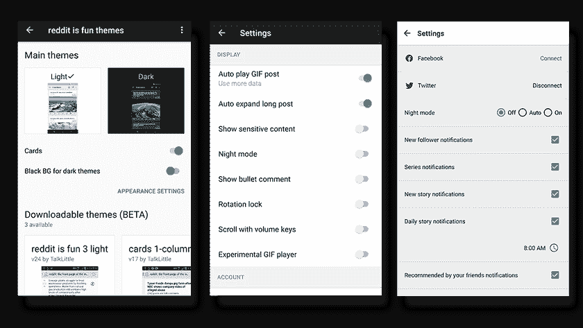

Spotify 使用这一基本概念，即人们通过周围的事物(和应用程序)表达自我身份，创造一个环境，教会自己如何与用户一起发展。实际上，这是个性化的一个很好的例子。当使用 Spotify 的[每日混音](https://support.spotify.com/us/using_spotify/search_play/daily-mix/)时，你可以根据你在应用程序中迄今为止听到的音乐类型来听你几乎肯定会喜欢的音乐。这些列表是自动为你创建的，加载了你喜欢的艺术家，并添加了新发现的相同风格的音乐。但是最重要的是，算法的性能随着用户而增长。从这样一款产品中抽身出来，转而购买一款不知道你第一次醒来时喜欢听安静的音乐，但在健身时也喜欢听摇滚音乐的产品，这有多容易？

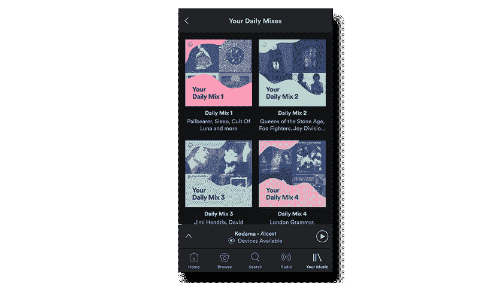

[Google Now](https://play.google.com/store/apps/details?id=com.google.android.launcher) ，谷歌创造的智能个人助理，也是个性化如何创造参与度的一个很好的例子。Google 现在会根据你以前的搜索习惯和位置模式，列出一些信息和建议。它还会通知你交通、新闻、事件、重要的电子邮件或会议，在你初步感受到它的价值后，你很难离开它们。

跟踪用户的行为(历史)也是创造一种拥有感的好方法。让用户看到或跟踪他以前的行为或以前对应用程序的使用，会在潜意识中给人一种应用程序很了解他的感觉。那是一种非常强烈的感觉。下面你可以看到一个例子，说明 Airbnb 如何通过这个平台追踪你之前的旅行。

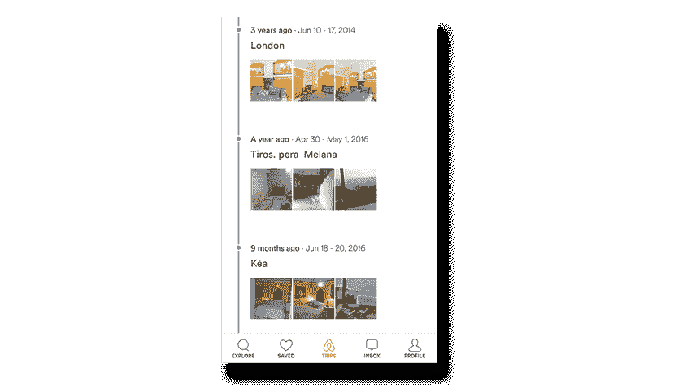

# 为将来储蓄——投资于承诺

允许用户采取行动并保存感兴趣的事情、进展或状态以备后用，建立在一种承诺之上，这种承诺可以揭示所有权的真正价值。

例如，允许一个新闻订阅应用程序的用户(就像你在下面看到的 [CNN](https://play.google.com/store/apps/details?id=com.cnn.mobile.android.phone) 应用程序)将一篇文章加入书签或收藏起来，以便在以后的访问中阅读，这提供了一种承诺的假象；一种将用户带回应用程序的错觉。

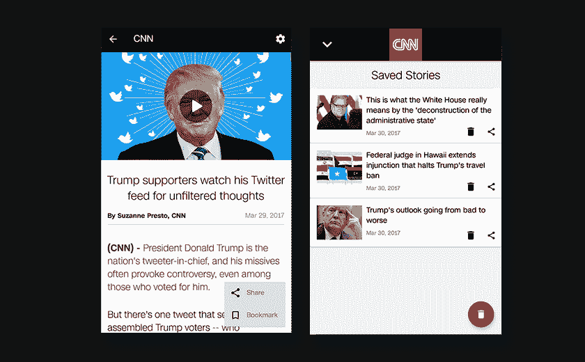

旅行费用聚合应用 SkyScanner 基于同样的概念。用户可以使用它来添加和监控带有价格提醒的航班。通过添加价格提醒，或选择监控航班，用户肯定会在不久的将来回到应用程序。

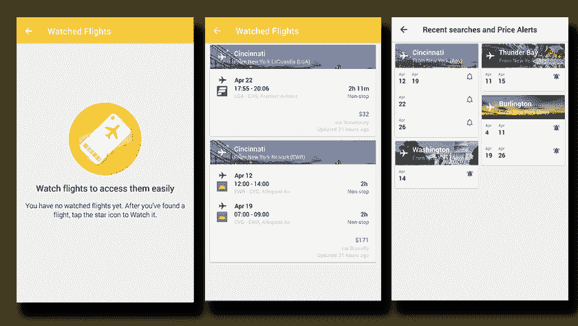

在应用程序中跟踪用户的进度(就像 [Duolingo 应用程序](https://www.duolingo.com/)的情况一样)并给他保存进度的选项也有助于创造这种承诺的情绪，并让用户回来尝试提高他的地位和成就。

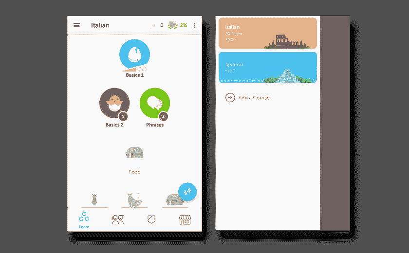

[例如，Runtastic](http://duolingo/) 允许用户记录自己的表现和活动，并与之前的进行比较，以及挑战那些新活动。这创造了直接与应用程序联系的忠实用户，因为所有这些信息都存储在应用程序中。能够返回并找到这个现成的，对用户来说真的很有价值。

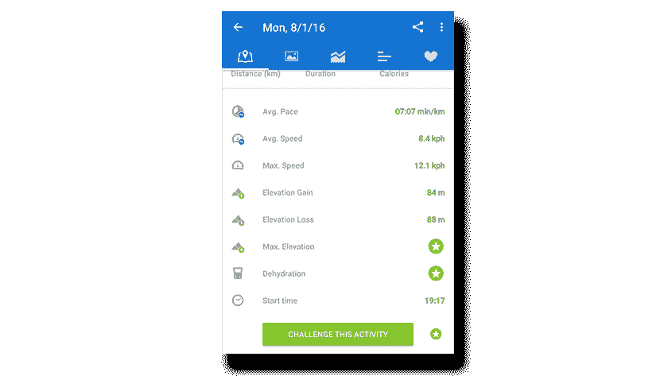

# 反馈——让用户成为流程的积极参与者

寻求反馈，最终倾听并建立用户所要求的东西，这是将用户转化为忠实访问者的好方法。当用户觉得自己是产品或应用进化的一部分时，他会变得高度参与，这反过来会导致应用的持续使用。

各大应用一直为用户提供在应用上留下直接反馈的方式。例如，Airbnb 有一个部分专门用于用户对各种不同主题的反馈，所有这些都是为了改善应用程序的体验和使用。

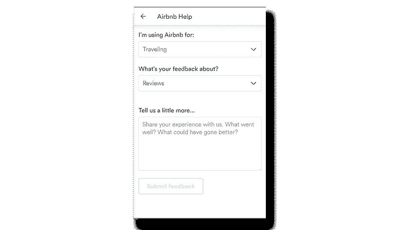

我们也看到了在 Pollfish 上给用户这个选项最终会实现什么。Pollfish 是一个 DIY 调查平台，每个人都可以在几分钟内创建一个调查，并在短短几个小时内通过移动应用程序获得数千名用户的回复。当我们第一次建立这个平台时，我们对实际参与我们调查的人数感到惊讶。以至于我们决定自己进行一次调查，问他们:“你为什么参加调查？”。现在我们知道，当用户回答说他们喜欢做调查“因为我提供反馈，我是这个过程的积极参与者”和“这样我就可以真正地把我的想法放在产品上”时，我们已经利用了这种基本的感觉，那种属于少数人选择的群体的感觉。那些参与产品开发阶段的少数人，仅仅通过给出反馈。

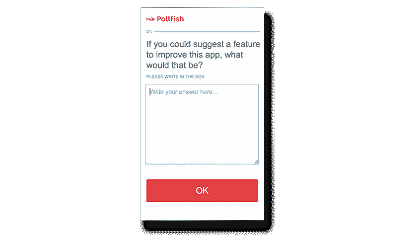

看到用户非常渴望分享他们喜欢或不喜欢某个应用程序，给了我们一个想法。这就是为什么应用发行商可以选择免费调查他们自己的用户。当用户回到一个应用程序时，发现开发者考虑了他们的一个建议并做出了改变，这个用户就“上钩”了。偶尔有用户转向忠诚的客户，所有这些都证明了留存率的显著提高，这是每个应用发行商的最终目标。

# 你必须抓住他们！—引入集合或忠诚度计划

《口袋妖怪》中著名的标语驱使玩家去寻找一个收藏中的所有物品。拥有所有这些稀有的口袋妖怪变得无所不包，用户不会停止，直到他们抓住他们。但是“一网打尽”的概念实际上并不新鲜；我们都在某个地方藏了一批交易卡。口袋妖怪 Go 就是建立在这个想法上的。在任何应用程序(不仅仅是游戏)中引入集合的概念仍然可以达到相同的效果。

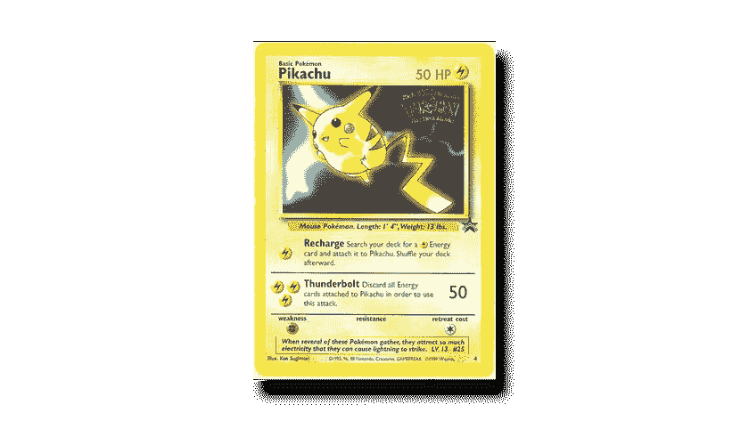

在应用程序中引入忠诚度计划也能引起同样的感受。例如， [OpenTable](https://play.google.com/store/apps/details?id=com.opentable) ，一个受欢迎的预订应用程序，推出了一个餐饮奖励计划，用户可以因为兑现他们的预订而获得积分，并在稍后的一天兑换积分。一举两得:积极的参与者留下帮助他人的反馈，并重复晚餐。

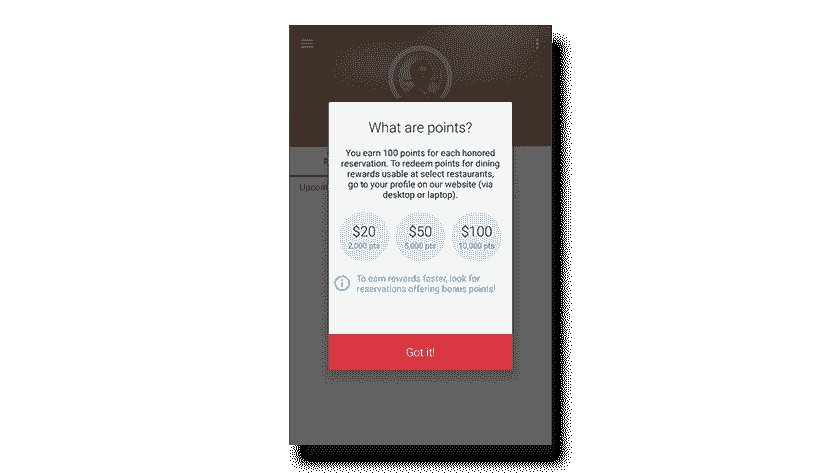

时间就是金钱。设法创造一个为应用程序投入了宝贵个人时间的用户，通过根据他的需求定制应用程序来帮助他做得更好，这是一种确保他不断回来的可靠方法。允许用户在一个应用程序中定制他们的体验，甚至更好的是，根据他们的使用情况个性化应用程序，这将使他们很难离开并转向另一个应用程序。给用户一种让他们自己的“碎片”渗透到应用程序中的方式，(比如保存他们的进度或项目以备后用)给人一种归属感。这促使用户重新使用这款应用。就像向用户征求反馈，并向他们展示你是如何做的一样。更重要的是，要完成一个忠诚度计划或一个集合，对应用程序保留和参与的影响将最大化。当我们还是孩子的时候，我们认为我们就是我们所拥有的，这种感觉并不会随着我们年龄的增长而减弱。人类的基本需求，如拥有感和成就感，是每个成功应用的核心，并广泛应用于移动应用的[设计](https://hackernoon.com/tagged/design)。

P.S. If you like this article and would like to see more click on the Recommend icon on the side

> [黑客中午](http://bit.ly/Hackernoon)是黑客如何开始他们的下午。我们是 [@AMI](http://bit.ly/atAMIatAMI) 家庭的一员。我们现在[接受投稿](http://bit.ly/hackernoonsubmission)，并乐意[讨论广告&赞助](mailto:partners@amipublications.com)机会。
> 
> 如果你喜欢这个故事，我们推荐你阅读我们的[最新科技故事](http://bit.ly/hackernoonlatestt)和[趋势科技故事](https://hackernoon.com/trending)。直到下一次，不要把世界的现实想当然！

