# 通过不同的 Lambda 事件源捕获和转发相关 id

> 原文：<https://medium.com/hackernoon/capture-and-forward-correlation-ids-through-different-lambda-event-sources-220c227c65f5>

## 默认情况下，无服务器架构是微服务，您需要关联 id 来帮助调试跨多个功能的问题，以及可能不同的事件源类型—异步、同步和流。

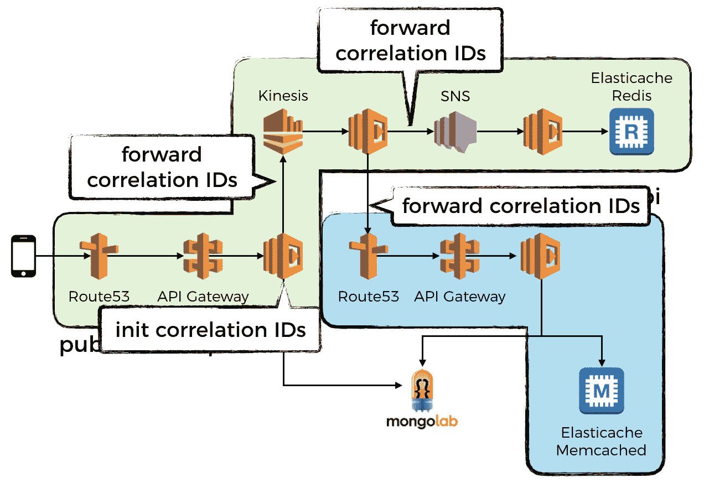

这是关于管理 AWS Lambda 日志的 3 部分迷你系列的最后一部分。

如果你还没有读过第一部分，请现在读一读。我们将在这篇文章中详细描述的 CloudWatch 日志的基础设施之上构建日志。

**第一部分:** [集中伐木](/@theburningmonk/centralised-logging-for-aws-lambda-b765b7ca9152)

**第二部分:** [小窍门](/@theburningmonk/tips-and-tricks-for-logging-and-monitoring-aws-lambda-functions-885af6da29a5)

# 为什么是关联 id？

随着您的架构变得越来越复杂，许多服务必须协同工作才能提供您的用户想要的功能。

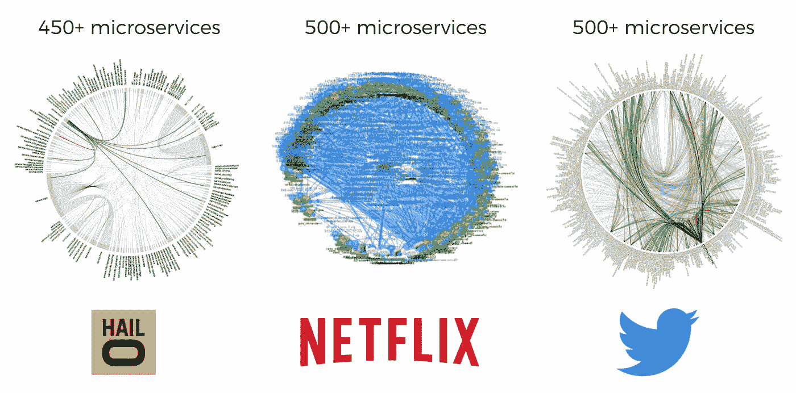

Microservice death stars, circa 2015.

当一切都运作时，就像看一个管弦乐队，许多小片段都独立地演奏，同时合作形成一个整体，这个整体大于其各部分的总和。

但是，东西不行的时候，调试起来很痛苦。找到那一条线索就像大海捞针一样，因为有这么多移动的部分，而且它们都在不停地移动。

想象一下，你是 Twitter 的一名工程师，正在试图调试为什么一个用户的推文没有被发送到他的一个追随者的时间线。

*“让我交叉参考来自数百个服务的日志，找到提到作者的用户 ID、推文 ID 或接收者的用户 ID 的日志，并整理出一个关于推文如何通过我们的系统以及为什么它没有被发送到接收者的时间线的故事。”*

*“没有明确提到这些字段的日志怎么办？”*

*“嗯……我会再联系你的……”*

大海捞针。

这就是关联 id 在微服务世界中解决的问题——用相关的上下文标记每个日志消息，以便以后很容易找到它们。

除了常见的 ID，如用户 ID、订单 ID、tweet ID 等。您可能还想在每个日志消息中包含 X 射线跟踪 ID。这样，如果您使用带有 Lambda 的 X 射线，那么您可以使用它在 X 射线控制台中快速加载相关的轨迹。

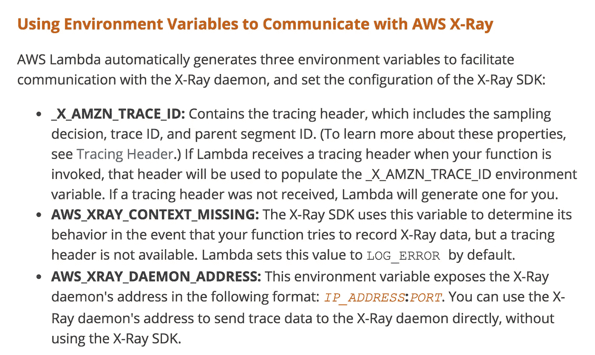

By default, Lambda automatically generates a _X_AMZN_TRACE_ID value in the environment variable.

此外，如果您打算给每个日志消息添加一堆相关 id，那么您应该考虑切换到 JSON。然后您需要更新我们在第 1 部分中介绍的`ship-logs`函数来处理 JSON 格式的日志消息。

# **启用整个调用链的调试日志**

人们遇到的另一个常见问题是，当我们意识到生产中有问题时，我们发现调试问题所需的关键信息被记录为 debug，我们在生产中禁用调试日志，因为它们太嘈杂。

*“糟糕，现在我们必须启用调试日志并重新部署所有这些服务！真痛苦！”*

*“找到问题后，不要忘记禁用调试日志并重新部署它们；——)"*

幸运的是，这并不一定是一个进退两难的局面。您可以通过以下方式在整个调用链上启用调试日志记录:

1.  决定在边缘服务上启用调试日志记录(例如，所有请求的 5%)
2.  将对所有向外请求的决策与相关 id 一起传递
3.  当收到来自边缘服务的请求时，可能通过 SNS 等异步事件源，中间服务将捕获该决定，并在被要求时打开调试日志记录
4.  中间服务还会将该决定连同相关 id 一起传递给所有向外的请求

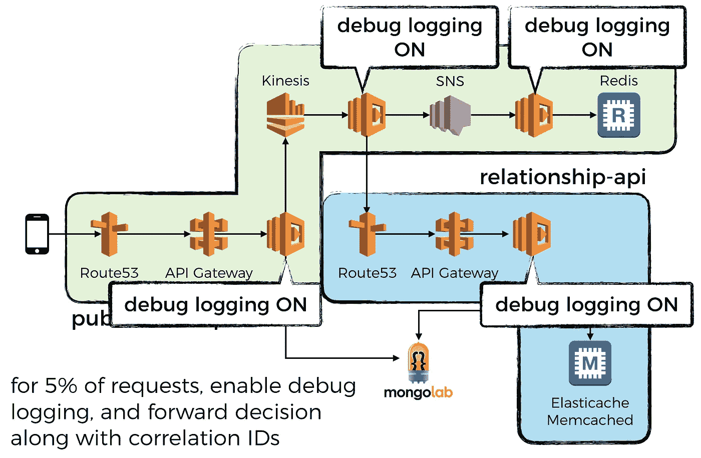

The edge service decides to turn DEBUG logging on for 5% of requests, that decision is captured and passed along throughout the entire call chain, through HTTP requests, SNS message and Kinesis events.

# 捕获和转发相关 id

说完这些，让我们深入一些代码，看看如何让它真正工作。如果您想跟进，那么代码可以在这个 [repo](https://github.com/theburningmonk/lambda-correlation-id-demo) 中找到，演示项目的架构如下所示:

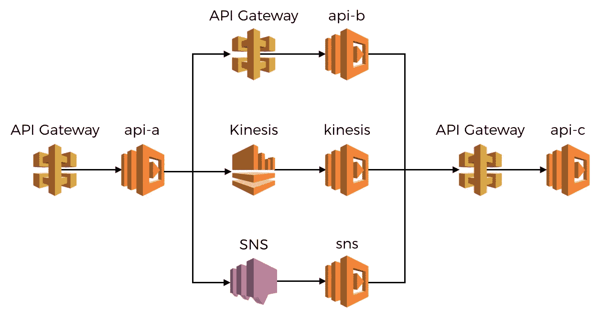

The demo project consists of an edge API, api-a, which initialises a bunch of correlation IDs as well as the decision on whether or not to turn on debug logging. It’ll pass these along through HTTP requests to api-b, Kinesis events and SNS messages. Each of these downstream function would in turn capture and pass them along to api-c.

 [## 燃烧 monk/lambda-关联-id-演示

### lambda-correlation-id-demo -如何跨 API、SNS 和 Kinesis 事件跟踪关联 id

github.com](https://github.com/theburningmonk/lambda-correlation-id-demo) 

我们可以利用现在由平台管理并发的事实，这意味着我们可以安全地使用全局变量来存储与当前调用相关的上下文信息。

在处理函数中，我们可以在全局变量中捕获传入的相关性 id，然后将它们包含在日志消息中，以及任何传出的消息/HTTP 请求/事件等。

为了抽象出实现细节，让我们创建一个`requestContext`模块，使获取和更新这些上下文数据变得容易:

然后添加一个`log`模块:

*   默认情况下禁用调试日志记录
*   如果通过环境变量被显式覆盖，或者在传入请求中捕获到一个`Debug-Log-Enabled`字段以及其他相关 id，则启用调试日志记录
*   将消息记录为 JSON

一旦我们开始捕获相关 id，我们的日志消息将如下所示:

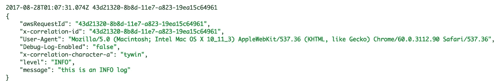

注意，我还从传入的请求中捕获了`User-Agent`，以及不启用调试日志记录的决定。

现在让我们看看如何通过 API 网关和传出的 HTTP 请求来捕获和转发相关 id。

# API 网关

您可以通过 HTTP 头捕获并传递相关 id。诀窍是确保团队中的每个人都遵循相同的约定。

为了标准化这些约定(如何命名作为相关 id 的报头，等等。)您可以提供一个工厂函数，开发人员可以用它来创建 API 处理程序。大概是这样的:

当您需要实现另一个 HTTP 端点时，将您的处理程序代码传递给这个工厂函数。现在，经过最小的改动，所有的日志都将拥有捕获的关联 id(以及`User-Agent`、是否启用调试日志记录等)。).

我们早期架构中的`api-a`函数如下所示:

因为这是边缘上的 API，所以它使用 AWS 请求 ID 来初始化`x-correlation-id`进行调用。每个日志消息都会记录这一点以及其他几条上下文信息。

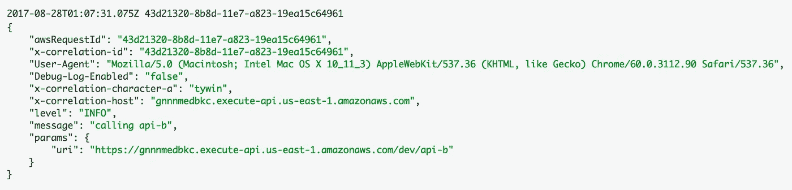

通过添加一个像[这个](https://github.com/theburningmonk/lambda-correlation-id-demo/blob/master/lib/http.js)一样的定制 HTTP 模块，您还可以很容易地将这些上下文信息包含在传出的 HTTP 请求中。将这些约定封装在一个易于使用的库中也有助于您在整个团队中标准化方法。

在上面的`api-a`函数中，我们向`api-b`端点发出了一个 HTTP 请求。查看日志，您可以看到前面提到的上下文信息已经被传递了。

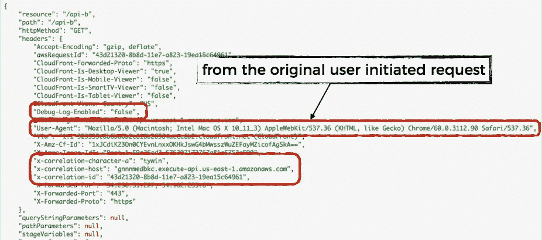

在这种情况下，我们也有从最初的用户发起的请求到`api-a`的`User-Agent`。这很有用，因为当我查看中间服务的日志时，我经常会错过用户正在使用的平台的上下文，这使得我更难将从日志中收集的信息与用户在其错误报告中描述的症状相关联。

当`api-b`函数(参见这里的)向`api-c`发出自己的出站 HTTP 请求时，它将传递所有这些上下文信息以及我们在`api-b`函数本身中添加的任何内容。

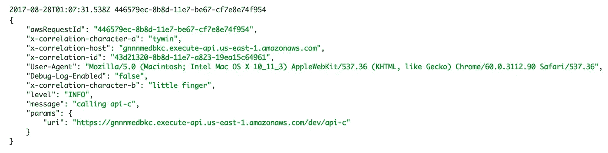

Log message for when api-b calls api-c with the custom HTTP module. Notice it includes the “x-correlation-character-b” header which is set by the api-b function.

当您在`api-c`的日志中看到相应的日志消息时，您将看到来自`api-a`和`api-b`的所有上下文。

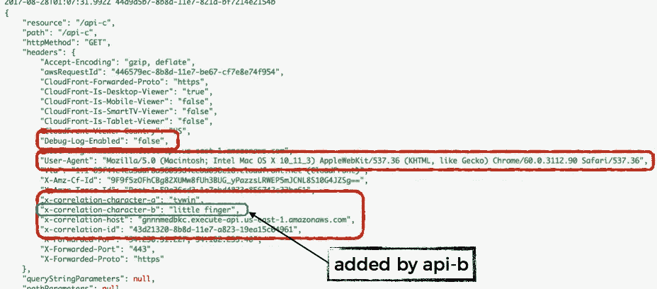

# 社交网站（Social Network Site 的缩写）

要通过 SNS 消息捕获和转发关联 id，可以使用消息属性。

在上面的`api-a`函数中，我们还用一个定制的`sns`模块向 SNS 发布了一条消息(从上面的代码片段中省略了),该模块将捕获的相关性 id 作为消息属性，见下文。

当这个 SNS 消息被传递给 Lambda 函数时，您可以在 SNS 事件的`MessageAttributes`字段中看到相关 id。

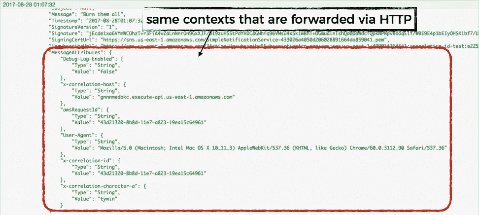

让我们创建一个`snsHandler`工厂函数来标准化通过 SNS 消息属性捕获传入关联 id 的过程。

我们可以使用这个工厂函数来快速创建 SNS 处理函数。来自这些处理函数的日志消息将可以访问捕获的相关 id。如果您使用前面提到的定制`http`模块来发出 HTTP 请求，那么它们将自动作为 HTTP 头包含进来。

例如，下面的 SNS 处理函数将捕获传入的关联 id，将它们包含在日志消息中，并在向`api-c`发出 HTTP 请求时传递它们(参见架构图)。

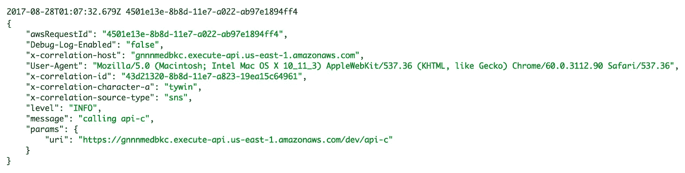

Log message for when the SNS handler function calls api-c with the custom HTTP module. Notice it includes the “x-correlation-source-type” header which is set by the SNS handler function.

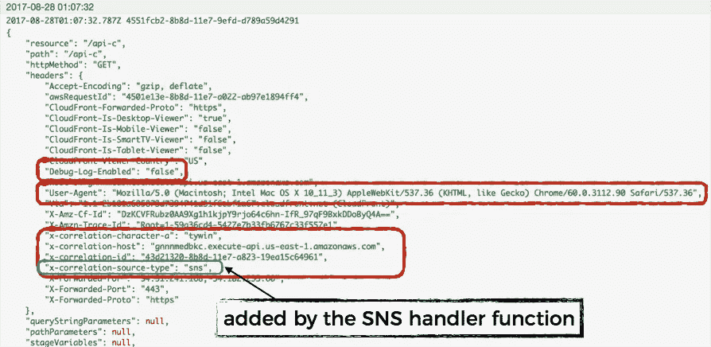

Those correlation IDs (including the one added by the SNS handler function) are included as HTTP headers.

# Kinesis 流

不幸的是，对于 Kinesis 和 DynamoDB 流，无法用有效载荷标记附加信息。相反，为了传递相关 id，我们必须修改实际的有效负载本身。

让我们创建一个`kinesis`模块来将事件发送到 Kinesis 流，这样我们就可以在有效载荷中插入一个`__context`字段来携带相关 id。

在接收端，我们可以取出它，用它来设置当前的`requestContext`，并在将它传递给 Kinesis 处理函数进行处理之前删除这个`__context`字段。发送方和接收方函数甚至不会注意到我们修改了有效载荷。

等等，还有一个问题—我们的 Lambda 函数将接收一批 Kinesis 记录，每个记录都有自己的上下文。我们将如何巩固这一点？

最简单的方法是强制处理函数一次处理一条记录。这就是我们在这里的`kinesisHandler`工厂函数中所做的。

处理函数(用`kinesisHandler`工厂函数创建)将一次处理一条记录，并且不必担心管理请求上下文。它的所有日志消息都有正确的关联 id，传出的 HTTP 请求、SNS 消息和 Kinesis 事件也会传递这些关联 id。

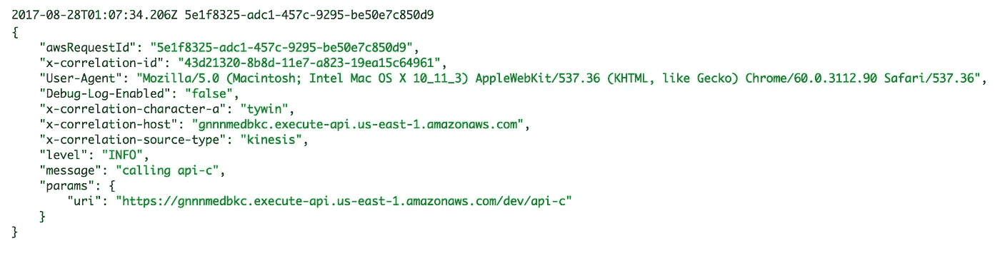

Log message for when the kinesis handler function calls api-c.

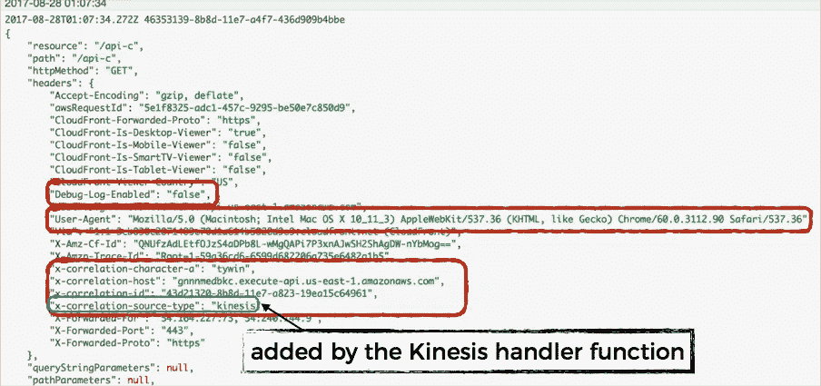

When api-c receives the invocation event, you can see the correlation IDs have been passed along via HTTP headers.

这种方法很简单，开发 Kinesis 处理函数的开发人员不必担心如何捕获和传递相关 id 的实现细节，事情“就这样工作了”。

但是，它也消除了通过成批处理所有记录来进行优化的机会。也许您的处理函数必须将事件持久化到持久性存储中，持久性存储更适合存储大的有效负载，而不是大量的小负载。

这种简单的方法并不适合每种情况，一种替代方法是将`__context`字段留在 Kinesis 记录上，让处理函数按照它认为合适的方式处理它们。在这种情况下，您还需要更新共享库——到目前为止我们已经讨论过的`log`、`http`、`sns`和`kinesis`模块——让调用者可以选择传入一个`requestContext`作为覆盖。

这样，handler 函数可以批量处理 Kinesis 记录。如果需要在特定记录的上下文中记录日志或进行网络调用，它可以提取请求上下文并根据需要传递。

# 结束了

就这样了，伙计们。如何通过 Lambda 最常用的 3 个事件源捕获和转发关联 id 的蓝图。

这是之前架构图的注释版本，显示了通过 HTTP 头、消息属性、Kinesis 记录数据从一个调用捕获并转发到另一个调用的数据流。

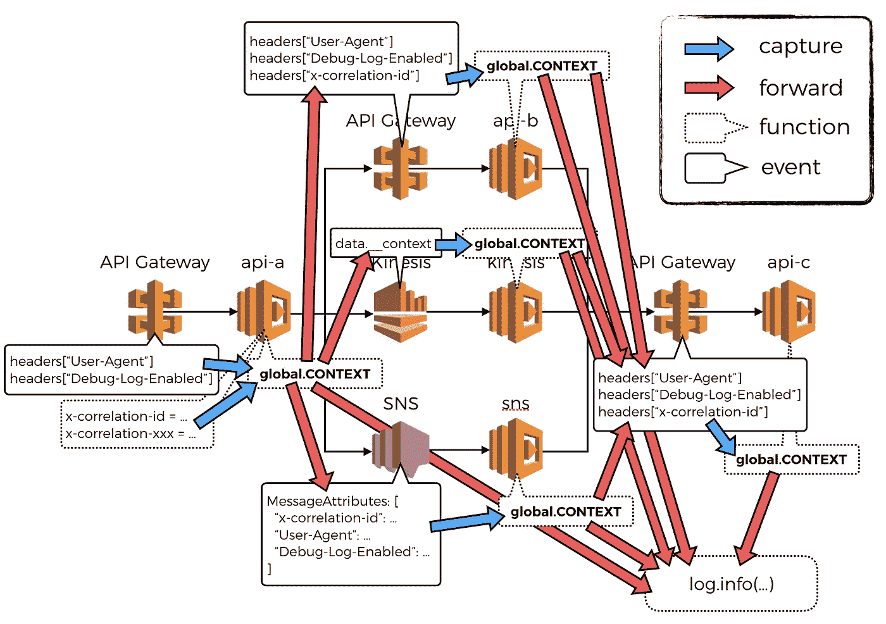

你可以在这个[报告](https://github.com/theburningmonk/lambda-correlation-id-demo)中找到你在这篇文章中看到的代码的可部署版本。这是为我的 O'Reilly 课程的演示会议准备的，下面会详细介绍，所以目前文档非常缺乏，但希望这篇文章能让你对这个项目是如何组织的有个大致的了解。

## 其他事件源

有很多[事件源](http://docs.aws.amazon.com/lambda/latest/dg/invoking-lambda-function.html)我们没有在这篇文章中提到。

不可能通过每个事件源传递关联 id，因为有些事件源不是来自您的系统，例如由 AWS 服务发出的 API 调用触发的 CloudWatch 事件。

而且可能很难通过 DynamoDB 流传递相关 id——我能想到的唯一可行的方法是将相关 id 作为字段包含在行中(这可能不是一个坏主意，但确实有成本问题)。

嗨，我的名字是**崔琰**。我是一个 [**AWS 无服务器英雄**](https://aws.amazon.com/developer/community/heroes/yan-cui/) 和 [**量产无服务器**](https://bit.ly/production-ready-serverless) 的作者。我已经在 AWS 中运行了近 10 年的大规模生产工作负载，我是一名架构师或首席工程师，涉足从银行、电子商务、体育流媒体到移动游戏等多个行业。我目前是一名专注于 AWS 和无服务器的独立顾问。

你可以通过[邮箱](mailto:theburningmonk.com)、 [Twitter](https://twitter.com/theburningmonk) 和 [LinkedIn](https://www.linkedin.com/in/theburningmonk/) 联系我。

查看我的新课程，[**AWS 步骤功能完整指南**](https://theburningmonk.thinkific.com/courses/complete-guide-to-aws-step-functions) 。

在本课程中，我们将介绍有效使用 AWS Step Functions 服务所需了解的一切。包括基本概念、HTTP 和事件触发器、活动、设计模式和最佳实践。

在这里拿到你的副本。

来了解 AWS Lambda: CI/CD 的操作性**最佳实践**，本地测试&调试功能、日志记录、监控、分布式跟踪、canary 部署、配置管理、认证&授权、VPC、安全性、错误处理等等。

还可以用代码 **ytcui** 获得**票面价格 6 折**。

点击获取您的副本[。](https://bit.ly/production-ready-serverless)