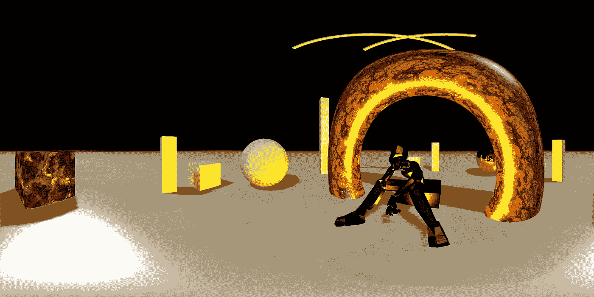

# 在浏览器中捕捉与脸书兼容的 4K 360 度 3D 场景视频

> 原文：<https://medium.com/hackernoon/capture-facebook-compatible-4k-360-videos-of-3d-scenes-in-your-browser-788226f2c75f>

A capture from inside of a Three.js example scene.

这篇文章描述了如何使用流行的 Three.js 图形库为基于浏览器的 3D 场景生成能够在你的[脸书](https://hackernoon.com/tagged/facebook)时间轴或 YouTube 页面上播放的 360 视频和照片。

[代码可在 Github](https://github.com/imgntn/j360) 上获得。

# 概观

1.  设置 3D 环境并…