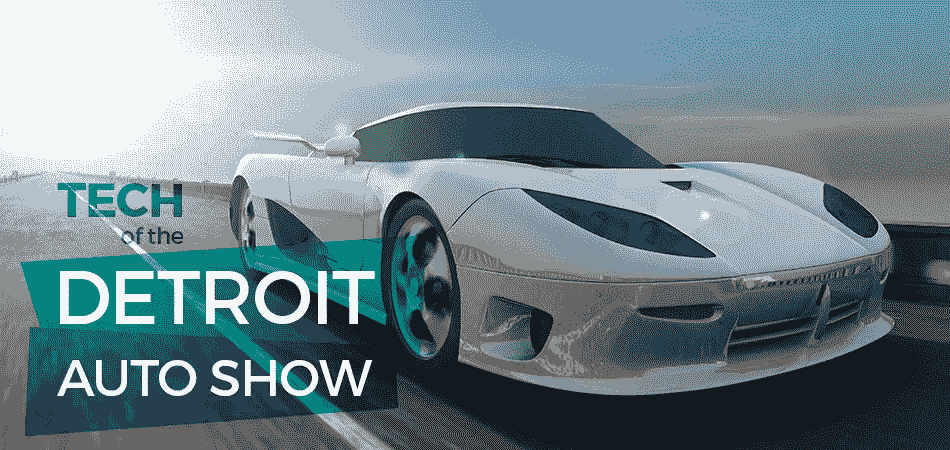
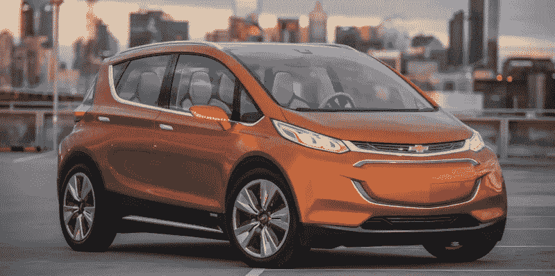
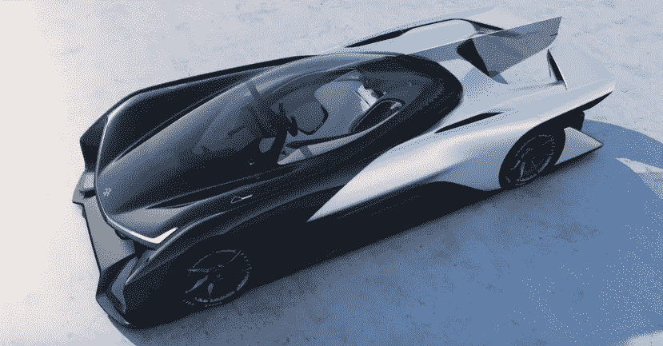
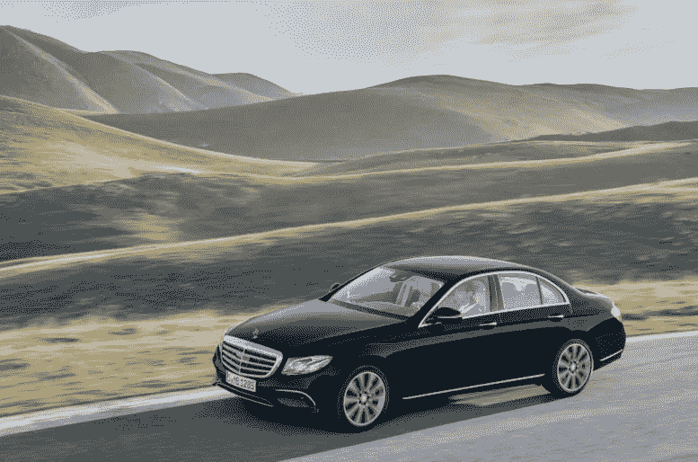
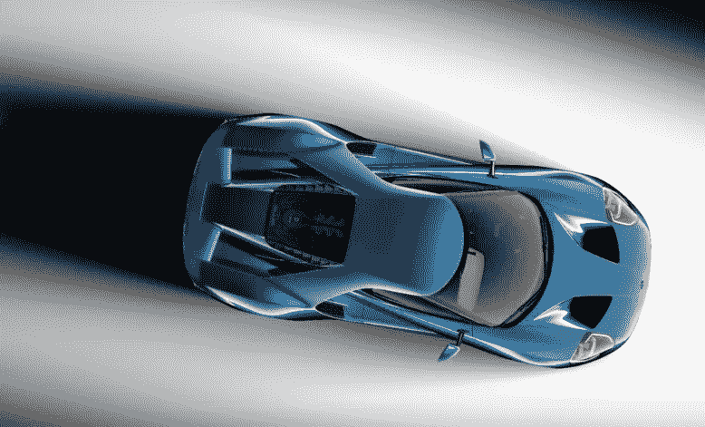
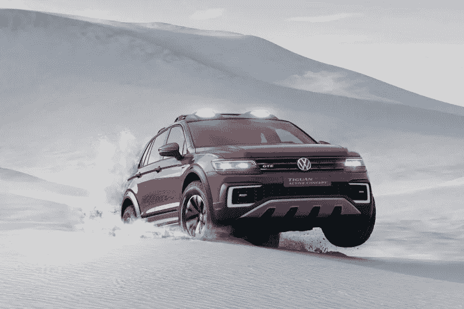

# 底特律车展上的汽车技术

> 原文：<https://medium.com/hackernoon/car-tech-at-the-detroit-auto-show-bf8ac73e139>

一月份有很多人在谈论汽车的未来。这部分是因为我们已经在今年最重要的两个车展上看到了令人兴奋的发展:消费电子展(CES)和北美国际汽车展(NAIAS)，通常被称为底特律汽车展。前者让人们一窥未来十年的驾驶方式，而后者展示了明年你将在路上看到的很酷的新汽车技术。

对于那些不痴迷于跟踪每个贸易展的人来说，消费电子展(CES)每年在拉斯维加斯举行，通常展示最新的电视、科技产品和家用电器。今年，汽车抢尽了风头，几乎每个制造商都推出了他们的未来高科技汽车计划。

CES 上的亮点包括沃尔沃为自动驾驶汽车设计的娱乐系统的[富有想象力的计划](http://www.theverge.com/2016/1/4/10708854/volvo-ericsson-concept-26-autonomous-video-streaming-ces-2016)，[雪佛兰的 2017 年 Bolt](http://www.engadget.com/2016/01/06/chevy-bolt-launch/) ，起亚的 [DriveWise](http://www.theverge.com/2016/1/5/10719152/kia-drive-wise-self-driving-cars-2030-ces-2016) 自主品牌以及新贵电动汽车制造商 Faraday Future 的华丽蝙蝠移动概念 [FFZero1](http://www.engadget.com/2016/01/04/faraday-future-zero-1/) 。

相比之下，本周的 NAIAS，长期运行的底特律车展，相对缺乏对未来的科幻愿景。但这是有道理的:这意味着展示未来一两年内上市的最热门汽车，而不是二十年后。

但这并不意味着底特律的展览缺乏创新，它们只是更加微妙。如果你仔细观察，你会发现一些真正的惊喜。以下是我们最喜欢的一些:

**半自动 2017 款 E 系列**

多年来，梅赛德斯一直致力于为其高端轿车开发半自动功能，如自适应巡航控制，明年重新推出的 E 级车将这些部件放在一个类似于特斯拉自动驾驶系统的包中。

这辆[高科技奔驰车](http://www.extremetech.com/extreme/220928-2017-mercedes-benz-e-class-extends-the-boundaries-of-self-driving-at-detroit-auto-show)将能够在高速公路上巡航，改变车道，刹车以避免事故，并在驾驶员输入最少的情况下停车。此外，多辆奔驰车将能够相互通信，就道路上的撞车、交通或减速发出警告。

这辆奔驰代表了许多汽车制造商对自动驾驶采取的渐进方法的顶峰(到目前为止)。它看起来也非常好。

**克莱斯勒小型货车插电式混合动力车**

在过去的十年里，小型货车比传真机受益的更新更少，克莱斯勒正试图通过[克莱斯勒 Pacifica](http://www.forbes.com/sites/kbrauer/2016/01/11/2017-chrysler-pacifica-minivan-meets-plug-in-hybrid/#2715e4857a0b6e2c0e0857c9) 将这个曾经流行的汽车家族带入 21 世纪。

最重要的创新是发动机。这是第一辆混合动力小型货车。它采用插电式混合动力系统，里程数高达 80 英里/加仑。它将能够在 100%电力的情况下行驶 30 英里，足够送孩子上学和回家。

除了发动机，Pacifica 是一款非常传统的高端小型货车，但由于运输能力(载人和载货)迄今为止一直是许多混合动力和电动系统的缺点，这可能是最终推动许多家庭考虑电动的套件。

**福特 GT 的超级挡风玻璃**

2017 款福特 GT 令人印象深刻的原因有很多:速度快、时尚、动力强劲。但它最令人兴奋的一点是大猩猩玻璃挡风玻璃的使用。

福特将首次在汽车上使用与大多数手机屏幕相同的专业分层玻璃。结果是挡风玻璃更耐刮擦和损坏，也更符合空气动力学。[看看这个演示](http://www.cnet.com/roadshow/videos/gorilla-glass-windshield-is-lighter-thinner-and-hail-proof/)。

并非每一项创新都需要从根本上动摇汽车的概念。有时候，只需要一个挡风玻璃。

**途观 GTE 是越野混合动力车**

大众汽车还推出了一款汽车，这款汽车将激发许多以前没有考虑过混合动力车的人的兴趣。虽然现在还只是一个概念，但[途观 GTE Active](http://www.topgear.com/car-news/detroit-motor-show/tiguan-gte-vws-knobbly-tyred-222bhp-hybrid-suv) 展示了大众对混合动力车的愿景，吸引了 SUV 和户外运动爱好者。

GTE 活动的主要目的是表明混合动力汽车可以是一种坚固耐用的探险车。它配备了四轮驱动，9 英寸的离地间隙，以及一个令人尖叫的混乱造型，“我喜欢在泥里玩。”

但这还不是全部，它还具有令人印象深刻的发动机罩下的混合动力发动机。途观 GTE 由 222 马力的 1.4 升发动机和两台电动机驱动。因此，它仅依靠电力就可以行驶 20 英里，总里程达到 580 英里，令人印象深刻。

**今日科技**

与去年非常相似，技术进步是底特律许多展览的核心。他们中的许多人不那么浮华，但他们也在某种程度上与现实联系在一起，像法拉第未来这样的高概念公司不需要这样。有一件事是肯定的，我们的一月份才刚刚过半，有强烈的迹象表明我们将在 2016 年经历一段令人兴奋的[旅程。](https://www.beepi.com/BackseatDriver/Posts/TheDetroitShow2015)

【www.beepi.com】原载于

******

> *[黑客中午](http://bit.ly/Hackernoon)是黑客如何开始他们的下午。我们是阿妹家庭的一员。我们现在[接受投稿](http://bit.ly/hackernoonsubmission)并乐意[讨论广告&赞助](mailto:partners@amipublications.com)机会。*
> 
> *如果你喜欢这个故事，我们推荐你阅读我们的[最新科技故事](http://bit.ly/hackernoonlatestt)和[趋势科技故事](https://hackernoon.com/trending)。直到下一次，不要把世界的现实想当然！*

**