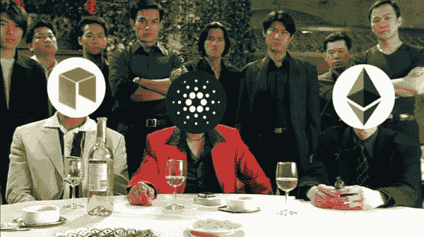
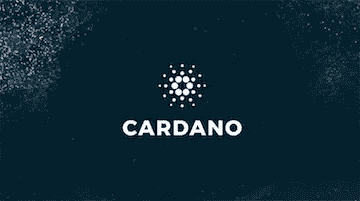
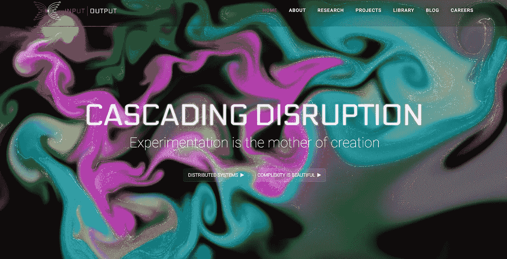
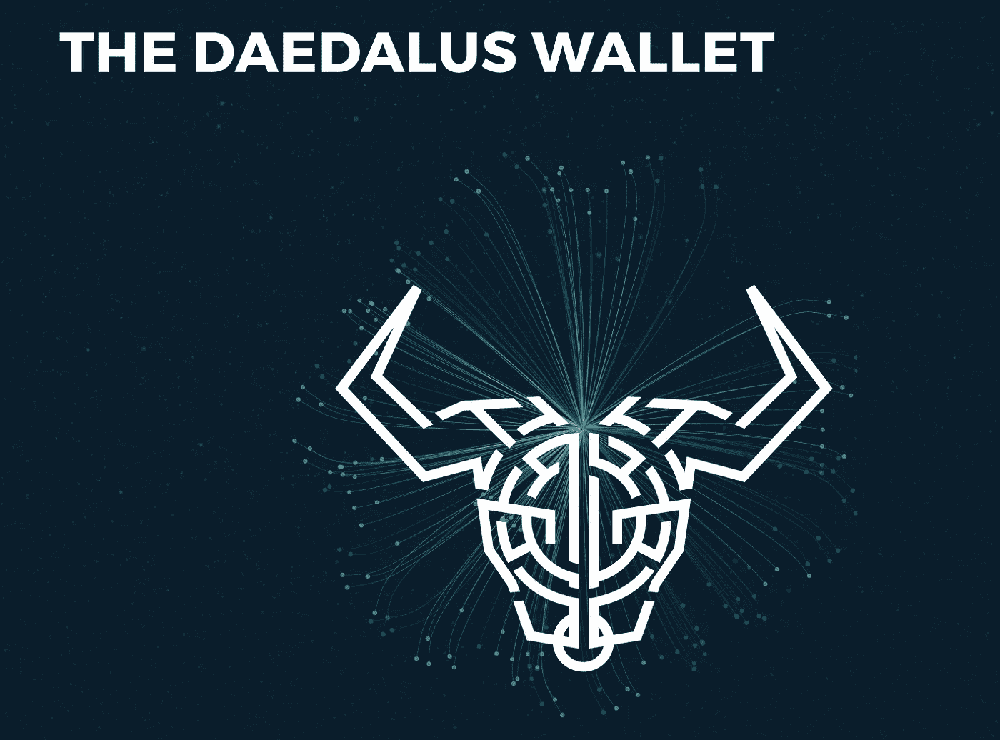
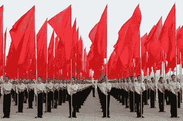

# 卡尔达诺:以太坊和新黑仔还是定价过高？

> 原文：<https://medium.com/hackernoon/cardano-ethereum-and-neo-killer-or-overhyped-and-overpriced-8fcd5f8abcdf>

## 作为第一个拥有**同行评审技术的**区块链，Cardano 是一个雄心勃勃的平台。能堆到 NEO 和以太坊吗？

**令牌:阿达**

自从本月早些时候卡尔达诺大卖以来，它就成了每个人的热门话题。即使在[加密货币](https://hackernoon.com/tagged/cryptocurrency)的动荡世界中，Cardano 在三周内 2000%的增长也是非同寻常的，并且引起了社区的注意。它现在是第六大加密货币市场，市值超过 100 亿美元。然而，在 Cardano 及其当时 7 亿美元的市值突然出现在 coinmarketcap.com 之前，大多数人从未听说过这个项目。它的突然出现和随之而来的巨大增长让区块链社区摸不着头脑，四处搜寻信息。

因此，就像街区里的任何新孩子一样，我们想了解 Cardano 是什么，它与其他区块链平台的区别是什么，以及它是否可以为我们的邻里团队打中外场…

本文将 Cardano 作为一个独立的平台，并与 Ethereum 和 NEO 进行比较。对于 NEO 与以太坊的分析，你应该[阅读这个](https://hackernoon.com/neo-versus-ethereum-why-neo-might-be-2018s-strongest-cryptocurrency-79956138bea3)。我知道 EOS 和其他第三代平台也是相关的；我以后会研究和写这些。因为我已经广泛地介绍了 NEO，所以我将把这篇文章主要用于提供对 Cardano 的深入分析。我还会将每个独特的组件与 NEO 和以太坊的组件进行比较。我将在某些方面直接引用我过去的文章。让我们开始吧…

# 卡尔达诺是什么？

卡尔达诺是一个三明治上没有面包皮的孩子，他在学校使用“同行评议”这样的词，阅读“学术期刊”他偶尔会被塞进自己的储物柜，而且从来不擅长运动；但是 10 年后，他开着一辆法拉利，你意识到你一开始就不应该评价他。

简而言之，Cardano 是一个区块链平台，为 dApp 开发提供可编程的区块链和智能合约。但这个行业已经成熟，竞争激烈:以太坊拥有先发优势和庞大的用户群，NEO 专注于智能经济， [ARK](/breathe-publication/why-ark-deserves-your-attention-c57acd51846a) 拥有智能桥梁和区块链互操作性；那么是什么让卡尔达诺与众不同，为什么它能成为该领域的一名有竞争力的球员呢？

**Cardano 的 One Liner:** Cardano 是业界第一个利用学术同行评审的开源代码的平台。

Definitely don’t want bugs in the code for this airplane’s protocol…

翻译？这意味着卡尔达诺项目拥有一个全球研究人员和科学家网络，他们为先进的区块链协议做出了贡献并开发了该协议。Cardano 的所有协议技术都经过了广泛的同行审查过程，类似于飞机代码可能经历的过程。他们的结论是，支持全球经济的准则应该和人们赖以生存的准则一样受到严格的审查。

卡尔达诺被称为第三代区块链。比特币是第一代。以太坊是第二个。以太坊领先，但因为它的技术从根本上来说是新的，技术是初级的。现在以太坊必须依靠其治理体系来升级和规模化。第三代区块链，像卡尔达诺一样，有后知后觉的优势。他们可以识别以前项目的缺点和限制，并相应地进行开发。这正是卡尔达诺选择的道路。该项目出现在 2014 年，不是通过白皮书，而是通过集体研究和合作，专注于确定当前区块链的局限性。然后他们从头开始编码，试图解决这些限制。在添加到更大的建筑之前，每个构件都提交给会议和专家进行审查。

这个同行评审过程非常重要，尤其是考虑到糟糕的编码和开发会导致灾难性的结果(想想奇偶校验和 DAO hacks)。世界上有多少*开发人员能够有效地编写区块链项目的代码？有多少开发人员能够在一个全新的行业，使用全新的技术编写高质量的项目？我认为这个数字肯定少于 coinmarketcap.com 上发布的 1380 种加密货币。如此多的焦点被引向 ***骗局*** 项目；我认为一个更重要的焦点应该放在合法的项目上，这些项目*只是做得不好*。**在这个行业中，更多的人会因为那些*不太好的团队和开发人员*而失去金钱，而不是因为犯罪的金钱掠夺**。因此，必须提出这样一个问题:我们如何知道一个项目是好的？我们怎么知道代码是犹太人的？一种方法，正如以太坊和 NEO 所做的那样，是通过崎岖不平、反复试验的采用之路。卡尔达诺的同行评议方法是另一个例子。*

凭借这种系统化和同行评审的开发理念，Cardano 正致力于解决第二代区块链的问题。

# **不止是卡尔达诺**

在我们深入了解 Cardano 解决了哪些限制以及是什么让这个项目独一无二之前，我们应该了解 Cardano 背后的人是谁。

该项目由三个实体支持，它们在生态系统中服务于不同的目的。

## [卡尔达诺基金会](https://cardanofoundation.org/)

卡尔达诺由一家名为卡尔达诺基金会的非营利公司支持。该基金会为卡尔达诺和整个区块链社区服务。他们致力于向更大的社区推广 Cardano，开展加密货币教育，并与政府合作进行监管。**像这样的组织对于采用区块链平台非常重要；该基金会提供了一个标准机构，可以促进与企业和商业的合作和采用。**[企业以太坊联盟](https://entethalliance.org/about/)为以太坊提供类似的服务。作为 NEO 的合作伙伴，OnChain 虽然不是一个非营利组织，但也为区块链公众与政府和企业之间的联系提供服务。由于 NEO、Ethereum 和 Cardano 等区块链平台是分散的，这些组织为企业提供了一个集中的合作机构。比如平台的出版机构。

同样值得注意的是，卡尔达诺基金会拥有各种关于卡尔达诺的可消化资源。从项目和技术的概述到详细描述团队如何运作的博客更新，他们确切的工作时间表，以及他们的发布时间表。老实说，我从未见过如此透明的东西。

## [输入输出香港](https://iohk.io/) (IOHK)

IOHK 是一家工程公司，为学术机构、企业和政府开发区块链解决方案。该公司分别由以太坊前首席执行官[查尔斯·霍斯金斯](https://iohk.io/team/charles-hoskinson/) on 和[杰里米·伍德](https://iohk.io/team/jeremy-wood/)领导。IOHK 支持 Cardano，并拥有一支庞大的研究团队——17 名获得认证的个人。这个团队一直负责 Cardano 的技术和数字钱包的开发。IOHK 还支持其他几个区块链项目，包括以太坊经典。对于有技术头脑的人来说，网站上有他们所有的同行评议论文。

此外，我建议你去网站只是为了玩玩丰富多彩的界面。

## [埃默里戈](https://emurgo.io/)

Emurgo 是一家总部位于日本的公司，既帮助成熟企业整合区块链技术，也投资初创企业。Emurgo 的连接企业到卡尔达诺区块链。

IOHK、Cardano 基金会和 Emurgo 之间的任务分配很有意思。我支持这个概念。我能理解如何将开发和工程从市场营销和网络中分离出来，从而建立一个更高效的系统。在生态系统中，每个组织都有不同的目的。

TLDR:卡尔达诺得到了三个组织的支持。*卡尔达诺基金会*通过向更大的社区推广卡尔达诺、开展加密货币教育和监管工作来支持该平台。 *IOHK* 是 Cardano 技术背后的工程和开发组织。Emurgo 致力于将平台与业务相结合。

# 卡尔达诺有什么特别之处？

正如加尔文·哈里斯所说，“这就是你来的目的。”

一个平台可以拥有最闪亮的网站、最强大的开发团队和最大的“同行评审”论文库，但如果它不能完成一些新的东西——一些革命性的东西——那么它就会死去。因为在这个领域，竞争是激烈的，每个人都在和以太坊这个 dApps 之王竞争。

卡尔达诺雄心勃勃，但大部分未开发。我将探索 Cardano 将实现的未来特性，但是现在，最重要的是关注基础。构成 Cardano 未来基础的特性和协议。

按照我探索它们的顺序，我认为 Cardano 的独特之处是:分层技术、利益协议证明、编码语言、钱包、治理模型和金库。

Cardano technology is layered like this delicious cake

# 分层技术

对于价值转移，有两组信息。很简单，从哪里来，给谁，什么时候，多少钱，这是比特币唯一能支持的信息。然而，正如我们所知，在我们的现实世界中，价值转移从来没有这么简单。与每笔交易相关，我们还可以问:转账的*条款和条件是什么*、*为什么*资金被转账*、*和*涉及哪些*实体？这就是所谓的*元数据*。

以太坊，第二代区块链，实现了所有这些信息的集成。**他们称实际价值转移和相关元数据之间的联系为*智能合约。*** **可编程合约*。*** 然而，在以太坊中，因为会计和计算没有分离，所以这些信息被存储在一起，而没有考虑元数据*是否总是*需要被包含。这是有问题的。每笔交易包含的数据越多，花费的汽油就越多，区块链存储这些信息就越困难，节点存储区块链的历史就越麻烦。

因此，卡尔达诺将*转移*和*为什么分开。*他们通过将平台分成两个不同的*层来实现这一点:*

**卡达诺结算层(CSL):** 这一层负责代币经济和所有用户账户的余额。卡尔达诺的本地货币 ADA 就是在这一层进行交易的。通俗地说，这意味着所有与帐户和 ADA 令牌相关的代码都存在于这一层。

**Cardano 控制层(CCL):** 所有的智能合约功能都存在于这一层。此外，该层还可以支持数字身份等监管元素。

The CCL is the control tower of Cardano

**CSL 只维护实际的交易信息—例如:从钱包 A 到钱包 B 的 3 个 ADA**。通过仅包括简化的交易信息，CSL 可以像一个标准化的交易协议。即使不是所有可能的交易，也是预编程的。灵活性和可定制性虽然有用，但也会产生安全漏洞。然而，对于简单的交易，Cardano 可以从一开始就预测并修复这些漏洞。

然而，Cardano 仍然支持智能合约。这些由 CCL 控制。CCL 允许智能合约的所有高级可编程特性。*为什么要进行*的交易。*条件和条款。*

将该层与 CSL 分离的优点有两个。**首先是**，它允许保护交易隐私，因为交易可以在没有以太坊或 NEO 要求的额外元数据的情况下进行。**其次**，它允许更集中的扩展更新，例如，更新可能只影响计算层，而不会危及用户平衡或网络的事务处理能力。

我理解这一点的最佳方式是，成为一种加密货币有好处，成为一个 T2 平台也有好处。加密货币协议简单高效。平台协议健壮而灵活。比特币和莱特币都是加密货币。以太坊和 Neo 首先是平台，其次是货币。卡尔达诺都是。这是两全其美的。

**TLDR: Cardano 将其协议分为两层。一层侧重于交易和账户，另一层是智能合约的计算层。这允许更容易的升级和增强的灵活性。**

# 利益证明协议

如果你不理解股权证明(PoS)，我建议你阅读我的 [NEO 文章](https://hackernoon.com/neo-versus-ethereum-why-neo-might-be-2018s-strongest-cryptocurrency-79956138bea3)中的解释。它强调了 PoS 和以太坊使用的东西之间的区别:工作证明(PoW)。本质上，PoW 使用计算能力来决定谁来确认区块链上的区块，并根据你贡献的计算能力来分配奖励。对于 PoS，根据谁持有最多令牌来确认区块。

> **在 PoW 中，如果你操作了网络总计算能力的 5%，就可以期望获得 5%的区块奖励。在 PoS 中，如果您拥有 5%的代币，您还可以获得 5%的块奖励。**

You don’t need all this equipment for PoS

Cardano 和 NEO 一样，使用利害关系证明协议。它叫**大毒蛇。**据说这是**唯一一个数学上证明安全的 PoS 协议**。要知道，和 Cardano 的所有技术一样，Ouroboros 已经过广泛的同行评审。大毒蛇是在爱丁堡大学、康涅狄格大学、IOHK 和东京工业大学的帮助下开发的。

与 NEO 和 Ark 一样，Cardano 使用了一种类似于委托利益证明(dPoS)的 PoS 协议变体。作为参考，NEO 将其称为 dBFT(委托拜占庭容错)。dPoS 允许利益相关者“投票和选举”代表，即众所周知的共识节点，他们为利益相关者进行整体确认。块奖励被给予共识节点，共识节点然后向投票给他们的代币持有者提供支付。

Delegated PoS is kind of like how we elect these guys to make the decisions for us

对于 Cardano，该系统的工作方式略有不同。时间被分成所谓的*时段(*每个时段可以是 20 分钟——一个完全任意的数字)*。*在每个时段或 20 分钟块内，有*时隙。*槽就是*待开采的*区块。随机算法为每个时隙选择一个令牌持有者作为共识节点。他们被称为*槽头*。然后，槽头确认该块，并让位于下一个随机选择的*槽头。*所有区块奖励都集中在一个池中，并在时段结束时分配给槽头。

时代的作用有点像你当地的 *Cold Stone Creamery* 的排班表。该计划可以持续任意长的时间，就像 epochs 一样——假设这个计划是一周。每个班次称为一个时隙。每个班次(或槽)只能有一个人工作，但我们*需要*为每个班次配备一名工人。每个工人都是随机挑选的。**有了卡尔达诺，你拥有的代币(ADA)越多，你当选的可能性就越大**——就像彩票一样:你拥有的代币越多，你的胜算就越大。用户也可以将他们的 ADA 放在一起，分享奖励。一旦那个工人(槽头)开始工作，下一个人就会接手。时期为每个插槽定义插槽前导。然后，当该时段结束时，一个新的时段上线，并为该时间表定义所有时隙前导。事情就是这样。

在 2018 年 Q2 的**雪莱更新之前，目前没有在卡尔达诺下注。更多关于奖励和赌注系统将如何工作的信息将会变得可用。截至目前，该平台是完全集中的，因为所有节点都归 Cardano 所有。所有网费都收了烧了。**

Cardano 对如何扩展平台进行了广泛的思考。大毒蛇启用了许多高级扩展选项。槽头可以管理多个链上的块。并且可以同时运行多个时期。这两者使区块链能够支持扩展解决方案，如*侧链*——多个链都可以互操作——和*分片*——将较大的区块链分成可管理的“块”值得注意的是，这些都还没有实现。目前正在研究中，将在网络需要时实施，预计在 2018 年底。

**与 NEO 和以太坊的对比:**以太坊仍然使用工作证明，这是一个严重的缺点。但是，他们正在过渡到 PoS 系统。NEO 使用的是所谓的 dBFT。NEO 的系统允许 NEO 令牌持有者选举在下一个街区达成共识的共识节点，这与 Cardano 不同。近地天体小组正在放弃对这些共识节点的控制。以太坊正致力于分片、侧链和其他扩展解决方案。NEO 的平台已经实现了比 Ethereum 更多的扩展解决方案，但正在向侧链和互操作性努力。

**TLDR:卡尔达诺使用了一个名为“大毒蛇”的赌注证明系统。网络随机选择一个节点来确认下一个块，并且奖励被分配给该节点。你拥有的代币越多，你当选的可能性就越大。令牌持有者还可以通过向节点贡献他们的令牌来“投票”节点，并增加他们当选的可能性。**

# 编码语言

卡尔达诺是用一种叫做*哈斯克尔的语言编写的。*程序员可以给你一个更好的理解，但是我知道 Haskell 语言是一种更精确的代码，它使用数学验证方法来限制人为错误并确认代码的正确性。本质上，代码有一个更好的过程来验证*是否被正确编写。可以想象，这将有助于防止 bug 和错误，例如为以太坊的 [DAO Hack](https://www.coindesk.com/understanding-dao-hack-journalists/) 或[平价钱包](/@mohamed.ai)灾难开辟道路的错误。*

Cardano 确实计划在未来将多种语言纳入其智能合约平台。

**以太坊和 NEO 对比:** NEO 允许使用多种最常见的编码语言进行编码，为开发者提供了更多的灵活性。以太坊创造了他们自己的语言，叫做 Solidity，是为以太坊智能合约优化的。

TLDR: Cardano 使用 Haskell，一种更加动态的编码语言。

# 钱包

卡达诺的专用钱包叫做 [**代达罗斯**](https://daedaluswallet.io/) **。**钱包支持网络令牌: **ADA** 。这款钱包由 IOHK 开发，由 9 名出色的开发人员组成的团队提供支持。当大毒蛇，利害关系协议的证明，被实现的时候，钱包将是关键的。从钱包，用户将能够“赌注”他们的令牌，并可能被选为确认块。或者他们将能够投票给其他代币持有者，以增加他们的赔率并分享区块奖励。

我发现卡尔达诺对他们钱包的奉献令人鼓舞。它展示了团队对平台所有元素的承诺。

以太坊和 NEO 的比较: NEO 有一个社区开发的钱包，NEON，它允许 NEO 持有者领取汽油。以太坊有多种支持的钱包。

**TLDR: Cardano 开发了自己的钱包，代达罗斯，支持令牌:ADA。**

# 管理

在评估区块链的未来前景时，治理模式至关重要。考虑一下[弗雷德·厄尔萨姆](https://medium.com/u/b947efe0a51a?source=post_page-----8fcd5f8abcdf--------------------------------)从这篇[精彩文章](/@FEhrsam/blockchain-governance-programming-our-future-c3bfe30f2d74)中引用的这段话:

> “最成功的区块链将是那些最能适应环境的人。假设这些系统需要进化才能生存，初始设计是重要的，但在足够长的时间内，变化的机制是最重要的。”

那么卡尔达诺的变革机制是什么呢？

卡尔达诺希望实施基于区块链的治理。**这意味着，有关区块链未来的决策可以由令牌持有者投票决定，并制定成协议。他们设想了一个各种各样的图书馆，在那里升级和修改可以被提议，然后由 ADA 持有者投票决定。议定书的实施需要获得一定比例的选票。**

相比之下，链外治理系统也有一些投票的外表，除了没有一个统一的投票方法。矿工通过将他们的计算资源(或者 PoS 的股份)贡献给他们支持的任何一个区块链分叉(版本)来投票。用户通过使用投票——他们决定使用哪个链。交易所也可以投票决定支持哪种代币。但是所有这些投票都发生在分叉之后。**因此，链上治理创建了一个系统，其中每个人都以相同的格式投票，并且投票发生在实现**之前*。为了更好地理解 forks，请阅读本文中的解释[。](/blockchain-for-grandma/https-medium-com-blockchain-for-grandma-gold-or-garbage-is-bitcoin-worthless-eli5-caab5767753a)*

举个例子，看看所有的比特币分叉。在今天的治理方法下，分叉经常发生，但没有人支持新的比特币(不包括已经广泛成功的比特币现金)，新的令牌也就消亡了。有了链上治理系统，变更可以提交投票表决；如果有足够多的人支持变革，变革就会实现。**他们不需要叉来衡量社区利益。**

然而，这个系统有利也有弊。

**优点**:这个系统可能有助于防止硬分叉。创建一个讨论和投票的格式可以促进网络的平稳更新，而不会有激烈的辩论和有争议的分歧。它有效地使这一过程民主化，并允许根据象征性的股份享有平等的投票权。这个系统也分散了治理。整个社区都可以参与进来，而不是只有少数开发人员负责提议和更新。

**缺点:**网络投票也有缺点。如果出现问题，任何已实现的功能都变得更加难以删除。代码中设置的治理是不可更改的。我们也相信机构群体会就协议变更做出明智的决定。系统必须到位，以防止如钓鱼活动。即使只是单纯的冷漠也会对这个系统有害。

这些治理系统目前都不存在；都还在开发中。该协议的细节以及它将如何解决上述问题仍有待观察。

**与以太坊和 NEO 的比较:**以太坊和 NEO 都使用链外治理模型。有了以太坊，更新被提出，被审查，然后网络分叉。矿工、用户和交易所必须决定使用哪条链。以太坊的社区通常同意更新，因此，这通常是一个平稳的过程。但是，看看以太坊和以太坊经典有没有分叉不顺利的例子。NEO 比以太坊更集权；因此，团队可以快速实现更新和协议更改。这符合 NEO 的智能经济愿景。

**TLDR: Cardano 希望实施链上治理，令牌持有者可以对社区提议的区块链更新进行投票。这些更新然后被编码到区块链中。**

# 财政部

每笔奖金的一部分(25%)被放入国库。这个金库是分散的，只能通过上述投票机制访问。假设 Cardano 社区想要举办一场开发竞赛。详细内容将提交给社区，由 ADA 持有者投票并批准竞赛。有了财政部，社区就可以投票决定如何资助竞赛。通过一致投票，财政部的资金可以支持项目和网络升级。也许有一天，研究人员会希望获得资助，研究卡尔达诺的元素，并提出改进建议。财政部系统可以做到这一点。

所有这些都有助于解决这样一个问题:在支持他们的公司离开后，区块链应该如何筹集资金？Vitalik 离开，以太坊基金会解散，以太坊会做什么？当近地天体理事会不复存在时，近地天体会变成什么样？虽然这些平台将继续自给自足，但它们不一定有办法为新的生态系统开发提供资金。这是卡尔达诺的解决方案。

再次，要认识到这个模型还没有实现。

**与以太坊和 NEO 的比较:** NEO 和以太坊没有链上资助机制。

**TLDR:卡尔达诺将会有一个财政系统，资金来源于 25%的集体奖励。ADA 令牌持有者可以投票决定如何使用这笔钱。**

# **队**

如前所述，卡尔达诺项目得到了三个组织的支持。然而，我认为 IOHK 是与该项目最相关的实体，因为他们正在进行实际的开发。查尔斯·霍金森和杰里米·伍德负责 IOHK。查尔斯首先共同创立了 Invictus Innovations，并创立了 Bitshares。然后他去了以太坊担任执行总裁。他担任 IOHK 的首席执行官已经快三年了。

杰里米还为以太坊工作，担任行政助理。他担任 IOHK 的 CSO 也将近三年了。

除了这两个之外，Cardano 还拥有由学者和开发人员组成的小型跨学科团队，致力于单独的项目。开发待办事项列表被跟踪，当团队完成项目时，新的任务不断地被分配给他们。团队以两周的时间间隔工作，发布对主要项目的小的、增量的更新。Cardano 专注于基于时间的发布，而不是基于功能的发布。通过不发布大的更新，他们避免了需要协调所有新特性发布的问题。

我对团队的透明度和专业性印象深刻。不断提供进度更新，我很欣赏该系统如何利用开发人员网络快速有效地工作。

**以太坊和 NEO 比较:**这三个项目都有由聪明的思想领袖领导的强大团队。很难不给以太坊和维塔利克·布特林(区块链思想家的迈克尔·乔丹)以优势。

# [**路线图**](https://cardanoroadmap.com/) **和当前进度**

卡尔达诺目前唯一有效的协议是他们的 SL Mainnet。这是 9 月 29 日发布的。S1 是支持 ADA 的结算层。本质上，这意味着卡尔达诺只是一种加密货币；它需要发布其他功能来实现它作为一个平台的承诺。

2018 年的 Q2 将是卡尔达诺的下一个大发布。这个名为 Shelley 的版本将启用许多新功能。**这些包括:**
1。他们的利害关系证明协议——大毒蛇的发布。

2.增加了运行完整节点的激励

3.钱包升级。此次升级将包括高级安全性、多重签名(钱包的多重密码)、量子抗性地址和检查点——这是一个加快区块链同步时间的过程。

4.他们网上投票系统的发布。

在此之后，版本将包括他们的智能合约平台、资金系统和高级扩展方法。

Cardano 在设计协议时考虑到了法规和合规性。他们希望创建一个支持数字身份的生态系统，并能在现有经济中与企业和政府合作。他们未来的发展将集中在这个原则上。

**TLDR:到目前为止，卡尔达诺只发布了他们的结算层，因此，只能作为一种加密货币。智能合约和其他平台创新是未来的发展方向。**

# 其他相关信息:

1.  Cardano 正在用 Psi Calculus 对 Ouroboros 和其他协议特性进行建模，Psi Calculus 是一种机器可以理解的正式建模语言。这允许他们在协议实际实现之前对其进行测试。
2.  正如路线图部分所述，Cardano 计划实现量子安全签名，使他们的区块链理论上免受量子计算机的攻击。NEO 实现了这个特性，而以太坊没有。
3.  卡尔达诺关于每个决定的思考过程都被记录在他们的网站上。我从未见过项目如此透明。
4.  卡尔达诺的代币销售被审计。你可以在这里阅读报道[。](https://www.cardanohub.org/en/audit-report-summary/)
5.  该网络拥有大量社交媒体追随者。三个相关的 twitter 页面有 72k 的粉丝，他们的 R [eddit](https://www.reddit.com/r/cardano/) 有 24k 的粉丝。

# **危险信号和问题**

与任何项目一样，我们了解项目的所有方面是至关重要的；好的和坏的。

**1。仍在开发中**

卡尔达诺还远远没有做好生产准备。随着 SL mainnet 和本地令牌 ADA 的发布，它比其他第三代区块链(如 EOS)走得更远。然而，我们距离实施他们的 PoS 协议可能还有 6 个多月的时间。他们的智能合约平台——他们的 CL 和虚拟机——甚至没有发布日期。在此之前，不能开发 dApps，也不能进行 ico。以太坊已经支持超过 800 个 dApps。NEO 正在迅速支持更多的应用。虽然 Cardano 确实在以太坊的许多方面有了显著的改进，但以太坊确实计划实施扩展解决方案来缩小这一差距。即使卡尔达诺在一年内完全投入运营，在正常情况下，在区块链行业的一年也是永恒的。一年后，以太坊可能会在 dApp 市场上占据一席之地，并在扩展解决方案方面取得重大进展，因此没有 Cardano 的位置。眼下，卡达诺是一种加密货币；但 Cardano 目前 105 亿美元的估值远不止是基于它是一种简单的加密货币。

**2。治理和财政**

卡尔达诺依赖于一个复杂的治理系统。该系统的功能必须精心制作，以调整激励措施，并确保坏演员和巨魔不能操纵系统和肆虐。如果一群积极主动的用户能够获得足够的权力，并利用国库为自己谋利，那会怎样？虽然我确实期望 Cardano 团队会仔细地、有条不紊地处理这些问题，但这仍然是一个需要考虑的因素。

# **结论**

这篇文章的要点应该是:Cardano 是一个第三代平台，它正在有条不紊地构建，采用了同行评审技术，以解决当今第二代区块链(如以太坊)的许多扩展、隐私和技术问题。Cardano 拥有先进的股权证明协议、独特的治理和资金系统以及分层基础，使 Cardano 能够同时充当加密货币和区块链平台。它有一个强大的支持网络，一个强大的开发团队，以及大量的社区兴趣。其路线图的广度是惊人的，我相信 Cardano 能够实现它的承诺。

即使有这些好处，也很难有效地评估 Cardano 和其他第三代平台的价值。毫无疑问，卡尔达诺做得很对。然而，网络效应在平台估值中扮演着重要角色。网络效应指的是技术的价值经常取决于有多少人会使用它。因此，Cardano 要想成功，就必须拥有*用户。*除了发送和接收 ADA 之外，Cardano 至少还需要一年的时间才能拥有一个可以支持用户的平台。相比之下，以太坊和 NEO 在各自的市场上都取得了巨大的成功。以太坊控制着今天的 dApp 开发市场，而 NEO 正在大步成为东方的平台，并实现智能经济。我不认为 Cardano 会取代这两个平台；它不会取代 NEO，因为他们的目标和目标市场不同，它也不会取代以太坊，因为我认为以太坊将通过其许多扩展解决方案取得成功，缩小它和 Cardano 之间的技术差距。

无论如何，我认为区块链的生态系统可以支持不止一个平台。Cardano 的诸多优势让我确信它是以太坊的有力替代者，也许是一个更灵活、更安全的平台。目前，我们能做的只有等待；等着看卡尔达诺是否忠于它的路线图；等着看行业和企业是否注意到这一点；让我们拭目以待，看看卡尔达诺能否成为区块链平台中的一个强者。

有兴趣的话可以买币安的 ADA:【https://www.binance.com/?ref=10928176】T2(推荐链接)

***免责声明:此为非付费内容；我没有收到这篇文章的任何报酬。我对以太坊和 NEO 都很感兴趣。我没有投资卡尔达诺。这不是投资建议，仅仅是我对平台的看法。自己做研究。***

> 在 Twitter 上关注我:@ noamlevenson

—非常感谢捐赠和支持—

ADA:ddzffzcqrhsgvw 4 humyhsmuscjksfh 1 bxv 7 VC 5 pft 7 wayec w8 l 4 so 4 thglyhwbht 37 uujtfwnkqvcgbiic 8 fqd 8 sb 7 ph 1 DCC n9 tcmn 8

NEO:agpjyu 9 fy 58 tgd hhbxgtxaosxh 5 uumvp

ETH:0x4c 35100 a0a 25 b 3933 ba 1c 0469 b 5 df 8 b 24035775 b

如果您喜欢该内容，请按住鼓掌按钮！它帮助我获得曝光率。

***鼓掌 50 次！***

*我喜欢收到问题或建议，所以请留言吧！*