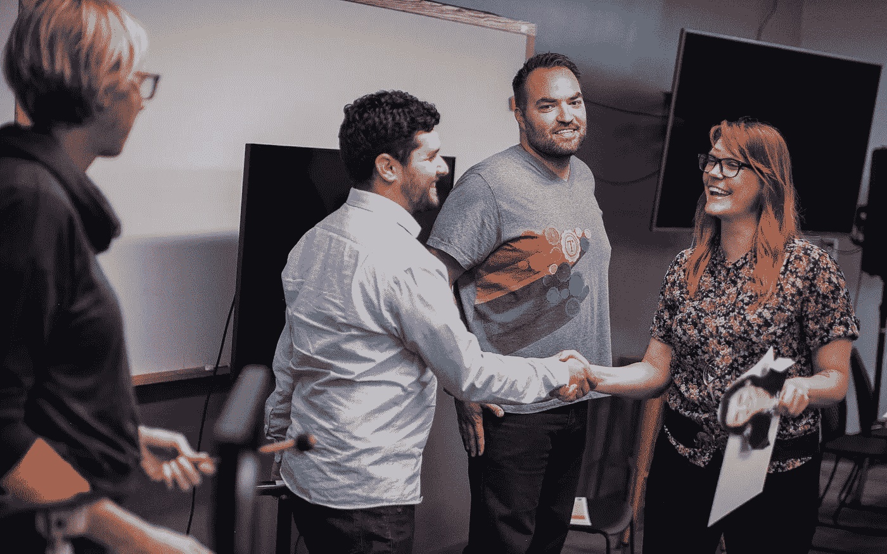

# 职业准备就绪

> 原文：<https://medium.com/hackernoon/career-ready-d57682a92736>

2011 年有人问我“*如果你有一群对编程一窍不通的了不起的人，要多久才能把他们变成* ***成功的软件开发人员*** *？*“六年的理论，实验，近千名学生，得出了清晰的答案。

潜在学生注意到的关于图灵的第一件事是，我们的课程运行 **27 周**，而不是像我们的竞争对手那样只有 10 周。为什么不同？

The predominant feeling of programming: uncertainty

大多数项目都是这样开始的:培训一个人被录用至少需要多长时间？“相反，我们问他们“**什么时候为职业生涯做好准备**”？他们准备什么时候在这个行业取得彻底的成功？我们从 2012 年的五个月开始，在 2013 年增长到六个月，在 2014 年增长到七个月。

为什么？根据我们的实验和观察，27 周是一个学习拐点。在此之前，学生在受控制的学术环境中学习得更快更好。27 周后，他们通过在工作中应用技能，学得更快更好。

刚开始新工作一个月的毕业生最普遍的反馈是“*比图灵更慢更容易。*“他们不仅仅是幸存，他们已经准备好了。

我们很荣幸能够发布[成果报告](http://report.turing.io)并参与[成果报告诚信委员会(CIRR)](https://cirr.org/) 等活动。但事实是:我对学生的毕业和就业并不满意。

> 我们的使命是通过培训多元化、包容性的学生群体来释放人类潜能，从而在高成就的技术职业中取得成功。

**毕业不是终点**；这是一个检查站。下一步是获得工作机会。但是职业生涯是以年和十年来定义的。现在下结论说我们已经成功还为时过早。但是该死的有一些伟大的指标。

On the keyboard you’re constrained. On paper your ideas can live free.

如果你回到 2012 年的第一届，**所有 24 人都毕业并开始了技术职业生涯。五年里发生了很多事。**

一名毕业生攒够了钱，离开了科技行业，实现了自己开一家 CrossFit 健身房的梦想。另一个回到了她的初恋:戏剧。2017 年初，我们失去了出色的特拉维斯·瓦伦丁，原因是悲惨的健康状况。这是另外 21 名毕业生的完整名单目前的职位和公司:

*   首席技术官，*厨房*
*   工程经理， *GitHub*
*   支持工程师，*哈希公司*
*   高级软件工程师， *MuveHealth*
*   软件开发商，*独立*
*   软件工程师，*数字海洋*
*   首席产品工程师， *Freebird*
*   高级软件工程师，*决策人*
*   软件工程师， *In-Q-Tel*
*   首席执行官，*塞内卡系统*
*   软件工程师，*事实*
*   软件工程师，*团购网*
*   高级软件工程师，*决策人*
*   开发商代言人， *Heroku*
*   软件开发者， *LivingSocial*
*   iOS 领先， *Gametime 联合*
*   软件开发者，*破译技术工作室*
*   软件工程师，*尘嚣健康*
*   工程师四， *2U*
*   产品经理，*谷歌 AdMob*
*   业务发展总监，*强大的实验室*

这是一群特殊的人。但是最激动人心的是:**这是我们的第一稿**。

11 月，我们将开始第 40 期**培训。我们已经改进了 39 次了。数以千计的课程、项目和评估结合了无数页的学生反馈、雇主输入和经验教训。我们的课程计划和作业每天都在变化。从我的角度来看，程序和指令至少是早期的两倍有效。**

五年后的 2022 年，我们将会看到大约 2000 名毕业生。会有首席技术官、首席执行官、工程副总裁，还有一些艺术家、世界旅行者和一大群软件工程师。

那我们就继续走。不仅仅因为*我们的* ***愿景*** *是一个开发技术的人代表使用技术的人的行业*，而是因为我们训练人们为职业生涯做好准备。27 周的准备迎接一生的可能。

如果你最爱的人需要一份令人惊叹的职业，请把他们发给我们。

***我是*** [***杰夫·卡西米尔***](http://twitter.com/j3) *和* [*图灵软件学院的&设计*](http://turing.io) *是我毕生的心血。*

Victoria graduates. Number 400-something of thousands.