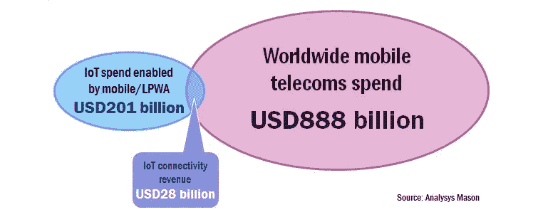

# 运营商物联网现在不是很有前途吗？

> 原文：<https://medium.com/hackernoon/carrier-iot-not-so-promising-now-is-it-5423f1894ed4>

今天早上喝咖啡时，我看到了可能是迄今为止对蜂窝物联网前景最乐观的看法。来自英国一家名为 Analysys Mason 的公司的分析可能会在今天早上引发一些关于其收入预测的电子邮件:

但最引人注目的是分析师们的操作建议，它们反映了我自己的观点:

> **创建一个独立的实体来瞄准物联网机遇**。物联网业务部门应该能够独立于传统业务做出决策。它的业绩指标应该与一个新的增长领域相称，并且应该被授予相当程度的自主权来做出自己的投资决策。对硬件和应用服务的投资应侧重于发展物联网业务，不应受到传统业务考虑的阻碍(例如，Bouygues Telecom 和 Vodacom 已经展示了运营商如何使用独立的部门来开发物联网解决方案)。1
> 
> **利用内部能力构建物联网支持者和应用**。运营商需要建立平台和支持者，以便在价值链的新领域开展业务。一些运营商有独立的研发和 ICT 部门，专注于开发针对特定行业的新功能和解决方案。例如，德国电信的 ICT 业务 T-Systems 开发了一个医疗保健平台(e-Health Connect)，该平台支持远程患者监控等物联网应用。此外，威瑞森开发了 ThingSpace，Indosat 开发了 NexThing 来构建开发者生态系统以支持他们的计划。
> 
> **培育合作伙伴关系，将物联网主张推向市场**。并非所有移动运营商都具备开发硬件和应用解决方案所需的全部技能或内部专业知识。即使是那些已经建立了 IT 部门的运营商(如德国电信)，在某些方面也会依赖合作伙伴关系。大多数运营商将需要建立合作关系，以进入价值链的新领域，无论是在应用支持平台等能力方面，还是通过将端到端解决方案推向市场。
> 
> **大胆投资并购**。移动运营商在物联网领域的收购方面一直相对谨慎。有几个主要的例外:沃达丰收购 Cobra 是为了在汽车物联网价值链的每个部分进行竞争。同样，威瑞森也进行了一系列高调的收购，总计 35 亿美元，以竞争车队管理。在较小的规模上，Telia 投资了 Springworks 以支持其联网汽车平台，并于最近收购了 ltcom 以参与智能城市应用的竞争。

正如我在这里写的和[这里写的](http://bit.ly/2noxibV)和[这里写的](http://bit.ly/2mTXw7j)，蜂窝电话的前景比他们的营销团队让你相信的要弱。蜂窝运营商在物联网中发挥着作用，但它只是被过度宣传和神话化，以至于瘫痪了物联网行业的部分领域，特别是当它与企业/工业领域的 LPWAN 相关时。

# 如果你喜欢这篇文章，请点击下面的❤图标，然后[关注](/@patburns)我。

> [黑客中午](http://bit.ly/Hackernoon)是黑客如何开始他们的下午。我们是 [@AMI](http://bit.ly/atAMIatAMI) 家庭的一员。我们现在[接受投稿](http://bit.ly/hackernoonsubmission)并乐意[讨论广告&赞助](mailto:partners@amipublications.com)机会。
> 
> 如果你喜欢这个故事，我们推荐你阅读我们的[最新科技故事](http://bit.ly/hackernoonlatestt)和[趋势科技故事](https://hackernoon.com/trending)。直到下一次，不要把世界的现实想当然！

