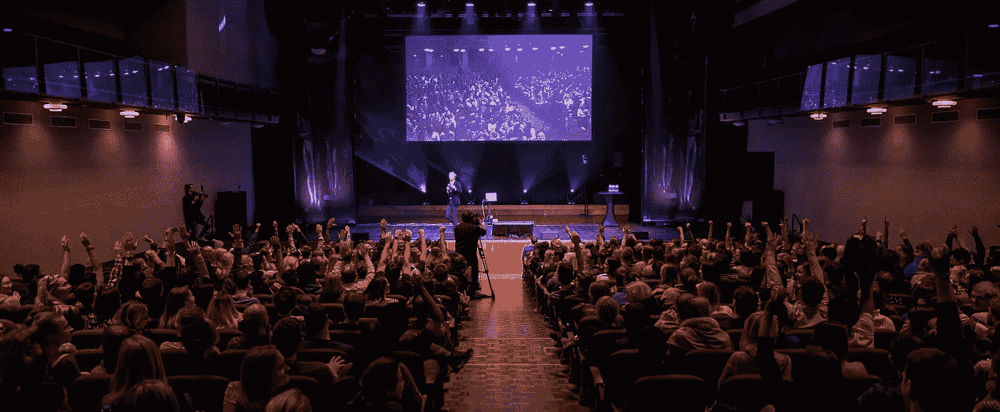
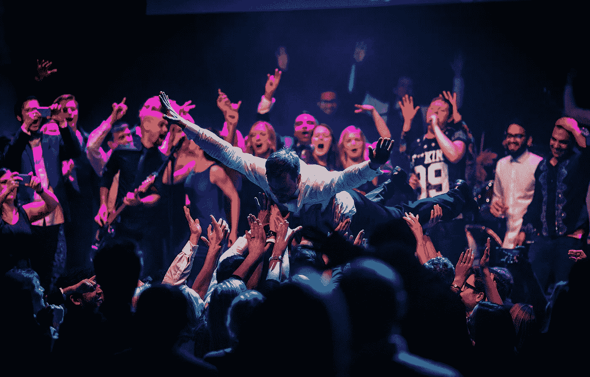

# 举着旗子

> 原文：<https://medium.com/hackernoon/carrying-the-flag-6d0a2703625d>

在过去的几天里，我感受到了一种新的强烈的归属感。家庭聚会。周日早午餐。晚上和朋友一起玩棋盘游戏。实际上，那感觉就像所有的一切，只是在五百人的公司里，而不是五个或十五个。TransferWise 举办了一年两次的全体聚会——冬季聚会。

我们一起创造，一起表达，一起经历，一起欢笑。我们以多种方式向彼此展示，在角色和责任之下，我们只是一群美好而温暖的人。

Y 你可能听说过 TransferWise 一开始就没有多少层级。尽管如此，随着我们[的成长](https://hackernoon.com/tagged/grow)，我们需要不断提醒自己，任何人都可以走向并呼唤任何人。像《我们的日子》这样的事件让它变得简单。感谢你们时刻准备着让自己难堪，克里斯托和塔维特。谢谢你在坑里流汗，珍。韦德，你这个怪老头。马丁和尼兰,[反馈循环](https://hackernoon.com/tagged/feedback-looping)动态二人组。

我也觉得我们的大部分乐趣来自内心，来自我们这些疯狂的有创造力的人的内心。像这样的团队活动是我们一直在做的事情。它不是一场表演或戏剧，它不是一项观赏性运动。你赋予了它生命——歌手和舞者，电影制作人和恶作剧的人。麦肯、凯瑞和他们的团队为我们搭建了一个做自己的平台。

同样重要的是，那是冬天，不是冬天。让我心跳加速、起鸡皮疙瘩的时刻，没有一个是由酒精、食物或任何其他外部能量来源引发的。对我来说，这一事件证明了 TransferWise 正在从一个青少年成长为一个年轻、负责任的成年人——不仅是作为一个企业，而且是在社会上。

长大看起来可能苦乐参半，但这并不等于变老。我们有人在我们中间教导如何花白的胡子只是一个门面，以及如何你可以去野生没有加仑的酒。

我们将永远保持饥饿和敬畏。

> [黑客中午](http://bit.ly/Hackernoon)是黑客如何开始他们的下午。我们是阿妹家庭的一员。我们现在[接受投稿](http://bit.ly/hackernoonsubmission)并乐意[讨论广告&赞助](mailto:partners@amipublications.com)机会。
> 
> 如果你喜欢这个故事，我们推荐你阅读我们的[最新科技故事](http://bit.ly/hackernoonlatestt)和[趋势科技故事](https://hackernoon.com/trending)。直到下一次，不要把世界的现实想当然！

