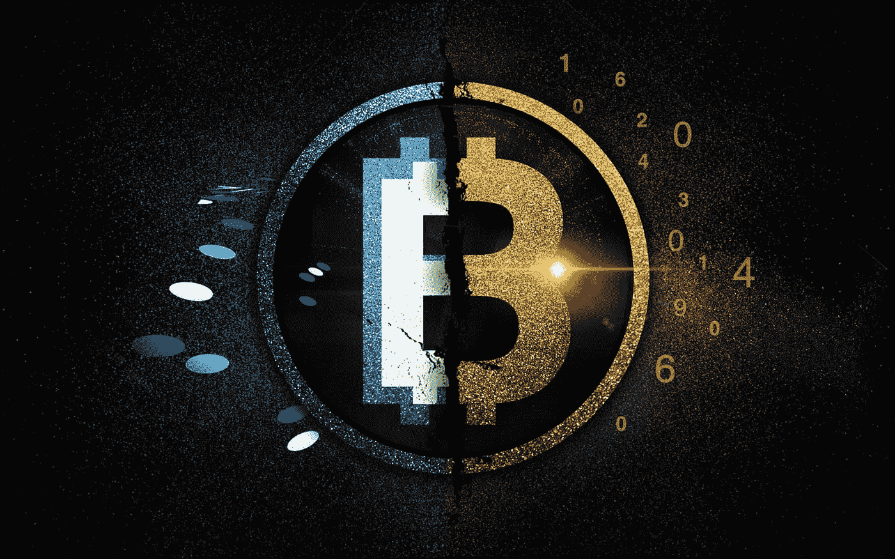
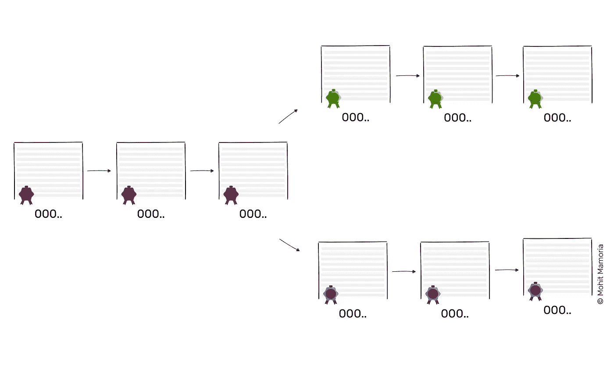
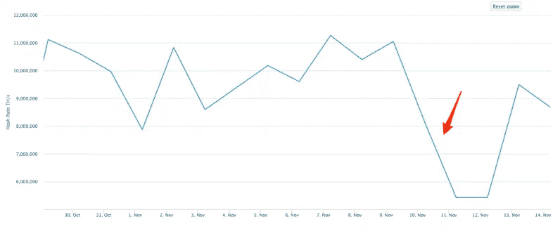
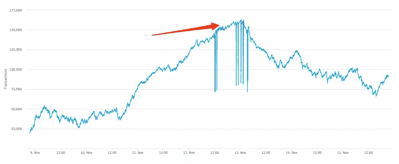

# 现金、黄金、2 倍——什么叉子！

> 原文：<https://medium.com/hackernoon/cash-gold-2x-what-the-fork-272ecc0ad370>

## 毕竟，比特币在过去的几个月里发生了什么？

它 **看起来，在过去的几个月里，**比特币和分叉交了朋友。当我写关于[比特币分叉的最后一次](https://thenextweb.com/contributors/2017/07/24/ultimate-guide-upcoming-fork-thats-splitting-bitcoin-community/#.tnw_TYuJsUnr)时，我没想到这么快会有这么多。但是，嘿，我们在这里，试图搞清楚到底在密码世界发生了什么。

通过这篇文章，我试图将自比特币现金以来发生的一切按照适当的顺序排列，这将成为任何人在 2017 年 8 月至 2017 年 11 月期间学习比特币分叉的首选文章。

> 顺便说一句，我是 Crypto 上周 [**的编辑，每周一发邮件，包含上周 Crypto 空间发生的一切。**](https://lastweekincrypto.com/)

# 🍴但是首先，什么是叉子？

> “吃美食不需要银叉。”—保罗·普拉德霍姆

你可以把区块链·莱杰想象成一摞页面。网络中的每个完整节点都自己保存了这一堆页面的副本。每个人的账本都是完全一样的，因为每个人都遵循相同的规则来建立账本。

因此，如果网络中有 10 个人，他们每个人都会有一份类似这样的分类账副本:

每个分类账都有相同的一组块，整齐地排列在链中，因为每个人都遵循相同的规则。这种与陌生人合作的想法赋予了比特币所拥有的价值。但问题依然存在——“每个人都遵守的规则是我们能拥有的最好的规则吗？”

当你问社区这个问题时，不幸的是，没有明确的一致意见。那是所有分叉的根源。当一个社区在应该遵循什么样的规则上产生分歧时，分叉就发生了。

例如，如果在接下来的区块链中，社区在块#3 之后划分，一些参与者将开始遵循新的规则集，而其他参与者将继续遵循旧的规则。

因为不是每个人都遵循相同的规则，所以每个社区的未来区块可能会有所不同。区块链可能看起来像这样:

在#3 街区之后，一些人会遵循新的规则来建造未来的街区，因此，远离了社区的其余部分。这就是叉子。

> *分叉意味着社区的一部分不同意当前的规则来创建区块并采用一套新的规则。*

好了，现在我们知道 fork 意味着社区的一些成员遵循一套更新的规则，让我们来看看每个 fork 是关于什么的。

# 💰比特币现金

> "我有点像女王，因为我没带多少现金。"—理查德·布兰森

**比特币社区面临的一个主要问题是区块链的吞吐量。目前，比特币区块链每秒只能处理大约 6 到 7 笔交易。与 Visa 每秒超过 24000 笔交易相比，你会意识到为什么我们不用比特币来购买我们的早餐咖啡。**

这个问题已经困扰这个社区很长时间了。我在[这篇文章](https://thenextweb.com/contributors/2017/07/24/ultimate-guide-upcoming-fork-thats-splitting-bitcoin-community/#.tnw_CMHI14yc)中解释的 SegWit2x 分叉是为了解决比特币网络速度慢的问题。这个问题的解决方案是在一个块中容纳更多的事务。为了实现这一点，在当前的规则集中更改了两条规则，以提高网络速度:

1.  写入事务的格式已经过优化，以便在一个块中可以容纳更多的事务
2.  块的大小从 1MB 增加到 2MB

记录事务的优化格式与更大的块大小相结合，意味着可以在一个块中写入更多的事务，从而以更快的速度处理事务。

分叉将在 8 月 1 日发生，社区似乎同意这一升级。升级将分两个阶段进行。第一阶段将改变第一条规则，第二阶段(定于 11 月中旬)将改变第二条规则。

第一阶段进展顺利，但后来一群矿工(制作新砖块的人)决定另辟蹊径，升级到第二条规则。

那些矿工催生了比特币现金，它与比特币的区别在于一个方面:速度。与比特币的 1MB 相比，比特币现金的块大小为 8MB，这使得它比比特币快很多。

那应该是说比特币现金比比特币好吧？不对。

在决定一枚硬币是否优于另一枚时，有几个因素。速度只是其中之一。比特币现金由少数大型矿商驱动，其存在完全依赖于他们。他们停止为网络供电的那一天，将是比特币现金终结的那一天。

> *区块链以不可信的方式工作，因为网络中有大量的陌生人。*

因此，比特币现金不像大多数加密货币那样由大量陌生人提供动力，这些陌生人分配权力。相反，它是由一个拥有所有权力的小精英统治的。

# 📈为什么比特币现金最近一飞冲天？

> “我是女王，我要求被像女王一样对待。”希拉·李庚翔

这就是事情变得有趣的地方。尽管比特币现金规则相对于比特币规则没有“突破”，但前者的价值最近一直在疯狂增加。

我推测这枚特殊的硬币是由少数几条大鲸鱼抽取的。我看不出为什么世界会突然为它而疯狂，因为它没有为任何真正的问题提供真正的解决方案。

当然，它的块大小比比特币大，但这解决不了区块链的缩放问题。这只是暂时的解决办法。很快，我们将再次达到极限，我们不能永远增加块大小。作为过去 15 年的程序员，我相信区块链的扩展解决方案将是第二层— [闪电网络](https://www.youtube.com/watch?v=XIkmEMkLaz4)。

比特币现金的涌入将会带来自身的后果。看一下这张图表:

这张图表显示了比特币网络的哈希值下降。这意味着，当比特币现金的价格上涨到 1000 美元时，一些矿工不再开采比特币，而是开始为比特币现金提供动力。

好吧，然后呢？这个。

因为矿工离开了比特币网络，未经证实的交易数量激增。在某个时间点，有超过 160，000 个事务在队列中等待处理。目前，当我在 2017 年 11 月 16 日写这篇文章时，未经确认的交易数量为 92，000。

总之，比特币现金的价格上涨导致比特币网络更加缓慢。就个人而言，这些抽取硬币并由少数大型矿商控制的行为让我对比特币现金产生了怀疑——这感觉就像是违背了加密货币的意识形态。而且很多人[同意](https://steemit.com/bitcoin/@timehacker/meme-for-all-bitcoin-cash-lovers) [跟](https://steemit.com/cryptocurrency/@timehacker/meme-bitcoin-cash-doesn-t-make-her-happy) [我](https://twitter.com/Blockchainlife/status/920257392733978624)。

# 🥇比特币黄金

> “我相信黄金法则——拥有黄金的人……法则。”—劳伦斯·特劳德

**当我们刚刚消化完比特币现金硬分叉带来的变化**时，突然又来了一个分叉。我们大多数人都知道即将到来的 SegWit2x 分叉，预计将在 11 月中旬发生(但没有发生)，但突然之间另一个分叉出现了:比特币黄金。

[比特币黄金](https://bitcoingold.org/)与增加比特币区块链的吞吐量无关。它的存在是为了一个完全不同的原因——让比特币在 CPU 和 GPU 上可开采，从而更好地在地理上分布。

我们这样说是什么意思？比特币区块链的工作方式是，为了创建一个区块，矿工必须解决一个密码难题。无论哪个矿工首先做到，都会得到新铸造的比特币作为奖励。这在矿工之间创造了一场竞赛，投入他们所能投入的任何资源来解决这个密码难题。这导致了 ASICs 的发展，以挖掘比特币。

ASIC 代表专用集成电路。这意味着这些是专门设计的计算机芯片，可以执行一个且只有一个任务。在比特币的背景下，这导致矿工在工作中部署昂贵且专门设计的计算机。这导致比特币开采集中在一个地理区域，并掌握在少数富裕的大型矿商手中。

这绝对不是中本聪[看到的分散资金](http://satoshi.nakamotoinstitute.org/emails/cryptography/16/)的愿景。

这个问题的解决方案是再次找到分叉的区块链和改变一个规则。比特币黄金改变的规则是:用另一个可以在 CPU 和 GPU 上以类似于在 ASICs 上的效率解决的密码难题取代当前的密码难题。

这意味着部署昂贵的专用集成电路在经济上是不值得的。相反，矿工部署 CPU 和 GPU 会更好。此外，作为一个副作用，这将允许任何有电脑的人加入网络并获得报酬。

从[他们的 Github 库](https://github.com/BTCGPU/BTCGPU)中，我们可以看到它仍然是一个正在进行的工作。虽然分叉确实发生在 10 月 25 日的[，但是前 16000 个区块将由团队自己预先开采，以奖励他们所做的工作。我对这种预开采非常怀疑，因为如果需要，他们可以向公众出售预开采的硬币，赚钱，然后放弃这个项目。不知何故，这似乎不是真正意义上的开源项目。](https://github.com/BTCGPU/BTCGPU)

比特币黄金引发的另一个批评是缺乏重播保护。如果没有重放保护，一个分支上的一个事务可以在另一个分支上“重放”,即使没有用户的意图。它的意思是:

如果你在分叉之前拥有一些比特币，你会得到一份你持有的副本作为新的货币。例如，如果你在分叉前有 10 个比特币，那么分叉后你将有 10 个比特币和 10 个比特币黄金。但是如果没有重放保护，如果你花了你的 10 个比特币或 10 个比特币黄金，很有可能其他的硬币也会被花掉。

> **注意:**这里有一个[视频解释它是如何发生的](https://www.youtube.com/watch?v=yQzlPP4m-gw)。

除此之外，从 Github repo 中可以明显看出，只有一个开发人员在构建和维护整个项目。这可能不是一个真正的危险信号，但知道没有活跃的开发人员社区在这个项目上工作并不是特别令人欣慰。为什么这不好？只需要一个开发者放弃这个项目，这个项目就完蛋了。

尽管如此，我认为比特币黄金可能真的有良好的意图，并可能解决比特币最大的问题之一。但要让比特币黄金成为一种可行的加密货币，首先需要做的是发展比特币背后的开发者社区，以增加安全性。

# 👬Bitcoin2X

> “我只希望世界有两倍大，还有一半尚未被探索。”—大卫·爱登堡

**最后一个分支是**计划在 11 月出现的，但目前不会成为现实。对于一些人来说，这似乎是突然出现的，但它是在 2017 年 8 月初计划的。这个分叉是对我们上面讨论的第二个规则的升级:“块的大小从 1MB 增加到 2MB。”

因此，它被称为 Bitcoin2X。它总是被安排在 11 月中旬发生，但鉴于比特币链中的突然分叉，并不是每个人都相信这将是一个平稳的分叉。这种怀疑是因为 Bitcoin2X 旨在完全取代比特币。Bitcoin2X 本来会成为主要货币，完全取代比特币。

这意味着将不再有比特币，只有比特币 2X。为了成功，比特币社区的所有主要参与者——矿工、钱包、公司等。—不得不同意 Bitcoin2X 将取代比特币的事实。起初，看起来他们同意了。但是随着时间的推移，公司开始打退堂鼓。

他们最终认为，他们将支持这两种硬币，除非世界其他地方完全相信新的比特币。这有点令人失望，因此，在 fork 应该发生的前几天，它被暂停了。

比特币矿工组织宣布，他们将暂停所有关于分叉的计划，目前是*。在一封公开信中，他们说，“虽然我们坚信需要更大的街区，但我们认为有一件事更重要:保持社区团结。”*

矿工们没有足够的共识来拥有一个平稳的分叉并取代当前的比特币。如果矿工们在没有明确的多数共识的情况下继续前进，我们将会谈论另一种硬币的产生。

随着交易变得越来越昂贵，矿工群体将意识到，他们将不得不增加区块大小，以使比特币网络吸引普通大众。但是那一天可以等到现在。或者，不需要增加块大小。我们最终可能会找到解决这个问题的另一种方法。

# ⚡️:另一个潜在的解决方案是什么？

> *“雷声好，雷声大；但是是闪电在起作用。”—马克·吐温*

**我个人认为，缩放解决方案**会通过区块链上面的另一层发生。这意味着大多数交易根本不在区块链进行，而是在同行之间进行结算。

潜在的解决方案被称为闪电网络。使用 SegWit(升级上面讨论的第一个规则)，实现 Lightning 网络是可能的。如果开发人员社区致力于实现 Lightning 网络，我们可能会真正解决区块链的扩展问题——一劳永逸——而无需另一个分叉。

如果你感兴趣，这里有一个视频解释闪电网络是如何工作的。

## 感谢阅读！:)如果你喜欢，请鼓掌支持👏🏻还有分享帖子。请随意发表评论💬下面。

[Mohit Mamoria](https://twitter.com/mohitmamoria)

*莫希特·马莫里亚是*[***Authorito Capital***](https://authorito.com)**(一家加密基金)的首席执行官，也是 Crypto* *上周* [***周刊的编辑，每周一发邮件，内容包含上周在加密空间发生的一切。***](https://lastweekincrypto.com/)*

**这个故事最早出现在 TheNextWeb* *上* [*。有反馈？在推特上做朋友*](https://thenextweb.com/contributors/2017/11/17/ultimate-plain-english-guide-bitcoin-forks/)**。*🙌🏻**