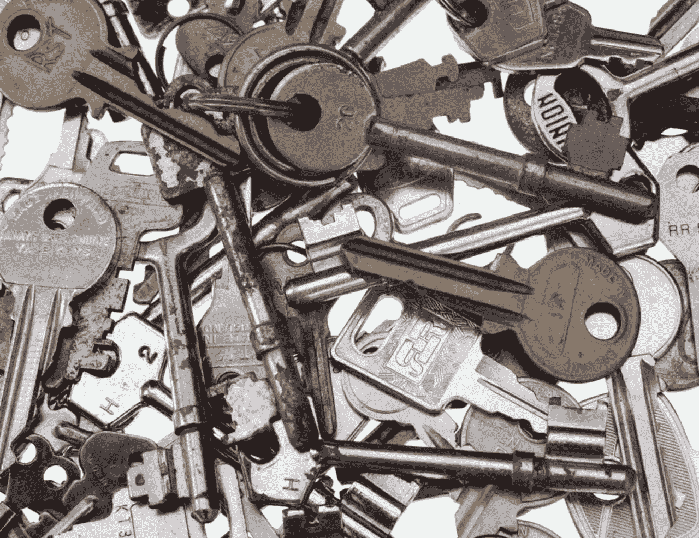

# 比特币的临时用户！你需要了解 8 月 1 日！

> 原文：<https://medium.com/hackernoon/casual-bitcoin-users-you-need-to-know-about-aug-1st-d568e07418cb>

有人告诉你比特币。他们告诉你价格暴涨。他们用了“扰乱”这个词。他们向你展示了如何在手机上安装钱包，以及如何获得一些钱包。这篇文章是关于他们*没有*告诉你或者至少没有足够强调的事情。

他们可能没有告诉你比特币地址和银行账户有多大区别。你看，在比特币*中，你要*负责。为了一切。与银行相比，几乎没有法律保护你的比特币，你的钱包提供商也不可信。你能信任的是协议。代码会做它被设计要做的事情。那么，需要自己审查整个核心代码吗？大概不会。有一些安全的方法来储存你的比特币，这些方法不需要太多的专业技能。基本的经验法则是“你的钥匙——你的比特币”。不是你的钥匙——不是你的比特币”。通过访问 bitaddress.org 这样的网站，离线生成并打印一个地址，并在再次上线之前清除浏览器的缓存，就可以轻松建立一个安全的纸质钱包。或者你可以买一个硬件钱包。

那么，2017 年 8 月 1 日会发生什么呢？

基本情况是，大多数比特币节点将试图迫使矿工实施一项名为 BIP148 的协议升级提案。他们将试图这样做，以结束各方在*块大小辩论*中的僵局，这场辩论在过去一年左右的时间里阻碍了比特币的发展。因此，交易费用现在非常高。这可能会以几种不同的方式出现，但基本上你主要关心的应该是分叉后可能出现的链分裂。链分裂将导致两个不同的令牌。去年以太坊发生了这种情况，其他加密货币也发生了这种情况。

如果你*不*在链分裂期间控制你的钥匙，三个主要的事情可能发生:

1.  你的比特币余额将保持不变，你将能够像往常一样使用*比特币代币。*
2.  由于你的钱包选择了错误的链，你的比特币余额一夜之间将为零
3.  您的钱包提供商将为您提供一个机会，让您在两条链上保持代币余额，或者选择其中一条链

如果你*确实*控制你的钥匙，你*将*在两条链上有相同的余额，你*将*能够用一条交易另一条，有效地增加你的比特币总余额。然而，在链分裂的情况下，比特币很有可能会失去价值。不管怎样，你最好知道自己在做什么，而在比特币中，这是无法作假的。现在继续自学吧！Google BIP148，隔离见证，冷藏，软叉硬叉！你的驴子命悬一线！

> [黑客中午](http://bit.ly/Hackernoon)是黑客如何开始他们的下午。我们是 [@AMI](http://bit.ly/atAMIatAMI) 家庭的一员。我们现在[接受投稿](http://bit.ly/hackernoonsubmission)，并乐意[讨论广告&赞助](mailto:partners@amipublications.com)机会。
> 
> 如果你喜欢这个故事，我们推荐你阅读我们的[最新科技故事](http://bit.ly/hackernoonlatestt)和[趋势科技故事](https://hackernoon.com/trending)。直到下一次，不要把世界的现实想当然！

