# Java 开发人员的变形

> 原文：<https://medium.com/hackernoon/catamorphisms-for-java-developers-e3cc10b43d03>

在本文中，我们将深入探讨一个有用的概念，即 catamorphism，它在函数式语言中很常用，但在 [Java](https://hackernoon.com/tagged/java) 中却很少见。变形很容易实现，通常只需要几行 Java 代码。这几行代码为您的内部 API 增加了巨大的能力，有效地引入了编译器强制的、详尽的结构模式匹配，这种匹配可以消除通过复杂的 if / then / else 意面代码潜入的令人沮丧且难以阻止的错误。

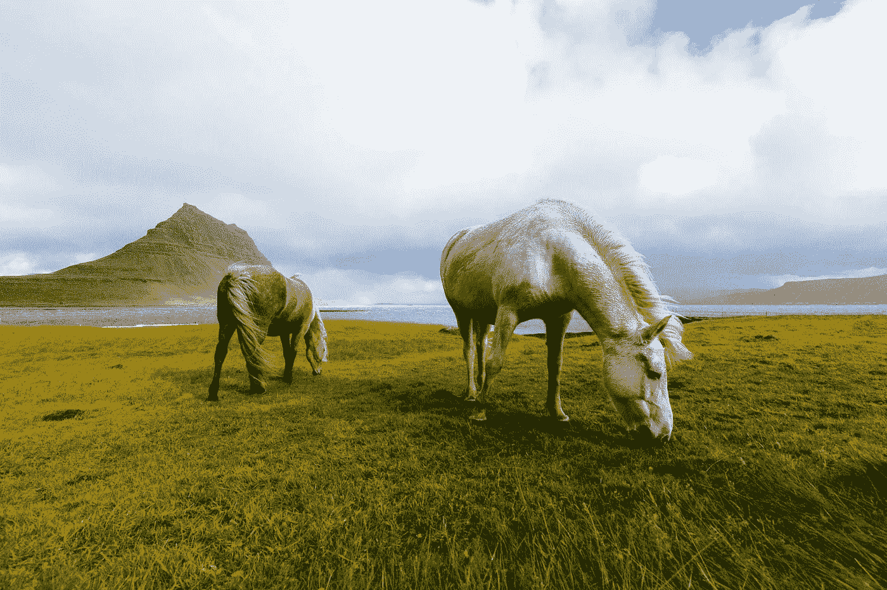

Photo by [James McGill](http://unsplash.com/photos/kMU_2u2Ap2g?utm_source=unsplash&utm_medium=referral&utm_content=creditCopyText) on [Unsplash](https://unsplash.com/?utm_source=unsplash&utm_medium=referral&utm_content=creditCopyText)

## 简单的概念，复杂的单词

Catamorphism 这个词是由希腊语向下(cata)和转换(morphism)组成的，对于大多数 Java 开发人员来说可能听起来很陌生。T2 维基百科上的定义是

> 在函数式[编程](https://hackernoon.com/tagged/programming)，**中，变形**将列表的折叠推广到任意代数数据类型，这可以被描述为初始代数

对大多数人来说可能是完全难以理解的。这很遗憾，因为变形既是一个非常有用又相当简单的概念，可以用来产生更干净(主观上)和更安全/更少 bug(客观上)的代码。

# Lambda 访问者模式

虽然术语 catamorphism 可能还没有进入主流 Java 词典，但是将 principal 编纂成四人组设计原则已经进入了主流词典。visitor 模式定义了一种实现 catamorphisms 的麻烦而复杂的方式(这可能是它没有被广泛使用的原因)。幸运的是，随着 Java 8 的到来，实现 visitor 模式(以及更一般的 catamorphisms)变得简单多了。

# 可选的同态

当实现一个变形时，目标是以一种安全的、穷尽的方式提供对一个类型的关键结构信息的访问。Java 8 的可选类可以处于两种状态之一

> 呈现(有一些数据)
> 
> 空的(没有数据)

Optional 的变形可以写成两个函数

> *Present:接受可选值的 j.u .函数*
> 
> *Empty:一个 j.u.Supplier，被执行以检索一个值*

catamorphism 的调用者提供了两种函数类型的 lambda(或其他实现),只有其中一个根据状态被选择性地执行。

我们可以简单地如下定义可选的同态

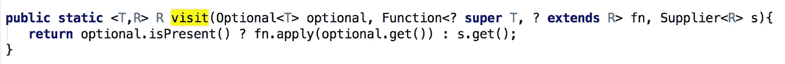

This is the catamorphism implementation for Optional in cyclops-react Optionals companion class

为了使用 catamorphism，我们提供了要处理的可选函数和要执行的函数。在下面的代码中，a 将保存我们的供应商返回的值，b 将保存我们的函数执行的结果(其中输入参数是可选的 10 的值)。

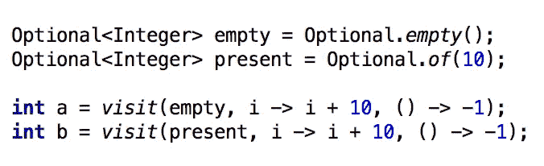

a will be -1, b will be 20

## 可选模式匹配

事实证明，当我们对 Optional 使用 catamorphism 时，我们正在做的事情非常类似于函数式语言(以及像 Scala 这样的双范式语言)中的模式匹配。也就是说，我们正在解构可选实例，并根据其内部状态选择适当的案例/函数来执行。

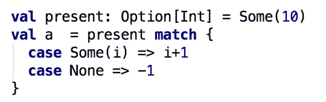

Scala pattern matching code for Option

Scala 模式匹配 on 选项的代码最终非常类似于我们的 visitor/catamorphism Optional 代码。

## 为什么这样好？

Scala 中的模式匹配不仅仅是 Java 的 Switch 语句的更强大版本。Scala 编译器还能够检测开发人员是否已经覆盖了解构的所有可能情况，如果没有，就会发出警告或出错。

类似地，如果 Java 开发人员利用了 catamorphisms，编译器将迫使他们为可选的(或被检查的类型)所有可能的状态提供实现。

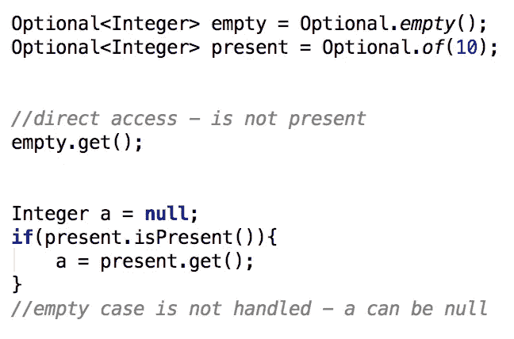

Javac would help us if we used our visit method!

Photo by [Kristopher Roller](http://unsplash.com/photos/PC_lbSSxCZE?utm_source=unsplash&utm_medium=referral&utm_content=creditCopyText) on [Unsplash](https://unsplash.com/?utm_source=unsplash&utm_medium=referral&utm_content=creditCopyText)

# 吸气剂破坏封装

Scala 有 case 类的概念。Case 类是非常简单的类，具有可以非常简洁地定义的不可变字段。

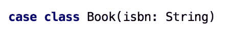

我们可以在 Java 中定义一个类似的类，虽然稍微大一点，但也非常清楚编译后的类的实际结构。

然而，一旦创建，用法是非常相似的

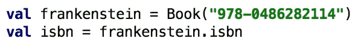

Scala case class usage

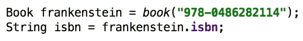

Java case class usage

除了一点之外，由于 Book 缺少 catamorphism Java 实现，我们可以在 Scala 中进行模式匹配，但不能在 Java 中进行

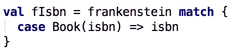

但是这很容易解决

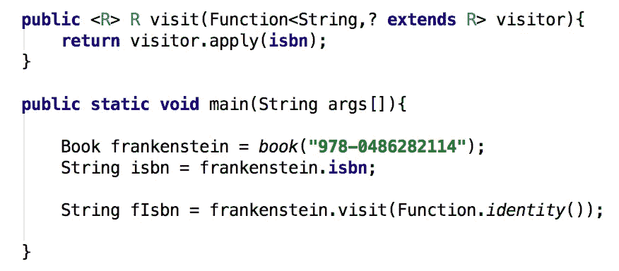

在 Java 中，我们现在有了一个额外的选项，使我们的 case 类成员成为私有的，并通过 catamorphism 强制所有的访问。这样做对于一个简单的类(比如我们书中的例子)的好处是很小的，但是正如我们所看到的，对于 Optional 来说，即使是一点点额外的复杂性也意味着错误会开始渗入我们的代码库。让我们通过引入书籍的两个新子类——小说和非小说来看看这一点。

## 小说或非小说

我们可以重构我们的 Book 类，做一些改动

1.  我们使 Book 成为一个抽象类，因为我们现在有两种具体类型(小说和非小说)
2.  我们定义了两个子类型(小说和非小说)
3.  我们将所有字段都设为私有(以保持使用我们的 Book 实例的代码简单！)

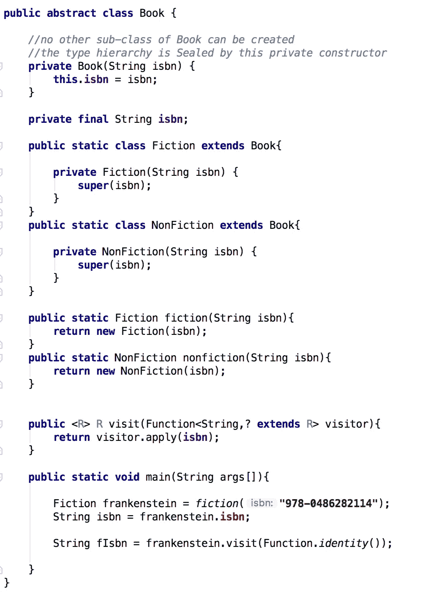

这个类别有几个值得注意的属性，唯一可以定义的具体书籍类型是小说和非小说。这是由私有构造函数强制执行的。此外，对我们的 Book 实例的内部状态或结构的所有访问都是通过我们最初的 catamorphism 来控制的。

## 我们如何区别对待小说和非小说

现在我们有两种类型的书，我们可能会尝试通过传统的 Java if / then / else 语句来处理它们。

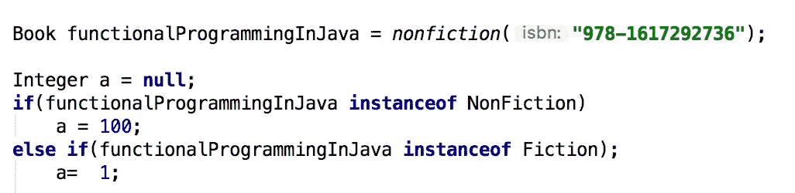

Even for such a relatively trivial example, if / then / else can cause bugs : note the semicolon! a is alway 1

一个更好的方法是定义另一个 catamorphism，它覆盖可能的书籍类型。除了我们接受两个单参数函数之外，这个函数的实现看起来很像我们的 Optional 函数的实现。一个接收虚构的实例，另一个接收非虚构的实例。

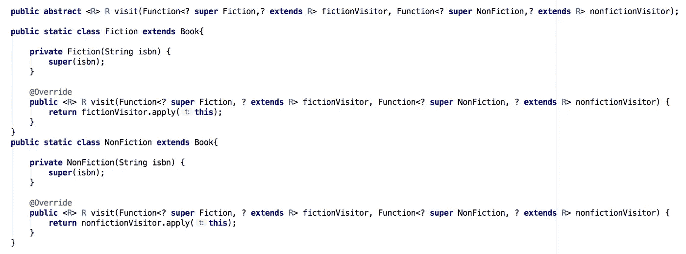

catamorphism over Book type

我们可以将错误的 if / then / else 语句重写为更加安全的语句

## or(或 Xor)型的同态

我们刚刚为一本既可以是小说也可以是非小说的书推导出了变形。这可以被概括为可以是两个其他类型之一的类型(例如，类型 T1、类型 T2)。表示这一点的常见数据结构是两者之一类型。(cyclops-react 提供了懒惰的&反应式实现，可以选择多达 5 个选项，并提供了一个名为 Xor——eXclusive or 的数据结构的热切版本)。就像当一个字段可以为空时，我们如何使用 Optional，而不是一致地重新实现来表示继承层次，我们可以利用现有的数据结构。

我们可以重构我们的 Book 类来使用这两者之一

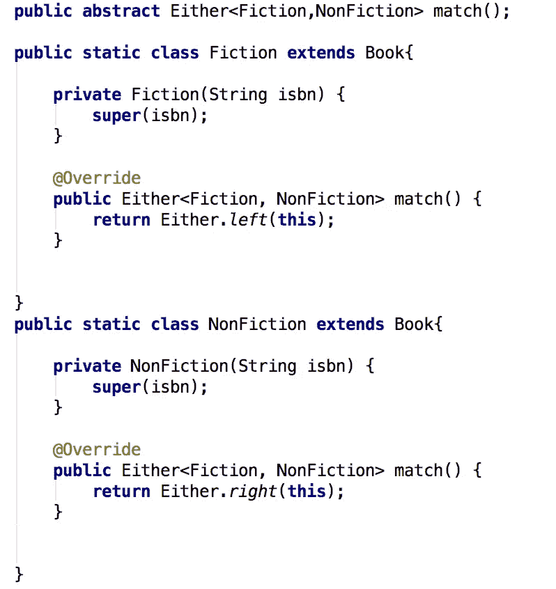

对于书籍类型的模式匹配，我们可以使用匹配方法

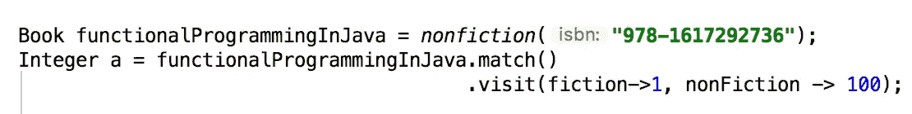

# 列表的同态

当列表在函数中实现时，它们通常是按照头和尾来构造的(递归)

> 标题:第一个值
> 
> Tail:包含头部和尾部的列表

列表的变形由一个双参数函数(或双函数)组成，它接受列表的第一个值和尾部(列表的其余部分)。我们可以在 cyclops-react 中使用扩展列表类型(ListX)轻松实现这一点。ListX 可以包装任何标准的 j.u.List，并增加了许多有用的功能。即使 j . u . list(通常)不是按照头部和尾部实现的，我们也可以抽象地(或虚拟地)这样表示它们，并且我们的简单同态仍然可以应用。

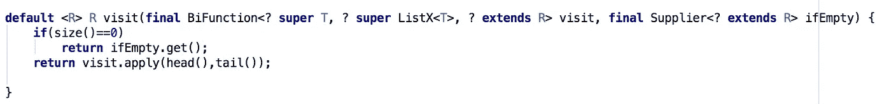

使用 Scala 模式匹配，我们可以通过添加头部和递归处理尾部，将一个字符串列表折叠(或缩减)成一个字符串。

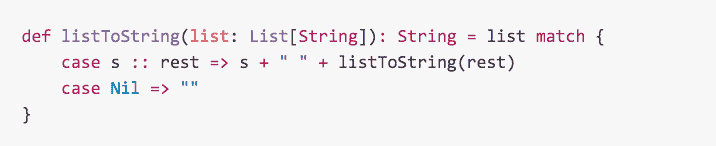

在 Java 中，我们可以用列表变形做同样的事情

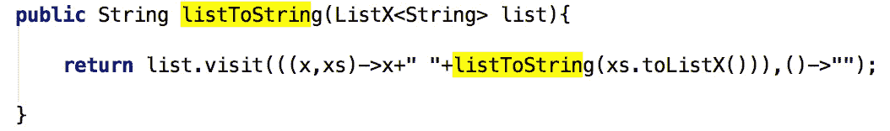

# 实现自己的变形

在本文中，我们展示了为一个核心 Java 8 类型(可选的)实现 catamorphism(或模式匹配)是多么简单。然后通过一个工作实例，我们用 Java 实现了一个非常简单的 Case 类，它有自己的变形。我们展示了如何通过实现*或者*类型的变形来简化 Java 中继承层次的工作。最后，我们实现了 j.u.List 的函数式变形，尽管它没有公开头和尾的简单递归数据结构。

所有这些变形都是用 3 行或更少的代码实现的，但是它们允许我们在我们为其创建的类型的结构的重要方面进行模式匹配。您也可以在自己的代码库中这样做。

下次你发现自己在纠结一个复杂的 if / then/ else 序列或 case 语句时，问问这是否可以以某种方式简化，几乎可以肯定的是，你的对象结构中有一些东西可以指导你创建简单的变形，这将提高你的代码的健壮性。