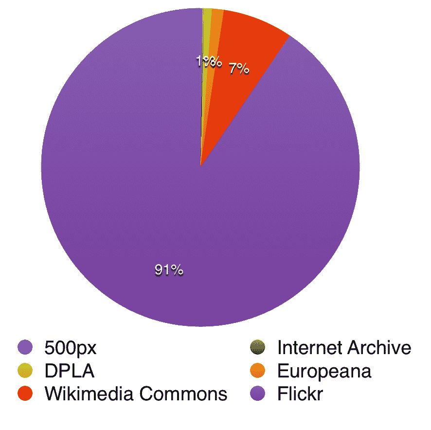

# CC 搜索开发者笔记和反思

> 原文：<https://medium.com/hackernoon/cc-search-developer-notes-and-reflection-418271194682>

由[丽莎·戴利](https://medium.com/u/a0a2769b965e?source=post_page-----418271194682--------------------------------)

2016 年 7 月，我加入了知识共享团队，为 CC Search 研究和构建一个概念验证:一扇通向开放许可内容世界的大门。作为这项工作的一部分，我需要推荐一种技术方法，吸收数百万的作品，并构建一个健壮的工作原型，该原型可以引发公众讨论，并为未来的增强指明方向，最终实现一个完全实现的愿景。

CC 估计共有 11 亿部作品，包括 CC 许可的材料和公共领域。其中一半被认为是图像，由选择 CC 许可的艺术家和选择无限制发布公共领域材料的文化机构提供。剩余的 5 亿件作品包括其他创意媒体，如视频和音乐，以及越来越多的 CC 许可的研究、教育材料和全新类型的作品，如 3D 建模数据。

# 项目范围

我参与的期限是七个月，包括范围界定、研究、产品构建和公开发布。CC 是一个资源有限的小组织。我得到了 Rob Myers——CC 的开发人员和技术主管——的慷慨帮助，以及组织中许多人的战略投入，但除此之外，这只是一个开发团队。

尽管存在这一制约因素，但如果该项目不能充分反映总体目标的规模，它就不是一个现实的概念证明。这意味着我们需要对足够的内容进行操作，以反映公共资源的广度和多样性，同时避免不必要的开销，这些开销会削弱我们快速迭代的能力。

我们的目标是代表 1%的已知公地，但是可以选择哪 1%的公地:

*   选择一个跨越媒体类型的*水平*切片，探索可以处理图像、音频、视频和文本的搜索界面。
*   选择一个*垂直*切片一个媒体类型，充分探索一个专门构建的界面，代表一种类型，但许多供应商。

图像占了整个公共领域的一半，但却代表了一组不同的材料——我们仍然需要回答搜索(例如)当代照片和博物馆藏品的图像意味着什么。仅 Flickr 就拥有超过 3.5 亿张公开授权的图片，其不确定的未来增加了紧迫性。最后，图像自然有助于通过网络界面进行探索；对于其他一些媒体类型来说，这就不那么真实了。出于这些原因，我们决定 CC 搜索的第一次公开迭代将由大约 1000 万张图像组成，并且只有图像。

# 内容合作伙伴选择

在选择了图片之后，我着眼于潜在的内容合作伙伴，他们拥有大量开放的收藏和 API，可以用于发现和获取。我们的候选名单包括:

**供应商名称和预计时间。开放工程数量**

纽约公共图书馆 18 万

大都会艺术博物馆 20 万

国立博物馆 50 万英镑

500 像素 800，000

互联网档案 100 万

DPLA 三百万

欧洲 a

维基共享 3500 万

Flickr 亿

(这些数字只是一阶近似值，有很多重叠之处:Europeana 包括 Rijksmuseum 和许多属于 Flickr Commons 的公共领域作品；许多摄影师同时发布到 500px 和 Flickr。)

有几个标准需要考虑:

*   API 的易用性如何？(或者是否有大量可用的来源？)
*   图像的整体质量如何？
*   当提供者包括公开和传统许可的材料时，我们能有多可靠地识别公开许可的图像？

最后一点对这个项目至关重要。虽然我们不能对不受我们控制的材料做出法律声明，但作为一个官方的知识共享项目，我们应该努力确保我们提供的供重用的内容确实是公开许可的。(这条指导方针让我们拒绝了其他商业摄影提供商，他们似乎没有太多监督就转贴或回收版权材料。)

我们还需要考虑每个提供商的相对代表性:

显然,“代表性样本”必须不成比例地来自 Flickr，但是为了支持我们呈现多样化材料的目标，我们还需要确保我们设计的界面能够显示非照片，或者允许用户深入特定的提供商。

不幸的是，我们不得不推迟一些我们可能想包括的提供商:

*   代表了重要材料的丰富资源，但是不提供权威地识别材料的许可的机制。可以手动浏览打开的收藏库，但是不能通过 API 编程。许多图书馆在特定的限制下提供对资源的访问，这些限制并不完全属于知识共享或公共领域。
*   Wikimedia Commons 代表了一个[大而丰富的材料库](https://commons.wikimedia.org/wiki/Special:Statistics)，但是权利信息目前还没有良好的结构。维基媒体基金会最近宣布，来自斯隆基金会的[300 万美元赠款将用于解决这个问题，但这项工作才刚刚开始。](https://blog.wikimedia.org/2017/01/09/sloan-foundation-structured-data/)

最后，我们选择了这些提供商，因为它们代表了最好的“性价比”，并且紧密结合了公共资源的整体代表性:

500 像素×50，000

Flickr 万

纽约公共图书馆 168000

国立博物馆 59，000

大都会艺术博物馆 20 万

(确切数字可能会不时变化)

为了让非 Flickr 作品浮出水面，我们开发了过滤工具，让你可以根据一般的作品类型(照片或文化作品)或特定的提供商进行挖掘。这是一个不完美的衡量标准:Flickr 上有文化作品，博物馆里也有照片，但这是最简单的解决问题的方法。

# 技术考虑

## 托管和服务架构

CC 搜索的目的是让资料更容易被发现，而不管它存放在哪里。出于这个原因(也是为了明显的成本节约目标)，我们决定只托管图像*元数据*——标题、创建者姓名、任何已知的标签或描述——并直接链接到图像显示和下载提供商。其结果是 CC 搜索仅包括当前在网络上可用的图像；CC 本身不收集或存档任何图像。

因为整体架构预计会发展(并大幅增长！)，自然会选择云托管基础架构。我对谷歌云和 AWS 做了成本分析，它们的净值大致相同。我选择 AWS 主要是因为它提供了更大的套件，而且未来的开发者可能会比谷歌的云更熟悉它。在项目开始时，我估计每月的总托管成本为 1，000 美元，完全在现有的项目预算范围内。(原型构建完成后，我们对所需的规模和组件有了更好的了解，我委托一位经验丰富的 IT 管理员准备了另一轮评估。这些估计接近 1400 美元/月，我认为这是一个相对良性的增长范围，仍然在预算之内。)

## 软件架构元目标

我在 CC Search 的角色是暂时的:我写的代码要么被扔掉，要么被其他工程师改进。虽然这个项目是一个原型，但我们都知道 MVP 倾向于成为产品代码。如果整个代码库最终被替换掉，我会很高兴，因为它已经达到了促进计划和浮现用例的目的，但是我需要在这样的假设下操作，即这些代码可能会存在很多年。出于这些原因，我在这些自我强加的准则下工作:

*   显而易见胜过晦涩难懂:如果有一个众所周知的 X 特性工具或库，那么使用它而不是一个可能更好但不太为人所知的工具或库。
*   编写一个全面的测试套件，即使在不断变化的条件下。我认为最好的技术文档是一套好的测试用例，列举出应用程序应该做的一切。良好的测试覆盖率还允许新开发人员在没有完全理解整个应用程序的情况下进行更改——我将应用程序配置为持续集成测试，因此他们会立即知道他们是否破坏了某些东西。
*   为安全性和代码卫生提供良好的基础。CC 喜欢尽量公开操作；这为正确做事提供了强大的压力。
*   尽可能减少移动部件的数量:即使在最好的情况下，技术交接也是困难的。新开发人员入职所需的手动步骤越少，整体过渡就越好。

# 区块链怎么样？

这个项目的一个长期目标是不仅促进搜索和发现，而且促进重用和“感恩”一个关于开放许可的常见抱怨是——无论是创造性作品还是软件代码——为公共资源做贡献可能是一件吃力不讨好的事情。消费者总是比贡献者多，而且没有一个开放的网络可以和脸书的“赞”相提并论

重用循环的本质可以暗示一种区块链架构:如果我创建照片 A，而你将其修改为照片 B，那么这两者之间存在一种有序的关系，这种关系最好记录下来并呈现出来。虽然大多数重用行为都是非商业性的，但事实并非如此，基于区块链的系统也可以用来以分布式方式记录许可交易。

话虽如此，我们选择不在第一次迭代中使用基于区块链的，原因如下:

*   我个人对该技术没有经验，所以在我们 7 个月的时间内跟上速度(尤其是快速发展的技术)将是一个挑战。
*   这违反了“显而易见胜于晦涩难懂”的原则——我不仅要注册学习一项实验性技术，我们还要迫使未来的团队接受这种限制。
*   CC Search 的第一次迭代专注于搜索和发现端，而不是围绕衍生作品的用例，因此区块链的长期好处在第一次发布中不会很明显。

# 语言和框架

CC 现有的 web 服务使用多种语言——Ruby、Python 和 PHP——任何集成都将在 web 服务层进行，所以我选择使用 Python 仅仅是因为我自己对它很熟悉。随着原型的发展，我们决定在策展和个性化方面为公众打开一扇吸引人的大门。由于其专门的维护团队和频繁的补丁管理，我选择 Django 作为 web 框架。

当然，CC 搜索主要是搜索。我选择 Elasticsearch 而不是 Solr 或其他搜索引擎选项，主要是因为 AWS 的 Elasticsearch 即服务的可用性。CC Search 目前还不是一个特别复杂的搜索应用程序；图像元数据相对简单，当处理来自不同提供商的异构内容集时，人们倾向于采用最小公分母方法—我们的搜索只能与最弱的数据源一样丰富。这里有很多需要改进的地方。

最后，我选择 Postgres(通过 AWS 的 RDS 数据库服务)而不是 MySQL，因为它支持 JSON 和数组数据类型。MongoDB 和其他 NoSQL 解决方案由于其流动性和可伸缩性而具有吸引力，但从来不是一个强有力的竞争者——我觉得我们已经通过 Elasticsearch 获得了文档数据库的许多好处，无论如何，Django 失去了关系数据库后端的大部分价值。有了存储和查询任意 JSON 的能力，我觉得 Postgres 在结构和灵活性之间取得了很好的平衡。

CC 搜索确实有前端组件，但相对有限。因为 CC Search 针对的是最新的浏览器，所以我决定放弃任何特定的框架——甚至是 jQuery——尽管我确实使用了 ES6 语法，因为它简洁明了。这需要一些工具和构建步骤，可能会违背我的“显而易见胜过晦涩难懂”的要求，但是我认为 ES6 是未来 JS 开发的更好的基础。虽然不如 Python 套件全面，但我也建立了 JS 级别的单元测试。

# 隐私和减轻伤害

所有的产品开发人员都需要问自己，他们正在做什么来最大限度地减少隐私问题，并认真考虑他们的应用程序可能会被滥用。在收集最少量的用户数据这个问题上，我得到了 CC 团队极好的支持和反馈:足够实际操作一个包含个性化的网站，但仅此而已。与一个非常关心用户安全和隐私的组织合作是一件愉快的事情。我们可能没有做到完全正确，但审查最终产品以确定潜在的隐私和滥用载体是显而易见的。

# 未来的工作

我们有很多想做的事情暂时推迟了，或者会根据用户反馈重新考虑:

*   包括更多的内容和更多的内容合作伙伴 Europeana 收藏的全部内容、DPLA 的精选子集以及 Flickr Commons 的更大子集将是显而易见的方向。
*   允许用户自定义共享列表的更多工具
*   允许用户从他们自己的策划材料中进行搜索
*   提供允许可信用户将元数据推回到集合中的机制，为每个人丰富归档
*   更多引人入胜的搜索工具— [按颜色搜索](https://github.com/creativecommons/open-ledger/issues/115)、[深入标签](https://github.com/creativecommons/open-ledger/issues/94)、[搜索公共列表](https://github.com/creativecommons/open-ledger/issues/61)

我们希望听到您的反馈和建议！请将想法和意见发送到我们的[反馈表](https://docs.google.com/forms/d/1Z_lwUoiTRBw-fr4wQVDZBSq8-T2kr93XezOEU-ISHBU/edit)，并将错误和问题报告给我们的[公共问题跟踪器](https://github.com/creativecommons/open-ledger/issues)。

> [黑客中午](http://bit.ly/Hackernoon)是黑客如何开始他们的下午。我们是阿妹家庭的一员。我们现在[接受投稿](http://bit.ly/hackernoonsubmission)并乐意[讨论广告&赞助](mailto:partners@amipublications.com)机会。
> 
> 如果你喜欢这个故事，我们推荐你阅读我们的[最新科技故事](http://bit.ly/hackernoonlatestt)和[趋势科技故事](https://hackernoon.com/trending)。直到下一次，不要把世界的现实想当然！

