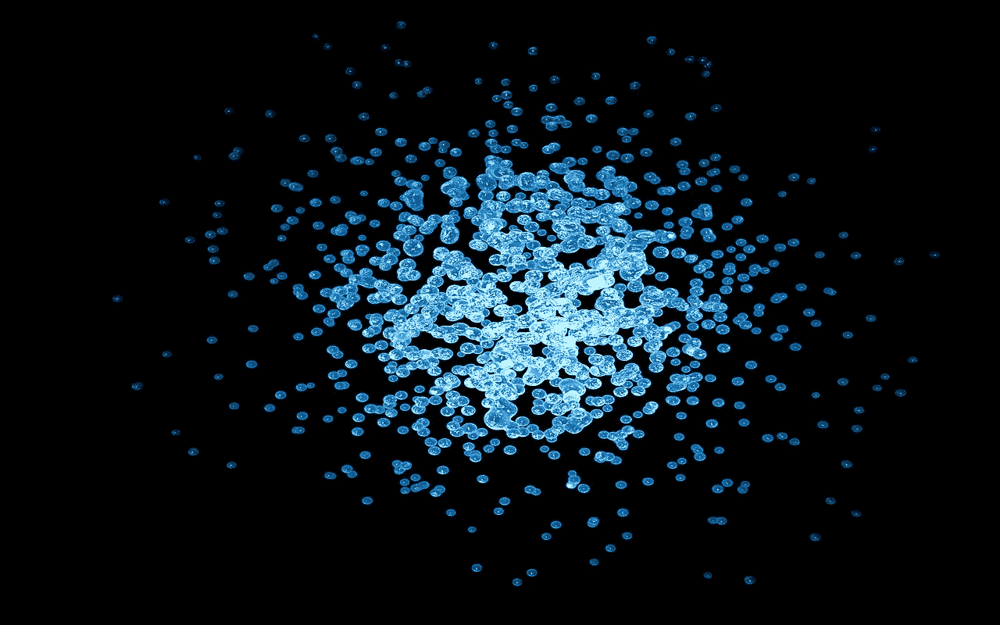

# CCleaner 妥协了，你的电脑可能被感染了

> 原文：<https://medium.com/hackernoon/ccleaner-compromised-your-computer-could-be-infected-c772ebd69d4f>

来自思科 Talos [的一组研究人员最近报告](http://blog.talosintelligence.com/2017/09/avast-distributes-malware.html)称，8 月至 9 月期间可供下载的 CCleaner App v5.33 带有 Floxif 恶意软件。

Floxif 恶意软件收集计算机名称、安装的软件等信息，并将其发送回黑客的服务器。这也有能力下载和运行其他程序，如键盘记录器。数百万个系统被怀疑受到威胁。

研究人员发现该应用程序正在向可疑的域拨打电话。通常，当应用程序是从不可信的来源下载时，会发生这种情况。但是，在 CCleaner 的情况下，安装程序是从官方网站获得的，并由有效的数字证书签名。这使得情况更加糟糕，因为公司的开发或签约流程似乎受到了影响。

不要惊慌，只需将您的 CCleaner 版本更新到 v5.34。这应该可以解决问题。只有 CCleaner 的 Windows/Cloud 产品受到影响。如果你用的是 macOS，应该没问题。

> 关注哈克农和我([费宾·约翰·詹姆士](https://medium.com/u/75a616711f4e?source=post_page-----c772ebd69d4f--------------------------------))了解更多故事。我还在写一本书，以提高对蓝鲸挑战的认识，蓝鲸挑战已经夺去了几个国家许多青少年的生命。它旨在帮助父母了解黑暗网络的威胁，并采取行动确保他们孩子的安全。《T4 与蓝鲸战斗》这本书可以在亚马逊上预购。该书将于本月 20 日发行。