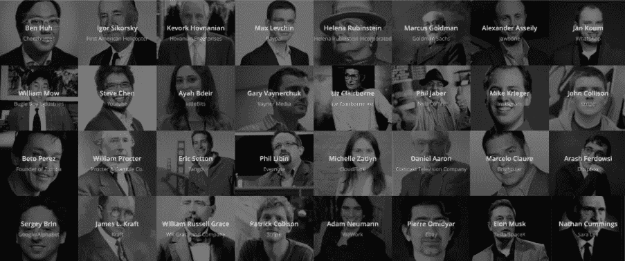
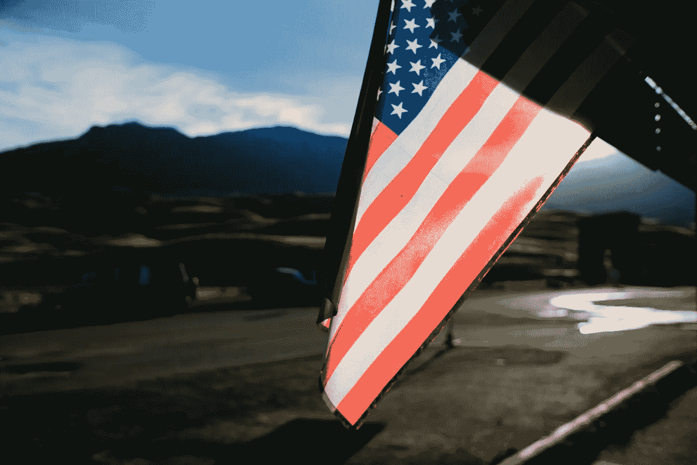

# 庆祝移民创始人

> 原文：<https://medium.com/hackernoon/celebrate-immigrant-founders-5b56b4e12c17>

## 多元化是我们的基因，🇺🇸

## [庆祝移民](http://celebrateimmigrants.us/)

在讲述美国的故事时，你不能不提到移民在塑造我们国家的过程中所发挥的巨大作用。现在，我们比以往任何时候都更必须认识到他们不可思议的贡献，并对我们国家的开放性和多样性心存感激。

开放是人性的核心。这是我们伦理道德的核心。

如果没有移民，我们的国家会更糟。移民是我们的朋友。他们是我们的足球教练、教师、医生、律师、消防员、士兵、作家、艺术家…

对我来说，他们就是我的家人。我父亲大约 20 年前来到这里开始新的生活。美国给了他一次机会。该是我们向所有人展示我们愿意冒险的时候了。

尤其是商界，应该特别感激和认识到这一点。

来自[更新你的经济报道](http://www.renewoureconomy.org/sites/all/themes/pnae/img/new-american-fortune-500-june-2011.pdf)的数据显示了移民对我们经济的重要性:

> **2010 年财富 500 强企业中，超过 40%是由移民或他们的子女创办的。尽管自 1850 年以来，移民平均只占美国人口的 10.5%，但有 90 家由移民创办的财富 500 强公司，占榜单的 18%。如果算上移民子女创办的另外 114 家公司，财富 500 强的份额将超过 40%。**
> 
> 最新的财富 500 强公司更有可能有一位移民创始人。不到 20%的最新财富 500 强公司——那些在 1985 年至 2010 年的 25 年间成立的公司——有一位移民创始人。
> 
> **全球最有价值的 10 个品牌中，有 7 个来自移民或移民子女创办的美国公司。许多美国最伟大的品牌——苹果、谷歌、美国电话电报公司、百威啤酒、高露洁、易贝、通用电气、IBM 和麦当劳，仅举几例——都源于一位移民创始人或移民的子女。**

多样性是我们的基因。这就是我们所知道的美国。

我和我的朋友整理了一份移民创业者的名单。这些人的所作所为真的令人惊叹！

 [## 庆祝移民

### 开放是美国 DNA 的核心。移民是我们的朋友、教练、老师、家人——他们是…

庆祝移民。美国](http://celebrateimmigrants.us/) 

当然，这只是我们一夜之间搜索谷歌所能找到的。我相信还有更多，但这里是一个开始:

*   [阿里安娜·赫芬顿](https://en.wikipedia.org/wiki/Arianna_Huffington)《赫芬顿邮报》
*   [约翰·科利森](https://en.wikipedia.org/wiki/John_Collison)，条纹
*   [帕特里克·科利森](https://patrickcollison.com/)，条纹
*   谢尔盖·布林，谷歌/Alphabet

[*点击推文此列表*](https://twitter.com/intent/tweet/?text=25%25%20of%20Fortune%20500%20Startups%20Are%20Founded%20By%20Immigrants.%20Diversity%20is%20in%20our%20DNA.%20%23celebrateimmigrants&url=http%3A%2F%2Fcelebrateimmigrants.us)

*   [威廉·高露洁](https://en.wikipedia.org/wiki/William_Colgate)，高露洁
*   [加里·维纳查克](https://en.wikipedia.org/wiki/Gary_Vaynerchuk#/media/File:Gary_Vaynerchuk_by_Erik_Kastner.jpg)，韦纳传媒
*   安德鲁·卡内基卡内基钢铁公司
*   [伊丽莎白·雅顿](https://en.wikipedia.org/wiki/Elizabeth_Arden)，伊丽莎白·雅顿公司
*   皮埃尔·奥米迪亚 T21 易趣网
*   [Chamath Palihapitiya](https://en.wikipedia.org/wiki/Chamath_Palihapitiya) ，社会资本
*   [简·库姆](https://en.wikipedia.org/wiki/Jan_Koum)，WhatsApp
*   桑杰·梅赫罗特拉
*   天纵，佐拉
*   [埃隆·马斯克](https://en.wikipedia.org/wiki/Elon_Musk)，特斯拉/SpaceX
*   亚历山大·阿塞利，颚骨
*   托默伦敦，兴致勃勃
*   亚当·诺伊曼
*   迪拉杰·拉贾拉姆
*   雷诺面容，Eventbrite
*   [米歇尔·扎特琳](https://www.linkedin.com/in/michellezatlyn)，云闪
*   [阿拉什·菲尔多西](https://en.wikipedia.org/wiki/Arash_Ferdowsi)，Dropbox
*   肖恩·拉德，火绒
*   伊克拉姆·马格东-伊斯梅尔，文莫
*   [雷诺·拉普兰什](https://en.wikipedia.org/wiki/Renaud_Laplanche)，借贷俱乐部
*   彼得·魏玛什
*   菲尔·贾伯，菲尔兹咖啡
*   麦克斯·拉夫琴，贝宝
*   迈克·克里格
*   克里斯蒂安·乔戈，Tidemark
*   詹姆斯·l·克拉夫特
*   丹尼尔·阿伦康卡斯特电视台
*   英特尔公司的安德鲁·格罗夫
*   [杨致远](https://en.wikipedia.org/wiki/Jerry_Yang)，雅虎
*   [马库斯高盛](http://researchpedia.info/marcus-goldman-founder-of-the-goldman-sachs/)，高盛
*   [塞缪尔·萨克斯](https://en.wikipedia.org/wiki/Samuel_Sachs)，高盛
*   第一资本金融公司的奈杰尔·莫里斯
*   安德鲁·维特比，高通公司。
*   约翰·w·诺德斯特龙
*   [威廉·拉塞尔·格雷斯](https://en.wikipedia.org/wiki/William_Russell_Grace)，WR·格雷斯公司
*   [亚历山大·格雷厄姆·贝尔](https://en.wikipedia.org/wiki/Alexander_Graham_Bell)，在& T
*   [麦克斯韦·科尔](https://en.wikipedia.org/wiki/Kohl%27s)，美国柯尔百货公司
*   利兹·克莱尔本公司
*   科沃克·霍夫尼安，霍夫尼安企业
*   [金正](https://en.wikipedia.org/wiki/Jeong_H._Kim)，尤里系统
*   号角男孩工业公司的威廉·莫
*   内森·卡明斯，李丽蕊
*   杜邦公司
*   [查尔斯·辉瑞](https://en.wikipedia.org/wiki/Charles_Pfizer)，辉瑞
*   威廉·普罗克特，宝洁公司
*   宝洁公司的詹姆斯·甘布尔
*   [维诺德·科斯拉](https://en.wikipedia.org/wiki/Vinod_Khosla)，太阳微系统公司
*   安迪·贝克托什姆，太阳微系统公司
*   K.R .斯里达尔能源公司
*   拉吉·托马斯，斯普林克尔
*   埃里克·塞顿《探戈》
*   马里奥施洛瑟奥斯卡健康
*   诺巴·阿费延，焦耳无限制
*   [伊戈尔·西科斯基](https://en.wikipedia.org/wiki/Igor_Sikorsky)，直升机
*   本·哈，奇兹堡
*   [Ayah Bdeir](https://en.wikipedia.org/wiki/Ayah_Bdeir) ，小比特
*   [菲尔·利宾](https://en.wikipedia.org/wiki/Phil_Libin)，Evernote
*   海伦娜·鲁宾斯坦公司
*   [王嘉廉](https://en.wikipedia.org/wiki/Charles_Wang)，电脑同仁
*   陈士骏，Youtube
*   尊巴的创始人贝托·佩雷兹
*   金铃子的马塞洛·克莱尔

这个列表可能要长 10 倍。20 年后，应该是现在的 100 倍。让我们确保美国的政策不会改变这一点。大声说出来，坚持你的信仰。

> 保持灵感！一如既往，如果您有任何问题，请随时联系我们！
> 
> 你可以在乔丹·戈宁或推特上找到我

> 黑客中午是黑客如何开始他们的下午。我们是这个家庭的一员。我们现在[接受投稿](http://bit.ly/hackernoonsubmission)并乐意[讨论广告&赞助](mailto:partners@amipublications.com)机会。
> 
> 如果你喜欢这个故事，我们推荐你阅读我们的[最新科技故事](http://bit.ly/hackernoonlatestt)和[趋势科技故事](https://hackernoon.com/trending)。直到下一次，不要把世界的现实想当然！

