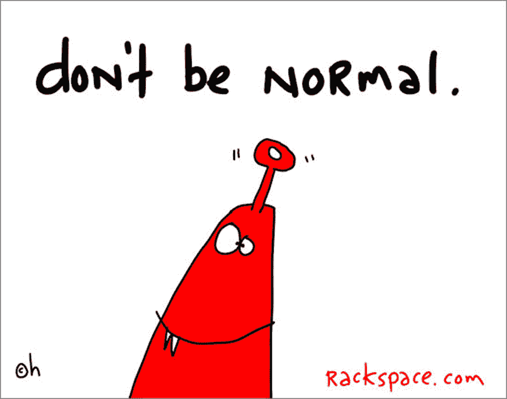

# 庆祝以色列的另一个独角兽经济…

> 原文：<https://medium.com/hackernoon/celebrating-israel-s-other-unicorn-economy-56d24cdce734>

在我结束与 Rackspace 的合作以及担任[驻以色列品牌大使的不可思议的经历的时候，我一直在回想我从有机会与团队、导师见面和交谈中学到的东西，尤其是倾听近 1000 家初创公司的故事、希望和梦想。](http://www.alanweinkrantz.com)

Racksapce art by Gapingvoid

当你在接下来的 16 个月里非常专注于做一件事时，你不仅擅长做这件事，你还能看到模式。从这些模式中可以学到一些东西。从教训中有惊喜。

经常有人问我“最酷的公司是哪家？”"谁有可能改变世界的东西？"“有哪家公司在一个没人认为他们能搞清楚的领域做到了这一点？”

虽然我确实遇到过许多有趣和引人注目的公司，但我通常忽略“公司”，而关注人。我更感兴趣的是，是什么驱使人们去做他们所做的事情，他们为什么这样做，以及他们创业的灵感来自哪里。

在以色列，你不仅会遇到来自这里的以色列人，还会遇到来自世界各地的人，他们出于各种原因，决定在这里生活和谋生。

有些人是因为宗教原因而来。

其他人来是因为他们在旅行中遇到了某个人并留了下来。

其他人在这里有家人，一些人在这里生活和居住，保持他们的联系，可能在其他地方有另一个住所。在我在这里的 16 个月中，我也遇到了许多来自法国的人，他们因为那里的局势而决定离开，并决定加入以色列正在见证的法国移民潮。

众所周知，以色列是一个很酷的地方。全球媒体报道所有正在进行的惊人投资，正在创造的惊人出口和财富，这些都使企业家回到生态系统，不仅重新投资他们的钱，更重要的是，他们的时间，爱和专业知识，再次做一些惊人的事情——而且是在这里做。

*Geektime* 刚刚发布了他们关于以色列创业公司和风险投资的 [2015 年年度报告](http://l.facebook.com/l.php?u=http%3A%2F%2Fwww.geektime.com%2F2016%2F01%2F11%2Fannual-report-2015-startups-and-venture-capital-in-israel%2F&h=MAQFashVh&s=1)，我们的 Crowd 在本周早些时候发布了一篇关于投资民主化的[文章，突出了他们在以色列的许多投资。](http://l.facebook.com/l.php?u=http%3A%2F%2Fblog.ourcrowd.com%2Findex.php%2F2016%2F01%2F13%2Fthe-democratization-of-investing-ourcrowds-2015-year-in-review-infographic%2F&h=hAQFeezox&s=1)

虽然我很高兴成为这个令人难以置信的生态系统的一部分，虽然看到历史在我们眼前展开真的令人惊叹，但我认为我们经常错过我所说的“以色列的另一个独角兽经济”，即成千上万的小型企业，有时是生活方式的企业，它们可能永远不会看到退出或 IPO 的曙光，但却为其所有者和员工提供了不错的收入和生活水平。

2016 年，我们有 500 家创业公司，Barclays / Techstars 和 MassChallenge 项目都在这里扩大规模。随着这些计划的扩展，您将会听到更多关于它们的信息。

在光谱的另一端，我认为更重要的是，我邀请您关注分别位于 Gush Etzion、Bet Shemesh 和 Modi'in 的 [Hub Etzion](https://www.facebook.com/HubEtzion/?fref=ts) 、 [SUBS](https://www.facebook.com/subshq/) 和 [MESH](https://www.facebook.com/modiinhub/?fref=ts) 。看看 [Presentense](https://www.facebook.com/presentenseisrael/?fref=ts) 是如何帮助这个国家的边缘社区拥抱企业家精神的。通过[拿撒勒商业孵化中心](https://www.facebook.com/NBICNazTech/?fref=ts)组织的项目，关注在阿拉伯-以色列生态系统中拿撒勒发生的事情。

这些项目让创业变得更加容易和真实。它们提供了“真正工作”之外的另一种选择，而且不仅仅是为了钱，它们让人们能够互相帮助取得成功。

如果让我选择一个十亿美元的出口，或者一千个年收入一百万美元的小企业，我会选择后者一整天。

算算吧。

总计十亿美元。

没错，是独角兽。

而且传播的又广又深。

让我们纪念和庆祝这些伟大的胜利。

但我们不要忽视另一个独角兽经济:数以千计的小企业正在利用我们集体智慧、意志和动力的力量，它们不仅为国家提供了知识和资本财富，也为世界其他地区树立了榜样。

> [黑客中午](http://bit.ly/Hackernoon)是黑客如何开始他们的下午。我们是 [@AMI](http://bit.ly/atAMIatAMI) 家庭的一员。我们现在[接受投稿](http://bit.ly/hackernoonsubmission)，并乐意[讨论广告&赞助](mailto:partners@amipublications.com)机会。
> 
> 如果你喜欢这个故事，我们推荐你阅读我们的[最新科技故事](http://bit.ly/hackernoonlatestt)和[趋势科技故事](https://hackernoon.com/trending)。直到下一次，不要把世界的现实想当然！

