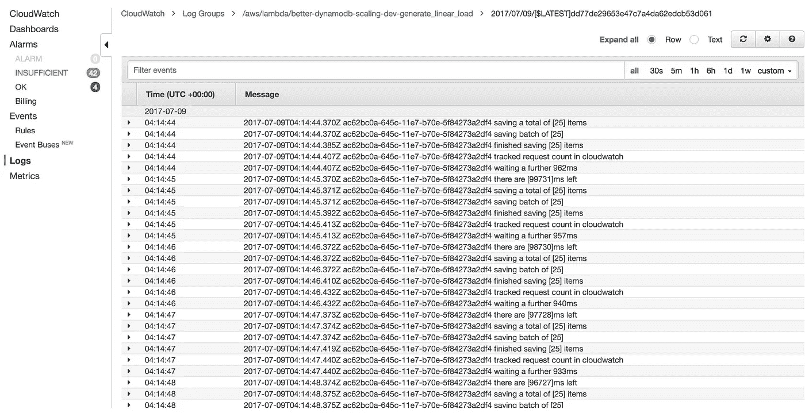
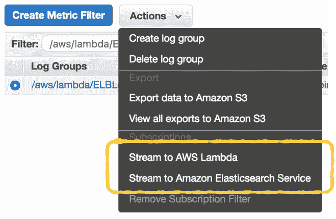
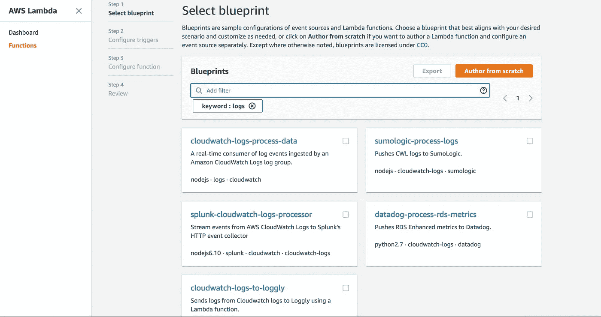
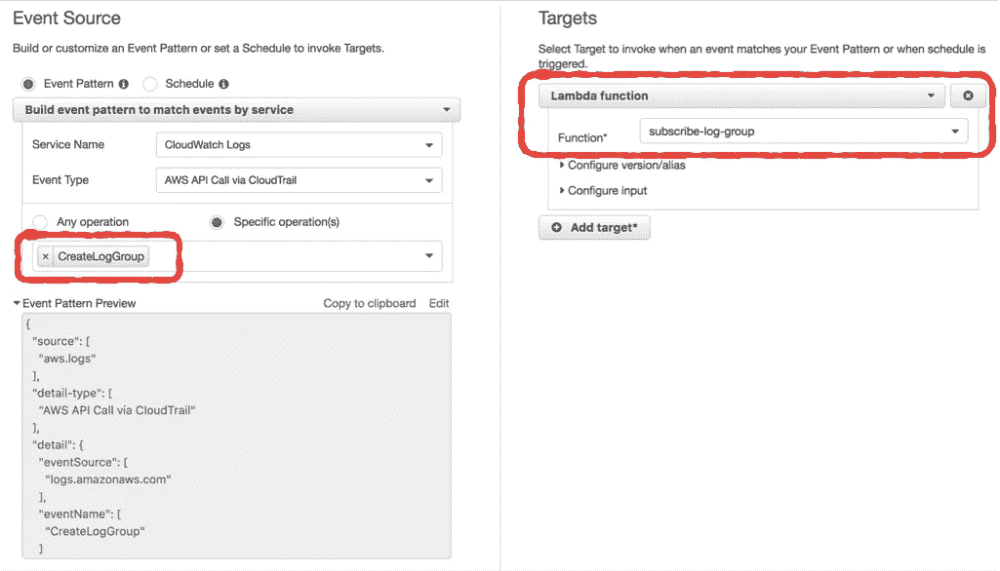
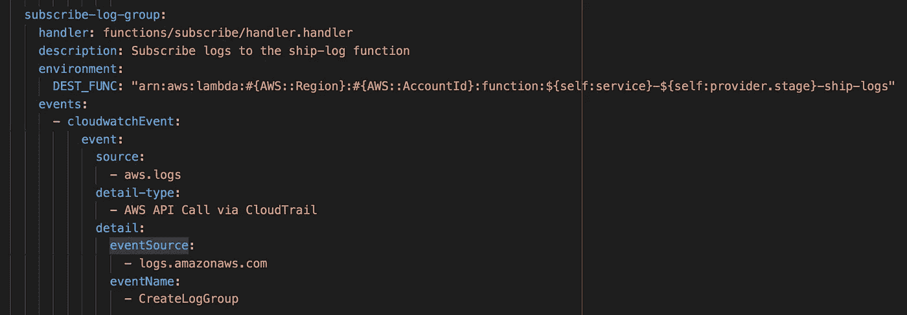
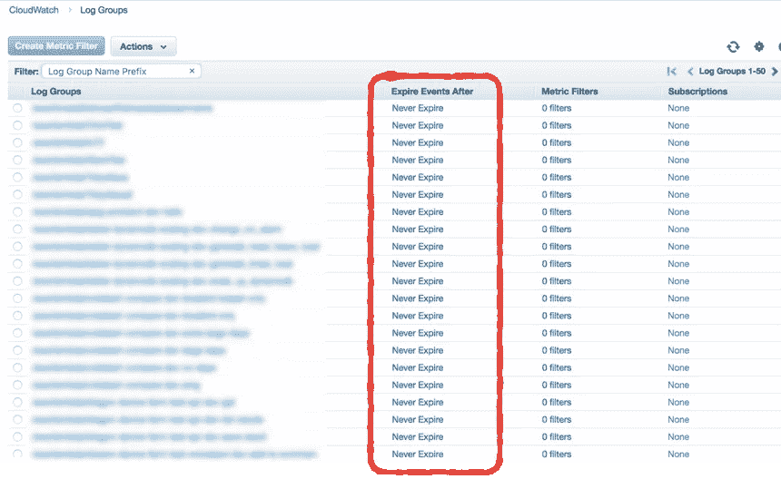
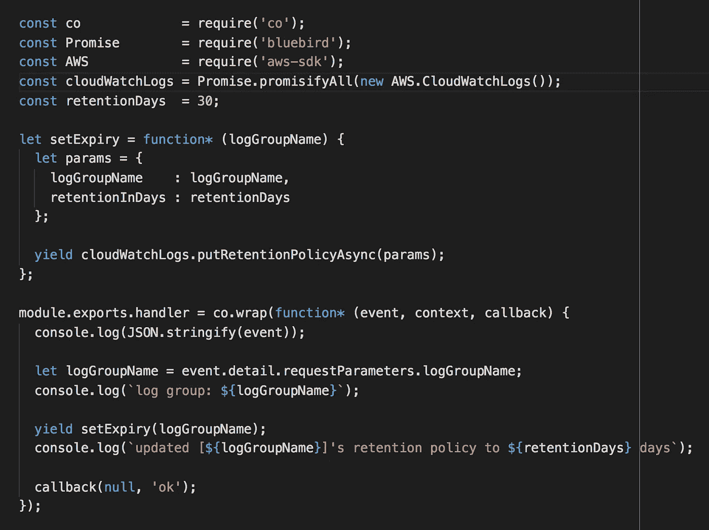

# AWS Lambda 的集中日志记录

> 原文：<https://medium.com/hackernoon/centralised-logging-for-aws-lambda-b765b7ca9152>

## CloudWatch Logs 很难满足您所有的日志记录需求，幸运的是，您可以使用 AWS Lambda 函数轻松地将日志流式传输到您首选的日志聚合服务。

这是关于管理 AWS Lambda 日志的 3 部分迷你系列的第一部分。在第 1 部分中，我们将了解如何从 CloudWatch 中获取所有日志。

第 2 部分将帮助您更好地理解日志记录和监控的不同方法之间的权衡，以及我遇到的一些有用的提示和技巧。

第 3 部分将演示如何通过各种事件源捕获和转发关联 IDs 例如 API Gateway、SNS 和 Kinesis。

**第二部**T3:小窍门

**第三部分:** [跟踪关联 id](/@theburningmonk/capture-and-forward-correlation-ids-through-different-lambda-event-sources-220c227c65f5)

# AWS Lambda 日志记录基础

在 Lambda 函数的执行过程中，您写入 stdout 的任何内容(例如，在 Node.js 中使用`console.log`)都将被 Lambda 捕获，并在后台异步发送到 CloudWatch 日志，而不会增加函数执行时间的任何开销。

You can find all the logs for your Lambda functions in CloudWatch Logs, organised into log groups (one log group per function) and then log streams (one log stream per container instance).

当然，您可以通过 [PutLogEvents](http://docs.aws.amazon.com/AmazonCloudWatchLogs/latest/APIReference/API_PutLogEvents.html) 操作将这些日志发送到 CloudWatch Logs，或者发送到您喜欢的日志聚合服务，如 Splunk 或 Elasticsearch。但是，记住**一切都必须在函数调用**期间完成。如果您在调用期间进行额外的网络调用，那么您将为这些额外的执行时间付费，并且您的用户将不得不等待更长的时间来等待 API 响应。

所以，不要那么做！

相反，应该在事后处理 CloudWatch 日志中的日志。

# 流式 CloudWatch 日志

在 CloudWatch 日志控制台中，您可以选择一个日志组(每个 Lambda 函数一个)，并选择将数据直接传输到 Amazon 托管的 Elasticsearch 服务。

如果你已经在使用托管的 Elasticsearch 服务，这是非常有用的。但是如果你还在评估你的选择，那么在你决定选择 AWS 主办的 Elasticsearch 之前，读一读这篇文章。

 [## 在 AWS 上使用亚马逊的 Elasticsearch 服务之前，你应该知道一些事情

### Elasticsearch 是一个强大但脆弱的基础设施，它有很多可能导致 AWS 服务…

read.acloud.guru](https://read.acloud.guru/things-you-should-know-before-using-awss-elasticsearch-service-7cd70c9afb4f) 

正如您从上面的截图中看到的，您也可以选择将日志流式传输到 Lambda 函数。事实上，当您从 Lambda 控制台创建一个新功能时，已经有很多将 CloudWatch 日志推送到其他日志聚合服务的蓝图了。

显然，这是许多 AWS 客户所要求的。

You can find blueprints for shipping CloudWatch Logs to Sumologic, Splunk and Loggly out of the box.

这很好，现在您可以使用这些蓝图来帮助您编写一个 Lambda 函数，该函数将 CloudWatch 日志发送到您首选的日志聚合服务。但是有一些事情要记住。

## 自动订阅新日志组

每当你创建一个新的 Lambda 函数，它就会在 CloudWatch 日志中创建一个新的日志组。您希望避免为上面的`ship-logs`函数订阅日志组的手动过程。

相反，启用 CloudTrail，然后在 CloudWatch 事件中设置一个事件模式，以便在创建日志组时调用另一个 Lambda 函数。

您可以在 CloudWatch 控制台中手动完成这一一次性设置。

Match the CreateLogGroup API call in CloudWatch Logs and trigger a subscribe-log-group Lambda function to subscribe the newly created log group to the ship-logs function you created earlier.

如果您使用多个 AWS 帐户，那么您应该避免手动设置。使用无服务器框架，您可以在`serverless.yml`文件中为这个`subscribe-log-group`函数设置事件源。

另一件要记住的事情是，**你需要避免为** `ship-logs` **函数本身订阅日志组——这会创建一个无限的调用循环**,这是你想要避免的痛苦教训。

 [## 无服务器:一个教训。艰难的方式。

### 我最近写了一篇关于我如何将我的静态网站从 VPS 迁移到无服务器堆栈的文章，非常成功..直到…

sourcebox.be](https://sourcebox.be/blog/2017/08/07/serverless-a-lesson-learned-the-hard-way/) 

## 自动设置日志保留策略

默认情况下，当 Lambda 为您的函数创建一个新的日志组时，保留策略是永远保留它们。可以理解，这是多余的，存储所有这些日志的成本会随着时间的推移而增加。

By default, logs for your Lambda functions are kept forever

幸运的是，使用上面的相同技术，我们可以添加另一个 Lambda 函数来自动更新保留策略，使其更合理。

Here’s a Lambda function for auto-updating the log retention policy to 30 days.

## 管理现有的日志组

如果您已经有许多现有的日志组，那么可以考虑将自动订阅日志组和自动更新日志保留策略的演示代码(如下所示)封装到一个一次性脚本中，以便对它们进行更新。

您可以通过使用 [DescribeLogGroups](http://docs.aws.amazon.com/AmazonCloudWatchLogs/latest/APIReference/API_DescribeLogGroups.html) API 调用遍历所有日志组来实现这一点，然后为每个日志组调用相应的函数。

## 查看演示代码

您可以在这个 [repo](https://github.com/theburningmonk/lambda-logging-demo) 中找到示例代码。

 [## burning monk/lambda-记录-演示

### 这个演示程序可以将日志发送到 ELK 堆栈，并自动订阅新的日志组

github.com](https://github.com/theburningmonk/lambda-logging-demo) 

嗨，我的名字是**崔琰**。我是一个 [**AWS 无服务器英雄**](https://aws.amazon.com/developer/community/heroes/yan-cui/) 和 [**量产无服务器**](https://bit.ly/production-ready-serverless) 的作者。我已经在 AWS 中运行了近 10 年的大规模生产工作负载，我是一名架构师或首席工程师，涉足从银行、电子商务、体育流媒体到移动游戏等多个行业。我目前是一名专注于 AWS 和无服务器的独立顾问。

你可以通过[邮箱](mailto:theburningmonk.com)、 [Twitter](https://twitter.com/theburningmonk) 和 [LinkedIn](https://www.linkedin.com/in/theburningmonk/) 联系我。

查看我的新课程，[**AWS 步骤功能完整指南**](https://theburningmonk.thinkific.com/courses/complete-guide-to-aws-step-functions) 。

在本课程中，我们将介绍有效使用 AWS Step Functions 服务所需了解的一切。包括基本概念、HTTP 和事件触发器、活动、设计模式和最佳实践。

在这里拿到你的副本。

来了解 AWS Lambda: CI/CD 的操作性**最佳实践**，本地测试&调试功能、日志记录、监控、分布式跟踪、canary 部署、配置管理、认证&授权、VPC、安全性、错误处理等等。

还可以用代码 **ytcui** 获得**票面价格 6 折**。

点击获取您的副本[。](https://bit.ly/production-ready-serverless)