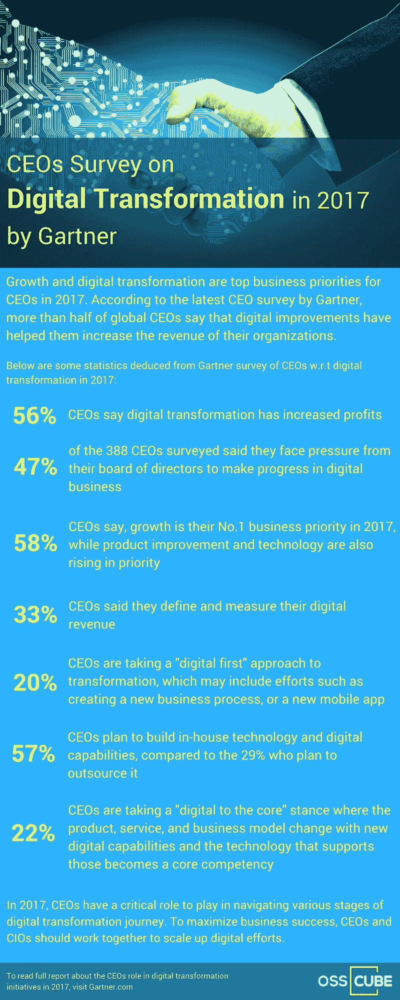

# Gartner 年首席执行官关于数字化转型的调查

> 原文：<https://medium.com/hackernoon/ceos-survey-on-digital-transformation-in-2017-by-gartner-c2d6e842f86c>

根据 Gartner 的调查，[数字化转型](https://hackernoon.com/tagged/digital-transformation)和业务[增长](https://hackernoon.com/tagged/growth)是 CEO 们在 2017 年的首要任务。据说首席执行官们已经开始了 [**数字业务转型**](http://www.osscube.com/digital-transformation) 的过程，并正在加大努力以最大限度地获得商业成功。

> 如果您正在寻找数字化转型解决方案，请访问:[http://www.happiestminds.com/](http://www.happiestminds.com/)。

> [黑客中午](http://bit.ly/Hackernoon)是黑客如何开始他们的下午。我们是阿妹家庭的一员。我们现在[接受投稿](http://bit.ly/hackernoonsubmission)并乐意[讨论广告&赞助](mailto:partners@amipublications.com)机会。
> 
> 如果你喜欢这个故事，我们推荐你阅读我们的[最新科技故事](http://bit.ly/hackernoonlatestt)和[趋势科技故事](https://hackernoon.com/trending)。直到下一次，不要把世界的现实想当然！

