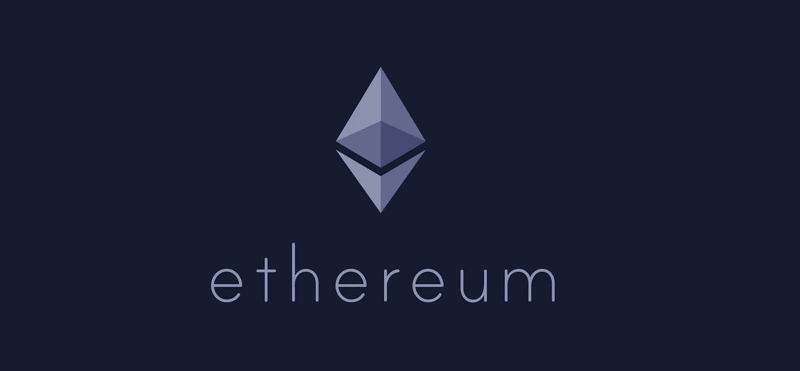
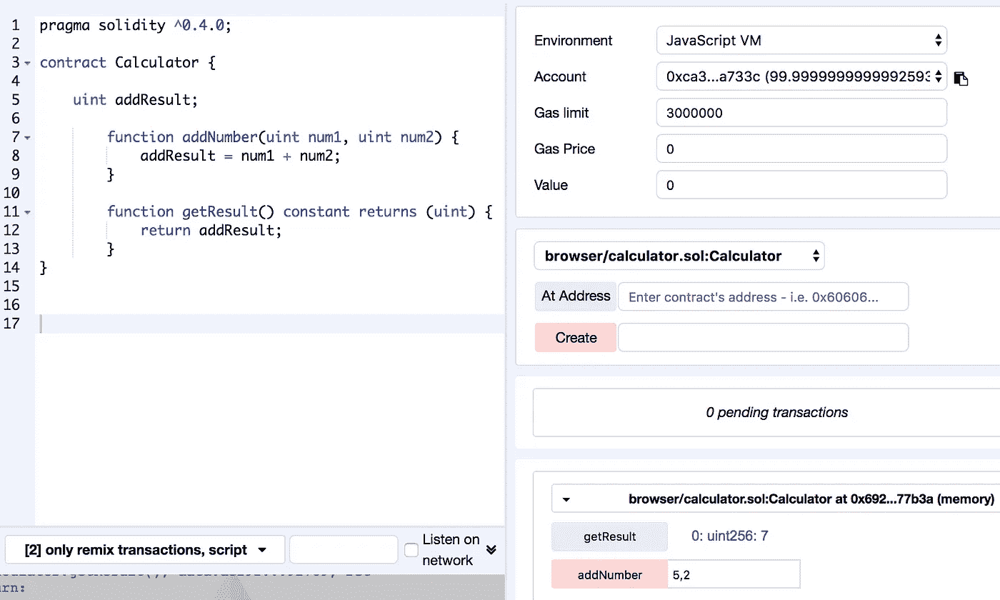
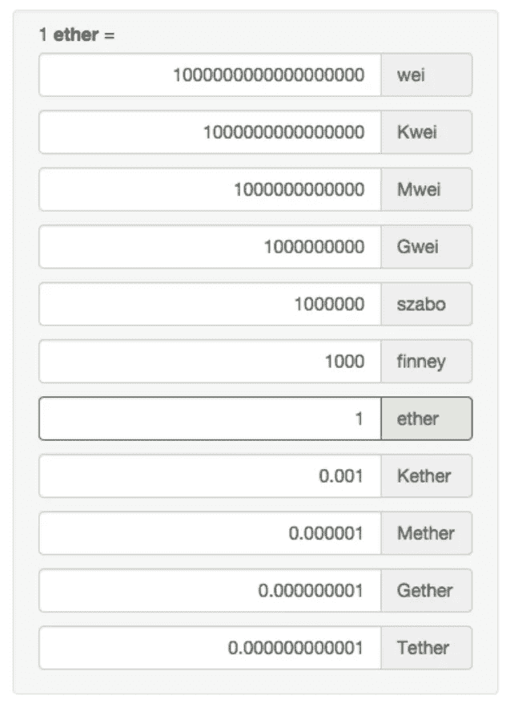

# 认证以太坊开发者:构建智能合约

> 原文：<https://medium.com/hackernoon/certified-ethereum-developer-building-smart-contracts-3d71a49ad45c>

以太坊是一个公共区块链，支持分布式计算，并在其 EVM(以太坊虚拟机)上提供智能合约功能。智能合同将在未来几年改变几个主要行业。乍一看，智能合同的概念似乎简单而基本。然而，智能合约提供的操作范围和多功能性令人难以置信。

[我最近参加了多伦多约克大学区块链中心的认证以太坊开发者(CED)项目](http://linkedin.com/in/shaanray)。这个认证项目是同类项目中的第一个。它专注于 Solidity，一种在以太坊区块链上运行的编程语言。在为期三天的强化课程结束时，其他与会者和我能够编写我们自己的智能合同并创建令牌。课程还涵盖了包括 ico、Dao、智能财产和其他新兴区块链概念在内的主题。这个项目以一次考试和一个顶点项目结束。

我与本·布朗(Ben Brown)和莫·哈桑(Mo Hasan)合作，建立了专注于智能城市和政府服务的智能合同。我们的顶点项目是一个假想的市政当局，它通过一系列智能合同管理税收和市政服务。即使我们完成并提交了项目，我们还会继续调整它并添加更多的功能。

虽然我已经在区块链呆了很多年，但在 CED 期间学习和重温几个新话题还是令人兴奋的。其中一些如下:

**模块化**

以太坊是模块化的，非常灵活。用户可以调整该协议，并改变它的几个组成部分，以适应特定的组织需要。两个重要的组件是:

1.难度级别-您希望在您的网络上进行挖掘的难度有多大？解决一个块需要多少哈希能力？

2.共识机制—您希望您的协议遵循哪种共识机制—工作证明、利益证明还是权威证明？

A solidity contract I wrote on the Ethereum’s Remix IDE. This contract performs a simple addition of two numbers. The contract would be triggered externally by someone calling this contract and sending two numbers to be added. On the bottom right of the screen by the addNumber tab I have sent ‘5’ and ‘2’, the result ‘7’ is display next to the getResult tab.

**建造一座区块链**

我们与 GETH 合作，为 CED 与会者创建了一个内部区块链。从头创建一个区块链，维护它，并参与其中的交易，这种经历是非常有益的。它允许与会者将他们的概念性知识付诸实践。除其他外，它有助于明确以下概念:

1.Genesis block —在创建我们的 Genesis block 的过程中，我们为几个变量赋值，包括在这个特定的区块链中允许的货币量，以及每个用户被分配了多少。

2.时间戳—每个块都标有创建时间的时间戳。有趣的是，以太坊遵循 Unix 时间，这意味着它认为时间的开始是 1970 年 1 月 1 日星期四 00:00:00 UTC(也称为 POSIX 时间或 epoch 时间)。

3.挖掘—我们使用命令' mining.start '或' mining.stop '来开始或结束加密货币的挖掘会话。

4.交易——然后，我们用开采出来的硬币在我们的网络中进行交易，并以“汽油”的形式支付费用，将数据输入每个区块。

5.通信—除了发送加密货币，我们还能够以“字符串”形式发送消息，作为交易数据的一部分。可以发送消息来通知另一个对等体各种属性，例如您的状态、您当前的以太坊状态和节点数据。

Denominations of Ether.

**智能合约**

智能合同是用代码编写的自动执行的协议。它们允许在分布式、安全和透明的环境中进行交易。(智能合约概念最早是由 Nick Szabo 在 1994 年提出的——这可能是为什么‘Szabo’是一个以太的命名:1，000，000 szabo = 1 个以太。)一些重要的智能合同概念包括:

1.天然气——这为每个智能合同提供了动力。乙醚可以转化成气体。气体存在于以太坊虚拟机上。它不能在其他交易所交易。汽油的价格不与 ETH 挂钩。相反，它根据复杂的算法而变化。执行交易或智能合同使用 gas。所需的天然气量与合同的复杂程度成正比。

2.契约可以调用其他契约——它们可以调用其他契约的函数，并且可以通过编程使用 ether 和 gas 来创建和部署其他契约。

3.继承—协定可以被编程为从一个或多个其他协定继承代码。

4.调用协定—创建协定并将其放在块上是一个必要的步骤，但与通过调用它来触发该协定是分开的。调用合同的实体称为“msg.sender”，而调用链开始处的实体称为“tx.origin”。例如，在调用链 A > B > C >D > E 中，“msg.sender”可能是 E，而“tx.origin”是 A。(在这种情况下，A 在智能合约 B 上调用；b(根据合同要求)访问 C，以此类推。前一个动作者用“msg.sender”表示，而这个链最开始的原始实体称为“tx.origin”。

Crypto enthusiasts gearing up for the holiday season. Photo credit Hodlmoon.com

**总体印象**

教授这门课程的教师是各自领域的[专家](https://www.linkedin.com/in/kmereshkin/)，他们在区块链技术、分布式账本应用、支付系统、密码学和企业家精神方面有着广泛的经验。我发现我的同事 Aalim Khan 是一个有天赋的程序员，他在可靠性和创建智能合同方面有很高的技能。

虽然这篇文章强调了我的一些想法，但它只是触及了这个项目的表面。为了简洁起见，我省略了这个程序的几个重要的概念方面(比如创建我们自己的 ERC20 令牌)和社交方面(比如在参与者、教师和区块链社区中的其他人之间交朋友)。虽然编码技能绝对是加分项，但对编程的基本理解足以让你从本课程中学到很多。

[沙恩雷](http://www.shaanray.com/)

关注 [Lansaar Research](https://medium.com/lansaar) on Medium，了解最新的新兴技术和新的商业模式。

 [## 沙恩·雷

### 来自 Shaan Ray 的最新推文(@ShaanRay)。创造新价值和探索新兴技术| ENTJ | #科学…

twitter.com](https://twitter.com/shaanray)