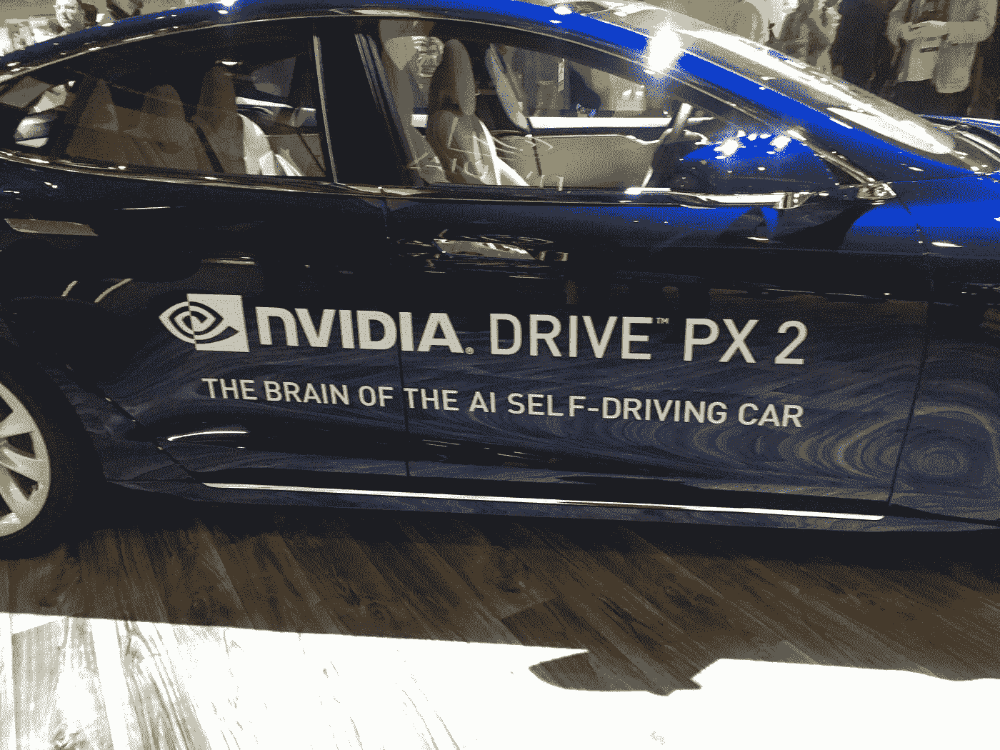
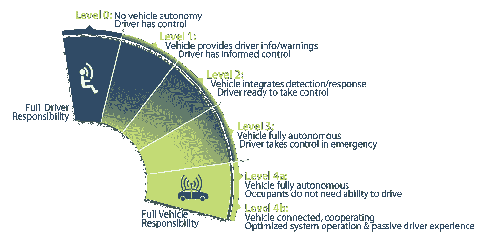
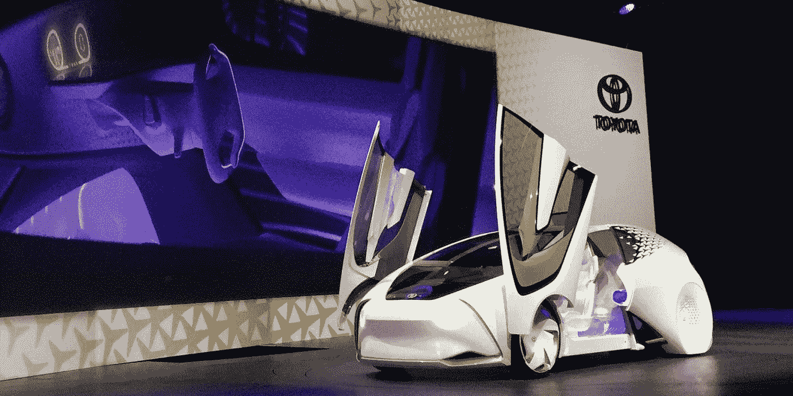
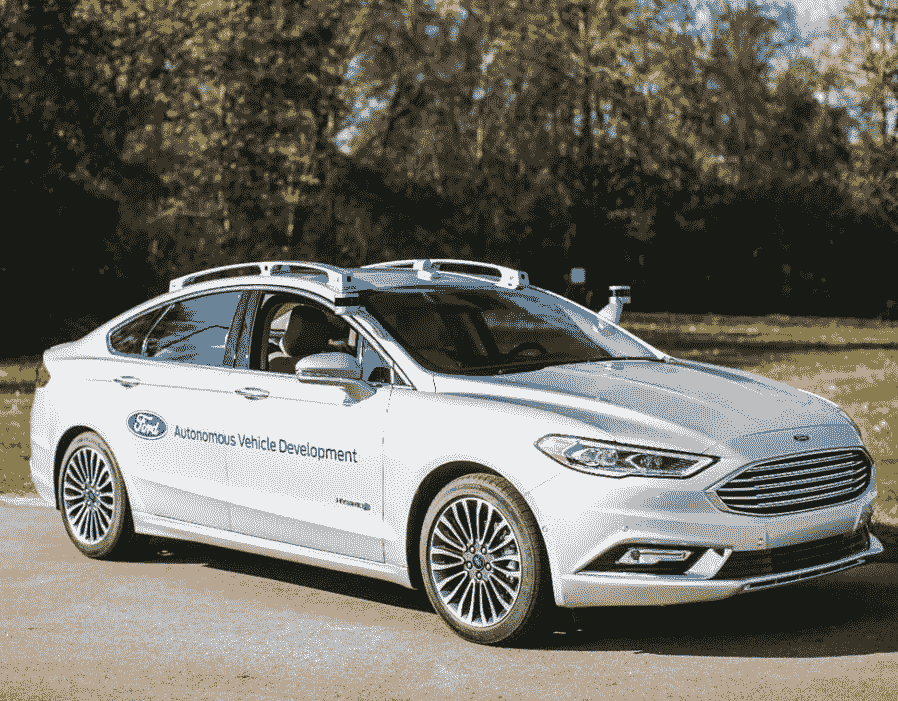
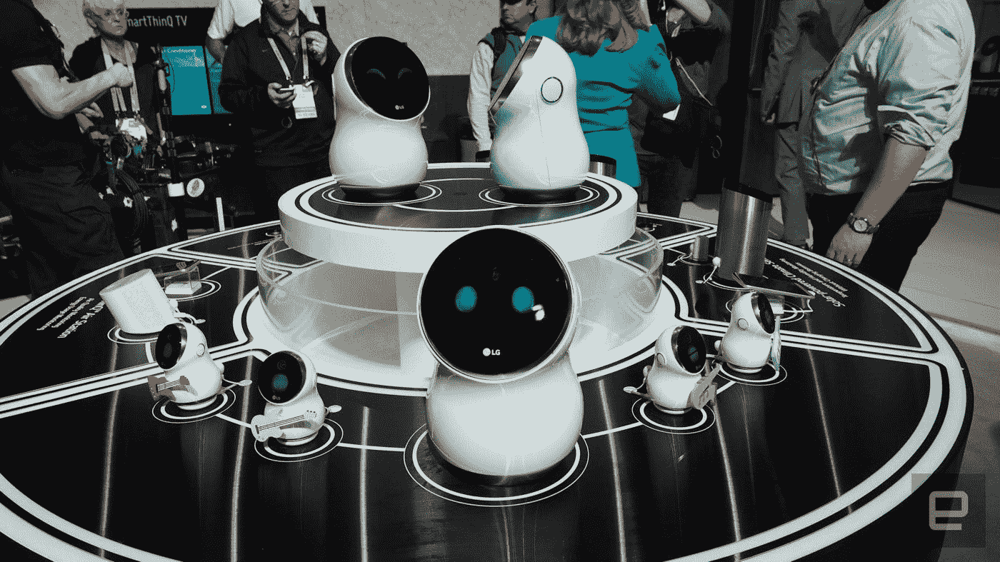

# CES 2017:来自展厅的报道

> 原文：<https://medium.com/hackernoon/ces-2017-report-from-the-show-floor-8de83943e894>

雪莉·帕尔默(又名 CES 先生)错了。昨天，他在每日信件中宣布，他投票选出的 2017 年“最佳展示”是[梅赛德斯-奔驰远景面包车](http://list.shellypalmer.com/inc/rdr.php?r=64167c582c1390c392)。我反驳:“雪莉，去北厅外面的黄金停车场，坐一下英伟达的自动驾驶汽车。”

我确实同意 Shelly 的观点，梅赛德斯概念车“将今年 CES 上展示的所有技术总结在一个简洁的包中。它是自主的，按需交付，并使用机器学习来完成任务。”然而，从机器人的角度来看，关键词是“概念”，作为现实主义者，我们对像下面 NVIDIA 这样的演示更感兴趣。

站在寒风凛冽的停车场轨道上，我亲眼目睹(并捕捉到)三位敢于冒险的科技高管将自己的生命交给英伟达的 AI 芯片。对我来说，这个演示最好地总结了 CES 2017 的体验——人类已经准备好把钥匙交给机器。

主办 CES 的消费者技术协会的首席执行官加里·夏皮罗(Gary Shapiro)感叹道:“NVIDIA 在改变当今世界的一些最重要的技术力量中发挥着核心作用。它在人工智能、自动驾驶汽车、虚拟现实和游戏方面的工作使该公司处于行业领先地位。”

图形芯片公司英伟达(NVIDIA)可能以游戏闻名，该公司利用其知识库开发了新的计算机视觉深度学习微处理器，以扩大其在游戏以外的市场份额，进军人工智能和联网汽车。该公司在华尔街获得了丰厚的回报，其股票价值在过去一年飙升了 230%。自 2014 年成立以来，NVIDIA 只是推动 CES 上自动驾驶汽车市场增长超过 75%的众多例子之一。

昨天，英伟达的首席执行官黄仁勋(Jen-Hsun Huang)在他的 CES 主题演讲中花了相当多的时间，宣称利用神经网络系统来教会计算机驾驶的好处，“深度学习使破解这个难题成为可能。我们现在可以感知汽车周围的环境；我们可以使用人工智能预测其他人和汽车的位置。”

黄与奥迪合作，推出了英伟达的新计算驾驶技术 Xavier，该技术运行自己的 Driveworks 操作系统。该处理单元包含八个 ARM64 内核，拥有每秒 30 万亿次运算的性能。

根据黄的说法，“这些人工智能联网汽车应该能够在世界上几乎每个地方从一个地址开到另一个地址。”认识到目前学习结构的缺点，黄宣布 Driveworks 也可以在对其自动驾驶能力信心不足时将驾驶交给人类副驾驶。

一天前，丰田研究所(TRI)的 Gil Pratt 博士表示，自动驾驶系统最危险的方面可能是在计算机与人类或第二级自主的交接中，“大量研究表明，驾驶员脱离驾驶任务的时间越长，重新定向的时间就越长。当有人过度信任 2 级系统的能力时，他们可能会在心理上将注意力从驾驶环境中分离出来，并错误地认为 2 级系统比实际能力更强。我们 TRI 担心，过度信任可能会在许多英里的无切换驾驶中积累。”

根据 Pratt 的说法，“TRI 一直在采取双轨方法，同时开发一个我们称为 Guardian 的系统，旨在使人类驾驶更加安全……同时致力于我们称为 Chauffeur 的 L4 和 5 系统。《守护者》和《司机》中的感知和规划软件基本相同。不同的是，Guardian 只在需要的时候使用，而 Chauffeur 在自动驾驶过程中一直使用。在 Guardian 中，除了在 Guardian 预测或发现即将发生的事件并短暂采取纠正措施的情况下，**司机应该一直控制着汽车。从某种意义上说，丰田正在跳过英伟达和特斯拉的自动驾驶控制，从 1 级自动驾驶转向完全自动驾驶。但是这个什么时候可以用呢？**

Haung 昨天明确表示，“到 2020 年，我们将有汽车上路。”这个日期得到了汽车和软件行业许多其他主要声音的响应。去年夏天，福特汽车联合首席执行官马克·菲尔兹表示，他们“计划在 2021 年为商业拼车提供全自动无人驾驶汽车。”昨天，我亲眼看到了自动驾驶的福特 Fusion 概念车(注意镜子上方有吸引力的双激光雷达装置)。福特表示，预计将在 2017 年部署 30 辆这种自动驾驶 Fusion 混合动力原型车，并在接下来的一年部署 90 辆，但承认“从现在到 2021 年仍有很多工程开发。”

普拉特比业内大多数人都不乐观，“所有汽车制造商的目标都是实现第 5 级，即汽车可以在任何时间、任何地点、任何交通或天气条件下完全自动驾驶。我需要非常清楚地说明这一点:这是一个美好的目标。然而，在汽车行业或 IT 行业，我们没有一个人接近实现真正的 5 级自主。这将需要许多年的机器学习，以及比任何人记录的*模拟…和真实世界测试* *都多得多的里程，才能达到第五级自主所需的完美*。”

漫步在会展中心和金沙尤里卡公园博览会，其他一些值得注意的趋势也成为来年的重要标志:

1.  虚拟现实是去年的无人机时尚:今年，以前由业余无人机公司占据的每一个空间似乎都被 Oculus 或三星 Gear 仿制品占据了(甚至连 the Verge 也加入了进来，在 JFK 为飞往维加斯的航班分发粉色纸板虚拟现实耳机)。
2.  [*夏娃机器人*](http://disney.wikia.com/wiki/EVE) *是新的 Alexa:* 正如预言，社交机器人的时代到了；事实上，它是从 Siri 开始的，然而我没有预料到的是，所有的工业设计师都会看同一部皮克斯电影(见上面 LG 的例子)。虽然外形可爱，但价值主张尚未完全具体化，因为大多数产品只是 Alexa 的更好包装。
3.  *世界在碰撞，人群在增长:*说起 Alexa，她无处不在，甚至出现在今年最新的福特车型中。这是否意味着她就像美国国家安全局监听我们的每一次谈话？无论如何，今年的 CES 是一个怪物年，比任何人预期的都要大。就连 CES 先生昨天也承认，他无法靠近一些展位。[顺便说一句，如果你想见见谢利·帕尔默，请在今年三月和他一起参加我的晚宴]

所有参加 CES 的朋友们，明年见…所有待在家里的人，现在你们有 FoMA 了吗？

> [黑客中午](http://bit.ly/Hackernoon)是黑客如何开始他们的下午。我们是阿妹家庭的一员。我们现在[接受投稿](http://bit.ly/hackernoonsubmission)并乐意[讨论广告&赞助](mailto:partners@amipublications.com)的机会。
> 
> 如果你喜欢这个故事，我们推荐你阅读我们的[最新科技故事](http://bit.ly/hackernoonlatestt)和[趋势科技故事](https://hackernoon.com/trending)。直到下一次，不要把世界的现实想当然！

