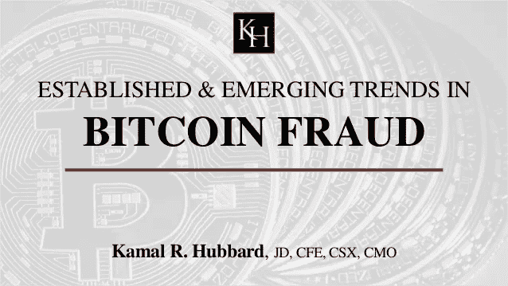
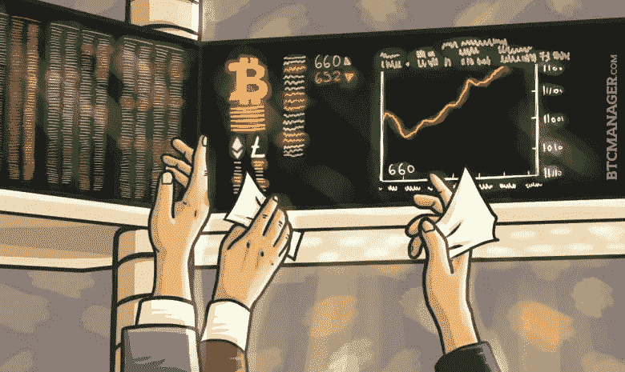
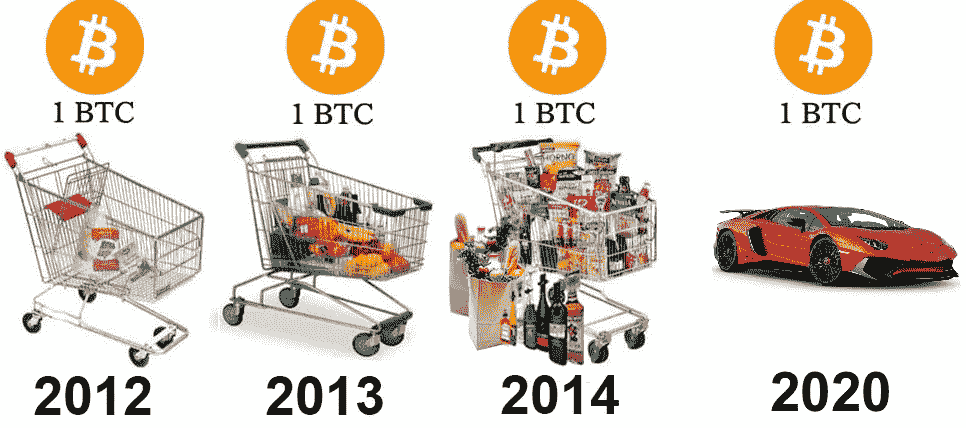
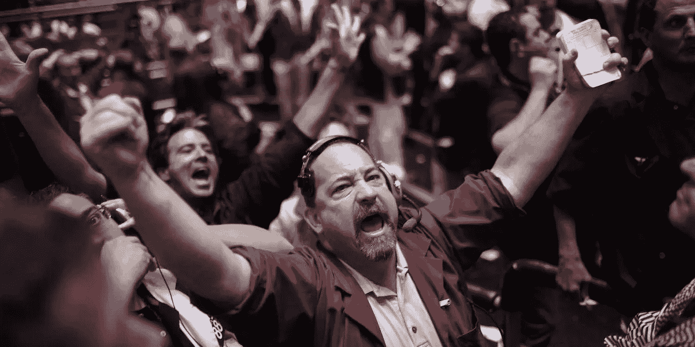
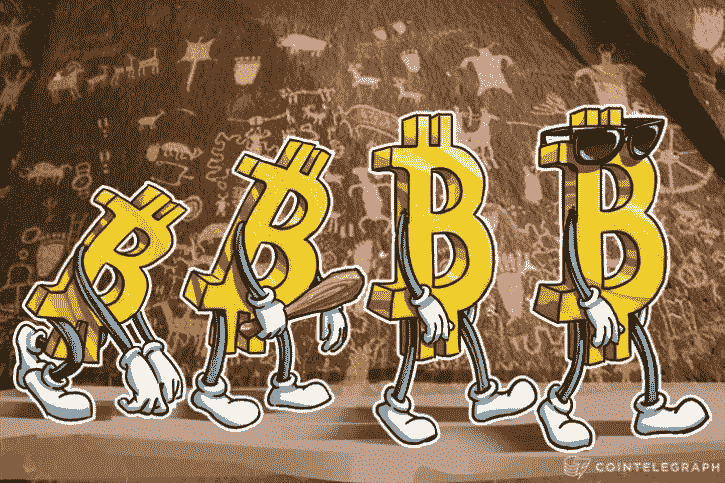

# CFTC 已批准比特币欺诈

> 原文：<https://medium.com/hackernoon/cftc-has-approved-bitcoin-fraud-a4e771a6c73f>

这是我们现在应该读的标题。CFTC 批准让芝加哥商业交易所、CBOE 和纳斯达克在交易所上市他们的比特币产品，这是我一生中见过的最**荒谬和最危险的**决定，我是比特币的忠实拥护者。我知道 LedgerX 已经获得批准几个月了，但是它没有芝加哥商品交易所、CBOE 和纳斯达克那样的影响力。CFTC 的**缺乏监督和不能正确地做他们的工作**，甚至通过批准 LedgerX，刚刚允许最**经典类型的欺诈**发生。最重要的是，CFTC 将市场参与置于风险之中，并将系统性风险放大到了灾难的程度。**你是怎么问的？**嗯，有 **3 个主要原因**，我在下面重点介绍了。

# 商品期货交易委员会的职责:

根据定义，**CFTC**的既定使命是“培育开放、透明、有竞争力和财务稳健的市场，避免系统性风险，保护市场用户及其资金、消费者和公众免受与受《商品交易法》管辖的衍生品和其他产品相关的欺诈、操纵和滥用行为的影响。”

1.  **“保护市场用户及其资金、消费者和公众免受欺诈”**
    CFTC 怎么能说他们在通过批准这些比特币期货产品来履行保护消费者和市场参与的职责呢？芝加哥商品交易所、CBOE 和纳斯达克即将从流通中的 1600 万枚比特币中创造出价值数万亿美元的比特币衍生品。然而，据估计，在这 1600 万比特币中，**400 万已经因人为错误而丢失**，因此本质上这些比特币衍生品是**从不存在的资产中获取价值。还有人觉得这有问题吗？换句话说，CFTC 批准了交易所的欺诈行为，因为它们提供的是并不存在的金融产品的衍生品。**这是对欺诈最经典的定义。****
2.  **“培育开放、透明、竞争和财务稳健的市场，避免系统性风险”**
    由于比特币的私人性质，投资者不能卖空传统意义上的比特币，因为不可能找到比特币或将比特币交付给交易者。然而，取而代之的是，交易所提供**菲亚特结算衍生产品**，正如每个交易员都知道的那样，这对基础资产没有实质性影响。这是如何试图创造一个金融健全的市场？菲亚特解决的衍生品基本上是一个马戏团，让投资者面临系统性风险。我认为交易所和 CFTC 缺乏监管是可耻的。做好你的工作。
3.  **“与衍生品相关的滥用行为”**
    批准 CFTC 比特币产品的不明智决定刚刚打开了潘多拉的盒子。**你认为交易所提供市场上其他 1300 种加密货币的衍生产品需要多长时间？**不要忘记考虑这 1300 种加密货币中的 90%完全没有效用因此实际上根本没有价值。对于其他人来说，这听起来像是虐待行为吗？CFTC 和交易所正在将任何类型的失策或错误放大 10 倍，但它将暴露在比过去多得多的受众面前。

# **以史为鉴:**

上面列出的这三个原因中的每一个都可能对数百万投资者产生重大影响。然而，如果你认为这些产品的发布会一帆风顺，那你也是个傻瓜。这种规模的事件和交易所**的短暂转向肯定会在他们的网络上引起巨大的涟漪**，有可能导致**的故障或黑客攻击**。我想带你回到过去，为你提供一个例子。有人记得 **Mt. Gox 吗？当 2013 年最大的比特币交易所 Mt. Gox 网站被黑后，比特币的价格开始暴跌。**为什么？有如此多的被误导的人参与市场，以至于很多人认为被黑客攻击的其实是比特币。然而，正如你们许多人现在知道的，那是不可能的。实际上是 Mt. Gox 网站被攻破了，黑客窃取了数百万比特币。那么，当所有来自股票市场的**未受过教育的投资者**开始将资金投入比特币产品，却发现其中一个交易所面临重大故障时，会发生什么？我知道！会有**重大不稳定**导致**混乱。******

# 让市场成熟:

自 2009 年成立以来，比特币社区已经取得了巨大的进步。然而，事实仍然是，市场仍在的成熟过程中，但肯定是朝着正确的方向前进。例如:

1.  波动性已经降低。自 2015 年以来，单日波动基本在 15%以内
2.  提高流动性和信息效率。买卖价差是 2013 年的十分之一

我为比特币社区取得的所有进步感到非常自豪，但恰在此时，银行家和我们当前的金融体系已经开始破坏我们的进步。我已经清楚地定义并讨论了 CFTC 将如何危及投资者，以及他们的轻率行为将如何转化为比特币的进一步丑化。CFTC 的某人需要立即被解雇！

