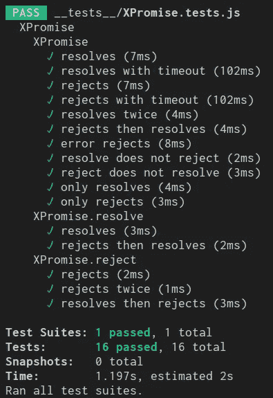

# 挑战:没有变量的程序#javascript

> 原文：<https://medium.com/hackernoon/challenge-program-without-variables-javascript-bee89a41455e>


[Labrinth — Alexas_Fotos](https://pixabay.com/en/labyrinth-wood-play-ball-red-fun-1738039/)

挑战在于创建一个没有任何变量的软件(一些真实的、有形的东西，而不仅仅是一个 hello world)。

这个想法来自萨梅尔·布纳的一篇文章。对此，我(开玩笑地)回应道，尝试“无变量编码”。

我计划创建一个希望图书馆。我受到了 Trey Huffine 的一篇文章的启发[，](https://medium.com/u/47e700e59e44?source=post_page-----bee89a41455e--------------------------------)[通过从零开始建立承诺来学习 JavaScript 承诺](/gitconnected/understand-javascript-promises-by-building-a-promise-from-scratch-84c0fd855720)。

我相信承诺简单到足以理解代码，也复杂到足以成为挑战。

# 警告！

如果我把编写干净的代码比作环法自行车赛，*这段代码不是那段*。这个代码会比 X-Games 小轮车自由泳大空气更好。你将会看到几个双后空翻和 360 度转体，但是当你骑上你的自行车时，最好让所有的轮子都在路上。孩子们，不要在家里或工作中尝试这个。

话虽如此(*如果你允许自己*)从这段代码中可以学到很多东西，我鼓励你创建自己的游戏场，看看你能变得多么极端和怪异。在边缘，你会发现最有趣的事情。

# 规则

*   不允许的关键字:`var`、`let`、`const`、`import`、`class`。不使用`if`或`switch`或`function`关键词的加分。
*   只要遵守所有规则，图书馆是允许的。
*   可以创建新库，但必须遵循所有规则。
*   库必须足够通用，可以在任何项目中使用，并且不能替代所创建代码的业务逻辑。
*   测试是不必要的。但是如果你选择写测试，它们就不受规则的约束。

# 开始吧！

# TimeDivisionDuplex 时分双工

Promise 库非常复杂，当我对代码进行修改时，我希望确保这些修改不会破坏之前工作的任何东西。所以我将首先写出我所有的测试。这很容易，因为 node 已经包含了一个 Promise 库，所以我将首先针对它编写我的测试。

一个区别是，我不打算创建任何类，因为我发现 JavaScript 中不需要类。因此，您可以不用创建承诺的典型代码:`new Promise((resolve, reject))`，而只使用`XPromise((resolve, reject)),`，不使用`new`关键字。

[XPromise.tests.js](https://gist.github.com/joelnet/29c273cb83a3ec2b290eaaf8f18d77f0)

# 从界面开始

我马上面临一项具有挑战性的任务。类似于 A+ Promise 实现，我希望能够使用`XPromise((resolve, reject) => …)`、`Promise.resolve(…)`和`Promise.reject(…)`创建一个承诺。所以`XPromise`需要是一个函数，还要有 2 个属性(`resolve`和`reject`)，也是函数。

通常这不需要太多思考，但是由于规则的原因，我不能这样做:

通过使用`Object.assign`将`resolve`和`reject`附加到主函数，是时候发挥创造力了。

到目前为止，我对此相当满意。也就是说，直到我意识到`resolve`和`reject`是助手函数，最终需要指向主`XPromise`函数，现在没有对它的引用😦

# 创建没有变量的引用

**`XPromise`也需要返回一个包含`then`和`catch`两个函数的对象。这些函数必须调用原始的`XPromise`函数，它(再次)不再被引用。**

**所以…我需要弄清楚如何创建一个异步的，递归的，匿名的函数，否则这整个事情将会失败。废话。**

## **是时候推出组合子了**

**说到匿名递归函数，脑海中立刻浮现出著名的 Y 组合子。这就是 Y 组合子的目的。但是，Y 组合子并不是我们唯一可以使用的组合子。对于这个任务，我决定使用不太为人所知但更简单的 U Combinator。**

**我喜欢 U Combinator，因为它容易记忆。**

```
f => f(f)
```

**就是这样！U Combinator 将一个函数作为参数，然后将该函数传递给自身。现在你的函数的第一个参数就是你的函数。如果这听起来令人困惑，那是因为它令人困惑。不要担心，在代码中会更容易看到。**

**注意零件`sayHello => () => 'hello'`以及`sayHello`和`UsayHello`的相同之处。**

**现在让我们用递归来试试。**

**完美！这正是我们需要的！现在是时候把它塞进项目里了。**

**好了，这是承诺的基本框架。我们有自己的主函数`XPromise`，辅助函数`resolve`和`reject`。`XPromise`取一个函数，包含`resolve`和`reject`。该函数还返回一个包含函数`then`和`catch`的对象。**

**您可以看到，我还使用了一个立即调用的函数表达式，使 U Combinator 可以用作`U`参数。**

**现在和我在一起吧，最糟糕的已经过去了！如果我没有跟丢你，并且还在跟踪你……请放心，在本文的剩余部分，我们将会沿着山坡向下滑行！😃**

# ****存储状态****

**像其他应用程序一样，这个应用程序必须存储某种状态。这将是来自`resolve`、`reject`的值和/或来自`then`和`catch`的函数。一般来说，这可以用好的“旧变量”来完成。不过，我们也可以使用默认参数来完成同样的事情。这也将带来额外的好处，能够调用该函数，并为它植入一个新的状态！剧透一下，我们正准备这么做！**

**BTW，这是 Redux 的绝佳案例！**

# ****将块转换成表达式****

**我*更喜欢用**表达式** 编码*而不是**块**。这只是我的一个偏好。`if`语句和`try/catch`包含块，所以我要做一个替换。我还喜欢使用**逗号运算符**来组合多个表达式，您将在下面看到。**

**是啊，这样好多了！😀**

**现在我想清理一下那个`try/catch`。**

# ****快进> >****

**这篇文章是关于在不使用变量的情况下编写软件的挑战。这篇文章不是关于如何创建一个承诺库。所以为了节省时间，让我们跳过无聊的废话，直接填空。**

**好吧，它在那里，在所有的荣耀；一个没有单个`const`、`let`或`var`的无极库。**

**看看这个…我所有的测试都通过了！😁**

****

**源代码@[https://github.com/joelnet/XPromise](https://github.com/joelnet/XPromise)**

# **赛后总结**

**这个挑战比我想象的要困难(耗时)得多。不一定是因为限制，而是因为**创建一个 Promise 库比我预期的要复杂得多**。承诺可以被同步/异步调用，也可以不被同步/异步调用，可以有也可以没有 resolve 值、reject 值、then resolver 和/或 catch resolver。这是 64 种可能的状态！很明显我没有足够的测试。**

**我终于有了 U Combinator 的合法用例，这真是太棒了。**

**Medium 不擅长写代码博客，为每个小片段创建一个要点对我来说是一件痛苦的事情😦**

**我有点喜欢这个图书馆的样子。整个事情最终变成了一个单一的表达。**

# **我给你的信息**

**我知道这变得很复杂，不要觉得你必须 100%理解它。我只希望你觉得它很有趣。我希望这篇文章里有你以前没见过的东西。我希望我让您对自己探索代码感到好奇！**

**你会如何完成挑战？你会做出同样的选择吗？你喜欢什么？你会有什么不同的做法？我会❤️听听你的想法！**

**在这里关注我，推特 [@joelnet](https://twitter.com/joelnet) ，[链接进来](https://www.linkedin.com/in/joel-thoms/)，它让我开心…当我开心的时候我会写更多！**

**在此继续阅读:**

**[](https://medium.com/@joelthoms/latest) [## 乔尔·托马斯写的最新故事

### 阅读乔尔·托马斯在 Medium 上写的最新故事。计算机科学家和技术传播者，拥有 20 多年的…

medium.com](https://medium.com/@joelthoms/latest)**