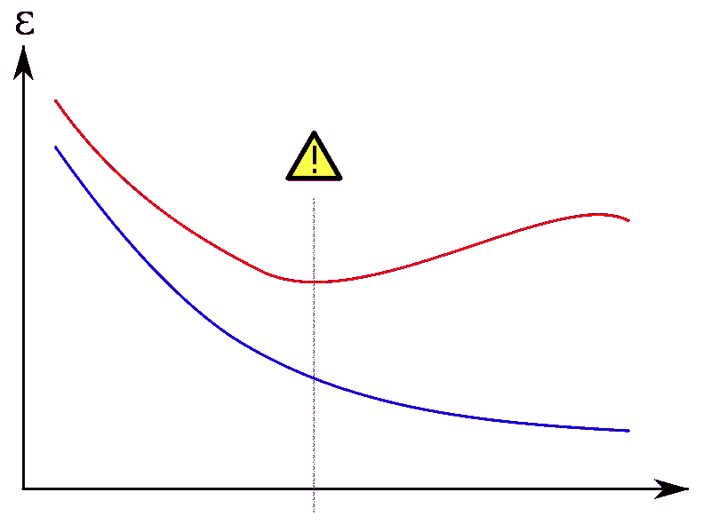
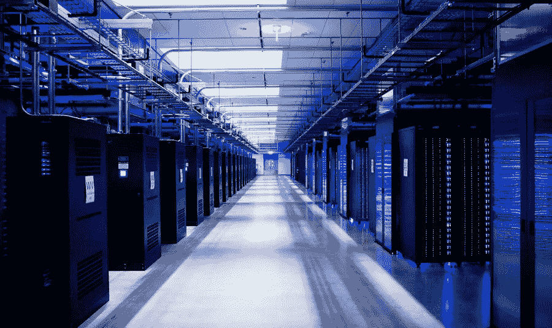
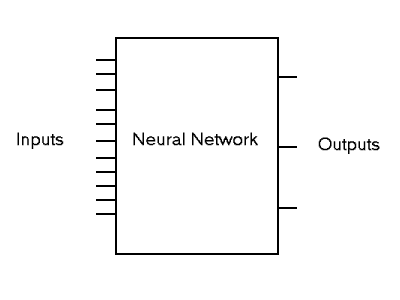

# 深度学习的挑战

> 原文：<https://medium.com/hackernoon/challenges-in-deep-learning-57bbf6e73bb>

A neural network architecture. [Credits](http://cs231n.github.io/neural-networks-1/)

深度学习已经成为开发智能机器的主要研究领域之一。AI 的大多数知名应用(如语音识别、图像处理和 NLP)都是由深度学习驱动的。深度学习算法使用人工神经网络模仿人脑，并逐步学习准确解决给定的问题。但是在深度学习系统中存在着重大的挑战，这是我们必须要注意的。

用深度学习领域最著名的名字之一[吴恩达](http://www.andrewng.org/)的话说:

> **“我相信深度学习是我们迈向真正人工智能的最佳途径。”**

如果你环顾四周，你可能会意识到安德鲁的上述声明的力量。从 Siris 和 Cortanas 到 Google Photos，从 Grammarly 到 Spotify 的音乐推荐，都是以深度学习为动力的。这些只是深度学习已经深入我们生活的几个例子。

但是，随着巨大的技术进步而来的是复杂的困难和障碍。在这篇文章中，我们将讨论深度学习中的突出挑战。

# 深度学习的挑战

## 很多很多的数据

深度学习算法被训练成使用数据进行渐进学习。需要大量的数据集来确保机器提供预期的结果。由于人脑需要大量的经验来学习和推断信息，类似的人工神经网络需要大量的数据。您想要的抽象越强大，需要调优的参数就越多，参数越多，需要的数据就越多。

例如，一个语音识别程序需要来自多种方言、人口统计和时间尺度的数据。研究人员为算法输入万亿字节的数据来学习一种语言。这是一个耗时的过程，需要巨大的数据处理能力。在某种程度上，通过深度学习解决问题的范围取决于它将训练的巨大数据语料库的可用性。

神经网络的复杂性可以通过参数的数量来表示。在深度神经网络的情况下，这个数字可以在数百万、数千万以及在某些情况下甚至数亿的范围内。*让我们称这个数字为 P* 。因为你想确定模型的概括能力，一个好的经验法则是数据点的数量至少是 *P*P.*

## 神经网络中的过拟合

有时，在训练数据集中出现的错误和在新的未知数据集中遇到的错误有明显的不同。它发生在复杂的模型中，比如相对于观察值的数量有太多的参数。一个模型的有效性是通过它在一个看不见的数据集上表现良好的能力来判断的，而不是通过它在提供给它的训练数据上的表现来判断的。

Training error in blue, Validation error in red (Overfitting) as a function of the number of cycles. Credits: [Wikipedia](https://commons.wikimedia.org/w/index.php?curid=2959742)

一般而言，通常通过在特定训练数据集上最大化其性能来训练模型。因此，该模型记住了训练示例，但没有学会归纳到新的情况和数据集。

## 超参数优化

超参数是其值在学习过程开始之前定义的参数。少量更改这些参数的值可能会导致模型性能发生巨大变化。

依赖默认参数而不执行超参数优化会对模型性能产生重大影响。此外，拥有太少的超参数并手动调整它们，而不是通过成熟的方法进行优化，也是性能驱动的一个方面。

## 需要高性能硬件

为深度学习解决方案训练数据集需要大量数据。为了执行任务来解决现实世界的问题，机器需要配备足够的处理能力。为了确保更高的效率和更少的时间消耗，数据科学家转向多核高性能 GPU 和类似的处理单元。这些处理单元是昂贵的并且消耗大量的能量。

Facebook’s Oregon Data Center. Credits: [MIT Technology Review](https://www.technologyreview.com/s/423577/inside-facebooks-not-so-secret-new-data-center/)

行业级深度学习系统需要高端数据中心，而智能设备如无人机、机器人和其他移动设备需要小型但高效的处理单元。因此，将深度学习解决方案部署到现实世界中成为一件昂贵且耗时的事情。

## 神经网络本质上是一个黑盒

我们知道我们的模型参数，我们将已知数据输入神经网络，以及它们是如何组合在一起的。但是我们通常不明白他们是如何得出一个特定的解决方案的。神经网络本质上是黑盒子，研究人员很难理解它们是如何推断结论的。

The Neural Network Blackbox. Credits: [University of Florida](http://lyra.ifas.ufl.edu/ABE6644/ai.html)

神经网络缺乏抽象层次上的推理能力，这使得难以实现高级认知功能。此外，它们的操作在很大程度上对人类是不可见的，这使得它们不适用于过程验证很重要的领域。

然而，伦敦帝国理工学院认知机器人学教授默里·沙纳汉和他的团队提交了一篇论文，讨论了深度符号强化学习，展示了解决上述障碍的进展。

## 缺乏灵活性和多任务处理

深度学习模型一旦经过训练，就可以为特定问题提供极其高效和准确的解决方案。然而，在当前的情况下，神经网络架构高度专业化于特定的应用领域。

谷歌 DeepMind 的研究科学家 [Raia Hadsell](https://www.linkedin.com/in/raia-hadsell-35400266/?ppe=1) 总结道:

> “世界上没有神经网络，现在也没有方法可以被训练来识别物体和图像，玩太空入侵者，听音乐。”

我们的大多数系统都是围绕这个主题工作的，它们非常擅长解决一个问题。即使解决一个非常相似的问题也需要重新培训和评估。研究人员正在努力开发深度学习模型，这些模型可以进行多任务处理，而无需对整个架构进行改造。

虽然，有[在这方面使用渐进式神经网络](https://arxiv.org/abs/1606.04671)的小进步。此外，在[多任务学习(MTL)](https://en.wikipedia.org/wiki/Multi-task_learning) 方面也有显著进步。来自谷歌大脑团队和多伦多大学的研究人员提交了一篇关于[多模型](https://arxiv.org/abs/1706.05137)的论文，这是一种神经网络架构，借鉴了视觉、语言和音频网络的成功，同时解决了多个领域的许多问题，包括图像识别、翻译和语音识别。

深度学习可能是人工智能的主要研究垂直领域之一，但它肯定不是完美无缺的。在探索认知技术的新领域时，遇到某些障碍和困难是很自然的。任何技术进步都是如此。未来看到了“深度学习是我们实现真正人工智能的最佳解决方案吗？”作为应用人工智能研究小组的一员，我当然洗耳恭听。

> 我为应用人工智能研究小组 [Paralleldots](https://www.paralleldots.com/) 工作。我们为现实世界的问题开发人工智能解决方案。文章原载[此处](http://blog.paralleldots.com/technology/deep-learning/challenges-in-deep-learning/)。
> 
> 如果你喜欢读这篇文章，请鼓掌，分享或评论下面的进一步讨论。