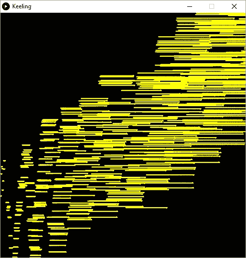

# 改变你的音阶

> 原文：<https://medium.com/hackernoon/change-your-scales-97e4ee37c4d4>

这是 N 部分系列的第 7 部分，详细介绍了我如何制作我的动画。

[上一张](/@kevpluck/learn-your-scales-f78da9bea959) [下一张](/@kevpluck/rates of change-ca904f010a19)

现在我们已经达到了在 500x500 [动画](https://hackernoon.com/tagged/animation)中可以显示的极限，所以我们需要改变[的比例](https://hackernoon.com/tagged/scale)来适应 58 年数据的绘图。

因此，一旦 x 大于 500，我们就可以开始减小 x 和 y 的比例。让我们这样做:

```
 float xScale = 1.0;
    float yScale = 40.0;

    if(frameCount > width)
    {
      xScale = float(width) / float(frameCount);
    }

    float x = frameCount * xScale;
    float y = (co2 - 313.04) * yScale;

    ellipse(x, height - y, 1, 1);
```

这个`float()`是怎么回事？因为`width`和`framcCount`是整数，所以当你将它们相除时，结果也是整数。不幸的是，作为整数的 500/501 的结果是 0，而不是 0.998，所以我们必须将整数值转换成浮点数。你还会注意到，当我使用一个常量值时，比如`40.0`我包含了小数点，这导致计算机进行浮点运算，而不是整数运算。例如，1/10 的结果将等于 0，而 1.0/10.0 的结果将是预期的 0.1。要知道 1.0/10 也会导致 0！

哦，那不是我们想要的！图像没有缩放，最后几个点都挤压在图像的右侧。

我们的代码是每帧绘制一个点，并保持之前绘制的所有其他点可见。这意味着当我们改变比例时，我们只是改变了下一个点的比例，而不是之前所有点的比例。

因此，为了克服这一点，我们必须重新绘制所有以前的点和下一个点。这是通过一个与`loadData()`不同格式的`for()`循环完成的

```
for(int dataIndex = 1; dataIndex <= frameCount; dataIndex++)
{}
```

该循环定义了一个名为`dataIndex`的变量，该变量从 1 开始增加 1，直到达到当前值`frameCount`。`dataIndex++`符号是`dataIndex = dataIndex + 1`的一种简写方式

以下是具体情况:

```
void draw()
{
  float xScale = 1.0;
  float yScale = 40.0;

  if(frameCount > width)
  {
    xScale = float(width) / float(frameCount);
  } for(int dataIndex = 1; dataIndex <= frameCount; dataIndex++)
  {
    int daysFromStart = (dataIndex - 1) * 7;
    LocalDate frameDate = _startDate.plusDays(daysFromStart);

    if(_data.hasKey(frameDate.toString()))
    {
      float co2 = _data.get(frameDate.toString());

      float x = dataIndex * xScale;
      float y = (co2 - 313.04) * yScale;

      ellipse(x, height - y, 1, 1);
    }
  }
}
```

这基本上是为每一帧画出所有先前的点，然后每次增加一个计数。一旦计数超过 500，我们就开始调整`xScale`到

现在我们有了:



啊？哦，我忘了清理每一个平局的框架！

只需在`draw()`的第一行加上`background(0);`。现在我们得到:

很可爱。现在让我们对 y 轴做同样的事情。

这将有一点不同，因为 y 值不会线性增加，所以我们将保持一个运行最大值，并根据该值进行缩放。由于我们已经将 y 轴乘以 40，这自然会导致我们设置:

```
float yScale = 40.0;
```

将该行放在`void draw()`定义之前，这样在`draw()`执行之间`yScale`会被记住。

现在，每次我们计算新的 y 值时，我们都需要检查它是否超过了先前的`height`值，如果是，则计算新的`yScale`:

```
if(y * yScale > height) 
{
  yScale = float(height)/y;
}
```

导致:

下面是完整的代码:

```
import java.time.*;FloatDict _data = new FloatDict();
LocalDate _startDate = LocalDate.of(1958, 3, 29);void setup()
{
  loadData();
  size(500,500);
  background(0);
  stroke(255,255,0);
}float yScale = 40.0;void draw()
{
  background(0);
  float xScale = 1.0;

  if(frameCount > width)
  {
    xScale = float(width) / float(frameCount);
  }for(int dataIndex = 1; dataIndex <= frameCount; dataIndex++)
  {
    int daysFromStart = (dataIndex - 1) * 7;
    LocalDate frameDate = _startDate.plusDays(daysFromStart);

    if(_data.hasKey(frameDate.toString()))
    {
      float co2 = _data.get(frameDate.toString());

      float x = dataIndex;
      float y = (co2 - 313.04) ;

      if(y * yScale > height) 
      {
        yScale = float(height)/y;
      }

      ellipse(x * xScale, height - (y * yScale), 1, 1);
    }
  }
}void loadData()
{
  String[] lines = loadStrings("weekly_in_situ_co2_mlo.csv");

  for (String line : lines) 
  {
    if( line.startsWith("\"") ) continue;

    String[] values = split(line, ',');
    String date = values[0];
    float co2 = parseFloat(values[1]);
    _data.set(date, co2);
  }
}
```

下周和我一起玩速度游戏，添加一些文字和轴之类的东西…

编辑:当我第一次发表这个的时候，我有一个更复杂的方法来计算`yScale`，现在更简单了。

[](http://bit.ly/HackernoonFB)[](https://goo.gl/k7XYbx)[](https://goo.gl/4ofytp)

> [黑客中午](http://bit.ly/Hackernoon)是黑客如何开始他们的下午。我们是 [@AMI](http://bit.ly/atAMIatAMI) 家庭的一员。我们现在[接受投稿](http://bit.ly/hackernoonsubmission)并乐意[讨论广告&赞助](mailto:partners@amipublications.com)机会。
> 
> 如果你喜欢这个故事，我们推荐你阅读我们的[最新科技故事](http://bit.ly/hackernoonlatestt)和[趋势科技故事](https://hackernoon.com/trending)。直到下一次，不要把世界的现实想当然！

