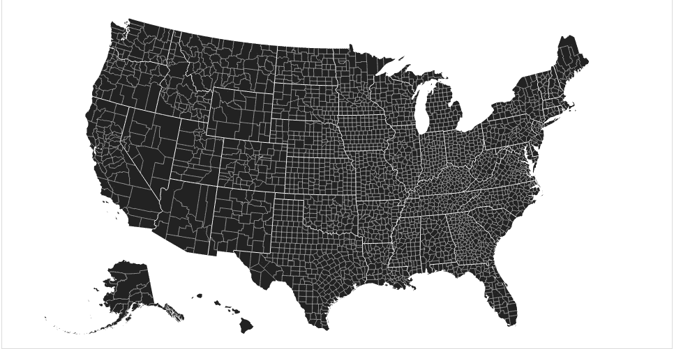
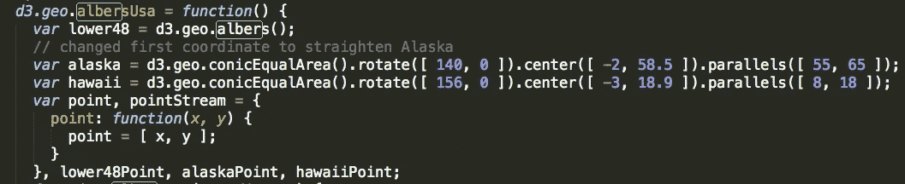
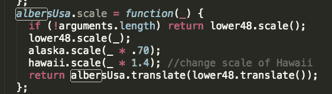
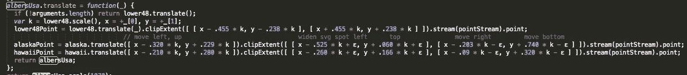
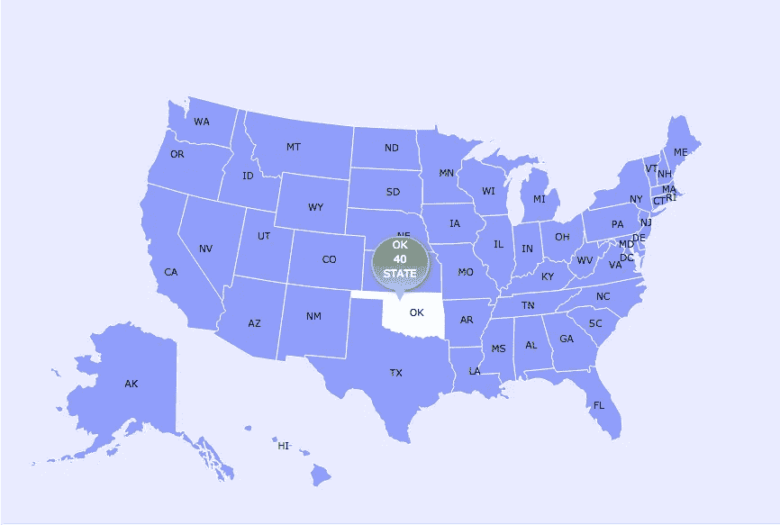

# 更改 D3js albersUsa 州大小

> 原文：<https://medium.com/hackernoon/changing-d3js-albersusa-state-size-de4a6687334d>

我最近一直在玩和探索 [D3js](https://hackernoon.com/tagged/d3js) 库，并且非常喜欢它。我收到了一个[数据可视化](https://hackernoon.com/tagged/data-visualisation)的创意，是一家公司在美国的增长，阿拉斯加和夏威夷被移到了美国核心州之下。

albersUsa 投影非常适合这一点，但是创意要求阿拉斯加和夏威夷的大小要比标准的 albersUsa 投影大得多。我研究了 google 来寻找一个增加州大小的解决方案，只遇到了一个复制粘贴 D3 库中提到 albersUsa 的部分并修改坐标的建议。这让我仍然通过 CDN 加载库。然而这个解决方案并不奏效，所以我将在下面解释我是如何做到的。

## 如何增加阿拉斯加和夏威夷的面积

你应该将整个库下载到你的项目文件夹中，并在本地加载，而不是通过 CDN 加载 D3 库。如果你不知道怎么做，D3 O'Reilley 的书有一个很棒的[解释](http://chimera.labs.oreilly.com/books/1230000000345/ch04.html#_downloading_d3)。在 d3.js 文件中搜索 albersUsa 并更改您需要的内容。

首先我改变了。旋转方法，以符合我想要的阿拉斯加和夏威夷。

然后我搜索了。缩放功能，并根据创意调整比例。

的。翻译功能将允许您移动状态。阿拉斯卡波因特

。translate 将上下移动状态。

。clipExtend 将加宽显示 svg 地理坐标的方框。

这是最终产品的样子。这里可以访问互动版[。](https://us-svg.herokuapp.com/)

