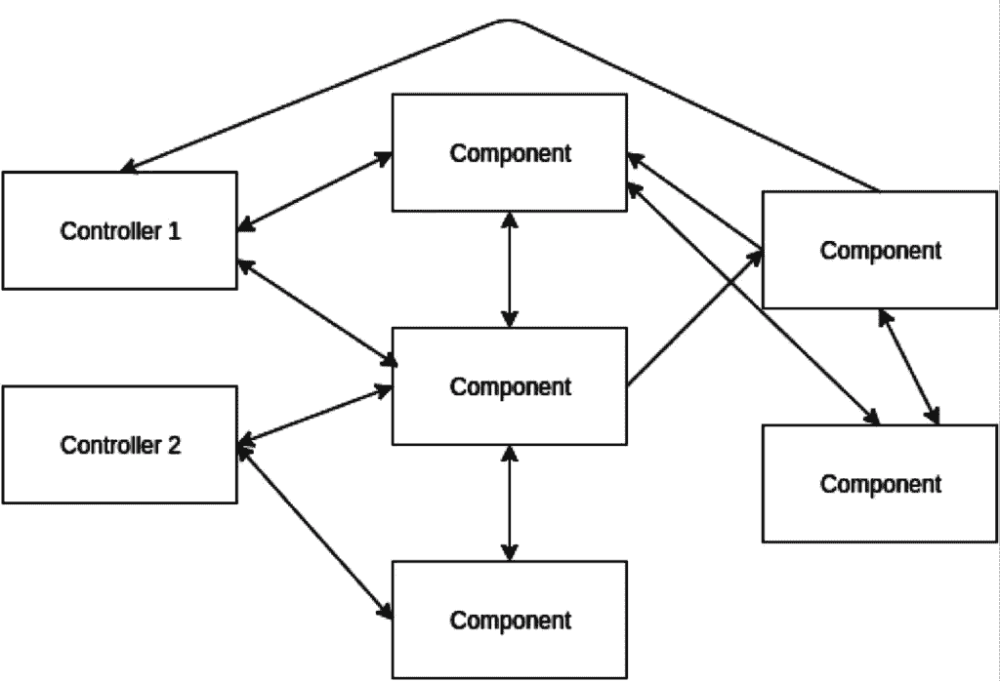
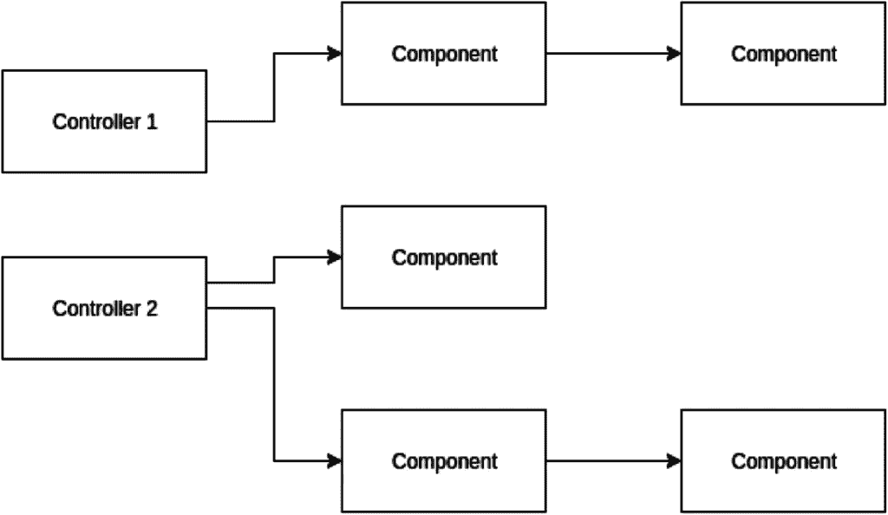
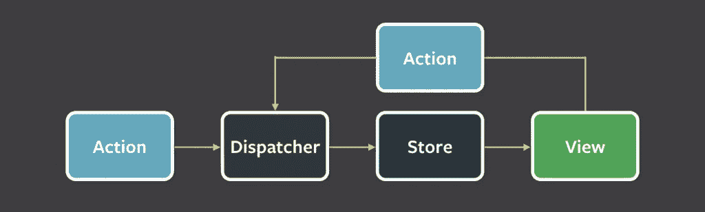

# 用功能概念改变思维模式

> 原文：<https://medium.com/hackernoon/changing-mindset-with-functional-concepts-af3b2492c116>


当我第一次听说函数式编程(FP)时，我认为它是另一个没有人需要的被过度宣传的东西。我生活在我快乐的面向对象世界中，不认为有什么是我应该改变的。直到我看了[非常有说服力的视频](https://www.youtube.com/watch?v=7Zlp9rKHGD4)，在那里鲍勃叔叔描述了为什么 FP 如此重要。

我决定试一试。我开始使用小的，不是很流行的，但是非常功能化(正如人们描述的)的 JavaScript 库。叫做 React.js。

我很快意识到函数概念是多么强大。我们无时无刻不在使用它们，甚至不知道。

# 纯洁

React 是一个库，用于创建带有一些所需逻辑的 HTML 视图。主要构件是一个“组件”。

组件接受数据并返回 HTML。

一个例子:

```
const SomeComponent = ({data}) => { 
  return ( 
    <div> <h1>{data.title}</h1> <p>{data.text}</h1> </div> 
  ) 
}
```

> 注意:上面的代码是有效的 JavaScript。它使用 [JSX 语法扩展](https://facebook.github.io/react/docs/jsx-in-depth.html)。

如您所见，遵循代码非常容易。诀窍是**给定相同的输入，该组件将总是给出相同的输出。**

有可能是因为`SomeComponent`不访问任何外部状态，也不调用任何外部 API。它是纯的，没有任何副作用。你不需要担心在这个函数调用过程中会发生一些意想不到的魔法。

在 FP 中，这些函数被称为*纯函数*。它们只处理它们接受的参数，不访问外部状态。

但是你可能会问，这些副作用到底是什么？举几个例子:

*   访问数据库
*   写入磁盘
*   网络通信
*   显示数据
*   触发事件

**避免副作用**是另一个直接来自函数式编程的核心概念。

不可能写出完全没有副作用的应用程序。关键是把它们放在一个地方。最好是在应用程序的“边缘”。

通过这样做，您可以获得两个重要的好处——可组合性和更简单的测试。可以想象，测试第一个例子中的函数是非常容易的。您只需要提供一些参数并测试输出。不需要复杂的模仿库。

你得到的好处是:结构良好的代码，更少的重构问题，更容易的调试和可扩展性。

使用酶文库进行测试的例子:

```
it('renders SomeComponent', () => { 
  const wrapper = shallowRender( 
    <SomeComponent data={{title: 'hello', text: 'world'}} /> 
  ); 
  expect(wrapper.find('h1')).to.have.length(1);
  expect(wrapper.find('p')).to.have.length(1); 
});
```

纯函数也支持合成。假设您有更多的数据要呈现，并且视图稍微复杂一些:

```
const data = { 
  menu: [ 
    {link: 'http://netflix.com', title: 'Netflix'}, 
    {link: 'https://www.primevideo.com/', title: 'Amazon Prime'} 
    // ... 
  ], 
  title: 'Some Heading', text: 'Lorem ipsum...' 
} const MenuComponent = ({menu}) => { 
  const menuHtml = menu.map(menuElement => ( 
    <a href={menuElement.link}>{menuElement.title}</a> 
  )) return ( 
    <div>{menuHtml}</div> 
  ) 
} const SomeComponent = ({data}) => { 
  return ( 
    <div> 
      <h1>{data.title}</h1> 
      <MenuComponent menu={data.menu} /> // passing menu array here
      <p>{data.text}</p> 
    </div> 
  ) 
} render(
  <SomeComponent data={data} />, 
  document.getElementById('main') 
)
```

> 注意:请将本文中的所有代码示例视为伪代码。

拥有两个纯函数— `MenuComponent`和`SomeComponent`，允许你以任何你想要的方式将它们混合在一起。尽管如此，你不需要担心副作用，因为这些功能没有它们。

# 不变

上面的例子中缺少的是数据操作。在传统编程中，数据操作通常是通过改变值来完成的。

一个简单的例子:

```
const doSomethingToTheArray = arr => { 
  array.push(4) // mutating the original array 
} const anArray = [1, 2, 3] 
doSomethingToTheArray(anArray) // [1, 2, 3, 4]
```

这种模式可能非常危险。

假设您需要将同一个数组传递给其他函数。这些功能也可以改变这种状态。

确定状态在哪里被改变的唯一方法是遵循代码。有时几层下来。

最终*引入了共享的可变状态*。有人认为它是万恶之源(我同意)。

浏览器事件、API 调用等。会在不可预知的时间发生。鉴于此，跟踪应用程序中共享状态的所有变化很快就变得很麻烦。

有什么选择？

FP 引入了不变性的概念——你不能改变一个曾经被创建的值。

```
const doSomethingToTheArray = arr => { 
  return array.concat(4) // no mutation, returning new array 
} const anArray = [1, 2, 3] 
const newArray = doSomethingToTheArray(anArray) // no mutation
```

如果不变异任何状态，就不用处理并发问题。

然而，在我看来，还有更重要的建筑效益。**状态在一个地方管理，因此更容易跟踪变化。**

让我们专注于此。

在 React 中，如果您沿着组件树向下传递状态，它将永远不会被重新分配。

那么如何改变这种状态呢？

定义状态的组件负责处理所有的更改。假设您想要通过单击子组件中的某个按钮来修改状态。要做到这一点，您不仅需要传递数据，还需要能够更改数据的处理程序。

一个代码示例胜过千言万语，所以让我们看看它是如何工作的。

```
// a way to define a stateful compnent
const StatefulComponent = React.createClass({
  getInitialState () { // defining initial state
    return {
      data: [1, 2, 3]
    }
  },

  // a handler changing state
  changeSomeState (newValue) {
    // built-in function to change the state
    this.setState(({data}) => {
      return {
        data: data.concat(newValue)
      }
    })
  },

  return (
    <div>
      <ChildComponent
        changeSomeState={this.changeSomeState}
        data={this.state.data}
      />

      <SomeOtherComponentDiplayingData data={this.state.data} />

      <SomeOtherComponentChangingData
        changeSomeState={this.changeSomeState}
        data={this.state.data}
      />
    </div>
  )
})

const ChildComponent = ({data, changeSomeState}) => {
  return (
    <div>
      <button onClick={() => {changeSomeState(4)}}>Click</button>
    </div>
  )
}
```

`StatefulComponent`遵循我之前提到的原则——它拥有国家，并且是唯一可以改变国家的地方。`ChildComponent`只是一个傀儡，它在点击按钮时调用`changeSomeState`处理程序。它调用传递的函数来更改状态，但不能直接修改状态。

看看跟踪状态有多容易。您会立即知道它在哪里使用，以及哪个子组件使用该处理程序来修改它。

我们知道还有一个显示状态的组件(`SomeOtherComponentDiplayingData`)，还有一个改变状态的组件(`SomeOtherComponentChangingData`)。

几乎没有关于状态管理的认知负荷。你只需要看一下`StatefulComponent`就可以知道你可以执行什么样的状态修改。

我曾经遇到过这样一种情况，我们在项目中与国家管理层发生冲突。它看起来像这样:



如果我们遵循上面描述的原则，它可能看起来像这样:



你喜欢哪一个？

# Redux

当使用前端代码时，您可以通过在组件之外抽象状态管理来帮助自己。

最受欢迎的库是 Redux。

这是脸书人描述的[通量架构](http://facebook.github.io/flux/)的一个实现，大约在同一时间 React 出现了。

前提是要有一个全局状态容器。状态不是保存在有状态的组件中，而是保存在全局存储中。

如果您想要执行状态更改，您需要发出一个操作。然后，动作被分派到商店。存储处理所有更改，然后通知所有订阅者新的状态，以便他们可以获取它并重新呈现视图。



source: [https://facebook.github.io/flux](https://facebook.github.io/flux)

> 注意:[“Redux 没有调度员的概念”](http://redux.js.org/docs/introduction/PriorArt.html)

Redux 本身功能就很强大。负责状态修改的“存储”部分被称为“还原器”，它们是接受某种状态和动作的纯函数。它们返回修改的状态。

来自 [Redux docs](http://redux.js.org/) 的一个例子:

```
// todos reducer
function todos(state = [], action) {
  // Somehow calculate it...
  switch (action.type) {
    case 'ADD':
      return state.concat(action.payload)
    default:
      return state
  }
  return nextState
}

const addTodoAction = {type: 'ADD', payload: 'write a blog post'}
```

Redux 将通过向`todos`减速器和`addTodoAction`一起提供先前的状态来处理动作。运行减速器后，将返回新状态。

同样，抽象状态管理使得测试变得容易。您需要提供一些状态和动作。这样你可以毫无困难地测试任何你能想到的案例。

来自 [Redux docs](http://redux.js.org/docs/recipes/WritingTests.html) 的测试示例:

```
it('should handle ADD_TODO', () => {
  const initialState = []
  expect(
    reducer(initialState, {
      type: types.ADD_TODO,
      text: 'Run the tests'
    })
  ).toEqual(
    [
      {
        text: 'Run the tests',
        completed: false,
        id: 0
      }
    ]
  )
)}
```

如果您的状态管理变得复杂，并且希望引入更多的可预测性，您可能希望尝试 Redux。

# 高阶函数

有时组件需要用一些公共逻辑来修饰。例如，获取用户权限以启用/禁用某些字段。

React 允许您为处理这些情况的组件定义包装器。

```
// component that requires user rights
const WrappedComponent = ({user}) => {
  if (user.isAdmin) {
    return <AdminStuff />
  }

  return <RegularStuff />
}

// wrapper function
const withUserRights = Component => React.createClass({
  getInitialState () {
    return {
      user: null
    }
  }

  componentDidMount () {
    this.setState({user: getUserData()})
  },

  render () {
    return <Component user={this.state.user} />
  }
})

// usage
const WrappedComponentWithUserRights = withUserRights(WrappedComponent)
```

`withUserRights`函数返回一个组件，它是一个**高阶组件** (HOC)。在 React 文档的高级技术部分可以找到对这种技术的描述。但说实话，它很快就变得有用了。

正如文档中所描述的，HOC 是一个接受一个组件并返回一个新组件的函数。
这个概念是从 FP 那里借来的，在 FP 那里它被称为高阶函数。

高阶函数是将函数作为参数、返回函数或两者都做的函数。

最基本的例子是“map()”。

```
const mapped = [1, 2, 3].map(n => n + 1) 
// [2, 3, 4]
```

这完全是抽象的。例如，`map()`是一个抽象的`for`循环，它正在组装新的数组。当你使用内置的抽象，比如`map()`、`filter()`或`forEach()`时，引入错误的机会更小。你可以忘记像计数器递增这样的低级概念。

想象更复杂(有点夸张)的函数链:

```
const Wrapped = withSuperFeatureNumber3Enabled( 
  withFancyHeader( 
    withUserRights(WrappedComponent) 
  ) 
)
```

本例中的每一层抽象都封装了一些公共逻辑。代码变得更加清晰**你可以看到其他程序员的想法**。代码易于理解，使用组合可以更好地重用代码。

# 摘要

有许多源自 FP 的技巧你可以每天使用。这些是函数式编程最基本的构件，但我发现它们是最有用的。

没有副作用的纯函数给你更好的抽象和组合。再加上不变性和可预测的状态管理，您最终会得到更少的易错代码和更少的认知负荷。
高阶函数给你一个更好的普通逻辑的抽象，并且在纯函数中表现出色。

我真的鼓励你深入挖掘，因为 FP 在未来会变得更加有用。

如果你正在寻找知识的来源，我推荐阅读:

我经常重复**函数式编程是一种思维模式**。心态的坏处是不容易改变。在 FP 的情况下，我觉得是值得的。[再等五分钟](https://signalvnoise.com/posts/3124-give-it-five-minutes)。

*最初发布于*[*www . future-processing . pl*](https://www.future-processing.pl/blog/changing-mindset-with-functional-concepts/)*。*

[](http://bit.ly/HackernoonFB)[](https://goo.gl/k7XYbx)[](https://goo.gl/4ofytp)

> 黑客中午是黑客如何开始他们的下午。我们是这个家庭的一员。我们现在[接受投稿](http://bit.ly/hackernoonsubmission)并乐意[讨论广告&赞助](mailto:partners@amipublications.com)机会。
> 
> 如果你喜欢这个故事，我们推荐你阅读我们的[最新科技故事](http://bit.ly/hackernoonlatestt)和[趋势科技故事](https://hackernoon.com/trending)。直到下一次，不要把世界的现实想当然！

