# 改变世界，一次一个硬件的启动。

> 原文：<https://medium.com/hackernoon/changing-the-world-a-hardware-startup-at-a-time-789539aa0077>

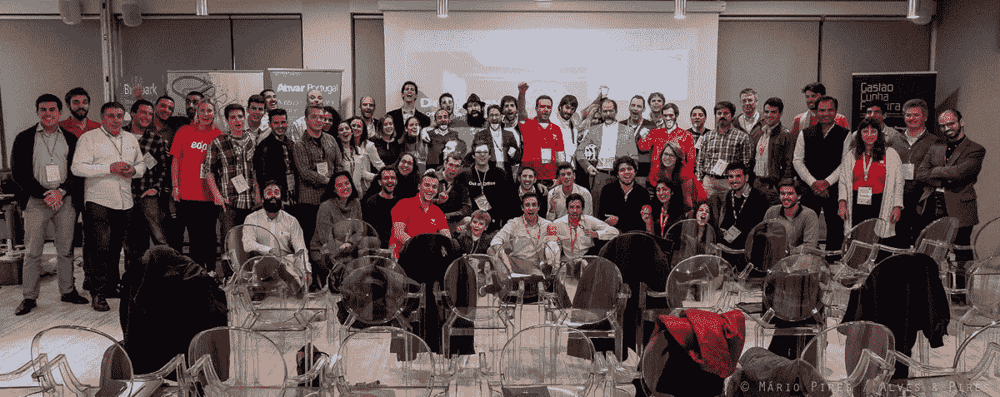

Pirates #family

假设你有一个硬件设备的想法，可能是一个面向消费市场或商业的联网设备。你去哪里？

在我和其他十几个创始人决定创建产品化协会之前，这个问题我们已经听过好几次了。在过去的 7 年里，我参与了几个创业加速器，亲眼目睹了本地创业生态系统从几乎为零发展到今天的样子，组织了许多版本的创业周末(并在这里写了关于缺乏好的创业想法的文章)，并共同创立了 Beta-i， 然后是里斯本挑战加速器——从很多方面来说，我觉得我们赢得了一场大战——里斯本生态系统已经淡出人们的视线太久了，最终在欧洲得到了媒体应有的关注，这也受到了都柏林网络峰会、TalkDesk 等明星新贵和 Lisbon Challenge 等国际公认的加速器以及 Startup Lisboa 和 Fabrica de Startups 等世界级孵化器的推动。

# 一场战斗胜利了。赢得更多。

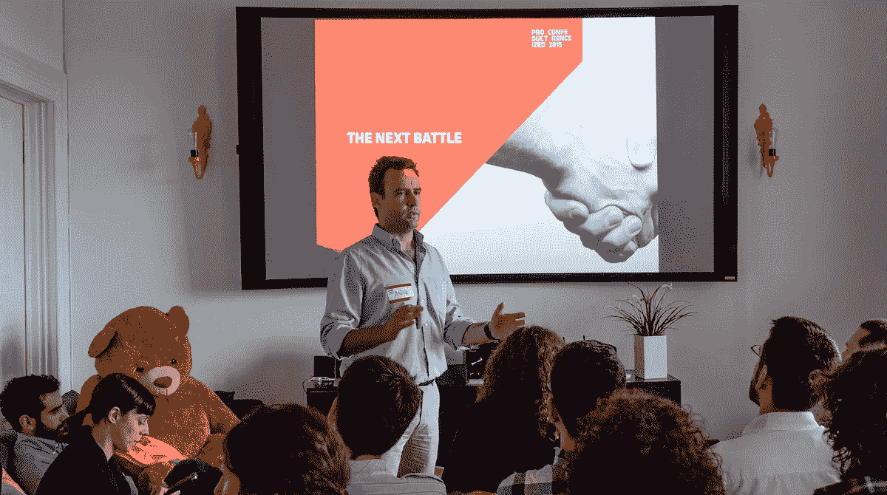

The teddy bear is MIA.

尽管里斯本的创业场景令人兴奋，但它并没有反映在“实体经济”中，在许多方面，葡萄牙经济仍然受到低生产率的困扰，即使葡萄牙在信息和通信技术(ICT)领域发展了一些公司，该领域占全国 GDP 的 4.5%，但在创建开发高技术密度、可出口和在国际市场上具有竞争力的产品的公司方面，它的表现并不差。在这种情况下，国家信通技术公司仍然高度依赖开发边际成本非常高的解决方案和服务，因此很难开发可扩展的产品化解决方案。

随着建立移动和网络软件创业公司的艺术和科学被数百个在这个领域工作的组织所掌握。曾经被视为评估和发展 SaaS 商业的魔法，现在已经相当标准了。加速生态系统已经形成了一个市场平衡，欧洲的加速器往往会提供非常相似的交易，此外，风投的质量更加透明，种子交易完全相同。事实上，大多数加速器都是一样的，因为它们都是 Y-Combinator 的克隆体，Y-Combinator 开创了这个行业，并有 SaaS 商业模式的成功案例。

# **产品比以往更有意义。**

但是，如果你想发展产品公司，或者如果你想冒险进入一家硬件创业公司，或者将 R&D 推向市场，选择就少得多了，你必须准备走一条人迹罕至的道路。

用峡湾首席服务设计师[亚历克斯·琼斯](/@alexmarkjones)的话来说，软件灵丹妙药正让我们淹没在无菌应用的海洋中，我们根本不再*接触这个世界。现在，我们所做的一切都可以通过一层防刮擦玻璃来访问和控制。在越来越多的情况下，我们甚至失去了像声音命令和手势这样管理我们与越来越多的生活之间的界面的*。**

在 Productized，我们相信创造更好的产品是下一场要赢得的战斗，所以我们在 2015 年组织了 Productized 会议(见下面的视频)和一些每月活动 Productized Talks，以组织葡萄牙新生的产品和硬件初创公司。

# 与海盗合作

因此，当我们在 2015 年春天联系 Startup Pirates 团队，在里斯本组织 Startup Pirates 2015(第一届完全致力于硬件项目)时，他们的回答非常热情，这促使我们继续前进。我们考虑了几个日期来组织第一次硬件创业预加速器，首先我们试图在 7 月组织，然后是 9 月，然后是 12 月。在所有的互动中，初创公司 Pirates 团队都超级友好，理解我们的多次延迟，大部分是因为产品化的会议。我们最终决定在 2015 年底前组织这次活动，从 12 月 12 日持续到 19 日。

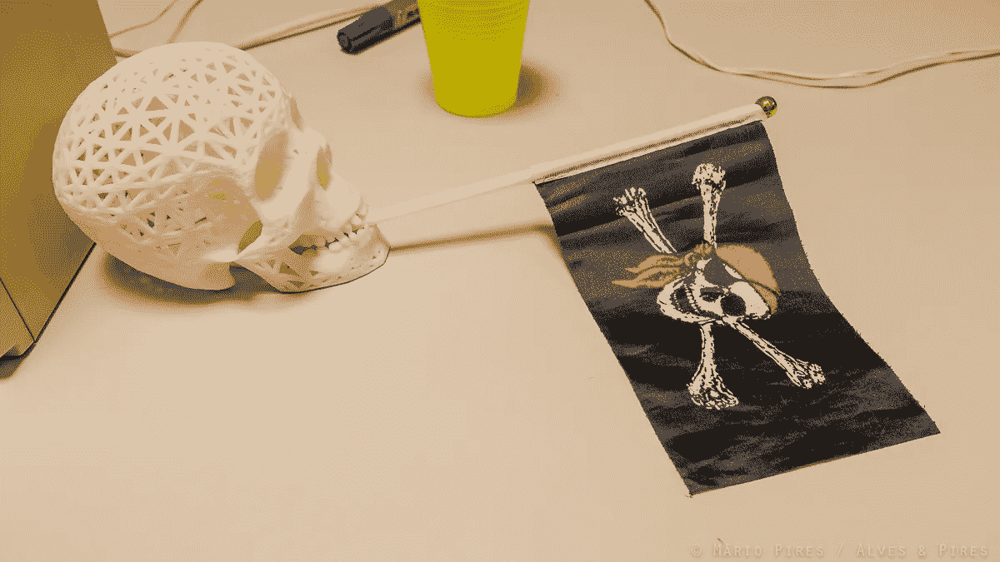

在规划活动议程时，我们与欧洲硬件加速领域的关键人物进行了交谈，包括 Startup Weekend Makers 的 Damien Cavaillès 和德国 hardware 的联合创始人 Jeff Katz。他们给了我们宝贵的反馈，告诉我们应该在本周的活动安排中包含哪些主题。

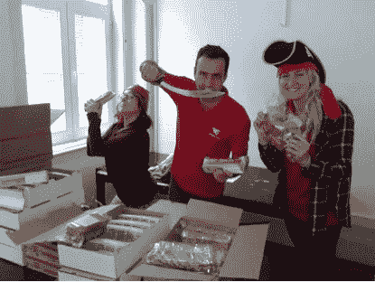

Part of our team working (from left to right - Karelle, André, and Noora). This picture captures well the team spirit.

# 海盗、无人机和网络鲨鱼

## 飞行四轴飞行器

从我以前运行其他加速器的经验中，我也知道团队建设活动对于帮助参与者在他们的旅程中建立强大的相互沟通技能至关重要。

> “我喜欢在那个房间里建立的友谊。一开始的团队建设真的很有帮助。”

因此，对于初创公司海盗硬件版，我们决定在计划的最开始加入一个团队建设研讨会，即第一层挑战，挑战团队从基本材料组装一个工作的四轴飞行器，因为我们认为这将是一个有趣、机智的方式，帮助团队建立信心，建立一个甚至是创造性活动的方法。我们收到的批评之一是，TF1C 研讨会需要更长时间，以便人们理解背后的 PM 方法，而不仅仅是建造四轴飞行器的工程挑战。无论哪种方式，实际上建造一架四轴飞行器，参与者最终自己飞行并相互竞争是非常有趣的。

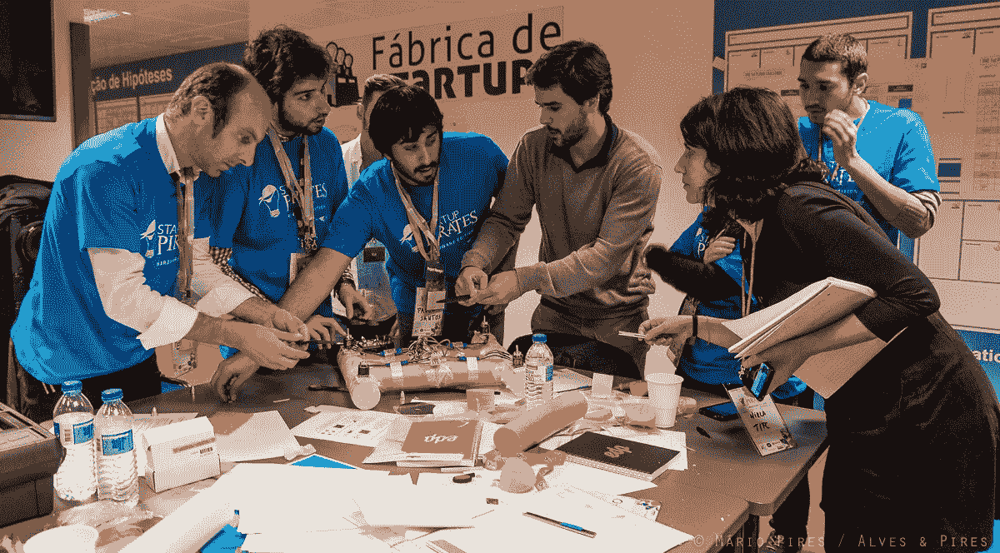

“Let me cut first”

> "最好是在项目团队成立后再举办(团队建设)研讨会."

每次我组织一个加速项目，我都会吸取很多经验教训 TF1C 的主要目的之一是帮助 SP 里斯本版的参与者创建更好的团队！从这个意义上来说，TF1C 工作得非常好，因为最终成立的 10 个团队在整整一周的时间里坚如磐石！尽管如此，从项目管理的角度来看，也许我们可以在团队成立后安排这个研讨会。

## **推介培训和业务发现比演示日的工作原型更重要……**

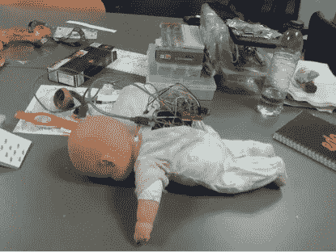

“Let me sleep a little bit more”

> “太过关注硬件，而没人能完成原型。让每个小组都强调了这一点……”

非常早期的硬件项目在没有至少一个原型的情况下是无法建立用户群的——你最多可以建立预购订单和支持者，但没有真正的用户。但是，这不应该阻止团队追求产品的市场适应性！因此，我们得到的教训是，组织硬件预加速并重点关注 MVP 原型是一个错误，他们应该花更多的时间在建筑之外。

## **团队拼尽全力开发工作原型**

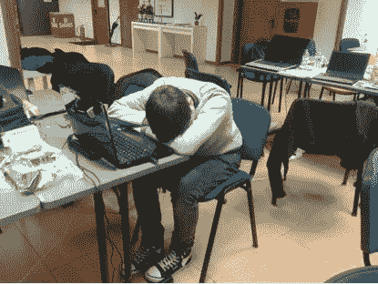

“I code and hack 24h/7”

对于一周前的加速器格式，进行硬件加速是非常棘手的。我认为最大的收获之一是，我们应该更加关注“正常”的加速主题，如业务发展、精益创业、商业模式画布——因为我们认为这些*面包和黄油*主题仍然是硬件项目的核心。相反，团队被要求在周末之前完成工作原型，没有时间做基本的市场验证。

## **你不需要大量的 3D 打印机来制作原型…**

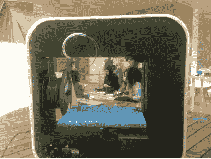

…也没有焊台，但你仍然需要一些。我建议每 10 名参与者配备一对焊台/ 3D 打印机。我们有两个工作站和 3D 打印机，一直很忙，但我们仍然设法做到了。

> “这是一个非常好的交流氛围。非常好和有帮助的导师和组织者。”

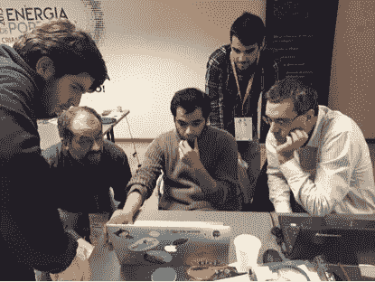

我们很幸运有最好的演讲者和导师。在初创公司《里斯本海盗》(Pirates Lisbon)中，我们有一个很棒的阵容，每个研讨会都是由我们非常感谢的专家举办的。我们对工作演示的质量感到非常自豪。这是唯一可能的，因为所有的团队和导师在项目的 8 天里疯狂地工作。

# 走木板。小心鲨鱼！

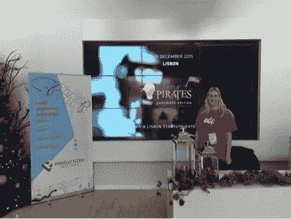

Demoday at Microsoft Portugal

我们花了一些时间来写这篇文章，这样我们就可以了解距离创业公司 Pirates Lisbon 的结束还有一个月的时间，有多少团队正在为以后的加速计划推进他们的项目，从最初的 10 个项目中，有 3 个团队仍然活着。

我们真的很自豪项目阿丽亚娜，一个连接自行车报警已被选中展示他们的项目在鲨鱼坦克葡萄牙！将在夏季之前播出。祝他们好运！

> “如果没有产品化团队中所有优秀人员的宝贵帮助，我们永远也不会成功。谢谢……真的！”-阿丽亚娜联合创始人。

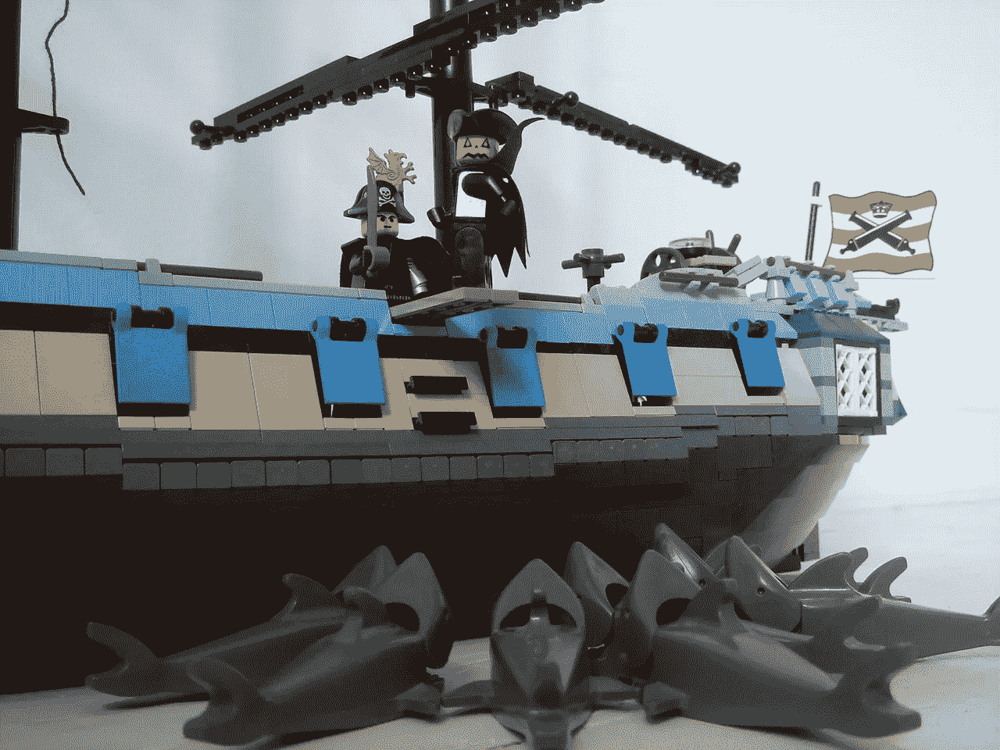

# 海盗就要当海盗！

Pirates also kill monsters :)

我们在组织第一届硬件会议时遇到了非常具体的问题，所以从某种意义上说，我们是实验室的小白鼠，我们知道我们将在未知的水域航行，现在还不清楚葡萄牙是否有硬件创业加速器的市场空间。但是，我们已经在考虑下一个挑战了。敬请期待！

> [黑客中午](http://bit.ly/Hackernoon)是黑客如何开始他们的下午。我们是 [@AMI](http://bit.ly/atAMIatAMI) 家庭的一员。我们现在[接受投稿](http://bit.ly/hackernoonsubmission)，并乐意[讨论广告&赞助](mailto:partners@amipublications.com)机会。
> 
> 如果你喜欢这个故事，我们推荐你阅读我们的[最新科技故事](http://bit.ly/hackernoonlatestt)和[趋势科技故事](https://hackernoon.com/trending)。直到下一次，不要把世界的现实想当然！

