# 将混沌工程原理应用于具有延迟注入的 AWS Lambda

> 原文：<https://medium.com/hackernoon/chaos-engineering-and-aws-lambda-latency-injection-ddeb4ff8d983>

## 我们可以对用 API Gateway 和 AWS Lambda 创建的 API 应用延迟注入。我们的方法应该允许我们配置何时向我们的 API 端点添加任意延迟(以及添加多少),以确保使用适当的超时值来调整服务间通信。

这是一个多部分系列的第 2 部分，探讨了如何将混沌工程的原理应用于围绕 Lambda 函数构建的无服务器架构。

*   第一部分:我们如何将混沌工程的原理应用于 Lambda？
*   **第 2 部分:为 API 应用延迟注入**
*   第 3 部分:处理延迟峰值和超时(将于 2017 年 11 月 21 日发布)
*   第 4 部分:为 Lambda 函数应用故障注入(来了？)

我在生产中遇到的最常见的问题是与延迟/性能相关的。它们可能是一系列潜在原因的症状，从 AWS 网络问题(也可能表现为任何 AWS 服务中的延迟/错误率峰值)、过载的服务器到简单的 GC 暂停。

**延迟峰值是不可避免的**——尽管你可以提高应用程序的性能，但事情最终还是会出错，而且往往超出你的控制。

所以你必须为他们设计，优雅地降低你的应用程序的质量**以最小化对你的用户的影响。**

**对于 API Gateway 和 Lambda，还有一些额外的考虑:**

*   ****API Gateway 对于集成点有一个 29 秒超时的硬限制**，所以即使您的 Lambda 函数可以运行 5 分钟，API Gateway 也会在此之前超时**

**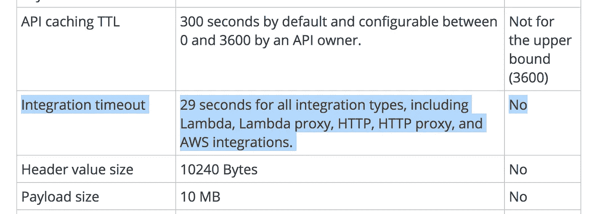**

*   **你需要考虑**冷启动**的效果，这[受到语言运行时和内存分配](https://read.acloud.guru/does-coding-language-memory-or-package-size-affect-cold-starts-of-aws-lambda-a15e26d12c76)的严重影响。中间服务的冷启动很容易导致外部服务超时。**

**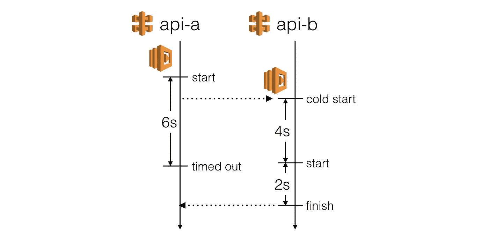**

**If you use moderate timeout settings for your API functions (and you should!) then you need to consider the effects of cold starts when calling an intermediate service.**

# **在哪里注入延迟**

**假设我们的客户端应用程序直接与两个面向公众的 API 通信，而这两个 API 又依赖于一个内部 API。**

**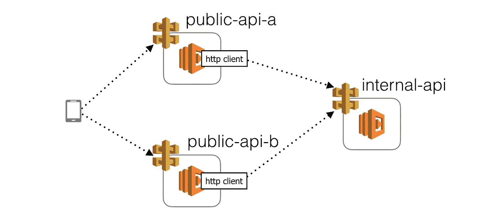**

**在这个设置中，我可以想到 3 个可以注入延迟的地方，每个地方都可以验证不同的假设。**

## **在 HTTP 客户端注入延迟**

**第一个也是最容易引入延迟的地方是我们用来与内部 API 通信的 HTTP 客户端库。**

**这将测试我们的函数**在这个 HTTP 通信上有适当的超时，并且当这个请求超时**时可以正常降级。**

**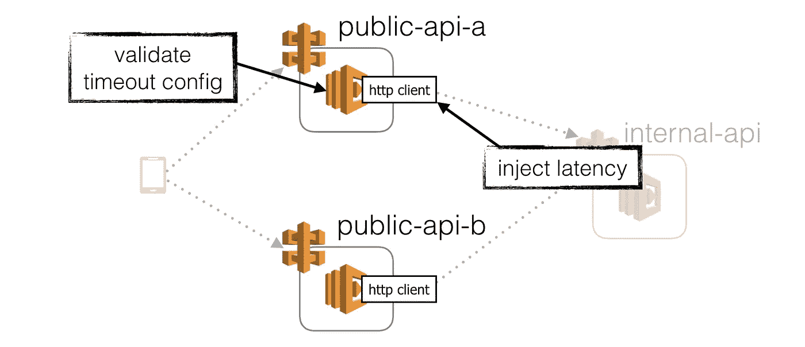**

**We can inject latency to the HTTP client libraries for our internal APIs, hence validating that the caller function has configured appropriate timeout and error handling for timeouts.**

**此外，这种做法**也应该适用于我们依赖的其他第三方服务**，比如 DynamoDB。我们将在稍后的帖子中讨论*如何*给这些第三方库注入延迟。**

**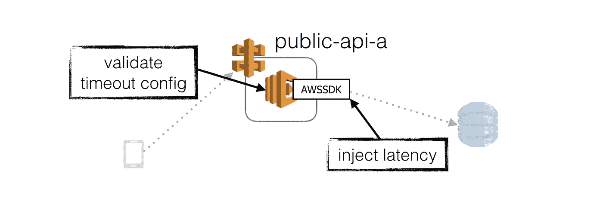**

**We can also inject latency to 3rd party client libraries for other managed services we depend on.**

**这是一个相当安全的注入延迟的地方，因为*即时*爆炸半径受限于这个函数。**

**但是，您可以(也可以说应该)考虑将这种类型的延迟注入也应用到中间服务中。这样做确实会带来额外的风险，因为它在故障情况下有更大的爆炸半径。如果测试中的功能没有正常降级，那么它可能会给外部服务带来意想不到的问题。在这种情况下，这些故障案例的爆炸半径与您直接向中间功能注入延迟的情况相同。**

## **给中间函数注入延迟**

**您也可以直接向函数本身注入延迟(稍后我们将查看*如何*)。这与向 HTTP 客户端的每个依赖项注入延迟具有相同的效果，只是它会立即影响所有的依赖项。**

**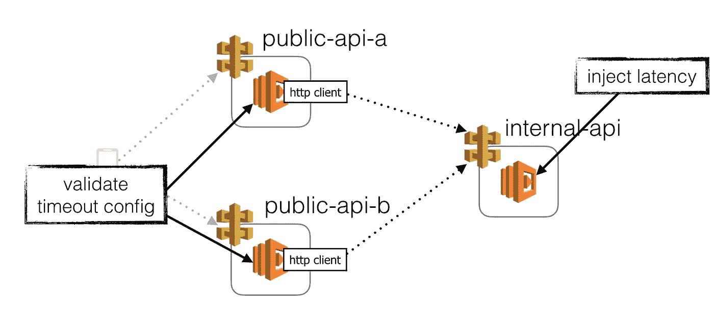**

**We can inject latency to a function’s invocation. If that function is behind an internal API that are used by multiple public-facing APIs then it can cause all its dependents to experience timeouts.**

**这看起来有风险(有可能)，但这是一种有效的方法来验证依赖于这个 API 端点的每个服务都是*期望*的，并且优雅地处理超时。**

**当应用于由同一个开发团队维护的有界上下文(或微服务)的中间 API 时，这是最有意义的。这样，您可以避免将混乱释放给那些可能没有准备好处理混乱的毫无戒心的开发人员。**

**也就是说，我认为这样做有一个很好的反驳理由。**

**我们经常陷入使用开发环境的性能特征作为生产环境的预测器的陷阱。虽然我们在开发环境中很少遇到与负载相关的延迟问题——因为我们在这些环境中没有足够的负载——但生产却完全是另一回事。这意味着，我们没有被*编程为*在开发过程中考虑这些故障模式。**

**因此，[侵入你的开发伙伴的大脑](http://jlouisramblings.blogspot.co.uk/2012/12/hacking-brains-of-other-people-with-api.html)并对他们进行编程以期待超时的一个好方法是，通过在开发环境中向我们的内部 API 注入延迟，在开发环境中定期向他们暴露这些故障模式。**

**事实上，如果我们让我们的开发环境展现出我们的系统**应该处理**的最恶劣和最混乱的条件，那么我们肯定知道任何进入生产的系统都**准备好面对在野外等待它的事情**。**

**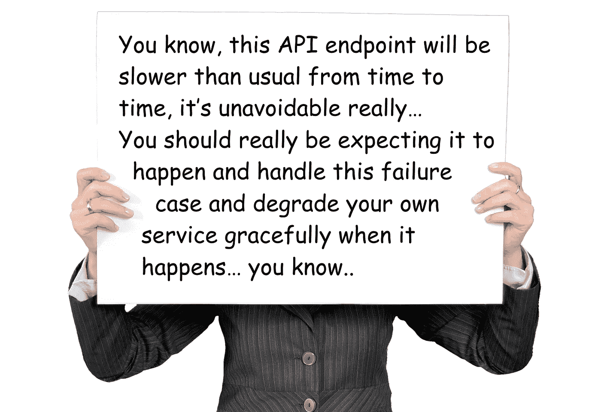**

**We can figuratively hold up a sign and tell other developers to expect latency spikes and timeouts by literally exposing them to these scenarios in dev environments, regularly, so they know to expect it.**

## **向面向公众的函数注入延迟**

**到目前为止，我们一直专注于验证 API 中延迟峰值和超时的处理。我们的客户端应用程序需要同样的验证。**

**我们可以在这里应用上面提到的所有相同的论点。通过向面向公众的 API 函数注入延迟(在生产和开发环境中)，我们可以:**

*   **验证客户端应用程序是否恰当地处理延迟峰值和超时，并在这些情况下尽可能提供最佳 UX**
*   **培训我们的客户端开发人员，以应对延迟峰值和超时**

**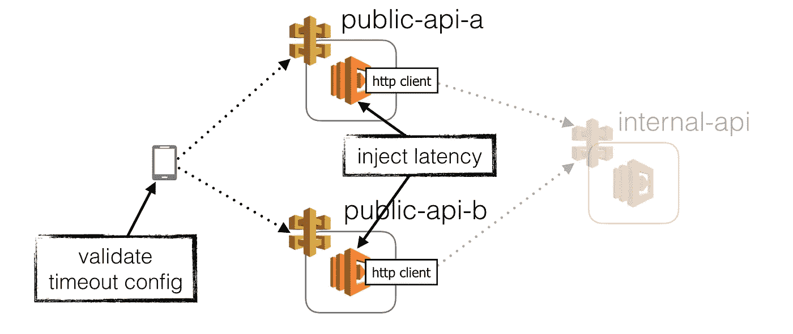**

**几年前我在 Gamesys 开发 MMORPG 的时候，当我们[向我们的 API 注入延迟峰值和故障](http://theburningmonk.com/2015/04/design-for-latency-issues/)时，我们发现了游戏中的许多弱点。如果最初几个请求中的任何一个失败，游戏就会在启动时崩溃。在某些情况下，如果响应时间超过几秒钟，那么游戏也会因为竞争条件而进入一个奇怪的状态。**

**结果是我让我的同事在生产中失败，因为开发环境太宽容了，给了他们一种虚假的舒适感。**

**至此，我们来谈谈*如何*应用延迟注入的实践。**

**但是等等，你不能在客户端 HTTP 客户端也注入延迟吗？**

***绝对！你应该这么做！然而，为了这篇文章的目的，我们将看看如何以及在哪里我们可以只给我们的 Lambda 函数注入延迟，因此我故意忽略了等式的这一部分。***

# **如何注入延迟**

**实际引入延迟有两个方面:**

1.  **增加操作延迟**
2.  **配置添加频率和延迟时间**

**如果你读过我以前的关于[捕获和转发关联 id](https://hackernoon.com/capture-and-forward-correlation-ids-through-different-lambda-event-sources-220c227c65f5)和[用 SSM 参数存储管理配置](https://hackernoon.com/you-should-use-ssm-parameter-store-over-lambda-env-variables-5197fc6ea45b)的帖子，那么你已经看到了我们需要做这两项工作的基本构件。**

## **如何给 HTTP 客户端注入延迟**

**由于您不太可能从头开始编写 HTTP 客户端，所以我认为向 HTTP 客户端和第三方客户端(如 AWS SDK)注入延迟的问题是同一个问题。**

**我想到了几个解决方案:**

*   **在静态语言中，你可以考虑使用静态 weaver，比如 AspectJ 或 PostSharp，这是我之前采用的方法**
*   **在静态语言中，您可以考虑使用动态代理，这是许多 IoC 框架提供的(AOP 的另一种形式)**
*   **您可以**为客户端**创建一个包装器，既可以手动创建，也可以使用工厂函数创建(bluebirdjs 的`promisifyAll`函数就是一个很好的例子)**

**因为我将使用 Node.js 作为例子，所以我将把重点放在包装器上。**

**对于 HTTP 客户端，考虑到您需要的方法数量相对较少，手工制作包装器是可行的，尤其是如果您有特定的 API 设计的话。**

**使用我为 [correlation ID post](https://hackernoon.com/capture-and-forward-correlation-ids-through-different-lambda-event-sources-220c227c65f5) 创建的 HTTP 客户端作为基础，我修改了它以接受一个配置对象来控制延迟注入行为。**

```
{
  "isEnabled": true,
  "probability": 0.5,
  "minDelay": 100,
  "maxDelay": 5000
}
```

**你可以在这里找到这个修改过的 HTTP 客户端[，下面是这个客户端的简化版本(它在引擎盖下使用了`superagent`)。](https://github.com/theburningmonk/lambda-latency-injection-demo/blob/master/lib/http.js)**

**为了配置函数和延迟注入行为，我们可以使用我最初在 [SSM 参数存储帖子](https://hackernoon.com/you-should-use-ssm-parameter-store-over-lambda-env-variables-5197fc6ea45b)中创建的`configClient`。**

**首先，让我们在 SSM 参数存储中创建配置。**

**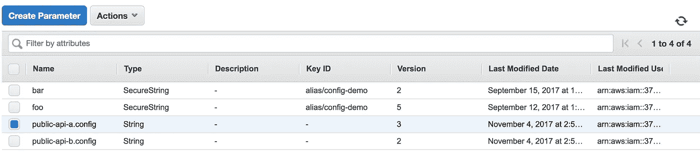**

**You can create and optionally encrypt parameter values in the SSM Parameter Store.**

**配置包含内部 API 的 URL，以及一个`chaosConfig`对象。目前，我们只有一个`httpClientLatencyInjectionConfig`属性，用于控制 HTTP 客户端的延迟注入行为。**

```
{ 
  "internalApi": "https://xx.amazonaws.com/dev/internal", 
  "chaosConfig": {
    "httpClientLatencyInjectionConfig": {
      "isEnabled": true,
      "probability": 0.5,
      "minDelay": 100,
      "maxDelay": 5000
    }
  } 
}
```

**使用前面提到的`configClient`，我们可以在运行时从 SSM 参数存储中获取 JSON 配置。**

```
const configKey = "public-api-a.config";
const configObj = configClient.loadConfigs([ configKey ]);let config = JSON.parse(yield configObj["public-api-a.config"]);
let internalApiUrl = config.internalApi;
let chaosConfig = config.chaosConfig || {};
let injectionConfig = chaosConfig.httpClientLatencyInjectionConfig;let reply = yield http({ 
  method : 'GET', 
  uri : internalApiUrl, 
  latencyInjectionConfig: injectionConfig 
});
```

**当我们向`internal-api`发出 HTTP 请求时，上面的配置给了我们 50%的机会注入 100 毫秒到 5 秒之间的延迟。**

**这反映在下面的 X 射线跟踪中。**

**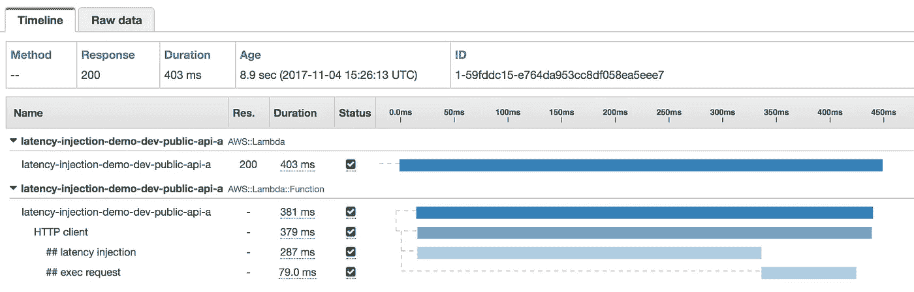**

**From this X-Ray trace, you can see that 287ms of latency was injected to the HTTP request.**

****

**In this trace, you see the amount of latency injected was a hefty 3.4 sec!**

**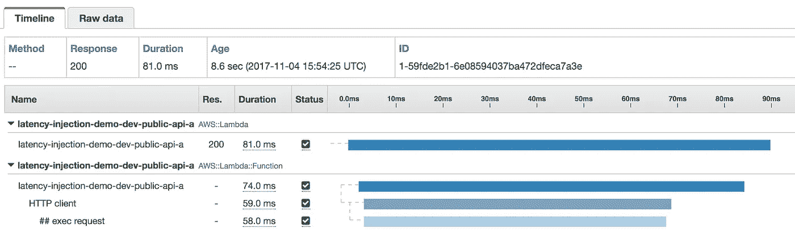**

**From this X-Ray trace, you can see no latency was injected to the HTTP request, so the overall invocation time was also very small by comparison.**

## **如何给 AWSSDK 注入延迟**

**使用 AWS SDK，手工制作包装器是不可行的。相反，我们可以使用类似于蓝鸟的工厂功能。**

**我们可以在这里应用同样的方法，我做了一个简单的尝试。*我必须补充一点，虽然我认为自己是一名* [*称职的*](https://en.wikipedia.org/wiki/Dreyfus_model_of_skill_acquisition)*Node.js/Javascript 程序员，但我确信有更好的方法来实现这个工厂功能。***

**我的工厂函数只适用于承诺对象(告诉过你这很粗糙)..)，并用一个包装器替换它们的`xxxAsync`函数，该包装器接受该形状的另一个参数:**

```
{
  "isEnabled": true,
  "probability": 0.5,
  "minDelay": 100,
  "maxDelay": 3000
}
```

**同样，这很笨拙，但是我们可以从 AWS SDK 中取出`DocumentClient`,用 bluebird 对其进行承诺，然后用我们自己的包装器工厂包装承诺的对象。然后，我们可以用可选参数调用它的异步函数来控制延迟注入行为。**

**您可以在`public-api-b`的处理函数中看到这一点。**

**出于某种原因，包装功能无法记录 X 射线中的子段。我怀疑这是 Javascript 或 X-Ray SDK 的一些细微差别，我没有完全理解。**

**尽管如此，从日志判断，我可以确认包装的函数确实给对 DynamoDB 的`getAsync`调用增加了延迟。**

**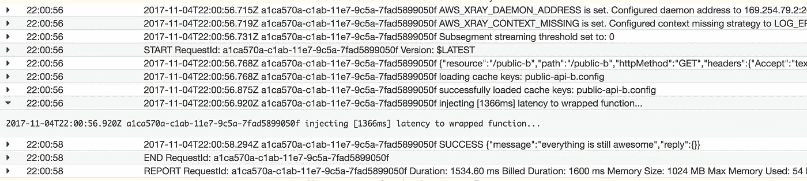**

**如果你知道一种改进工厂功能的方法，或者通过包装功能获得 X 射线追踪工作，请在评论中告诉我。**

## **如何给函数调用注入延迟**

**我在[关联 ID 帖子](https://hackernoon.com/capture-and-forward-correlation-ids-through-different-lambda-event-sources-220c227c65f5)中创建的`apiHandler`工厂函数是应用我们希望从 API 函数中得到的**通用实现模式**的好地方，包括:**

*   **将事件源记录为调试**
*   **记录调用的响应和/或错误(令人惊讶的是，Lambda 在默认情况下并不捕捉这些)**
*   **初始化全局上下文(例如，用于跟踪相关 id)**
*   **处理响应对象的序列化**
*   **等等..**

```
// this is how you use the apiHandler factory function to create a
// handler function for API Gateway event source
module.exports.handler = apiHandler(
  co.wrap(function* (event, context) {
    ... // do bunch of stuff

    // instead of invoking the callback directly, you return the
    // response you want to send, and the wrapped handler function
    // would handle the serialization and invoking callback for you
    // also, it takes care of other things for you, like logging
    // the event source, and logging unhandled exceptions, etc.
   return { message : "everything is awesome" };
  })
);
```

**在这种情况下，这也是我们向 API 函数注入延迟的好地方。**

**然而，要做到这一点，我们需要访问该功能的配置。是时候解除将配置提取到`apiHandler`工厂的责任了！**

**完整的`apiHandler`工厂函数可以在[这里](https://github.com/theburningmonk/lambda-latency-injection-demo/blob/master/lib/apiHandler.js)找到，下面是说明这一点的简化版本。**

**现在，我们可以像下面这样编写我们的 API 函数。**

**既然`apiHandler`已经可以访问函数的配置，那么它也可以访问`chaosConfig`对象。**

**让我们扩展`chaosConfig`对象的定义，添加一个`functionLatencyInjectionConfig`属性。**

```
"chaosConfig": {
  "functionLatencyInjectionConfig": {
    "isEnabled": true,
    "probability": 0.5,
    "minDelay": 100,
    "maxDelay": 5000
  },
  "httpClientLatencyInjectionConfig": {
    "isEnabled": true,
    "probability": 0.5,
    "minDelay": 100,
    "maxDelay": 5000
  }
}
```

**有了这个额外的配置，我们可以修改`apiHandler`工厂函数，用它给函数调用注入延迟，就像我们在 HTTP 客户端所做的一样。**

**就像这样，我们现在可以通过配置给函数调用注入延迟。这将适用于任何使用`apiHandler`工厂创建的 API 函数。**

**有了这一改变和两种类型的延迟注入，我可以通过 X 射线观察所有预期的场景:**

*   **没有注入延迟**

****

*   **延迟仅被注入到函数调用中**

**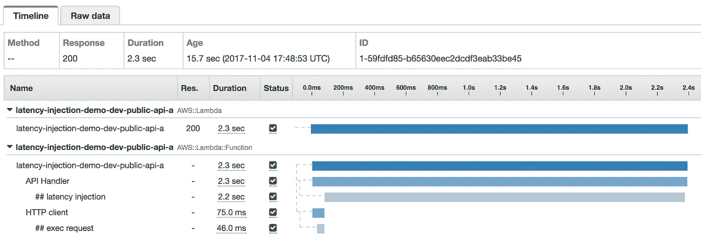**

*   **延迟仅注入到 HTTP 客户端**

**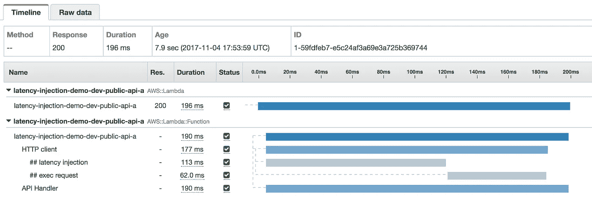**

*   **HTTP 客户端和函数调用都有延迟，但是调用并没有因此超时**

**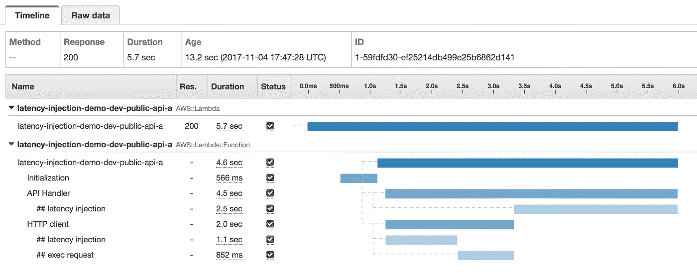**

*   **HTTP 客户端和函数调用都存在延迟，结果导致调用超时**

**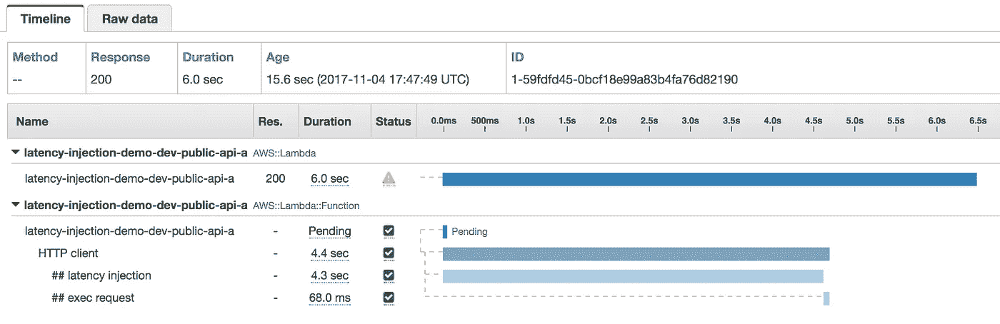**

**我可以通过日志和 X 射线轨迹中记录的元数据进一步确认预期的行为。**

**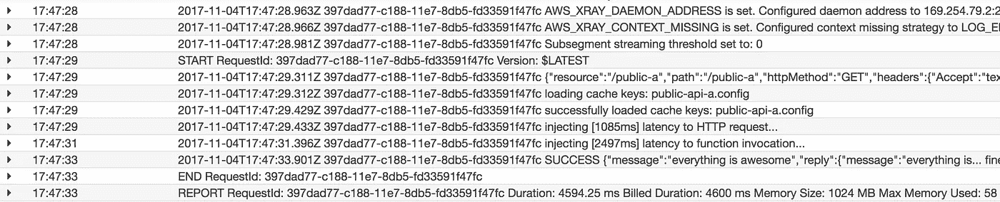**

**From the logs, you can see how much latency was injected.**

**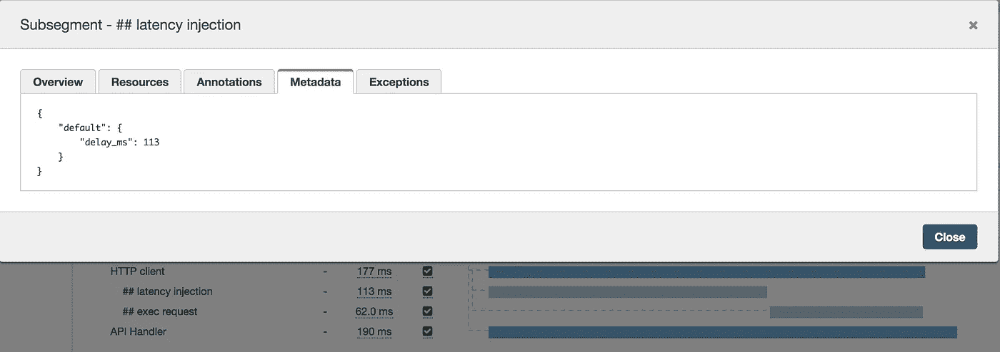**

**The amount of injected latency was also recorded as metadata in the X-Ray trace as well.**

# **总结和未来的工作**

**在这篇文章中，我们讨论了:**

*   **为什么您应该考虑将延迟注入的实践应用到用 API Gateway 和 Lambda 创建的 API 中**
*   **特定于 API 网关和 Lambda 的其他注意事项**
*   **您可以在哪些地方引入延迟，以及为什么应该考虑在这些地方引入延迟**
*   **如何在 HTTP 客户端、AWS SDK 以及函数调用中引入延迟**

**我们在这里讨论的方法是由配置驱动的，默认情况下配置[每 3 分钟刷新一次](https://github.com/theburningmonk/lambda-latency-injection-demo/blob/master/lib/configClient.js#L9)。**

**我们可以更进一步。**

## **细粒度配置**

**配置可以更细粒度，并允许您控制特定资源的延迟注入。**

**例如，配置可以特定于一个 API 或一个 DynamoDB 表，而不是针对所有 HTTP 请求(包括对 AWS 服务的请求)的一揽子`httpClientLatencyInjectionConfig`。**

## **自动化**

**这些配置可以通过自动化流程进行更改，以便:**

*   **每天运行例行验证**
*   **在下班时间和节假日停止所有延迟注入**
*   **强制停止所有延迟注入，例如在实际断电期间**
*   **编排难以手动管理的复杂场景，例如，同时在几个地方启用延迟注入**

**同样，我们可以向网飞寻求这样一个自动化平台的灵感。**

**通常，您会希望在有限的上下文中一次启用一个延迟注入。这有助于控制意外伤害的爆炸半径，并确保你的实验实际上是由*控制的*。此外，当潜伏期在几个地方注入时，由于有多个变量需要考虑，因此更难理解我们观察到的因果关系。**

**当然，除非你在验证特定的假设，比如:**

> **根据用户偏好，系统可以容忍**主存储(DynamoDB)和备份存储(S3)的中断，并在这种情况下返回硬编码的默认值。****

## **更好的沟通**

**另一件要做的事情是通知调用者延迟已经被故意添加到调用中。**

**这可能采取响应中 HTTP 头的形式，告诉调用者总共注入了多少延迟。如果您使用自动化过程来生成这些实验，那么您还应该将实验的特定实例的 id/tag/name 作为 HTTP 头包含进来。**

# **下一步是什么？**

**正如我在上一篇文章中提到的，在决定何时何地应用混沌工程实践时，你需要运用常识。**

**不要尝试你知道超出你能力的练习。**

**在您考虑将延迟注入应用到生产中的 API 之前，您需要考虑如何在 API Gateway 和 Lambda 的内在约束下处理这些延迟峰值。**

**不幸的是，我们已经没有时间在本帖中讨论这个问题了，但是两周后再回来，我们将在第 3 部分讨论你可以采用的几种策略。**

**这篇文章中演示的代码可以在 github [这里](https://github.com/theburningmonk/lambda-latency-injection-demo/)找到。请随意使用它，如果您有任何改进的建议，请告诉我！**

# **参考**

*   **[用 API 设计黑别人的脑子](http://jlouisramblings.blogspot.co.uk/2012/12/hacking-brains-of-other-people-with-api.html)**
*   **[针对延迟问题的设计](http://theburningmonk.com/2015/04/design-for-latency-issues/)**
*   **[通过不同的 Lambda 事件源捕获和转发关联 id](https://hackernoon.com/capture-and-forward-correlation-ids-through-different-lambda-event-sources-220c227c65f5)**
*   **[你应该在 Lambda 环境变量上使用 SSM 参数存储](https://hackernoon.com/you-should-use-ssm-parameter-store-over-lambda-env-variables-5197fc6ea45b)**
*   **[章节:混沌自动化平台](/netflix-techblog/chap-chaos-automation-platform-53e6d528371f)**

****

**嗨，我叫**崔琰**。我是一个 [**AWS 无服务器英雄**](https://aws.amazon.com/developer/community/heroes/yan-cui/) 和 [**量产无服务器**](https://bit.ly/production-ready-serverless) 的作者。我已经在 AWS 中运行了近 10 年的大规模生产工作负载，我是一名架构师或首席工程师，涉足从银行、电子商务、体育流媒体到移动游戏等多个行业。我目前是一名专注于 AWS 和无服务器的独立顾问。**

**你可以通过[邮箱](mailto:theburningmonk.com)、[推特](https://twitter.com/theburningmonk)和 [LinkedIn](https://www.linkedin.com/in/theburningmonk/) 联系我。**

**查看我的新课程，[**AWS 步骤功能完全指南**](https://theburningmonk.thinkific.com/courses/complete-guide-to-aws-step-functions) 。**

**在本课程中，我们将介绍有效使用 AWS Step Functions 服务所需了解的一切。包括基本概念、HTTP 和事件触发器、活动、设计模式和最佳实践。**

**点击获取您的副本[。](https://theburningmonk.thinkific.com/courses/complete-guide-to-aws-step-functions)**

****

**来了解 AWS Lambda: CI/CD 的操作性**最佳实践**，本地测试&调试功能、日志记录、监控、分布式跟踪、canary 部署、配置管理、认证&授权、VPC、安全性、错误处理等等。**

**还可以用代码 **ytcui** 获得**票面价格 4 折**。**

**点击获取您的副本[。](https://bit.ly/production-ready-serverless)**