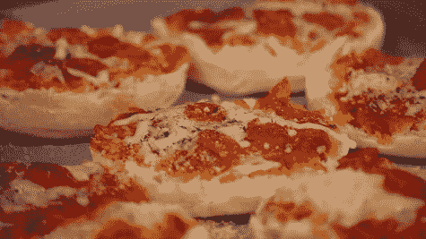

# 你没听过的比特币披萨故事。

> 原文：<https://medium.com/hackernoon/chapter-one-alice-and-bob-9fa315aeef62>

我说的不是第一笔比特币交易的真实故事，那是 1 万 BTC 换 2 个披萨。相反，我给你一个虚构的故事，但它与 2013-2017 年的比特币社区有着真实的相似之处。

# 第一章:爱丽丝和鲍勃

从前，两个非常要好的朋友(爱丽丝和鲍勃)决定开一家比萨饼店。确实需要，因为他们住在一个远离大城市的镇上，而且没有方便的地方可以买到比萨饼。事实上，一般来说没有很多地方可以吃到美味的食物。仔细想想，镇上真的只有一家餐馆，“菲亚特”。

2009 年，他们开店了。就像任何初出茅庐的生意一样，开始时也有困难，但在很短的时间内，每个人都来到了这家餐馆。

现在，一个特别的挑战是全尺寸的比萨饼面团暂时从餐馆供应公司脱销，所以起初，爱丽丝决定用小英式松饼做 3 英寸的比萨饼。

它们超级好吃。人们喜欢它。尽管…爱丽丝和鲍勃总是认为他们迟早会升级到“普通”的大披萨。

但是因为事情进行得如此顺利，它不是一个优先事项。

随着“爱丽丝”&鲍勃的“T1”越来越忙，他们意识到他们需要人来管理这个地方，所以他们贴出了一个招聘广告。不久之后，有一个关于工作的调查。

“你好，我叫格雷格。”那人说。他看上去 30 多岁。他穿着一件看起来不寻常的衬衫，有着不协调的几何形状和不和谐的颜色组合。他还有一把相当大的棕红色胡须，覆盖了整个脖子。

“如你所见，我的资历无可挑剔。我是披萨专家。”格雷格说，递给他们一份简历。

“我已经可以为您的运营提出几个 pip(披萨改进建议)。这里有多种非成本带宽解决方案。我可以看到你的比萨饼烤箱与食品柜台垂直，这是次优的。”

爱丽丝和鲍勃对此印象深刻。“哇，如果这家伙有他说话的一半好”，爱丽丝想。在接下来的几个月里，格雷格出色地管理了商店。

# 第二章:美食城的麻烦

一切都很好，但在接下来的几个月里，出现了一种奇怪的模式。每当“升级”到更大的比萨饼的话题出现时，格雷格似乎总是反对。一开始很微妙。

“你为什么要改变事情？一切都运转得这么好！”一天，他用鼓励的语气对爱丽丝说。

“嗯，我想……”爱丽丝大声想道。“只是更大的披萨才有意义。一直都是这么计划的。它甚至出现在最初的运营协议白皮书中。”

这种舞蹈持续了一段时间。提升比萨饼的尺寸毫无意义，但每次谈话都是一样的:格雷格似乎有这样或那样的理由让他们停下来。由于格雷格似乎对比萨饼和比萨饼店非常了解，鲍勃和爱丽丝不太愿意过多地争论这个问题。所以，罐子被踢到了路边。

餐馆继续发展，许多变化开始发生。

一天早上上班前，格雷格对鲍勃说:“你知道，我一直在想。真的没有那么多好的餐厅供应公司。我在考虑组建自己的团队。这对披萨店也有帮助。”

“哦。这很酷”鲍勃说，当时并没有多想。

格雷格决定将他的新公司命名为“Foodstream ”,因为它将带来稳定的食物和其他物资供应。他决定与一位食品行业的老前辈 Thwack 夫人合作。

20 年前，Thwack 发明了一种叫做“味道酱”的番茄酱，并因此声名鹊起，但此后就没怎么出过风头。

与此同时，爱丽丝和鲍勃正在向更多的地方扩张。他们不得不接受新的投资者，这对披萨连锁店来说是好事，但是突然间爱丽丝和鲍勃不是唯一做决定的人了。

所有重大变动都必须得到董事会其他成员的批准，其中许多人碰巧是中国人。格雷格一步步升到了分公司经理的位置，并设法获得了一个董事席位。

2015 年的一个晴朗的日子，鲍勃正在餐厅里屋的办公室里工作，这时有人敲门。是爱丽丝。

“鲍勃，我们需要谈谈。披萨结垢的问题已经闹得够大了。我们需要更大的披萨，而且越快越好。顾客开始抱怨了。我们总是承诺给他们全尺寸的披萨。其他餐馆也在全镇陆续开张。我们必须保持竞争力。”

“别担心”鲍勃说。我们周二见面时，我会向董事会提出此事。

# 第三章:食物流

Bob 希望董事会能毫无争议地批准升级。但这是不可能的。显然，格雷格关于保持小比萨饼和大比萨饼所有潜在问题的想法已经悄悄进入了集体思维。

鲍勃的陈述结束后，他等待董事会的反应。

“嗯……我们不能马上就去吃大披萨。格雷格说，如果我们这样做，将会引起混乱。

“我们*可以*有更大的披萨”，另一个说，“但我们必须达成共识。我们不能一家分店提供 12 英寸的披萨，而另一家分店提供 14 英寸的披萨。我们需要共识。”

这样的对话持续了一段时间，对于到底该怎么做有很多不同的意见。

第二天，爱丽丝问鲍勃:“怎么样？”。“爱丽丝，你可能不会相信，但成员们无法就何时增加比萨饼的尺寸，或者比萨饼应该有多大达成一致。”

“什么？!"爱丽丝怀疑地问。“你的意思是我们被 3 英寸的披萨困住了，因为我们对披萨实际应该有多大没有达成共识？"

“显然是这样。我开始觉得当初雇佣格雷格是个错误的决定。他给成员们提了一些似乎不再有意义的想法。我想知道它们以前怎么会对我们有意义。”

新闻媒体开始关注这个故事。当地的一个美食网站 RestaurantDesk 开始报道关于披萨的争论，并定期更新。过了一段时间，它成了所有人谈论的话题。

大约就在这个时候，另一件非常奇怪的事情发生了。格雷格的公司 FoodStream 宣布他们已经筹集了 7600 万美元的风险投资。奇怪的是，他们似乎没有实际的商业计划，也没有任何产品、服务或客户。事实上，他们甚至没有办公室。

鲍勃对此感到疑惑。

为什么格雷格被允许经营自己的公司，目标不明，但仍被允许在爱丽丝和鲍勃的工作？

但是解雇格雷格不再是鲍勃的决定了。成员们必须被说服，令人惊讶的是，他们中的大多数人并不真的对 Greg 或 FoodStream 有意见。事实上，他们似乎几乎被他那些听起来非常专业的话给迷住了。对他们来说，他是“披萨巫师”

# 第四章:面包迪克斯

随着“比萨饼规模”的争论开始变得令人绝望，格雷格给其他分店老板发了一份备忘录，宣布召开一次比萨饼会议，每个人都可以集思广益，一劳永逸地决定如何前进。

备忘录上写道，“我们将进行一次坦率而诚实的讨论”。“但我们要求每个人保持冷静和开放的心态。不一定会就具体的解决方案达成一致。”

爱丽丝非常生气。“这是某种玩笑吗？如果我们不能达成协议，那还有什么意义？”

尽管如此，会议还是召开了。

会议开始时，与会者就座，Thwack 夫人走向讲台。“谢谢你的到来”，她对着安装在木制讲台上的黑色金属麦克风平淡地说道。

“我期待着看到我创造 taste paste 时的那种创新精神。顺便说一下，比萨饼是用面团和奶酪调味的。我想你们都应该知道。关于我已经说得够多了，我想介绍一下 Foodstream 的另一位同事。”

“谢谢夫人，”彼得说。

一个黑发男子留着和格雷格一样的胡子，吸引了人群的注意力。

“所以，我想介绍一个提议，我们把传统的比萨饼分成不同的部分。我们要一片奶酪面包，然后是番茄酱。我称之为“面包迪克斯”…

在会议之后的几天里，许多人对 BreadStix 的这个新想法感到高兴。RestaurantDesk 和其他网站都称赞它。但是，爱丽丝和鲍勃不高兴。

“这是什么鬼东西？面包迪克斯？？我们的计划怎么了？披萨怎么了？”

# 第五章:巨魔

爱丽丝在最大的互联网论坛之一 pizzatalk 上创建了一个账户，并试图解释为什么更多的人没有看到正在发生的疯狂行为。

她的第一篇帖子题为“人们不想要大披萨吗？”一些人同意，但也有其他人不同意，其中许多人相当大声，咄咄逼人。

“面包迪克斯是更大的比萨饼”其中一个回答断言。"你实际上比普通的 3 英寸比萨饼得到了更多的面团和调味汁."

网上的叙述令人困惑。人们已经完全失去理智了吗？常识被扔出窗外了吗？随着这些问题受到越来越多的关注，事实证明事情比爱丽丝最初想象的还要糟糕。

Breadstix 需要更换很多烤箱，这也是 Greg 说大披萨首先会成为问题的原因之一。但是格雷格对这个想法非常乐观。

“看，升级到 Breadstix 将是可选的。不是所有的地方都必须这样做，所以真的没有问题。”

鲍勃试图和董事会成员讲道理。如果不会对烤箱产生太大的影响，也许他们会支持增加比萨饼的尺寸。他不再坚持要 14 英寸和 12 英寸的比萨饼，而是要了 10 英寸的。这肯定是合理的吗？

但是每个人似乎都没有紧迫感。鲍勃试着推荐 8 英寸的比萨饼。

“这太荒谬了。好吧，那 6 英寸的披萨呢？我的意思是，这仍然是一个非常小的个人比萨饼。怎么会有人对此有意见呢？鲍勃想知道。

但是成员们仍然需要被说服。这就成了下一轮的辩论。会员会选择 6 英寸的比萨饼还是面包迪克斯？

网上的争论变得更加激烈。这几乎就像是有人付钱给这些面包迪克斯的支持者，让他们去张贴和传播。想要 6 英寸比萨饼的董事会成员被指控“阻碍面包迪克斯”

一些真正想要大披萨的市民创造了一个名为“超大披萨”的计划，试图得到每个人的同意。只有 75%的人同意，才会改变披萨的大小。

但是，这个计划受到了攻击和审查，从网上论坛。

爱丽丝走进鲍勃的办公室，他们讨论了当前的形势。“我还是不明白我们是怎么来到这里的。为什么有些人认为面包迪克斯有天赋的权利出现在菜单上？事实上，为什么面包迪克斯甚至是一个选项？是谁先向别人要面包迪克斯的？这应该是一家**披萨**连锁店。”

# 第六章:阴谋

鲍勃不知道如何处理这种情况。这说不通。有些事就是不太对劲。所以，那天晚上，他打开电脑，开始挖掘…研究…甚至进一步挖掘。

他的发现令人震惊。

原来，Foodstream 与生产小蘸酱容器的公司签有合同。这是一个巨大的利益冲突！难怪格雷格想买面包迪克斯。

鲍勃还发现 RestaurantDesk 的母公司是数字餐厅集团，也是 FoodStream 的投资者。这一定是他们不断灌输面包迪克斯故事的原因。Foodstream 的其他大投资者与老牌菲亚特餐厅有联系。

不仅如此，数字餐厅集团还投资了许多新的竞争餐厅，这些餐厅开始在全镇涌现。

现在一切都开始有意义了。

鲍勃勃然大怒。在这个行业里，他一直都很冷静，但这令人难以置信。一个真正的阻止披萨的阴谋。

鲍勃全身心地投入到关于比萨饼的辩论中。他开始与真正的市民交谈，结果发现他们中的许多人都很愤怒。几乎所有人都想吃披萨，不像网上看起来的那样。

# 第七章:崩溃与重生

接下来的一周，Bob 参加了大都会地区的一个食品会议。他惊讶地发现那里几乎每个人都喜欢吃大披萨。显然你不能在会议上假装支持。

大多数人想要 16 英寸的比萨饼，并愿意为此付钱。

与此同时，格雷格的一个朋友被看到不时进出餐厅，卷入了这场争论。

现在这个家伙，没有人真正知道他的真名；他的绰号是“呕吐”，显然是因为他的暴食症。他也是一个宗教疯子，对他所做的一切都很狂热。

Puke 决定让每个人都得到面包迪克斯。

他不在乎董事会投票与否，所以他决定将 8 月 1 日定为“自制面包棒日”，正式名称为用户激活的棒节(UASF)，他开始在餐厅外面设立一个食品推车。

随着 8 月 1 日的临近，事情变得越来越疯狂。

格雷格的行为变得越来越不稳定。他大声吆喝要比萨饼的顾客，并告诉他们去隔壁的中国餐馆。然后，他说中国人是邪恶的，没有价值的。

新的汉堡店开张了，从比萨饼店抢走了更多的生意。但是格雷格坚持认为，很快我们就会有油炸面包迪克斯，这将被称为闪电面包迪克斯，它将“扩展”并神奇地变成 20“比萨饼。

他还宣布了机密玉米卷和配菜薯条的计划。

爱丽丝和鲍勃认为他们已经受够了。8 月 1 日，他们将离开老地方，开一家供应大披萨的新店。其他真正想吃油炸玉米卷和隔离面包圈的人可以吃。

结束了。

# 收场白

如果你一直在关注比特币规模的辩论，我敢肯定你会对此窃笑。如果不是，那么你可能不明白这里的讽刺。我会为你详细说明的。面包棒。没有人真正想要它，直到他们被洗脑相信它。我们不再关心。我们正在向大块、大规模连锁扩展和点对点电子现金——比特币最初的愿景——前进。