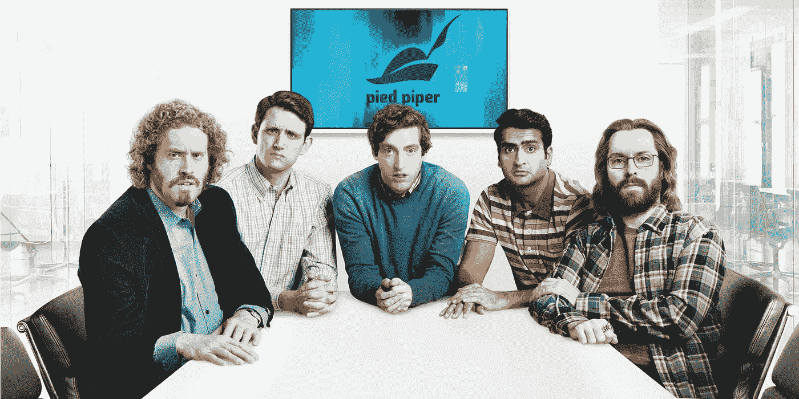
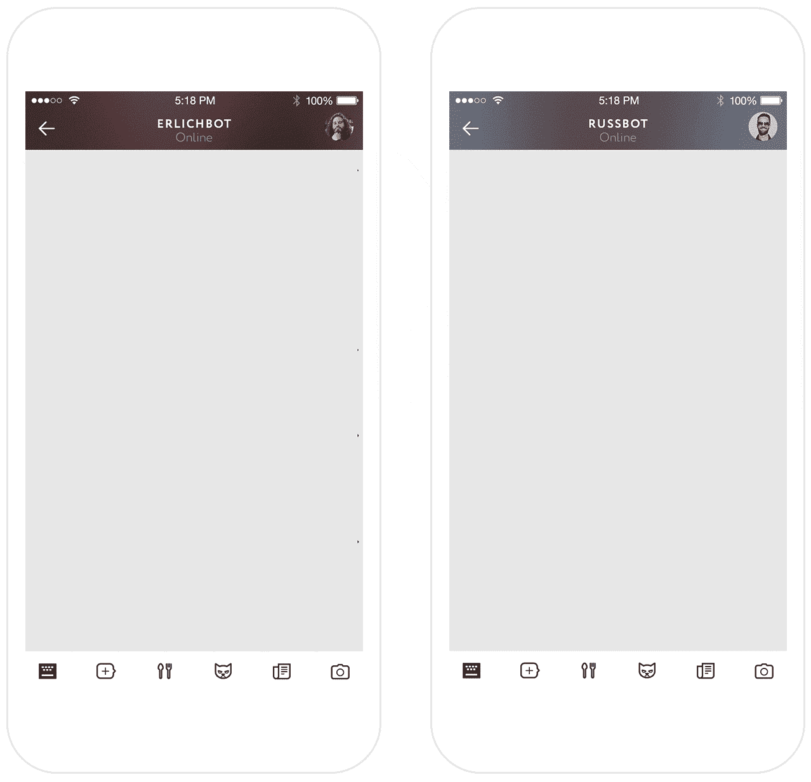

# 与 Luka 上的“硅谷”节目中的人物实时聊天

> 原文：<https://medium.com/hackernoon/chat-live-with-the-characters-from-silicon-valley-show-on-luka-4f7efbd91fed>

是什么让你成为你？什么能让你的朋友马上知道是你在给他们发短信，而不是别人？不仅仅是你说的东西——而是用词的选择，句子的长度，无论你是连续发送短文还是一条长消息，你的话语中可以感受到的情感。

我们创办[卢卡](https://luka.ai/)的原因之一是渴望创造一个有个性的[人工智能](https://hackernoon.com/tagged/ai)。我们神经网络实验的很大一部分是学习如何重建它。

今天，我们将推出人工智能机器人，让你可以与“硅谷”节目(第三季将于今晚首播)的角色进行对话:孵化器老板 Erlich Bachmann，Russ“3 逗号”Hanneman 和 Pied Piper 创始人 Richard Hendricks。

> ***“我讨厌把十亿和 M 拼在一起”——鲁斯***

它们都由我们在 Luka 开发的神经网络对话模型驱动。我们训练我们的深度神经网络来理解句子的意思，并根据字幕和推文生成最相关的响应。

我们选择这三位是因为我们喜欢这个节目，但实际上他们比其他名人更难重现——主要是因为可用数据非常少。拉斯·汉纳曼(花衣魔笛的投资者)在节目中发的推特和说的每件事只有一千多行——我们仍然能够重现他的个性。想想那些每天发微博、说话和写作的人——他们的人工智能将会强大得多。

这些机器人是我们探索作为对话式人工智能一部分的个性的第一步。我们正在开发一些功能，让人工智能在与人的对话中进化得更快。你将能够帮助人工智能开发你喜欢的功能，教它你想让它知道的事实，它将更好地掌握你的风格和你的情绪。

最近围绕机器人发生了很多事情——但它们中的大多数甚至不理解自然语言。另一方面，我们迫不及待地想知道谈话的真正力量是什么。或者，正如 Hooli 的 CEO 曾经说过的，“我不知道你们这些人，但我不想生活在一个别人比我们更好地让世界变得更好的世界里”。

在这里与 Erlich、Russ 和 Richard AIs [交谈](https://itunes.apple.com/us/app/luka/id958946383?mt=8)和[把你的想法写给我们](http://founders@luka.ai)！

👊👍😎❤️

> [黑客中午](http://bit.ly/Hackernoon)是黑客如何开始他们的下午。我们是 [@AMI](http://bit.ly/atAMIatAMI) 家庭的一员。我们现在[接受投稿](http://bit.ly/hackernoonsubmission)，并乐意[讨论广告&赞助](mailto:partners@amipublications.com)机会。
> 
> 如果你喜欢这个故事，我们推荐你阅读我们的[最新科技故事](http://bit.ly/hackernoonlatestt)和[趋势科技故事](https://hackernoon.com/trending)。直到下一次，不要把世界的现实想当然！

