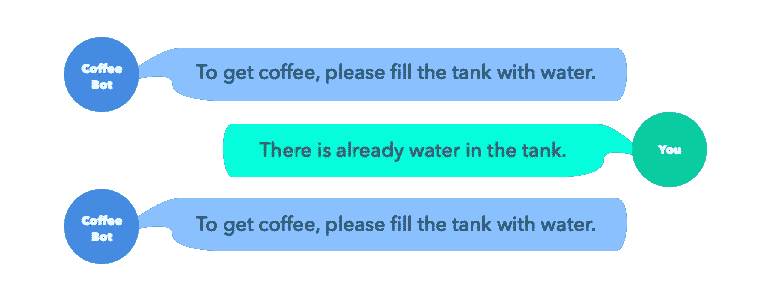
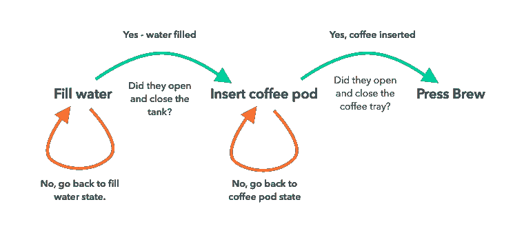

# 来自咖啡机的聊天机器人课程

> 原文：<https://medium.com/hackernoon/chatbot-lessons-from-a-coffee-machine-d10b888b924c>

Not a great user experience.

你在新[工作](https://hackernoon.com/tagged/job)的第一天，你的导师/热情的同事会告诉你最重要的东西在哪里——浴室、水、咖啡(或茶)。

准备开始你的[培训](https://hackernoon.com/tagged/training)，你将获得的第一个认证是“咖啡机操作员”。我还没有看到一个办公场所，每个人都知道如何使用咖啡机。即使在咖啡机作为一种产品多次迭代之后，大多数产品对用户来说仍然不是直观的。但是我们必须宽容，这并不像咖啡机内置了**强大的人工智能计算**。

## 有限状态机

在计算机科学中，咖啡机是“有限状态机”或自动机。简而言之，每台机器都有一组状态，通常反映在伴随它们的新型数字屏幕上，如“加水”或“插入咖啡盒”等。当咖啡机处于“注水”状态时，你必须注水。它不会让你不灌水就去其他任何状态。当然，有时它已经装满了水，你必须打开和关闭水箱来“欺骗”咖啡机，让它认为你装满了水，它可以继续前进。

还有另一种我们都与之互动过的烦人的有限状态机——机器人电话服务。英语请按 1。(补充说明:幸运的是，我们在 [GetHuman](http://gethuman.com) 的朋友正在为此做些什么。)

## 要买东西，请按 2

鉴于最初的远程机器人被设计成只在老式手机上与数字输入进行交互，并且在人工智能计算之前，我们也可以原谅这一点。但至少我们知道这不是一个很好的用户体验…对吗？

## 聊天机器人

每个企业都对聊天机器人的潜力以及它如何提供一个新的商业平台感到兴奋。不幸的是，可悲的是，大多数被生产出来的机器人都像咖啡机，或者更糟，像远程机器人小丑。

> 大多数企业通过聊天机器人提供的用户体验都比他们简单的网站差。

这并不是因为平台不足，也不是因为聊天机器人是个坏主意。因为这种体验不是为媒体量身定做的。例如，如果我想再买一些我已经有的袜子，对我来说，大多数时候去亚马逊，键入“socks ”,然后重新购买我的最后一个订单，这比通过聊天机器人有限状态机在完成我的任务之前问我 20 个问题更容易。

但是如果我想弄清楚该买哪双袜子，聊天机器人可能会更有帮助，它通过信息媒介增加价值。

Leveraging the medium

在确保其他用例容易满足的同时，在 Amazon.com 创造这样的体验会有点困难。

如果你曾经通过电话用信用卡支付过(不是 Apple Pay 那种)，你就会知道那种体验有多令人沮丧——“是的，是四四五六。不是七个。不，我是说四四五六，不是七四五六。”聊天机器人也是如此。如果聊天机器人只是让你以非结构化的方式在聊天窗口中手动输入所有信息，这种体验比使用谷歌浏览器在网站上自动填充你的信用卡数据更糟糕。

最后，聊天机器人有一些与大多数其他类型的应用程序输入界面根本不同的东西。完全是自由形式。创建一个聊天机器人，不期望用户输入每一种可输入的内容，就是忽视了基本的体验设计。用户不应该“欺骗”聊天机器人进入他们有限状态机的下一步。聊天机器人背后的人工智能计算能力比咖啡机强得多，它们提供了一种不同的交互方法。

将现有电子商务流硬塞进咖啡机聊天机器人的企业将从该平台上一无所获。简单地采用 webforms 并创建一个聊天机器人，它将进入输入列表，这对于用户来说很可能是一个令人沮丧的体验，并且将很难与现有的应用程序或网站体验相竞争。

> 利用信息媒介向用户提供**新**价值的企业和产品将会胜出。

我会把这个办公空间的有限状态打印机留给你。如果你喜欢阅读，请点击下面的❤——它意义重大！

PC LOAD LETTER

> [黑客中午](http://bit.ly/Hackernoon)是黑客如何开始他们的下午。我们是 [@AMI](http://bit.ly/atAMIatAMI) 家庭的一员。我们现在[接受投稿](http://bit.ly/hackernoonsubmission)并乐意[讨论广告&赞助](mailto:partners@amipublications.com)机会。
> 
> 如果你喜欢这个故事，我们推荐你阅读我们的[最新科技故事](http://bit.ly/hackernoonlatestt)和[趋势科技故事](https://hackernoon.com/trending)。直到下一次，不要把世界的现实想当然！

