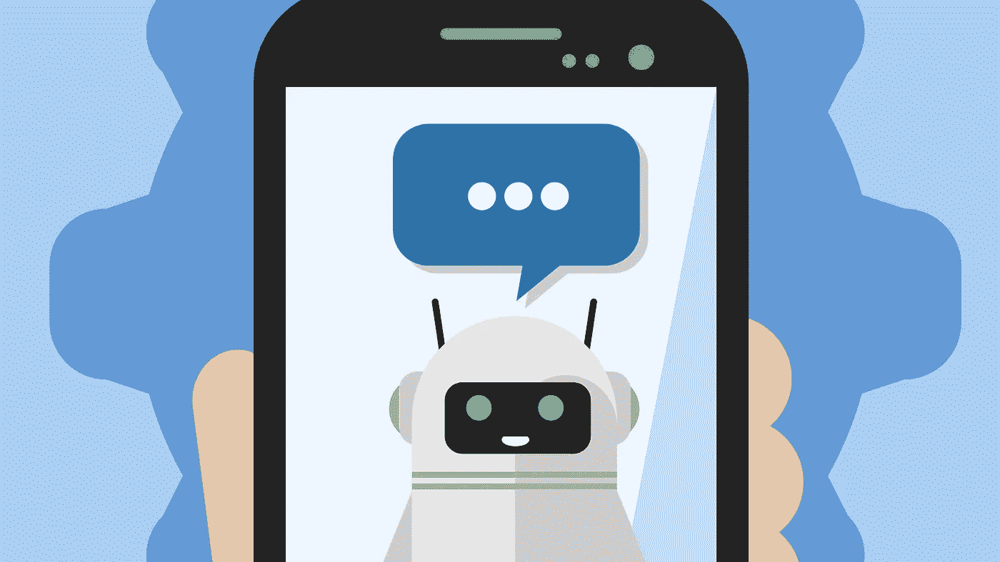
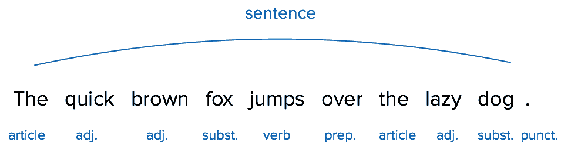
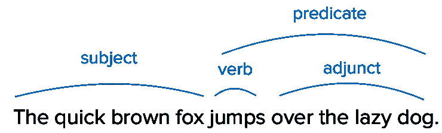
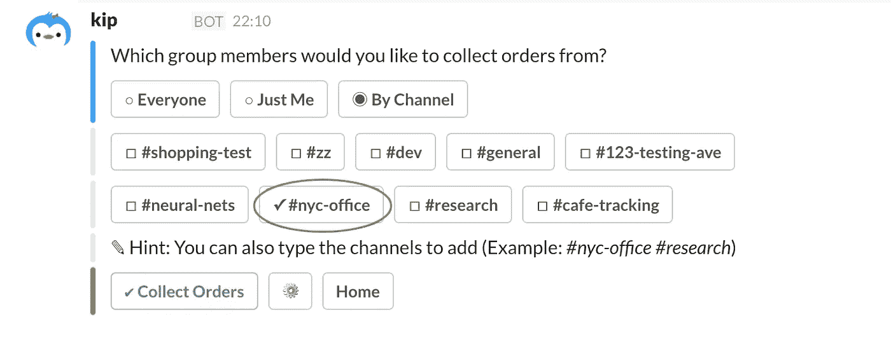
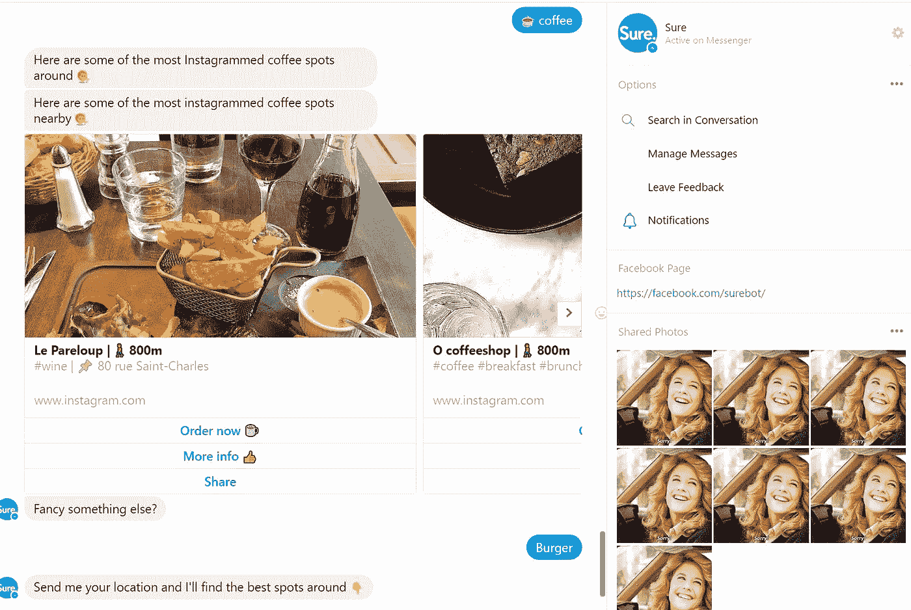
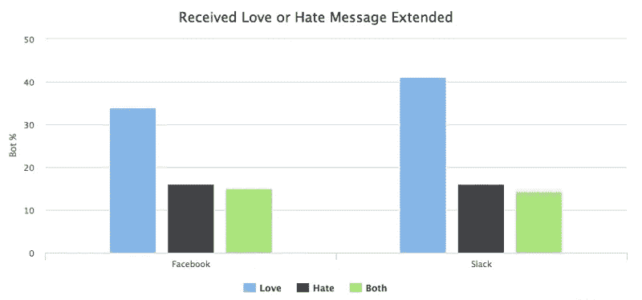

# 聊天机器人化妆舞会:用自然语言处理和语法塑造个性

> 原文：<https://medium.com/hackernoon/chatbot-masquerade-6d42aa73b9f7>

聊天机器人的炒作达到顶峰了吗？尽管 Messenger()、Telegram 或 Slack、**等领先的消息平台进行了大量投资，但聊天机器人兑现了它们的承诺吗？**

答案很复杂。虽然在技术方面，机器人构建框架、服务和库不断变得更好，但聊天机器人理解用户和表达自己的能力需要更加完善，以便大规模采用。让我们深入了解自然语言处理和实现类似自然的表达的潜在挑战。聊天机器人行业现在价值数百万(数十亿？)，但是你每天都使用聊天机器人吗？你认识这样做的朋友吗？

让我们深入了解自然语言处理和实现类似自然的表达的潜在挑战。

在我们这样做之前，让我们先说明菜单上有什么。我们将回到聊天机器人的根源，看看 NLP 到底是什么以及它为什么如此困难。然后，我们将看看目前可用的聊天机器人，并分析它们的缺点。有了所有这些陈述，我们将能够回到语言学方面，理解实现真正自然的表达需要什么。

最后，坚持到最后的忠实读者可以更进一步，看看我在研究这篇文章时与 [Brett Scott](https://twitter.com/Suitpossum) 的一次快速交流的文字记录:我们讨论聊天机器人的黑暗面——自动化、说话者混淆和数据收集。

构建聊天机器人主要有两种方式:基于规则的机器人和依靠人工智能(AI)的聊天机器人。

1.  **基于规则的聊天机器人:**这些是最简单的——**如果用户说 A，机器人会说 B** 。例如，天气机器人会对查询“天气+洛杉矶”返回洛杉矶的天气。规则可以有一些内置的灵活性，即使用户输入的命令有打字错误，规则也能正确工作。然而，机器人将无法处理未知的查询。
2.  **基于 AI 的聊天机器人:**这种方式完全不同。这些机器人可以分析用户的语言，从中提取意义并做出相应的回答——它们可以**处理未知的输入**。为此，基于人工智能的聊天机器人使用了一种叫做自然语言处理(NLP)的技术。

这种二分法似乎好得不真实？就是因为它是！野外的聊天机器人通常由两种方法的混合组成:它们遵循复杂的决策树逻辑，并使用自然语言处理(NLP)来使未知语句返回到它们的树的一个分支(T3)。

树逻辑很简单，所以我们不会深入讨论。更有趣的是自然语言处理。此外，这不仅仅是机器人的事情: **NLP 支持所有形式的自动语言识别**，从整理一堆简历到社交网络上的情感分析。

# 自然语言处理:智能聊天机器人的关键

> 自然语言处理(NLP)是计算机从人类语言中分析、理解和推导含义的一种方法。
> 
> *iCapps*

iCapps 对 NLP 给出了一个非常清晰明了的定义。本质上，NLP 的目标是创建能够理解日常语言输入的**程序**,而不是让用户预处理他的查询，使其能够被机器理解(早期的“Siri”对话)。

为此， **NLP 依赖于六个关键步骤**。我们将详细说明每个步骤背后的内容，以便在书面提示和自然语言表达分析之间建立联系:

## 1.标记化

在处理任何书面提示之前，必须将文本分解成单词和句子，以便于分析。在这方面，**标记化是预处理**:它确定了在分析过程中将被处理的基本单元(单词和句子)。虽然这一步可能看起来很基本，但是标记化必须准确，这样剩下的分析才是相关的。事实上，由于标记化是 NLP 的第一步，这里出现的错误将会传播，并导致以后的解释问题。

虽然看起来很基本(单词之间用空格隔开，咄！标记化的现实更加复杂:“洛杉机”是一个独立的实体，尽管它是由两个单词组成的。“我是”是两个单词和两个不同的想法，它们之间没有任何空格。此外， **NLP 技术可能会应用于“脏文本”**——包含拼写错误、不正确的间距或标点符号使用不当的提示——使其更加棘手。

因此，出现了不同的标记化方法，各有优缺点。关于这个主题的 IBM 开发者博客文章是一个很好的起点，可以让你了解更多。**标记化方法不是绝对的**:它们是根据所分析文本的性质来选择和调整的。

## 2.词汇分析

通过成功的标记化过程，单词被适当地彼此分开。自然，下一步是对令牌进行分类，以便于它们的处理。对单词进行分类的一个简单方法是**使用已经存在的语言分类**——单词的语法性质。

*The linguistics behind chatbots —* [*iCapps*](http://www.icapps.com/the-linguistics-behind-chatbots/)

首先，这很方便，因为使用字典可以很容易地完成单词与其语法性质的匹配。最重要的是，因为语法是管理语言中从句和短语组成的一套规则，用语法标准对标记进行排序使下面的步骤变得更容易，尤其是下一步:句法分析。

## 3.语法分析

虽然标记化和词法分析发生在单词级，但是句法分析跳到句子级来识别每个单词之间的关系。

本质上是带你回到学校:冠词+形容词+名词=主语组等等。

*The linguistics behind chatbots —* [*iCapps*](http://www.icapps.com/the-linguistics-behind-chatbots/)

**句法分析提供文本中每个句子的顺序和结构。**例如，确定主题对于以下步骤之一——语篇整合——尤为重要，语篇整合着眼于每个句子周围的上下文。

## 4.语义分析

在这一步，计算机寻找每个单词的意思。对于人类来说，这看起来又是一个简单的步骤**(我们有这方面的字典，废话！)对电脑来说更棘手。**

有些词很简单，因此很容易解释——比如“monosemy”就是**完美的肉体和灵魂的例子**:它是一个名词，专门指代**只有一个意思的属性。**

对于多义词来说，想要理解它的意思可能要困难得多。[“Set”有 119 种不同的含义](http://www.dictionary.com/browse/set)，可以用作及物动词或不及物动词、名词、形容词、感叹词，也可以参与动词短语(如“set back”)和成语(如“all set”)。

前面的步骤在某种程度上促进了这一点。事实上，如果我们知道“set”是作为一个名词使用的，我们就有 28 种不同的可能含义。在这里，语境对于找出说话者想要表达的意思至关重要。

## 5.话语整合

话语整合着眼于句子相对于前面句子的**意义**。假设文本的后续句子之间存在衔接。

要做到这一点，关键在于必须正确识别**代词，然后将其与相关先行词**联系起来。例如，在下面的语句中，计算机需要能够正确地识别“it”并将其链接到“Google”:

> 谷歌是一个搜索引擎。它帮助个人找到他们在网上寻找的信息。

虽然这个例子非常简单。然而，一个真实、自然的句子很少是这样的。回指可能很难解释，**特别是在自然语言中，代词的先行词可能不清楚或缺失**。

## 6.语用分析

语用学研究语境对意义的贡献。**这是从所说到所指的一步**，这是六个步骤中最难的一步。歧义很难用计算机来处理，然而这是我们人类说话时所做的一切。根据不同的语言和情况，上下文可能更重要或更不重要。

即使是人类语言学家也很难定义方法来分析语境带来的意义。**出现了各种各样的理论来解释语言的指称性使用**，如雅柯布逊的语言六大功能([指称、诗意、情感、意动、交际和元语言](https://en.wikipedia.org/wiki/Jakobson's_functions_of_language))或言语行为理论(其中[研究施为性话语](https://en.wikipedia.org/wiki/Speech_act))——一种产生自身行为的陈述，如“会议现在休会”。).对语言学家来说，定义什么是语境已经是一项艰巨的工作；上下文感知可以说是自然语言处理中最难的部分。

# 他们为什么会失败？聊天机器人的七宗罪

目前可用的聊天机器人通常不能满足用户的期望，原因从设计问题到技术限制。来自 UXdesign.cc 的 Fabricio 主要从设计的角度总结了聊天机器人的七宗罪。以下是我对此的看法:

## 1.有限的人工智能可用性

即使 NLP 平台和库变得越来越容易访问和常见，人工智能仍然很难实现，而且成本很高。这意味着，尽管聊天机器人背后的技术炒作，**当前部署的机器人基础的很大一部分仍然依赖于单词触发的决策树逻辑来回答查询**。这种类型的机器人的智能取决于设计树的人的彻底性和他预测潜在用例及输入的能力。

即使这些机器人在某些特定的环境中可能是有效的，它们也**因为缺乏语言能力而很快产生挫折感**。当面对我们在现实世界中的说话方式时，他们常常不知所措:缩写、不合语法的措辞、拼写错误……此外，由于他们基于树的决策逻辑，**他们无法对非预期的用例做出适当的响应**:

*A weather bot fooled by the ambiguity between Paris, the capital of France and all the others (20+) Paris in several US-states.*

## 2.用例真的那么强大吗？

当创新技术出现时，它们往往会在开发人员和设计人员群体中引起特别的兴奋。就像之前的应用程序或网站一样，**聊天机器人正成为任何希望显得创新的企业的必备工具**。聊天机器人淘金热导致机器人解决不相关的用例或提供低于标准的客户体验。

这导致了考虑不周的机器人**的增加**要么没有适合真实的用例，要么只是做得比现有的解决方案(网站、应用程序)更差:爸爸的笑话机器人、个人花店机器人、天气机器人……见达伦·奥尔夫关于这个问题的恐怖大厅:[脸书聊天机器人令人沮丧且无用](http://gizmodo.com/facebook-messenger-chatbots-are-more-frustrating-than-h-1770732045)。

另一方面，好的聊天机器人是那些用比网站或应用程序更方便、更直接的方式解决问题的人。例如，Kip 是一个 Slack bot 用来简化在办公室处理杂货和食品集体订单。对 Slack 内置函数的高效使用让@Kiptalk 变得方便而反应迅速。

*Kip Slack bot in action*

## 3.缺乏透明度:我在和谁说话？

聊天机器人展示自己的方式构成了用户互动的框架。尽管机器人制造商希望让他们尽可能感觉像人类，但他们必须记住树立正确期望的重要性。人们对其他人感同身受，而不是对机器。

在“人性化的机器人”和假定自己是机械人的机器人之间很难做出选择；本质上，它归结为你希望在你的聊天机器人和它的用户之间建立的关系。用户往往更有耐心，也更愿意容忍诚实面对机器人本性的机器人所犯的错误。

虽然当机器人不理解某个问题时，给机器人一些通用的预制答案可以帮助维持对话流程，但**这对建立信任有帮助吗？**

## 4.缺乏上下文意识

人类的对话很难复制，因为它依赖于语境**:**我们使用并理解讽刺，根据频道和对象调整我们的聊天方式(参见[雅柯布逊的语言交际功能](http://www.signosemio.com/jakobson/functions-of-language.asp))，并能读懂字里行间的意思。机器人不能。

想象你有一个朋友来你家:

朋友*:“有啤酒吗？”*

你*:“自便。”*

仅仅这两个词，你的朋友就推断出你确实有啤酒，他们可能在他们通常的地方，如果你也在喝酒，他可以抓一两杯。

[*Sure chatbot*](https://facebook.com/surebot/) *is asking for your location at every query.*

不是由自然语言处理技术驱动的机器人不能长时间保存上下文信息。**在顾客提问之前，他们可能会忘记顾客在说什么。**

因为这个缺点，我们不能自然地与机器人交流，**我们必须修改我们的提示**以包括每次我们问他事情的位置。

## 5.缺乏与现有业务系统的沟通

为了提高效率，**机器人需要能够与当前的业务流程进行交互**而不是创建新的业务流程。归根结底，聊天机器人是由客户和品牌之间的众多接触点构成的广泛生态系统的一部分。

创建一个在 silo 中运行的聊天机器人不仅损害了机器人处理和响应用户查询的能力；这也使得企业更难处理机器人通道产生的请求。

**只有能够与预先存在的业务流程进行交互的机器人才能持续产生价值**，比如基普之前讨论过的:他使用亚马逊订购用 Slack 收集的杂货清单上指定的项目。

## 6.不清楚

**高效的机器人解决特定的问题，在这些问题上，它们可以比现有的同类机器人(网站、应用程序或任何其他交互模式)提供更多的价值。**

**必须彻底研究解决已定义用户问题的现有渠道**以制作聊天机器人，这是对交互设计和效率的改进。

此外，缺乏焦点会导致机器人难以开发和维护。

## 7.缺少人员上报协议

机器人不是所有客户互动的答案。尽管自动化的诱惑对于拥有许多客户的企业来说是可以理解的，但总有一些情况需要人性化的处理。

这些情况必须被考虑并包含在机器人的决策树/行动中。事实上，**如果没有适当的升级，这些情况会导致用户被晾在一边**，可能会因为与机器人的不成功交互而感到沮丧。

目前占主导地位的商业观点倾向于将**聊天机器人视为减少真人处理客户互动需求的一种方式。高效和吸引人的机器人的真相恰恰相反:它们被用来创建一个新的互动渠道，如果需要，一个真实的人将会出现。**

从语言学的角度更好地理解了什么是 NLP，以及为什么当前机器人失败的主要原因，现在是时候回到语言学，探索机器人需要什么来实现真正自然的表达。

由于每种语言的语言学特征不同，我们将只关注英语，这是机器人最常用的语言，也是研究最先进的语言。

# 如何做到真正的自然般的表达？

## 1.词汇:数量容易，多义不容易

根据估计和“单词”的定义方式，英语中大约有 500，000 个单词。大多数都很少使用:它们可能已经过时，是特定领域行话或特定寄存器的一部分。

事实上，一个受过教育的母语为英语的人拥有大约 50 000 个单词的活跃词汇(单词在头脑中:心理词汇介绍——[Jean Aitchison 和 Detlef Stark](https://www.researchgate.net/publication/269554913_Words_in_the_Mind_An_Introduction_to_the_Mental_Lexicon) )。同样，在这 50，000 个单词中，**很少出现在我们的大部分文本中**。常用词包括最灵活的:动词、介词和代词。**研究表明，2145 个单词占所有英语文本的 80%(**聊天机器人的语言准确性:从 ESL 角度看的可用性——[David Coniam](https://www.researchgate.net/publication/272536147_The_linguistic_accuracy_of_chatbots_Usability_from_an_ESL_perspective)**)。**

正如语义分析挑战的分析所证明的，困难不在于理解词汇的数量，而在于它的灵活性:**一词多义很难计算**。我们可以通过语境在一个词的几十种潜在含义中进行分类，从而找到与我们当前处境相关的含义。目前，聊天机器人几乎没有上下文意识；**他们必须依靠其他策略**。

## 2.诚实聊天机器人的准则

当我们说话的时候，很多意义的传递都是通过我们的选择发生的。

当摄影师拍照时，他给它一个角度，饱和度，一个特定的框架——最终，**他将他的视角，他的观点转化为最基本意义上的真实世界的真实再现**。

我们对语言也是如此。我们选择谈论某些事情而不是其他事情，使用特定的词语来表达我们的意思，在所有的可能性中以特定的方式排列这些词语… **这些选择本身就有意义**。

因此，我们只能猜测为什么和你说话的人会做出这些语言选择。我们的分析不是纯粹的直觉或随机的。为了理解提示的含义(隐含的意思),我们依靠几个基本原则。

赫伯特·保尔·格赖斯研究语义学，以他的隐含理论而闻名。他分离出我们用来理解含义的四个主要准则:

*   **数量准则** —我们根据需要提供信息(为了当前的交易目的)，但不要太详细(这会妨碍理解)。
*   **质量格言** —我们努力做出真实的贡献。也就是说，不要说我们认为是错误的话，但也要避免在缺乏足够证据的情况下说话。
*   **相关性准则** —我们试图保持相关性，并在讨论的上下文中说一些相关的事情……这对机器人来说是一个难题！
*   为人处世的准则——我们尽量让自己易于理解。这意味着尽可能保持简洁，避免歧义，使我们自己清楚，并尽量保持有序。

我们对这些准则有着直观的理解，并期望我们遇到的每一个演讲者都尽可能地遵守它们。虽然我们与之交谈的人并没有这样做，但我们往往会因为交流变得难以理解(数量太多/质量不够/不够相关/缺乏礼貌)或信息不够丰富(缺乏数量或质量)而感到沮丧。

可以有把握地期待**我们对聊天机器人**——如果它们足够自然的话— **达到同样的标准**。

## 3.机器人的自我参照:我们在和谁说话？

尽管聊天机器人背后有先进的技术，但其设计和“个性”的思考过程仍处于非常早期的阶段。的确，**顺从的女性角色在机器人**中仍然非常普遍。此外，可以用音频处理和回答查询的机器人主要采用女性声音来生成语音。Siri 可能是最著名的虚拟助手，它最初是在 2011 年以女声发布的。两年后，Siri 才有了男声的选择。

一些机器人建造者通过制作中性角色来避免性别定义问题。例如，Kip，前面讨论的 slackbot 使用一个企鹅吉祥物作为它的角色。

从本质上讲，在聊天机器人自我引用方面，机器人构建者有三种选择:

1.  **一起避免**:可以实施不同的自我参照避免策略，比如使用中性吉祥物，或者当机器人被直接问及性别时给出一个回避的答案。
2.  **使用第一人称单数代词“我”**:虽然“我”是处理这个问题最简单的方式，**但它也提高了顾客的期望**。如果机器人无法展示真实的个性，它的自我参照可能会被认为是纯粹的人为行为。
3.  **使用第一人称单数代词“我们”**:“我们”似乎是一个很好的中间地带。它可能指的是机器人背后的团队，或者只是机器人模拟的团队(例如银行职员机器人的银行雇员)。然而，“我们”已经被广泛用于使商务交流听起来更友好；一个自称为“我们”的聊天机器人可能会患上“公司我们”疲劳症。

彼得·沃利斯和艾玛·诺林研究了社交智能的影响，或者说缺乏社交智能的对话代理人在处理有问题的情况时的影响，比如粗鲁的呼叫者(《聊天机器人的麻烦:社交世界中的社交技能》——[彼得·沃利斯和艾玛·诺林](http://perso.telecom-paristech.fr/~pelachau/AISB05/final/WalNor05.pdf))。他们强调聊天机器人需要能够“玩游戏”来有效地降低冲突。

> *在一篇即将发表的论文中描述的一种方法是基于这样一种想法，即* ***情绪基本上是冲突中信号升级的一种手段*** *。尽管狮子会对彼此造成致命的伤害，但争斗通常会在这种情况发生之前停止。同样地，* ***一个辱骂性的反应可能是一个信号，即代理人愿意(在情感上)伤害人类*** *，而人类最好尽快停止，否则就有被伤害的风险。尽管人类可能不会对“伤害机器的感情”有任何禁忌，但他们可能会对自己被称为白痴有不同的感觉，即使是被机器称为白痴。*
> 
> 彼得·沃利斯和艾玛·诺林

## 4.寻找诚实的机器人

我们倾向于对聊天机器人投入个人情感。Chatbotslife 对发送给机器人的 100 亿条信息进行了分析，并指出大约 10%的机器人会收到“我爱你”或“我恨你”类型的信息。

*What 10 Billion Messages can Teach us About Making Chatbots –*[*Chatbotslife*](https://chatbotslife.com/what-10-billion-messages-can-teach-us-about-making-chatbots-fb796781bb4a)

聊天机器人自我参照的问题背后有很多利害关系。人类倾向于神秘化物体——我们看到的不仅仅是物体的物理存在:可乐不仅仅是苏打水，它还是一种生活方式。布雷特·斯科特在他的文章[中讨论了这个被称为恋物癖的过程，如果你和机器人说话，你就是在和它们的老板说话。](https://howwegettonext.com/if-you-talk-to-bots-youre-talking-to-their-bosses-cd8e390c242f)

的确，聊天机器人的出现拓展了公司人格的界限。公司已经拥有法人资格；机器人可以给他们另一层伪人类，具有对话和人工人格，模糊了企业和个人之间的界限。

> 诚实的机器人目前还不存在。借用因《麦田里的守望者》中的存在主义者霍尔顿·考尔菲德而流行的一个术语，新一波机器人是“终极骗子”**。他们会假装友好、冷静、严肃、富有洞察力，甚至自我反省。但他们永远不会只做自己。因为，* ***最后，没有“我”，只有一家公司，它的股份由谁持有谁知道，可能注册在巴拿马*** *。**
> 
> **布雷特斯科特**

*虽然机器人现在大多被视为消费者与品牌互动的一种新的实用方式，但对诚实机器人的搜索显示了聊天机器人行业的深层利害关系。随着聊天机器人的个性化变得越来越精确，收集到的每个用户的数据也越来越精确。*

*它可能最终被转售，并与其他数据库合并，以满足 bot 所有者和 bot 平台的经济议程。最终用户可能比以前更容易受到侵入性数据收集和广告方法的攻击。*

*现在是时候**质疑聊天机器人能带来什么好处，以及谁将利用这些好处**了。我们应该对炒作保持警惕，并确保我们真正受益于机器人，而不是相反。一旦它们成为我们日常生活的一部分，那就太晚了。*

*这篇文章于 2017 年 5 月 31 日首次发表在 [CALLR 的博客](https://www.callr.com/blog/chatbot-masquerade/)上，并针对媒体做了轻微修改。*

**

*让我知道你是否喜欢这篇文章，并且[查看我的维基来获得更多类似的内容。](https://github.com/Ahirice/BCC/wiki) **别忘了拍拍它** **帮它传播:**可以一直按👏高达 50 次鼓掌。*

# *聊天机器人的角色和挑战—与 [Brett Scott](https://howwegettonext.com/@Suitpossum) 的快速交流*

*在我研究这篇文章的时候，我有机会和 Brett Scott 就聊天机器人的角色和它们目前的局限性进行了一次简短的交流。我认为这将是一个很好的总结方式，因为**我们将讨论本文所涉及的一些主题，并探索其他一些相关的主题**。再次感谢 Brett 的高质量见解！
以下是文字记录:*

> **品牌渴望聊天机器人，是因为他们希望某些职位(支持、客户关系等)实现自动化吗？)以前由真正的人类工人处理？**

*   *从未雇佣过一线员工的新公司**开始采用自动化的客户流程**——许多硅谷公司都是这样，例如 AirBnB 从未有过真正面向客户的员工。*
*   *以前有一线面向客户的员工的老公司，现在正在寻求提供一种**更低成本的选择**，潜在的目的是**最终淘汰一线员工**例如，许多银行都是这样。*
*   *在后一种情况下，聊天机器人被视为更“人性化”的“体验”，而不仅仅是给它们一个带有选项的网页或应用程序。*

> *考虑到聊天机器人的现状，缺乏人情味难道不令人沮丧吗？就 UX 而言，聊天机器人是真正的进步吗？*

*   *至于 UX 是否真的改进了，我不知道——我怀疑相当多的人会觉得聊天机器人很烦人，可能更喜欢普通的界面。然而，与普通界面的关键区别在于，它通过预定义的类别来限制你的查询，而聊天机器人创造了能够请求或询问任何事情的**假象**。*
*   *我猜 NLP 的东西就是能够将那些拼写错误或措辞奇怪的查询归入可以回答的预定义类别(据我所知，聊天机器人还不能即兴创作或编造答案或参与自发的行动——**它们只能学会接受不可预测的输入并给出可预测的输出***

> *从品牌的角度来看，聊天机器人体现了一种与客户互动的新界面。与通常的聊天机器人(网站、应用程序……)相比，聊天机器人作为界面有什么特点？*

*   *我们可以对界面进行一般性评论，因为**它们掩盖了它们背后发生的事情**，我们可能会认为聊天机器人特别擅长于此，因为它呈现了一个人类或“机密”的角色，诱使用户认为他们实际上只是在与一个“存在”而不是一个 it 系统进行交互。*

> **数据是聊天机器人被采用的主要驱动力吗？—公司期待实现聊天机器人是因为它允许他们收集更多的用户数据吗？**

*   *我不确定在这个过程中提取的数据是否会比任何其他数字接口提取的数据都多，但也许会。*