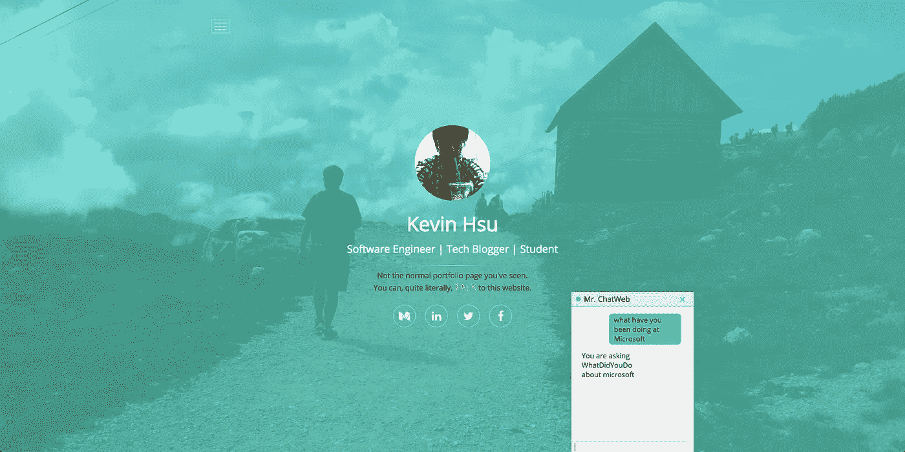
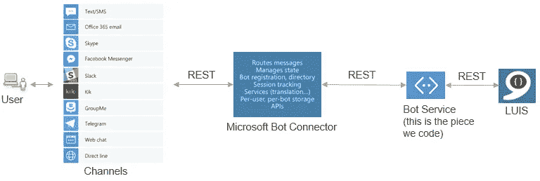

# 聊天网站#2:我说的聊天网站和项目更新是什么意思

> 原文：<https://medium.com/hackernoon/chatweb-2-what-do-i-mean-by-chatweb-and-project-updates-780e1acc3831>

> TL；我现在正在为研究生项目申请开发我的作品集网站的新版本。与传统的方式不同，我尝试制作一个静态网页，像聊天机器人一样理解用户意图的聊天网，以便用定制的布局呈现更多相关的内容。
> 
> 技术栈:微软 LUIS，Azure Functions，React JS，Fetch JS



# 自从上次…

我曾和一些朋友讨论过，他们是与我共事多年的香港城市大学教授，自从我发布了博客文章“ ChatWeb:用完整(免费)的微软栈建立理解用户的网站”之后，一些创业公司也打电话给我进行简短的聊天。

[](https://hackernoon.com/chatweb-build-websites-that-understand-users-with-full-free-microsoft-stack-dc07ce18b19d) [## ChatWeb:用完整的(免费的)微软堆栈建立理解用户的网站

### 聊天机器人肯定是一个热门话题。我仍然记得 12 支队伍中的 4 支队伍是如何干扰比赛的

hackernoon.com](https://hackernoon.com/chatweb-build-websites-that-understand-users-with-full-free-microsoft-stack-dc07ce18b19d) 

现在，从评论、那些私人聊天和消息来看，我认为上一篇博文在技术实现方面太隧道化了——这是因为我真的很激动和兴奋能够发挥微软技术和 [React](https://hackernoon.com/tagged/react) 之间的协同作用来实现我的**目标**。

然而，有些人没有达到我的目标，他们认为我在为客户支持或订票的网页制作聊天机器人。

但事实并非如此。好吧，至少这不是我想要建立的。

所以再给我一次机会来进一步分析聊天机器人和聊天网络的区别，当然，还有我脑海中的聊天网络的概念。

## 聊天机器人到聊天网站

我想要回答这个问题，更简单的方法是首先解释聊天机器人是如何工作的。



所以从用户的角度来看，一条用户消息首先经过一个特定的渠道，可以是 Facebook Messenger、Skype、Slack 等。然后，该消息将被一系列数据处理所消费和处理，在这些数据处理中，我们将利用 [Microsoft LUIS](https://www.luis.ai) 来提取用户的意图(即，用户要求什么)和实体(关于哪个主题)。

例如，从一条消息“今天西雅图的天气如何”(即使有拼写错误的单词)，LUIS 应该向服务器返回这样的内容:

```
{
    "intent": "asking weather",
    "entities": [
       "Seattle"
    ]
}
```

一旦服务器收到这些公式化的意图和主题，我们将能够向用户提供相关的响应——在再次请求天气的情况下，很可能会调用其他外部 API 来获取天气状态。

到目前为止，ChatWeb 的工作方式与聊天机器人完全一样。

聊天机器人的下一步是构造一条新消息反馈给用户，可能是“今天西雅图天气晴朗，耶！”在这个例子中。

但是我想要的交互是返回，不仅仅是文本信息，商品或支付网关的链接，而是整个网页的新布局。

我们再来看一下我的作品集页面当前标题的截图。


Oh, and that is my father in the background

你看到那个聊天室区了。这是用户输入信息与我的投资组合页面进行交互的地方。特别是在一个作品集页面上，很难**准备一个对所有读者来说足够通用，但对特定读者来说又足够具体的布局和内容顺序。**

例如，一些人可能对我在微软的经历感兴趣，而另一些人可能想知道我在多伦多或布达佩斯的旅程。

在这种情况下，ChatWeb 实现可能是提供更好的人机交互的一个很好的方法。

我可以将默认布局设置为首先显示我的实习经历，然后显示我的项目所遵循的技能集，并在布达佩斯的志愿工作上花了一点时间。但是一旦有用户问“你能分享一下在布达佩斯发生的事情吗？”我的网页将能够切换到一个新的布局，更多地关注有关 AIESEC 交易所的内容。

## 聊天网站和聊天机器人有什么共同点

*   真正理解用户
*   能够对不同的用户意图做出反应

## 聊天网站和聊天机器人有什么不同

*   不返回消息
*   响应用户请求，返回并呈现新的自定义布局和内容

# 潜在扩展

个人数字投资组合非常适合这种结构，在这个概念上也有一些扩展，我认为是可行的。例如，一个更加模糊和有弹性的搜索引擎首页**。**

**它不需要像谷歌那样的通用搜索引擎。**

**仅以 Medium 本身为例，我知道在幕后有协同过滤和机器学习来为用户找到相关的提要(正如我在 CF 上工作作为我的最后一年项目)，但我们甚至可以通过一个**可聊天和对话的**界面来实时改变布局和故事提要。**

**现在，我还没有研究过这种方法。**

**是否可行，是否被用户接受，不得而知。但这只是我们没有想到的事情——特别是随着 Cortana 这样的计算机辅助技术越来越受欢迎，也许有一天，我们甚至不再使用文本搜索。相反，一个能够将这些模糊的口头对话处理成有意义的和定制的布局来为客户服务的聊天网站可能会更好。**

# **后续步骤**

**我现在已经有了建筑代码设置。你在截图上看到的聊天室功能齐全，用户意图和实体的提取由 React State 控制。**

**我接下来要做的是交互和渲染决策。**

**我还希望将该架构模块化为一个开源和独立的 React 组件，以便其他开发人员可以扩展代码库，并根据他们的 ChatWeb 想法工作(只是为了节省一点时间，这实际上只是一个简单的实现，同样，可以参考我以前的博客帖子)。**

**[](https://hackernoon.com/chatweb-build-websites-that-understand-users-with-full-free-microsoft-stack-dc07ce18b19d) [## ChatWeb:用完整的(免费的)微软堆栈建立理解用户的网站

### 聊天机器人肯定是一个热门话题。我仍然记得 12 支队伍中的 4 支队伍是如何干扰比赛的

hackernoon.com](https://hackernoon.com/chatweb-build-websites-that-understand-users-with-full-free-microsoft-stack-dc07ce18b19d) 

如果你对这样的概念感兴趣，并且有使用 npm 或 yarn 管理开源 React 组件的经验，请随时在 [Twitter](https://twitter.com/kevhs_pj) 上给我发 DM。我个人真的不打算很快完成这一部分，因为我需要准备 GRE 和申请硕士课程，以获得我的 OPT，并开始在美国从事令人兴奋的项目。**