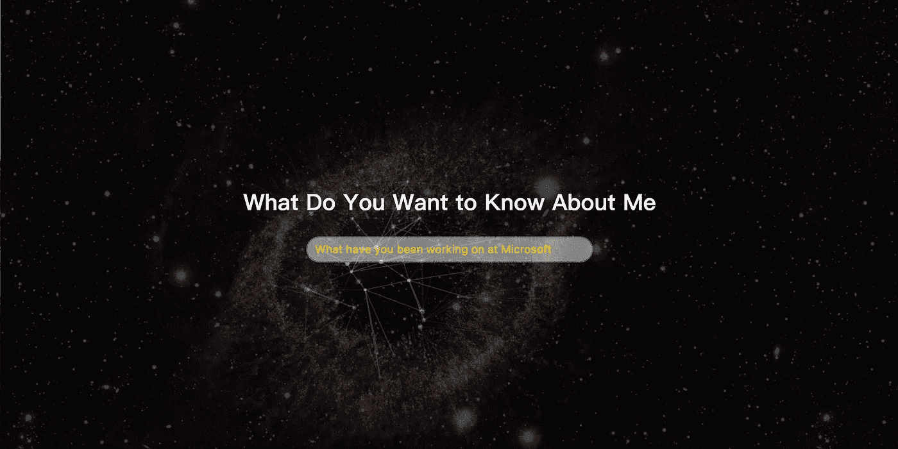
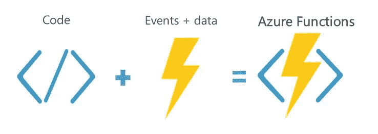
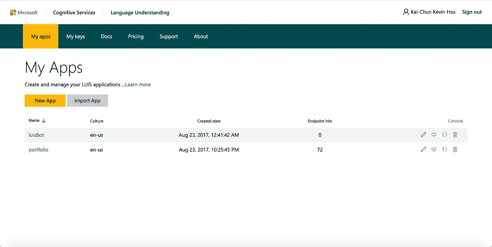
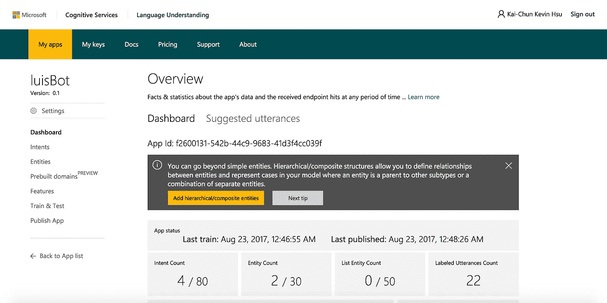
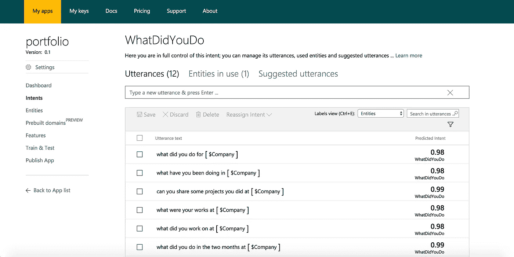
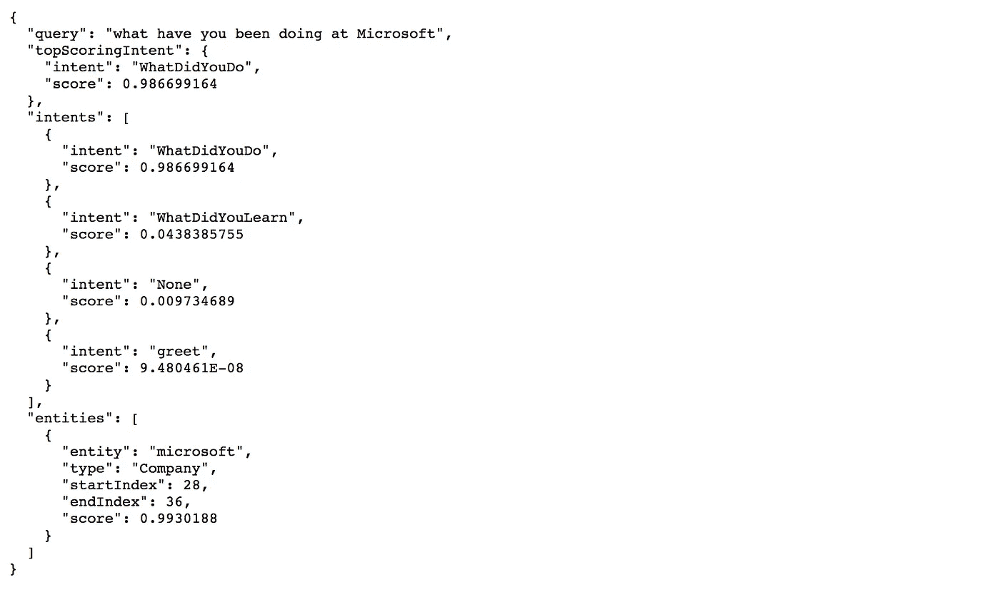
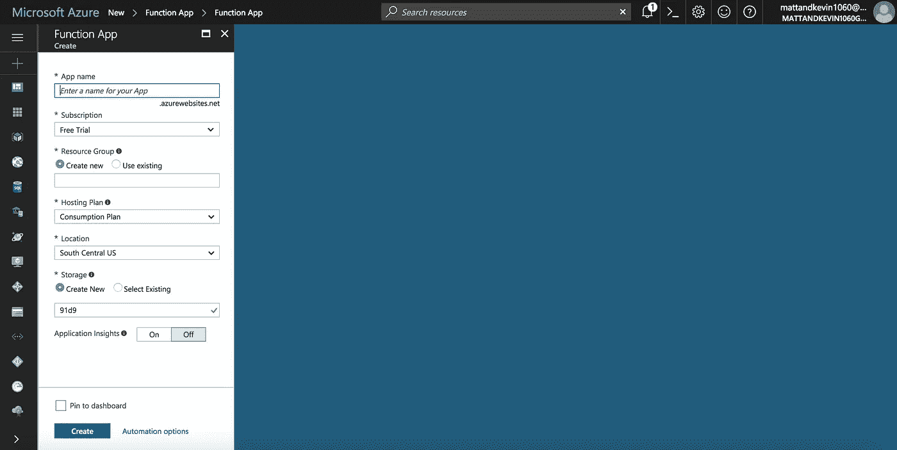
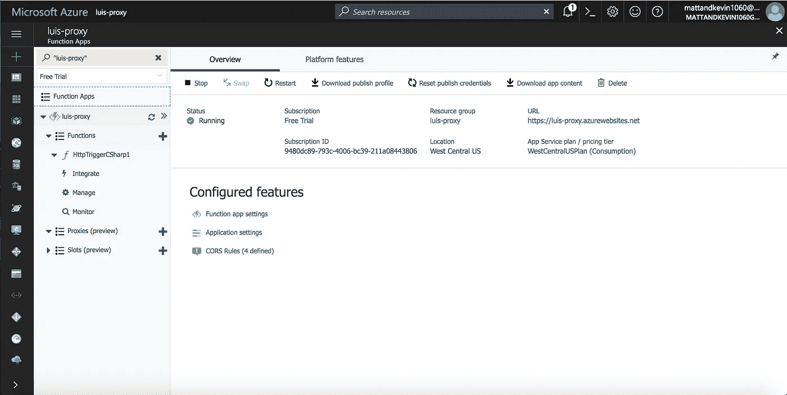
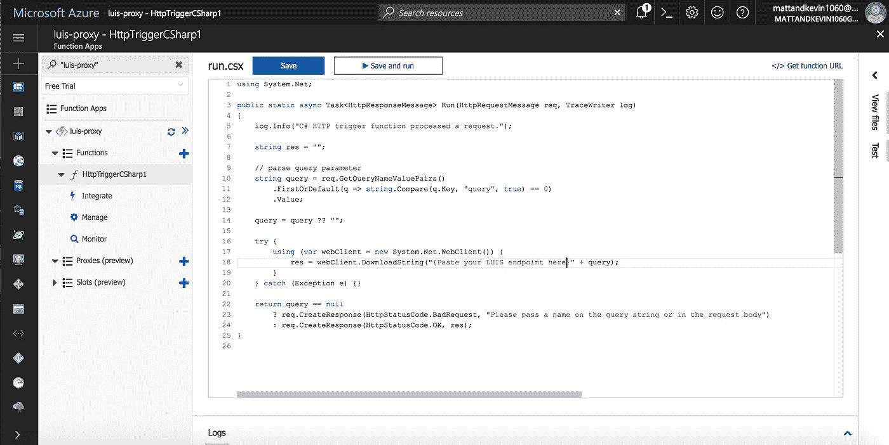

# ChatWeb:用完整的(免费的)微软堆栈建立理解用户的网站

> 原文：<https://medium.com/hackernoon/chatweb-build-websites-that-understand-users-with-full-free-microsoft-stack-dc07ce18b19d>


Just another weekend to C&C (Chill & Code) in Taiwan

聊天机器人肯定是一个热门话题。我仍然记得几个月前我和微软在香港组织的黑客马拉松[e . c . jaming](http://ecjamming.tech)的 12 个团队中的 4 个团队是如何开发聊天机器人项目的。

但我是一个真正的网络爱好者和传播者。

有一些很棒的框架，比如谷歌 [API.ai](https://api.ai) 、[微软机器人框架](https://dev.botframework.com/)和[微软 LUIS](https://www.luis.ai) (语言理解智能服务)，这些框架让开发人员能够毫不费力地在多个渠道构建和推出聊天机器人。

换句话说，为了增强聊天机器人开发者的能力，科技巨头们投入了大量的资源来构建组件和微/网络服务，这些组件和服务可以高效、准确地执行聊天机器人管道中的单一特定任务。例如，LUIS 可以帮助您理解具有机器学习支持的训练模型的用户，该模型具有单个 API 端点。

现在，我们为什么不利用这些服务来建立一个网站，像聊天机器人一样理解用户的意图和兴趣，同时，利用网络提供的丰富元素，我们能够提供比传统聊天机器人更多的交互。



The background of prototype was from [https://tympanus.net/codrops/2014/09/23/animated-background-headers/](https://tympanus.net/codrops/2014/09/23/animated-background-headers/)

就我而言，我现在正在为申请美国毕业项目建立一个个人作品集页面。

在静态的、标准的类似简历的 HTML 内容之上，我实现了一个标题，它可以与用户交互，并在用户问了一个关于我的经历的特定问题后，重新排列页面上呈现的样式和组件——就好像我在那里，与该用户一对一地回答诸如“你在微软工作过吗？”。

更好的是这个教程和所谓的 ChatWeb 是用无服务器架构构建的(感谢 [Azure Functions](https://azure.microsoft.com/en-us/services/functions/) )，这意味着你根本不用担心构建和维护服务器。只是前台。刚刚**反应过来**。



下面的一切都假设一个 Azure 账户。Azure 提供一个月的免费试用，供你玩一玩。即使在免费试用到期后，该架构中的所有产品都有每月免费配额，不容易被超过。

# 内容

*   培训和发布 Microsoft LUIS 端点
*   构建 Azure 函数
*   反应和获取


# 微软路易斯

所以再说一遍。LUIS 在聊天机器人的生态系统中发挥了重要作用，他让机器人能够理解用户的文字。LUIS 端点的最终目标是通过消费一个查询，它返回一个 JSON 数据以及诸如“用户想要什么？”以及“涉及任何特定实体？”

```
Example:
query = "What have you done at Microsoft?-----LUIS API returns
{
  "query": "what have you done at microsoft", "topScoringIntent": { 
     "intent": "WhatDidYouDo",
     "score": 0.729854763
  }, "entities": [ { 
     "entity": "microsoft", 
     "type": "Company",
     "startIndex": 22,
     "endIndex": 30,
     "score": 0.9897579 
  } ]
}
```

有了这些信息，以及 React JS 中的功能组件呈现机制，您就已经准备好构建 LUIS web 应用程序了。

但在我们深入了解这一点，以及我们如何使用 Azure 函数保护我们的订阅密钥之前，让我也向您展示一下我是如何在 [**LUIS.ai**](https://www.luis.ai) 上训练我的语言理解模型的。

## 构建 LUIS 应用程序的分步指南



在 LUIS 上创建一个帐户后，您应该会看到此页面。

单击按钮新建应用程序。它应该会询问你应用程序的名称及其文化(例如美国)。我没有尝试过其他文化。).



LUIS Dashboard

在侧边栏上，单击 Intent，开始定义用户可能拥有的意图。例如，如果你正在制作一个电子商务网站，网站应该遵守的可能意图可以是“购买”、“浏览”、“客户支持”等。基本上，试着列出用户来使用你的应用程序的所有可能的原因。

> 在我构建投资组合页面的情况下，我希望我的 LUIS 应用程序可以帮助我从一个句子中检测出用户是否对我学到了什么(技术堆栈)，或者我做了什么(项目细节)，以及在哪个公司更感兴趣，这样我就可以提供合适的个性化布局。



创建意图后，你可以给 LUIS 一些例子，说明这种特定的意图是可以预期的。对于这个例子，我告诉 LUIS，如果一个用户问“你为微软做了什么”、“你在微软做了什么”等问题，他可能会问“你做了什么”(intent)，而“微软”被映射到公司实体。

在您按照定义的意图输入了 10 个实例后，转到侧边栏上的**训练&测试**，并点击“**训练应用**”。LUIS 会帮你处理机器学习的部分。

**魔法。**

我喜欢成为 21 世纪早期的应用程序开发人员；清新爽，但还没完全被 AI 接管。

完成后，转到“**发布应用**”页面，您只需点击一下即可将应用推向生产，并获得如下所示的端点:

```
https://westus.api.cognitive.microsoft.com/luis/v2.0/apps/{app id}?subscription-key={app key}&timezoneOffset=0&verbose=true&q={user query}
```

砰的一声。



现在，您有了一个端点，可以将用户文字输入翻译成 JSON 格式的结构化和自定义的意图和实体。

# Azure 函数

现在，这一步不是强制的，但是强烈推荐，因为将您的秘密和密钥暴露给客户端浏览器通常是一种不好的做法。

尤其是一旦你每月的请求量超过 10K，路易斯就开始向你收费——这并不像你想象的那样雄心勃勃。请求意味着交易。一个快乐的用户太兴奋了，以至于不能停止提问来取乐，这可能是一个沉重的负担。

你真的不想冒险让其他人在他们的 LUIS 应用程序上使用你的订阅密钥——你可能不知道在其他网站上的使用情况，但他们的账单会在你身上。

我们可以通过实现一个代理服务器来解决这个问题，可能是 Node 和 Express，并在后端处理 HTTP 请求。

但是，Azure Function 即使不是最好的，也是另一个更好的解决方案。

这很简单。

让我们看看如何用 Azure 函数**在 5 分钟内**构建一个代理端点。



只需在 Azure Dashboard 上搜索“功能应用”，然后创建一个带有应用名称(我给自己的应用命名为“LUIS-proxy”)、订阅计划(是的……我在微软的实习结束了。免费试用时间。)和所有其他简单和预期的输入。这里没有什么会让你惊讶的。



Click the + next to “Functions” on sidebar to create a Function App

因此，这个功能应用程序要做的是，它将像我们在前面的步骤中获得的 LUIS 端点一样工作，但不允许用户访问您的 API IDs 和订阅密钥。

让我引用一下 Azure Functions 官方网站上的话——除了团队本身，谁还能解释 Azure Functions 呢？

> “Functions 提供了一个完全托管的计算平台，具有高度的可靠性和安全性。通过按需扩展，您可以在需要时获得所需的资源。”

使用 Azure 函数，客户端代码将调用这个 Azure 端点，然后在 Azure 的计算平台上使用 LUIS 的 API key 完成 HTTP 请求，并简单地将 LUIS 结果返回给客户端。如果你熟悉函数式[编程](https://hackernoon.com/tagged/programming)，可以把它想象成 Azure cloud 上的 lambda 函数。

还是那句话，如果你不熟悉这个，这一步并不是成就一个懂用户的网站的必经之路。这是出于安全原因。另外，欢迎您使用 Node 和 Express stack 构建这个代理，并使用 [Digital Ocean](http://digitalocean.com) 、 [Linode](https://www.linode.com/) 或 [Heroku](https://www.heroku.com/) 设置 API 端点。在这种情况下，他们都很好，很整洁。

但如果你决定跟着我，

以下是您将在功能应用程序上执行的操作:



这个函数是用 C#写的，主要是因为我觉得 C#可以用`WebClient`以更高效的方式完成任务(只需从 LUIS 下载响应资源)。Azure 函数确实支持 [JavaScript](https://hackernoon.com/tagged/javascript) ，请随意用你觉得舒服的方式来做这一部分。

但是您真的可以使用我编写的这段代码来屏蔽任何 web 服务提供商提供的任何 API 密钥。只需将您将在 AJAX 中使用的 Url 链接粘贴到我在这张截屏上的占位符中，然后单击右上角的 **< / > Get 函数 url** 即可获得 LUIS 的代理端点。

最后，在{你的应用} > CORS 下，记得定义和管理白名单来源列表以调用此端点。我真的很喜欢这个功能。这确保了**只有您的网站有权使用此 API 端点**。

# 反应和获取

最后，对于客户端代码，我再次选择 React。

但这一次，除了“React 很酷很干净”还有原因。我保证。

React 能够控制使用`this.state`呈现的组件，因此我们不必频繁地将 AJAX 请求放入回调地狱。返回 ES6 承诺的 polyfill Fetch 库可以与 React 无缝协作。最后，我还希望以后可以将它模块化到一个 LUIS Wrapper React 组件中，使用 npm 和 yarn。

在我开始展示一些代码之前。记得运行创建-反应-应用程序。

```
# in your terminal
create-react-app <project name>
cd <project name>
npm install --save whatwg-fetch
npm start
```

这将为你设置好你需要的所有东西，并且在 localhost:3000 打开应用程序。

随着 fetch 和 React 的`state`现在可用，我们将能够让应用程序根据 LUIS 返回的用户意图呈现组件。我的高级架构将是这样的(一个构造函数，一个处理 LUIS 查询的函数，和一个渲染函数)

```
... standard React import statements
import 'whatwg-fetch';class ChatWeb extends Component {
  constructor(props) {
    super(props);
    this.state = {
      query: "",
      intent: "",
      company: ""
    }
  } submitLUISQuery(e) {
     e.preventDefault(); fetch (`{Azure Functions Endpoint}&query=${this.state.query}`)
       .then(res => JSON.parse(res.json()))
       .then(json => {
         this.setState({
           intent: json.topScoringIntent.intent,
           company: json.entities[0].entity 
         });
       });
  } render() {
    const { intent, company } = this.state; return (
       { intent === "WhatDidYouDo"
           && ... // component to render in this case
       }
       { intent === "WhatDidYouLearn"
           && ... // component to render in this case
       }
    );
  }
}
```

现在我觉得用`react-router-dom`渲染的控制肯定可以更干净。从现在开始，我在这个组合项目中的工作将完全集中在这一点上——找到一种更有效、更模块化的方式来恰当地传递技术堆栈和数据。

同样，这是一个概念和高水平的原型，我迫不及待地想与社区分享。尤其是这周新(也是最后一个)学期开学，我会卡在研究生项目的申请，GRE 和潜在的找工作(是的。我仍然希望有雇主担保我的签证，所以我不需要那么拼命。)

# 最后…

我只想说，当然，这不是一个最佳的用户体验。人们(还)不希望与你的网站交谈，这也是这些技术主要用于聊天机器人的原因。但我认为这绝对是一个有趣的实验，我会继续深入下去——我们绝对可以让网站像聊天机器人一样理解用户。

这真让我兴奋！

**这为网络 UX 打开了许多新的可能性。**

如果你有任何更好的 UX 设计可以与这个聊天网站的概念相结合，一定要通过 kevin@projectable.hk 的[联系我，通过 Linkedin 的](mailto:kevin@projectable.hk)[联系我，或者简单地在下面留下评论。我的私人 Gitlab 中已经有了样板文件，我们还有工作要做！](https://www.linkedin.com/in/kai-chun-kevin-hsu-5428bbb4)