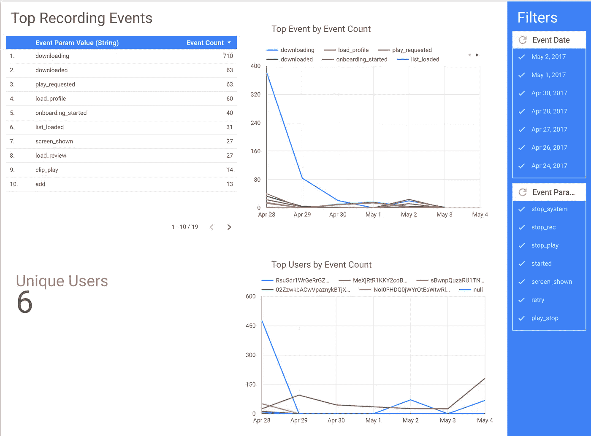
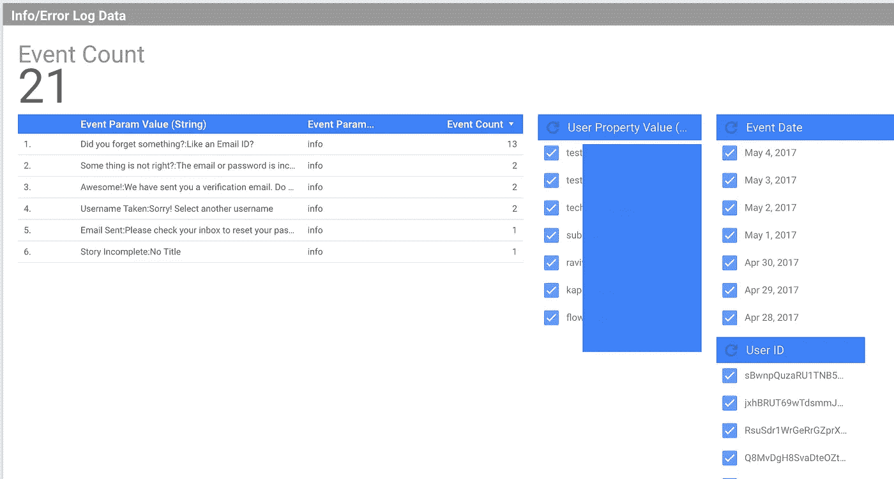

# 使用 Data Studio、BigQuery 和 Firebase(或类似服务)的廉价而强大的应用分析

> 原文：<https://medium.com/hackernoon/cheap-yet-powerful-app-analytics-using-data-studio-big-query-and-firebase-or-similar-services-6186ae42c697>

了解应用程序中发生的事情对应用程序的发展至关重要。俗话说:“不能测量的就不能改进”

听听这里的 odiocast:

 [## 由 tech_in_startups 构建您自己的分析基础架构

### 利用 Firebase、Big Query 和 Data Studio 构建一个更便宜但功能强大的分析基础设施

www.odiocast.com](https://www.odiocast.com/tech_in_startups/-KjhgDOLXxf16yIfIK7N) 

分析很快就会变得非常昂贵。[谷歌](https://hackernoon.com/tagged/google) Analytics Premium 的年费为 15 万美元，其他大多数工具的起价为每月 1000 美元以上。虽然所有的工具都有很大的自由层，但它们在功能上也有缺陷。自举创业公司负担不起这样的计划，但确实希望获得电力[工具](https://hackernoon.com/tagged/tools)。这是我们创办旧公司 PureMetrics 的原因之一，但市场已经很拥挤了，大公司正在通过为他们的云产品提供分析功能来耀武扬威。总的来说，这对生态系统有好处，因为它降低了每个人的成本。

这篇文章将深入探讨如何使用 Data Studio、BigQuery 和 Firebase 来完成近乎免费的分析。

首先，我通常建议不要从头开始“滚动你自己的”分析。基本上，如果有人告诉你他们可以有自己的 MYSQL 或 Mongo 实例来记录事件，不要听他们的。他们计划只解决一部分问题，存储，还没有想好数据如何推送到服务器，如何查询。

分析系统可以分为 3 个主要部分:—接收—存储—查询

我们将使用下面的 3

*   针对摄入的 Firebase 分析
*   BigQuery 用于存储，也可以用于查询
*   用于查询和可视化的数据工作室

**Firebase 分析**

您脑海中的下一个问题是，为什么我们不直接使用 Firebase Analytics？在查询方面，Firebase Analytics 相当弱。你甚至不能在分析仪表板上看到所有的事件参数(我不认为它会有所改善，因为那样人们就不会把数据转移到 Bigquery 上了)。它的超能力是以接近零的成本将我们的事件数据导入 BigQuery。

**BigQuery**

BigQuery 是 Google 提供的全托管 SQL DB。我喜欢它有三个原因:

*   它是完全托管的，不需要 DevOps，不用担心分片、热键或索引。
*   它很快！
*   它很便宜。查询 1 TB 的数据需要花费 5 美元，每月的第一个 TB 是免费的

**数据工作室**

Data Studio 是 Google 提供的一个比较新的 BI 服务，免费使用，容易上手。它确实有一些问题，比如一次只能处理一个表，但它不是一个阻碍，特别是因为我们可以在 BQ 中合并表，或者创建视图来简化表结构

通过这种设置，您需要将 firebase SDK 集成到您的应用程序中，以开始传递事件，并使 Blaze plan 能够开始将分析数据推送到 BQ 中。完成后，您可以开始使用 data studio 构建简单的报告，并与您的组织共享。如果您以前从未使用过 BI 工具，可能需要一些时间来适应，但是一旦您使用了，创建报告将是轻而易举的事情。这是一份关于我们 Alpha 版本的超级简单的报告。

## 这种设置的一些优点

*   通过合并来自各种其他来源的数据，如 CSV 文件、Google AdWords 或您自己的 MySQL 数据库，创建高级报告
*   完全托管，想想看，没有 DevOps，您不需要担心您的机器有多大，或者负载平衡器，或者有寻呼机在凌晨 3:00 叫醒您。如果你在吹捧你的系统的吞吐量，而该系统不是你销售的主要产品，那你就做错了。
*   分析师很容易上手，因为他们已经知道如何使用 BI 工具。BI 工具还利用了过滤器，当您使用过滤器时，它会更新整个视图。
*   BQ 很快，非常快。这允许您从多年的历史数据中查询趋势。你可以在这里阅读更多[，他们在 30 秒内查询 4 TB 的数据](https://cloud.google.com/blog/big-data/2016/01/anatomy-of-a-bigquery-query)
*   Firebase 自动捕获一些事件，比如 First_open，app_updated 等
*   如果您愿意使用 SQL，您几乎可以构建任何类型的报表。您不会被典型的查询机制所束缚，这些机制几乎总是从“已经完成或没有完成 X 的用户”开始

## 不足之处

*   Firebase Analytics 没有 web SDK[更新:[，他们现在有了](https://firebase.google.com/docs/reference/js)(他们可能永远不会有，因为它几乎会杀死 GA Premium)。所以你得不到你的站点数据。或者，您可以使用细分市场，而不是 Firebase Analytics。Segment 提供的表结构也更容易使用。它相对来说更贵，但是仍然比其他工具便宜，因为您可以从其他来源获取数据到 BigQuery 中
*   正如我在前面提到的，firebase 的表结构不是最好的，它最大限度地利用了 BQ 的重复记录，但是如果你打算使用其他来源，你将有更多的工作要做
*   如果你在 AWS 上，这个设置在到达时就已经死了。您可以使用 AWS mobile hub 建立类似的设置，或者直接使用独立的服务，即 AWS Mobile analytics、Redshift 和 QuickSight。
*   像队列这样的图表不是现成的，但是可以构建，大多数图表的 SQL 都可以在互联网上找到
*   DataStudio 不会向您发送电子邮件报告。
*   实时报告也将是一个挑战。Firebase 为当天的数据创建当天的表格。因此你不能直接合并数据。话说回来，你真的需要实时分析吗？你是实时反应的吗？如果不是，你不需要实时分析。
*   Firebase 将 iOS 和 Android 中的数据推送到不同的表中。事件和用户属性也被推入不同的表中。因此，如果需要合并数据，您需要运行连接或构建视图。如果这太多，分段是更好的选择
*   名称和值的长度是有限制的，根据您正在做的事情，这可能是一个问题。从 Firebase 文档中:

> 每个应用程序最多可以报告 500 个不同类型的事件，每个事件最多可以关联 25 个唯一参数事件和参数名称可以是 40 个字符长，每个应用程序最多可以提供 25 个唯一用户属性。名称最长可达 24 个字符，值最长可达 36 个字符

这就是我们在 Odiocast 的确切设置。对于网站，我们每天使用 Segment 将数据传递给 BigQuery 一次。从那里，我们使用 Data studio 上的多个报告来查看谁在 Alpha 应用程序上做什么。

另外，由于 Firebase 充当了 BigQuery 的管道，我们还在需要时传递错误和信息日志。在 iOS 上，我做了一点欺骗，传递了我的警告框的消息字符串

info logs

如果你有任何问题，请在下面发表评论。

如果你喜欢这篇文章，请点击下面的♡按钮分享

> [黑客中午](http://bit.ly/Hackernoon)是黑客如何开始他们的下午。我们是 [@AMI](http://bit.ly/atAMIatAMI) 家庭的一员。我们现在[接受投稿](http://bit.ly/hackernoonsubmission)，并乐意[讨论广告&赞助](mailto:partners@amipublications.com)机会。
> 
> 如果你喜欢这个故事，我们推荐你阅读我们的[最新科技故事](http://bit.ly/hackernoonlatestt)和[趋势科技故事](https://hackernoon.com/trending)。直到下一次，不要把世界的现实想当然！

