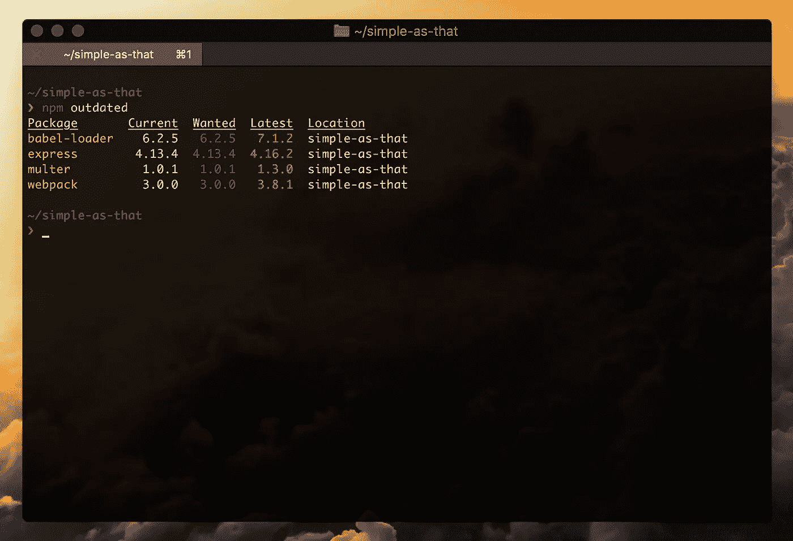

# 轻松检查 npm 模块更新

> 原文：<https://medium.com/hackernoon/check-for-node-module-updates-easily-f6d4ab8c1214>

如果你是一个[纱](https://yarnpkg.com)用户，运行`yarn upgrade-interactive`是一个内置的命令，让你的生活超级容易。但是不，这篇文章是为那些铁杆 npm 用户而写的。

使用 npm 时，还有一个内置的[工具](https://hackernoon.com/tagged/tool)来检查依赖性更新。`npm outdated`显示过期软件包列表。



npm outdated in action

但是有一个更好的工具！使用 [npm-check-updates](https://www.npmjs.com/package/npm-check-updates) 来检查更新并更新您的`package.json`是显而易见的。

> npm-check-updates 是一个命令行工具，允许您将 package.json 或 bower.json 依赖项升级到最新版本，而不考虑现有的版本约束。

## 装置

```
npm install -g npm-check-updates
```

## 使用

```
$ ncunuxt           ^1.0.0  →  ^2.2.0
node-sass      ^4.9.2  →  ^4.9.4
vue-scrollto   ^2.11.0 →  ^2.13.0Run with -u to upgrade your package.json
```

那不是很容易吗？它显示哪些包有更新，并使用标志 **-u** 自动替换 package.json 中的版本。

编辑于 2018 年 10 月 19 日-用新图片和最新信息更新了文章。