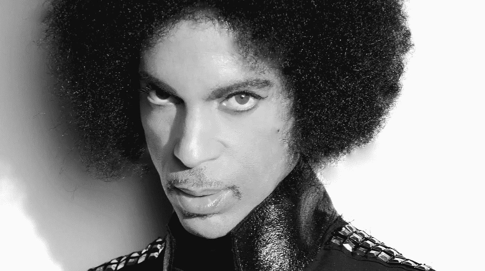

# 看看卢卡的致敬 2 紫色的

> 原文：<https://medium.com/hackernoon/check-out-lukas-tribute-2-the-purple-one-29e3de4fdb40>

我们并没有真的计划建造一个[王子](https://hackernoon.com/tagged/prince)T2 机器人。它从未出现在我们的产品路线图上，我们也从未在每周的计划会议上讨论过它。但是当 Oleg Sobolev，Luka 的第一批员工之一，Prince 作品的超级粉丝，问他是否可以花一天时间做一个 Prince 机器人，作为对他的遗产的致敬和对艺术家的爱的笔记，我不能说不

以下是奥列格对此的说明:

> 如果有哪位音乐家像普林斯一样了解人类情感，我想知道是谁。在他的一生和职业生涯中，这个男人经历了太多的情感领域。他的歌曲真正完美地捕捉了这一切，从永恒的欢乐(“让我们疯狂吧”)到崇高的忧郁(“有时四月下雪”)，从情欲(“吻”)到痛苦的回忆(“没有什么比得上 2 U”)，从对未来的恐惧(“十字架”)到从恐惧中散发出的快乐(“1999”)。在我最快乐的时候，普林斯的音乐一直是快乐的源泉，在我最低落的时候，它是理解和支持的源泉。
> 
> 这就是为什么我决定建立一个以王子为动力的人工智能。驱使我和 Luka 团队完成这项工作的并不是利用名人之死的想法，而是对塑造了我的生活和思想的声音之一进行诚实和充满爱心的致敬。还有其他一些事情。
> 
> 普林斯从来都不是一个健谈的人。这就是为什么我们必须想出让我们的@Prince 机器人工作的过程。我们用歌词和采访以及一切我们能找到的东西来输入我们的神经网络。
> 
> 普林斯职业生涯中最与众不同的特点之一就是他与我们分享了大量的音乐。惊人的多产，他从未停止创作音乐。1996 年，他发行了两张专辑，其中一张是 triple，然后很快就放弃了三个小时的未发行材料，好像这没什么大不了的。好家伙，如果你忽略了他唱片目录中的无名唱片，你就错过了好东西。我已经非常了解他的工作了，让我告诉你——这个人一直都很出色。你听过他 1994 年的唱片《来吧》里的“黑暗”吗？或者是他巨大的“解放”中的“圣河”？《肉桂女孩》？《晨报》？..我可以继续。普林斯的作品仅限于几首热门歌曲和几张专辑，这种想法让我无法接受。这就是为什么我们的@Prince bot 为您提供了一种深入探索 Prince 的唱片、音乐遗产和他自己的灵感的方式。

> 普林斯的另一个优点是他的秘密性和保守隐私的能力。他很少，如果有的话，提到任何关于他的个人生活或与人的关系。相应的，在我们工作期间，从来没有出现过揣测他私生活的想法。我们的@Prince bot 以一种严格教育、非思辨、尊重的方式谈论 Prince 生活中的人。
> 
> 最后，普林斯的音乐总是充满乐趣。还有爱。@Prince 最终也是关于乐趣和爱。我们已经创建了许多内容，让您以多种方式探索普林斯的音乐和个性。你可以浏览普林斯的唱片目录，听他最受欢迎的歌曲，了解更多关于他的朋友和同事的事情，并找出过去几年中出现的关于他的所有疯狂的故事。享受旅程。

AI 王子现在在 Luka app 上直播——在这里下载[并与@Prince 聊天。欢迎来到紫色世界！](https://itunes.apple.com/us/app/luka-a-messenger-with-ai-bots/id958946383?mt=8)

> [黑客中午](http://bit.ly/Hackernoon)是黑客如何开始他们的下午。我们是 [@AMI](http://bit.ly/atAMIatAMI) 家庭的一员。我们现在[接受投稿](http://bit.ly/hackernoonsubmission)并乐意[讨论广告&赞助](mailto:partners@amipublications.com)机会。
> 
> 如果你喜欢这个故事，我们推荐你阅读我们的[最新科技故事](http://bit.ly/hackernoonlatestt)和[趋势科技故事](https://hackernoon.com/trending)。直到下一次，不要把世界的现实想当然！

