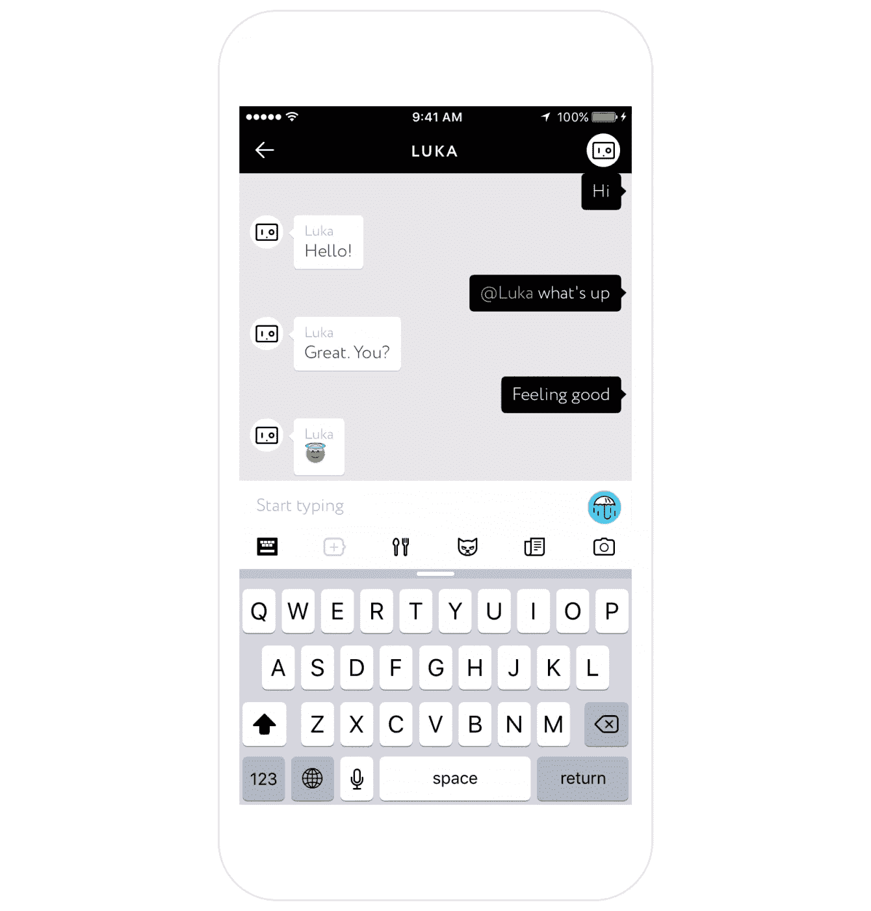
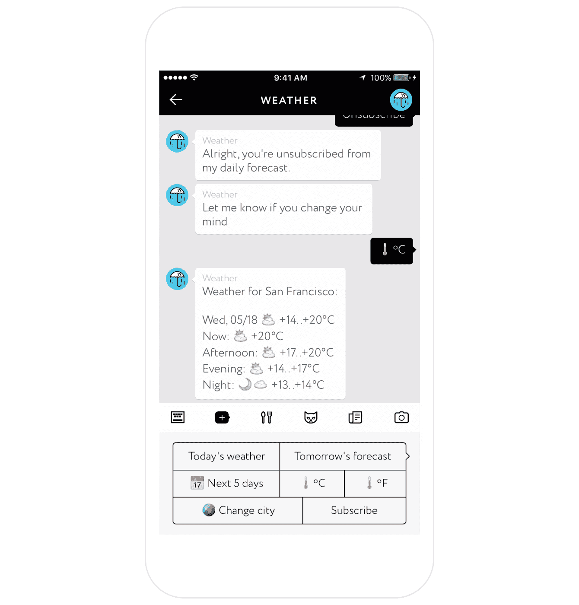

# 查一下卢卡的天气

> 原文：<https://medium.com/hackernoon/check-weather-on-luka-64b9aac6d6f>

今天，我们很高兴在 Luka 上宣布我们新的[天气](https://hackernoon.com/tagged/weather) AI！

已经有一些天气机器人出现了——我们的人工智能有它们最好的功能，甚至更多。@Weather 会告诉你当前的天气，并在你需要的时候给你发送你所在城市的天气预报。此外，这款[机器人](https://hackernoon.com/tagged/bot)还有一些锦囊妙计，比如在夜晚寒冷时提醒你带上外套，或者在可能下雨时提醒你带上雨伞。

比起华氏温度，我还是更喜欢摄氏温度，但是你可以设置更适合你的单位。你也可以选择另一个城市，询问几天的天气预报。

若要设置每日天气更新，请轻按“订阅”并设定通知时间。

这一切听起来非常简单和熟悉，但当我们环顾四周，无法找到一个好的，没有麻烦的天气机器人时，我们感到惊讶。它们为数不多——甚至还有一只气象猫！—但是没有一个能在我们需要的时候做我们需要的所有这些简单的事情。我们的下一步是从你和你的身上了解更多，让你的天气更新更智能、更个性化。

在这里下载卢卡开始和@Weather 聊天吧！

> [黑客中午](http://bit.ly/Hackernoon)是黑客如何开始他们的下午。我们是 [@AMI](http://bit.ly/atAMIatAMI) 家庭的一员。我们现在[接受投稿](http://bit.ly/hackernoonsubmission)并乐意[讨论广告&赞助](mailto:partners@amipublications.com)机会。
> 
> 如果你喜欢这个故事，我们推荐你阅读我们的[最新科技故事](http://bit.ly/hackernoonlatestt)和[趋势科技故事](https://hackernoon.com/trending)。直到下一次，不要把世界的现实想当然！

